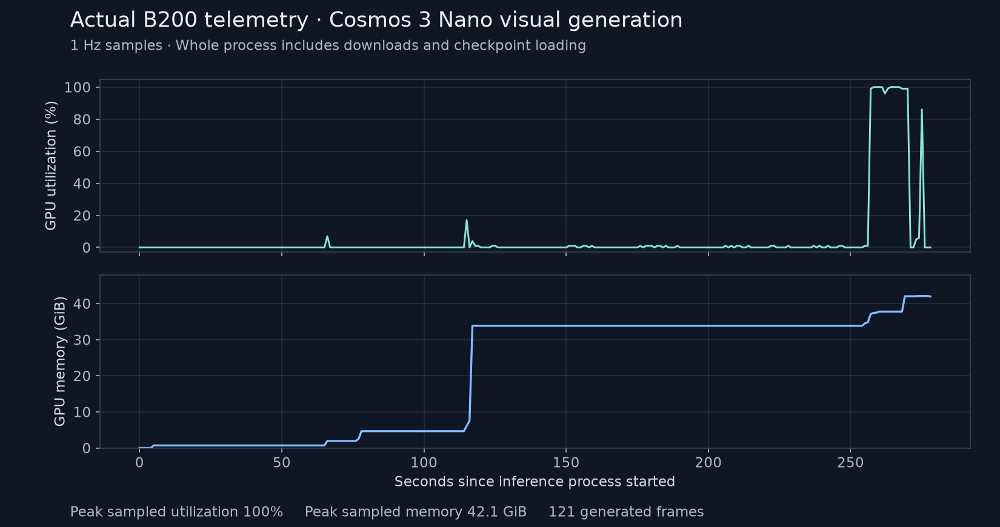

# Cosmos 3 Nano visual generation on a reserved B200

[Play the source/generated comparison](comparison.mp4) ·
[Play the full two-camera demonstration](dataset-preview.mp4) ·
[Machine-readable evidence](evidence.json)


The right-hand video was generated by Cosmos3-Nano on one reserved NVIDIA B200
on September 25, 2026. Its input was the first front-camera frame of LIBERO-10
episode 0 and the [recorded prompt and sampling settings](sample.json). The
left-hand video shows the corresponding recorded demonstration. It is resampled
from 20 to 24 fps for comparison; both views are scaled to 512×512 for display.

This is **base-model image-to-video inference**, not action-conditioned WAM
evaluation or a rollout from a post-trained checkpoint. In six inspected frames
at one-second intervals, the table and mugs remain recognizable, but arm
geometry and contact are inconsistent and the prompted mug placement is not
completed. The [contact sheet](generated-contact.png) preserves those inspection
frames. No task-success or post-training performance claim follows from this
clip.

## Measured execution

| Measurement | Observed value |
| --- | --- |
| Hardware | 1 NVIDIA B200, reserved capacity |
| Native output | 121 frames, 640×640, 24 fps; 5.04-second MP4 |
| Native generation batch | 21.97 seconds |
| Native sampling function | 13.35 seconds |
| Native decode function | 1.96 seconds |
| Whole inference process | 279.10 seconds |
| Peak sampled GPU utilization | 100% |
| Peak sampled GPU memory | 42.10 GiB |
| GPU telemetry | 279 samples, approximately 1 Hz |

The process timing includes initial guardrail downloads and checkpoint loading.
It excludes earlier model/data preparation and an initial failed launch with a
missing guardrail dependency. The native batch timer excludes model setup and
includes generation, decoding, output checks and persistence. These nested
timers must not be added together. This was one generation with no warmup,
35 UniPC steps, guidance 6, shift 10, seed 42, diffusion caching enabled and
Torch compilation disabled. It is not a repeated throughput benchmark or a
training-duration measurement. Raw native timings are in [benchmark.json](benchmark.json).



The [telemetry series](telemetry.json) uses elapsed seconds and omits live
infrastructure identifiers. All 121 native output frames decoded successfully
with increasing timestamps. Retrieved video hashes match the remote files;
the evidence record preserves hashes for the native MP4 and public artifacts.

## Reproduce the visual

First complete the [recipe's pinned preparation](../../cookbooks/cosmos3-wam-slurm.md).
Keep the verified operator Hugging Face credential available for the native
guardrail downloads. The source frame and prompt are provided in this directory;
they contain no model weights. Set `WAM_VISUAL_ASSETS` to this directory's
absolute path and `WAM_VISUAL_OUTPUT` to a fresh output directory on the GPU
machine. With `WAM_SHARED_ROOT` set to the prepared root:

```bash
cd "$WAM_SHARED_ROOT/framework"
uv sync --frozen --all-extras --group cu130-train
export PATH="$WAM_SHARED_ROOT/framework/.venv/bin:$PATH"
export COSMOS_TRAINING=1
export LD_LIBRARY_PATH=""
"$WAM_SHARED_ROOT/framework/.venv/bin/python" \
  -m cosmos_framework.scripts.inference \
  --input-files "$WAM_VISUAL_ASSETS/sample.json" \
  --output-dir "$WAM_VISUAL_OUTPUT" \
  --checkpoint-path "$WAM_SHARED_ROOT/model" \
  --parallelism-preset latency --no-use-torch-compile --benchmark --seed 42 \
  --experiment-overrides \
  model.config.vlm_config.tokenizer.repository=null \
  model.config.vlm_config.tokenizer.revision=null \
  "model.config.vlm_config.tokenizer.tokenizer_type=$WAM_SHARED_ROOT/model" \
  'model.config.tokenizer.bucket_name=""' \
  "model.config.tokenizer.vae_path=$WAM_SHARED_ROOT/vae/Wan2.2_VAE.pth" \
  'model.config.sound_tokenizer.bucket_name=""' \
  "model.config.sound_tokenizer.avae_path=$WAM_SHARED_ROOT/model/sound_tokenizer/avae_48k_noncausal_25hz_64ch.ckpt"
```

The last two overrides select the already materialized audio tokenizer instead
of resolving its upstream alias. The measured run resolved that alias to the
same pinned model revision, and its audio safetensors matched the staged bytes.
The native Qwen text guard resolves its own repository revision; the exact
revision used here is recorded in `evidence.json`. Recheck it when comparing
future runs. No audio was generated.

Guardrails remained enabled. The pinned native release ran its text blocklist,
Qwen text classifier and face-blur postprocessor; that release disables the
video content classifier. The record reports this actual coverage, not a claim
that all media safety models executed.

See [NOTICE.md](NOTICE.md) for dataset/model attribution and license information.
