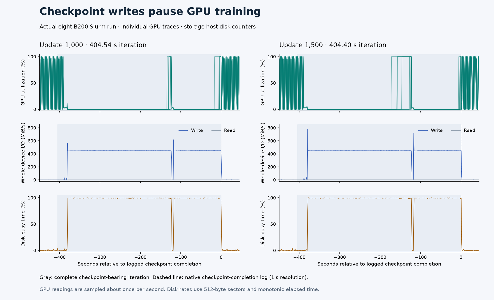

# Recorded checkpoint I/O during eight-B200 training



These are measured intervals from the full 2,000-update WAM run, captured on
September 26, 2026. Both checkpoints completed and training resumed. The full
run was still incomplete when this evidence was exported.

| Optimizer update | Previous update | Checkpoint-bearing update | Following update | Completed checkpoint size |
| --- | --- | --- | --- | --- |
| 1,000 | 13.39 s | 404.54 s | 13.26 s | 177,284,648,524 bytes |
| 1,500 | 13.28 s | 404.40 s | 13.25 s | 177,284,648,524 bytes |

The eight GPU traces show training pausing during sustained checkpoint writes.
The middle and bottom rows come from cumulative Linux block-device counters
on the storage host. They include all I/O to that device, including the native
training log, and are not process-attributed write measurements. Each completed
checkpoint includes model, optimizer, scheduler and trainer state; the
[manifest](evidence.json) records their individual logical byte sizes.

Gray shading covers the complete checkpoint-bearing iteration, including its
training computation. The iteration duration is not pure checkpoint-write
time. The dashed line comes from the native checkpoint-completion message,
whose timestamp has one-second resolution. GPU measurements were sampled
approximately once per second. Short GPU activity bursts during the save are
preserved rather than smoothed away. CUDA kernel attribution comes from the
separate profiling run.

## Reproduce the figure

The four CSV files contain the numeric GPU readings and cumulative storage
counters for both windows. `evidence.json` records SHA-256 hashes and row
counts. The renderer checks those receipts, confirms all eight GPU indices,
rejects non-finite readings and decreasing disk counters, and derives rates
using monotonic elapsed time and 512-byte sectors.

With the Workbench Python environment, Matplotlib 3.11.2 and NumPy 2.5.3:

```bash
npa/.venv/bin/python docs/workbench/evidence/cosmos3-wam-checkpoint-io/plot.py
```

`render-manifest.json` links the input manifest and final PNG by SHA-256.
Repeated rendering in this environment produced identical PNG bytes.

For a fresh experiment, the recipe's
[native deployment guide](../../../../npa/workflows/workbench/cosmos3-wam-slurm/native-cluster.md#evidence-and-cleanup)
documents GPU collection and
[`storage_telemetry.py`](../../../../npa/workflows/workbench/cosmos3-wam-slurm/storage_telemetry.py)
records the disk counters. Retain the raw logs privately, align their UTC
checkpoint-completion events with telemetry, and export numeric observations
without host names, GPU UUIDs, process identifiers or private endpoints.
