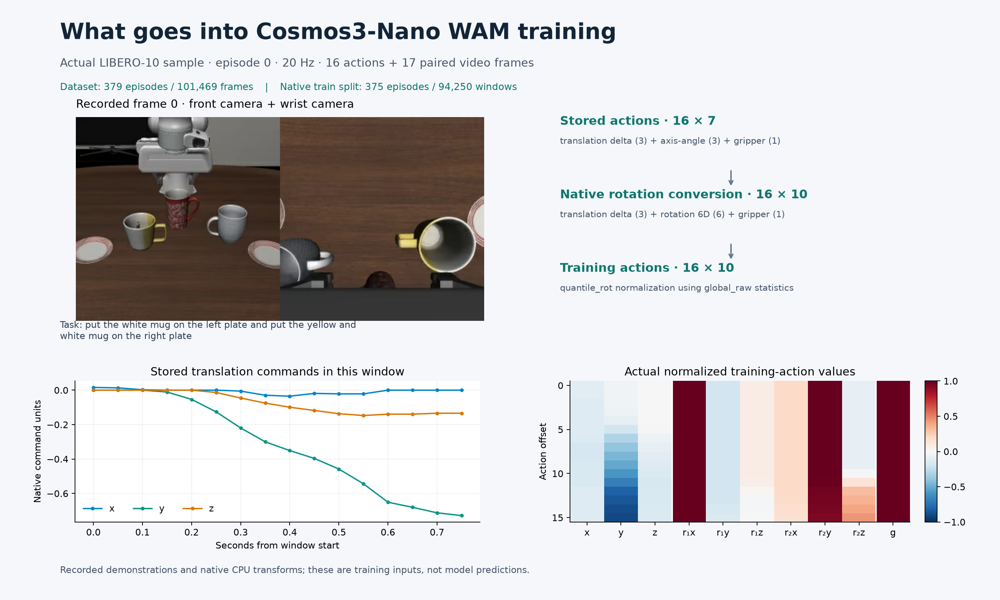

# A real LIBERO-10 training window



This figure uses episode 0 from the pinned NVIDIA LIBERO LeRobot v3 dataset.
The native `LIBEROLeRobotDataset` decoded the seventeen paired camera frames
and normalized the sixteen action targets. `front.png` and `wrist.png` are its
first decoded camera views. The numerical values in [sample.json](sample.json)
come from that same window, before the SFT tokenizer and resolution transform.

The raw action already represents a per-frame delta: three translation
commands, three axis-angle values and one gripper value. The native loader
re-encodes rotation into six values, producing ten values per action, then
applies `quantile_rot` using the bundled `global_raw` statistics. Translation
plots use native command units. Values are not assumed to be metres or clipped
to the interval [-1, 1].

The actual native episode split contains 375 training episodes and 94,250
valid windows from 379 total episodes. Its split seed is 0; episode shuffling
uses the separate native seed 42. The four held-out demonstration episodes do
not turn LIBERO-10 evaluation into a test on unseen tasks.

Regenerate the sample on the prepared Linux worker, using a fresh output
directory selected through `WAM_DATA_FIGURE_OUTPUT`:

```bash
cd "$WAM_SHARED_ROOT/framework"
CUDA_VISIBLE_DEVICES="" OMP_NUM_THREADS=1 \
  .venv/bin/python "$WAM_RECIPE/export_data_sample.py" \
  --shared-root "$WAM_SHARED_ROOT" --output-path "$WAM_DATA_FIGURE_OUTPUT"
```

This CPU-only exporter invokes the pinned native loader. Copy the resulting
`sample.json`, `front.png` and `wrist.png` beside a copy of [plot.py](plot.py),
then run that plotting script with the Workbench Python environment. Its
NumPy, Matplotlib and Pillow dependencies are included in Workbench:

```bash
npa/.venv/bin/python docs/workbench/evidence/cosmos3-wam-data/plot.py
```

The renderer writes PNG and SVG figures. See [NOTICE.md](NOTICE.md) for source
attribution and [render-manifest.json](render-manifest.json) for artifact
hashes and rendering versions.
