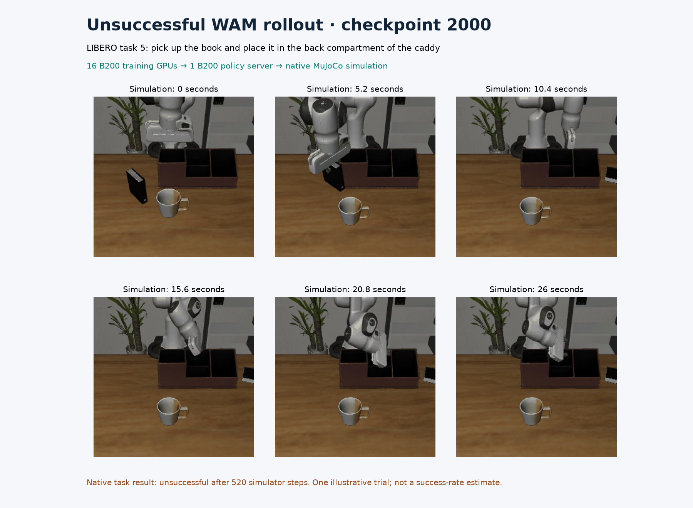

# Final trained WAM checkpoint: actual B200 policy rollouts

The completed 2,000-update training checkpoint executed ten LIBERO-10 visual
trials: **nine successes, one failure, zero infrastructure errors**. All ten
outcomes are retained in [quality.json](quality.json). This one-trial-per-task
pass illustrates execution; it does not qualify the policy against the
required 500-trial protocol or establish time to quality.

Sixteen reserved B200s on two nodes trained this checkpoint. For this visual pass, eight
policy servers each used one B200 and one simulator environment. CPU MuJoCo
with OSMesa rendered the simulator observations. Each illustrated trial used
one of those servers. Native server commands, logs, completion receipts and Slurm accounting are
retained by hash. No live policy-process snapshot was captured for this pass;
the separate sixteen-rank training record supplies live training attribution.

| Example | Native outcome | Simulator steps | Recorded playback | Trial wall time |
| --- | --- | --- | --- | --- |
| Task 0: alphabet soup and tomato sauce into the basket | Success | 254 | 12.75 s | 116.136 s |
| Task 5: book into the back compartment of the caddy | Failure | 520 | 26.05 s | 176.621 s |

These are the first successful and first unsuccessful trials in the completed
pass. Both MP4s preserve the entire native recording. Task outcomes come from
the simulator's termination condition; the posters are selected frames from
those videos. Playback runs at 20 Hz and is not a measurement of real-time
policy latency.


[Play the successful rollout](task-000.mp4) · [Predicted cameras versus actual simulator cameras](task-000-comparison.mp4)



[Play the unsuccessful rollout](task-005.mp4) · [Predicted cameras versus actual simulator cameras](task-005-comparison.mp4)

In each comparison video, the left panel contains the WAM's predicted front
and wrist views; the right panel contains the actual simulator views produced
by executing its actions. Native comparison recording omits the ten initial
stabilization steps. These predictions and robot motions came from the trained
model and the native evaluator.

## Checkpoint and GPU evidence

The evaluated model's seventeen component files exactly match the final checkpoint
in the [completed training record](../cosmos3-wam-full-16/README.md). Their
canonical manifest SHA-256 is
`1aa6f96662ac193e3b22f88aaccb74954c8aca8fda18e53d341db5eba01977b2`.
The native servers loaded the trained EMA weights, with thirty UniPC denoising
steps, guidance 1.0, sixteen actions per chunk and seed 42.

The eight servers completed **176 policy requests**. The
[GPU telemetry](policy-gpu-telemetry.csv) contains **1,928 device samples**,
241 per GPU, covering the earliest request through one second after the last
completed response. Sampled maximum utilization ranged from 39% to 48%,
with maximum sampled device memory 34,258 MiB and maximum sampling gap 1.161 s.
The interval includes simulator, media-writing and idle gaps. These sampled
maxima are not subsecond or allocator peaks, and do not measure policy quality.
[telemetry-summary.json](telemetry-summary.json) preserves source and selected
row hashes, the exact window and per-device results.

The visual process took **407.071 seconds**, including checkpoint hashing,
server setup, parallel simulation and media writing. Slurm recorded
`COMPLETED`, `0:0`, and 407 allocated seconds. Trial durations overlap and
must not be summed as process duration. Full fifty-trial-per-task evaluations
are separate runs with recording disabled; the
[final full evaluation](../cosmos3-wam-quality-16/README.md) scored 479/500.

## Reproduce

Follow the [Slurm recipe](../../../../npa/workflows/workbench/cosmos3-wam-slurm/README.md)
through training, simulator preparation and the documented guardrail prefetch.
Inside an exclusive eight-B200 allocation, choose a fresh directory in
`WAM_FINAL_VISUAL` and run:

```bash
"$WAM_SHARED_ROOT/framework/.venv/bin/python" "$WAM_RECIPE/evaluate.py" \
  --shared-root "$WAM_SHARED_ROOT" --run-dir "$WAM_FULL_RUN" \
  --step 2000 --output-dir "$WAM_FINAL_VISUAL" \
  --workers 8 --trials 1 --envs 1 --seed 42 --record-rollouts
```

Require all eight worker completion receipts, ten complete trial records
without errors, successful Slurm completion and a model hash matching the
selected training checkpoint. A fresh execution need not reproduce identical
trajectories or outcomes; retain every new outcome.

For these selected tasks, the native GIF paths are
`worker-0/rollouts/gifs/task_000/episode_000.gif` and
`worker-5/rollouts/gifs/task_005/episode_000.gif`. The corresponding comparison
recordings use `comparisons` in place of `gifs`. Select one source in
`WAM_SOURCE_GIF` and a fresh destination in `WAM_OUTPUT_MP4`:

```bash
ffmpeg -v error -i "$WAM_SOURCE_GIF" \
  -vf 'pad=ceil(iw/2)*2:ceil(ih/2)*2' \
  -c:v libx264 -crf 18 -pix_fmt yuv420p -movflags +faststart "$WAM_OUTPUT_MP4"
ffprobe -v error -count_frames \
  -show_entries stream=width,height,nb_read_frames,r_frame_rate,duration \
  -of json "$WAM_OUTPUT_MP4"
```

[evidence.json](evidence.json) records full MP4 and source-GIF hashes, decoded
frame counts, settings, model identity, log hashes and poster frame indices.
It also records the hash of the shared contact-sheet renderer. With FFmpeg,
NumPy and Matplotlib 3.11.2, reproduce both posters from the committed MP4s:

```bash
npa/.venv/bin/python docs/workbench/evidence/cosmos3-wam-trained-visual/plot.py \
  --root docs/workbench/evidence/cosmos3-wam-final-visual-16
```

The posters were visually inspected and reproduced with identical hashes.
[render-manifest.json](render-manifest.json) records those hashes; [NOTICE.md](NOTICE.md)
provides source attribution. The [earlier update-500 visual record](../cosmos3-wam-trained-visual/README.md)
remains available with all of its outcomes. Neither ten-trial visual pass
replaces the full checkpoint-linked quality curve.
