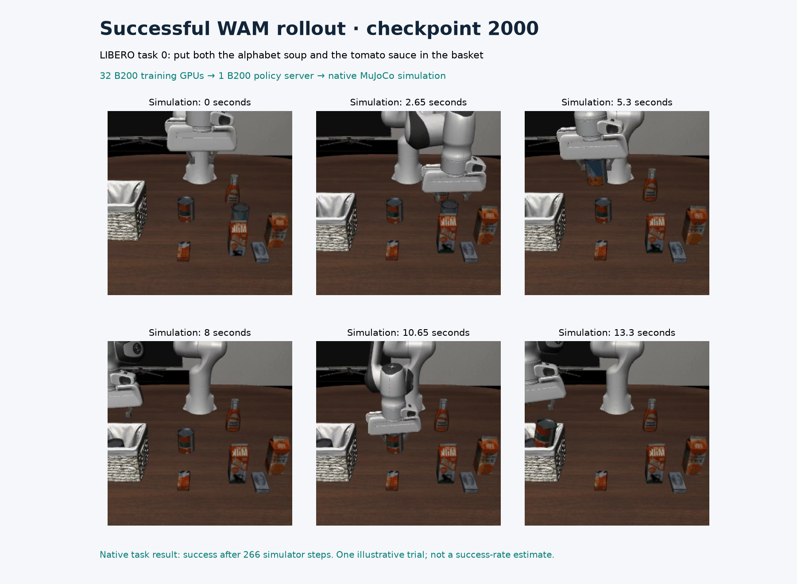
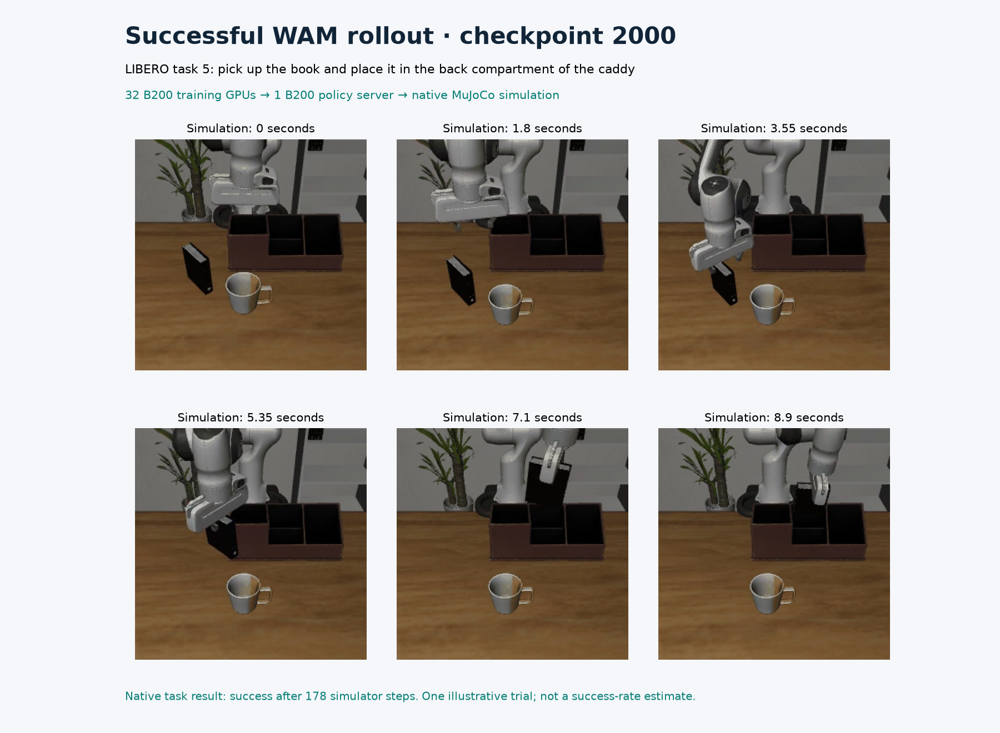

# Final four-node WAM checkpoint: actual B200 policy rollouts

The completed 2,000-update checkpoint trained on **four nodes × eight B200s**.
It executed **10/10 successful visual trials**, with zero infrastructure
errors. These ten illustrative trials are separate from the final
[500-trial evaluation](../cosmos3-wam-quality-32/README.md), which scored 478/500.
All ten illustrative outcomes are retained in [quality.json](quality.json).

Eight native policy servers each used one B200 and one simulator environment.
A [live process snapshot](visual-32-live-summary.json) matched all eight policy
processes to eight distinct B200 devices, final-checkpoint arguments, CUDA device
assignments and the visual job. Its [provenance](visual-32-live-provenance.json)
links the exact observer source and privately archived raw identities. This is
one process/memory/utilization snapshot, not sustained inference throughput.
MuJoCo cameras rendered on CPU through OSMesa. Each illustrated trial used one
of those eight GPU policy servers.

| Task | Native outcome | Simulator steps | Playback | Native frames |
| --- | --- | --- | --- | --- |
| 0: put both the alphabet soup and the tomato sauce in the basket | Success | 266 | 13.35 s | 267 |
| 5: pick up the book and place it in the back compartment of the caddy | Success | 178 | 8.95 s | 179 |

Tasks 0 and 5, trial 0, were [selected before the visual job started](visual-selection-32.json)
to match the earlier sixteen-GPU examples. Both succeeded. We retained that
selection and every other outcome. Each MP4 preserves the complete native GIF
frame count and 20 fps playback, including the initial frame. Playback duration
is simulator time; it is not measured policy latency.



[Play task 0](task-000.mp4) · [Predicted and actual cameras](task-000-comparison.mp4)



[Play task 5](task-005.mp4) · [Predicted and actual cameras](task-005-comparison.mp4)

The left comparison panel contains the WAM's predicted front and wrist views;
the right contains simulator views after executing the predicted actions.
Native comparison recording omits the ten initial stabilization steps. Robot
motion and predictions came from the trained model and native evaluator.

## Checkpoint and duration

The 33 model component files match the checkpoint used by the completed
500-trial evaluation. The canonical model manifest SHA-256 is
`0baadb3b59d00eba0c817439595a95b2227d48401be33c294177b0454c79bbb3`. Native servers loaded the trained EMA
weights, using thirty UniPC denoising steps, guidance 1.0, sixteen actions per
chunk and seed 42.

The visual process took **609.948 seconds**, including
checkpoint hashing, server setup, parallel simulation and media writing.
Slurm recorded `COMPLETED`, `0:0`, and **620 allocated seconds**.
Concurrent trial durations must not be summed to obtain process duration.

## Reproduce

Follow the [recipe](../../../../npa/workflows/workbench/cosmos3-wam-slurm/README.md)
through full training, simulator preparation and the documented guardrail
prefetch. Inside an exclusive eight-B200 allocation, choose a fresh output:

```bash
"$WAM_SHARED_ROOT/framework/.venv/bin/python" "$WAM_RECIPE/evaluate.py" \
  --shared-root "$WAM_SHARED_ROOT" --run-dir "$WAM_FULL_RUN" \
  --step 2000 --output-dir "$WAM_FINAL_VISUAL" \
  --workers 8 --trials 1 --envs 1 --seed 42 --record-rollouts
```

Require eight worker completion receipts, ten trial outcomes without errors,
successful Slurm completion and matching checkpoint hashes. A new execution
need not reproduce identical trajectories or outcomes; retain every result.
The selected native GIFs are `worker-0/rollouts/gifs/task_000/episode_000.gif`
and `worker-5/rollouts/gifs/task_005/episode_000.gif`. Comparison GIFs use
`comparisons` in place of `gifs`. Preserve frame count and playback rate:

```bash
ffmpeg -v error -n -i "$WAM_SOURCE_GIF" \
  -vf 'pad=ceil(iw/2)*2:ceil(ih/2)*2' \
  -c:v libx264 -crf 18 -pix_fmt yuv420p -movflags +faststart "$WAM_OUTPUT_MP4"
ffprobe -v error -count_frames \
  -show_entries stream=width,height,nb_read_frames,r_frame_rate,duration \
  -of json "$WAM_OUTPUT_MP4"
```

[evidence.json](evidence.json) records MP4/GIF hashes, decoded frame counts,
settings, model identity, archived-source hashes and poster frame indices.
The publisher changed after prospective selection only to add verified live
process receipts; both source hashes and the unchanged selection are recorded.
With FFmpeg, NumPy and Matplotlib 3.11.2, reproduce both posters:

```bash
npa/.venv/bin/python docs/workbench/evidence/cosmos3-wam-trained-visual/plot.py \
  --root docs/workbench/evidence/cosmos3-wam-final-visual-32
```

[render-manifest.json](render-manifest.json) records poster hashes.
[NOTICE.md](NOTICE.md) provides source attribution. These illustrations do not
establish unseen-task generalization or physical-robot performance.
