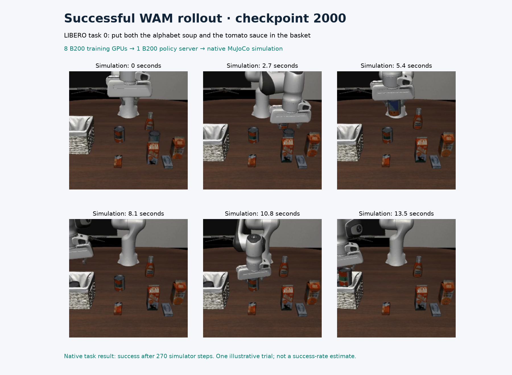
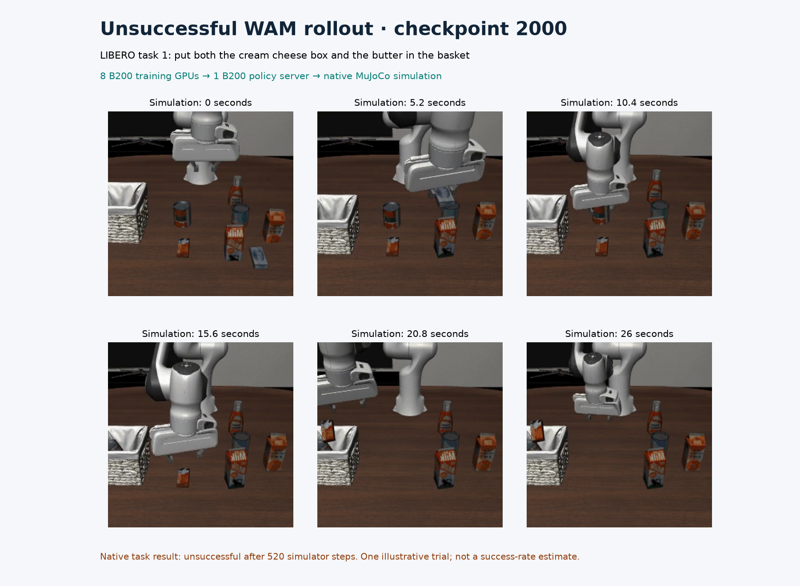

# Final trained WAM checkpoint: actual B200 policy rollouts

The completed 2,000-update training checkpoint executed ten LIBERO-10 visual
trials: **nine successes, one failure, zero infrastructure errors**. All ten
outcomes are retained in [quality.json](quality.json). This one-trial-per-task
pass illustrates execution; it does not qualify the policy against the
required 500-trial protocol or establish time to quality.

Eight reserved B200s trained this checkpoint. For this visual pass, eight
policy servers each used one B200 and one simulator environment. CPU MuJoCo
with OSMesa rendered the simulator observations. Each illustrated trial used
one of those servers. A live process snapshot verified all eight servers'
GPU assignments, checkpoint arguments and Slurm cgroups.

| Example | Native outcome | Simulator steps | Recorded playback | Trial wall time |
| --- | --- | --- | --- | --- |
| Task 0: alphabet soup and tomato sauce into the basket | Success | 270 | 13.55 s | 123.642 s |
| Task 1: cream cheese and butter into the basket | Failure | 520 | 26.05 s | 218.027 s |

These are the first successful and first unsuccessful trials in the completed
pass. Both MP4s preserve the entire native recording. Task outcomes come from
the simulator's termination condition; the posters are selected frames from
those videos. Playback runs at 20 Hz and is not a measurement of real-time
policy latency.



[Play the successful rollout](task-000.mp4) · [Predicted cameras versus actual simulator cameras](task-000-comparison.mp4)



[Play the unsuccessful rollout](task-001.mp4) · [Predicted cameras versus actual simulator cameras](task-001-comparison.mp4)

In each comparison video, the left panel contains the WAM's predicted front
and wrist views; the right panel contains the actual simulator views produced
by executing its actions. Native comparison recording omits the ten initial
stabilization steps. These predictions and robot motions came from the trained
model and the native evaluator.

## Checkpoint and GPU evidence

The evaluated model's nine component files exactly match the final checkpoint
in the [completed training record](../cosmos3-wam-full-8/README.md). Their
canonical manifest SHA-256 is
`4f28c9ab7e4cf172a8e05606dc2a944f4c1cf07b5c61c05160655a746ab6135c`.
The native servers loaded the trained EMA weights, with thirty UniPC denoising
steps, guidance 1.0, sixteen actions per chunk and seed 42.

The eight servers completed 173 policy requests. The
[GPU telemetry](policy-gpu-telemetry.csv) contains 2,288 device samples,
286 per GPU, spanning the earliest request through the last completed
response. Sampled maximum utilization ranged from 37% to 57% across GPUs,
and the largest sampled device-memory usage was 34,278 MiB. The longest
observed sampling gap was 1.119 seconds. The window includes simulation,
media writing and idle intervals; these maxima are not allocator or subsecond
peaks and do not measure policy quality.

[telemetry-summary.json](telemetry-summary.json) records the sampling window,
per-device summaries and source hashes. The separate
[live snapshot](live-policy-snapshot.json) attributes all eight GPU processes
to the expected policy command and trained checkpoint. Its instantaneous
utilization was mostly idle between requests; it is process-attribution
evidence. The [runtime probe](runtime.json) passed actual BF16 attention
forward/backward and fused Adam checks on device zero and recorded eight
visible B200s. It does not claim to test those kernels on every device.

The visual process took **428.222 seconds**, including checkpoint hashing,
server setup, parallel simulation and media writing. Slurm recorded
`COMPLETED`, exit `0:0`, and 429 allocated seconds. Trial wall times overlap
across workers and must not be added into a process duration. These are
evaluation timings, separate from the full training run's 7 h 50 m 33 s.
The full fifty-trial-per-task evaluations are separate runs with video
recording disabled.

## Reproduce

Follow the [Slurm recipe](../../../../npa/workflows/workbench/cosmos3-wam-slurm/README.md)
through training, simulator preparation and the documented guardrail prefetch.
Inside an exclusive eight-B200 allocation, choose a fresh directory in
`WAM_FINAL_VISUAL` and run:

```bash
"$WAM_SHARED_ROOT/framework/.venv/bin/python" "$WAM_RECIPE/evaluate.py" \
  --shared-root "$WAM_SHARED_ROOT" --run-dir "$WAM_FULL_RUN" \
  --step 2000 --output-dir "$WAM_FINAL_VISUAL" \
  --workers 8 --trials 1 --envs 1 --seed 42 --record-rollouts
```

Require all eight worker completion receipts, ten complete trial records
without errors, successful Slurm completion and a model hash matching the
selected training checkpoint. A fresh execution need not reproduce identical
trajectories or outcomes; retain every new outcome.

For these selected tasks, the native GIF paths are
`worker-0/rollouts/gifs/task_000/episode_000.gif` and
`worker-1/rollouts/gifs/task_001/episode_000.gif`. The corresponding comparison
recordings use `comparisons` in place of `gifs`. Select one source in
`WAM_SOURCE_GIF` and a fresh destination in `WAM_OUTPUT_MP4`:

```bash
ffmpeg -v error -i "$WAM_SOURCE_GIF" \
  -vf 'pad=ceil(iw/2)*2:ceil(ih/2)*2' \
  -c:v libx264 -crf 18 -pix_fmt yuv420p -movflags +faststart "$WAM_OUTPUT_MP4"
ffprobe -v error -count_frames \
  -show_entries stream=width,height,nb_read_frames,r_frame_rate,duration \
  -of json "$WAM_OUTPUT_MP4"
```

[evidence.json](evidence.json) records full MP4 and source-GIF hashes, decoded
frame counts, settings, model identity, log hashes and poster frame indices.
It also records the hash of the shared contact-sheet renderer. With FFmpeg,
NumPy and Matplotlib 3.11.2, reproduce both posters from the committed MP4s:

```bash
npa/.venv/bin/python docs/workbench/evidence/cosmos3-wam-trained-visual/plot.py \
  --root docs/workbench/evidence/cosmos3-wam-final-visual
```

The posters were visually inspected and reproduced with identical hashes.
[render-manifest.json](render-manifest.json) records those hashes; [NOTICE.md](NOTICE.md)
provides source attribution. The [earlier update-500 visual record](../cosmos3-wam-trained-visual/README.md)
remains available with all of its outcomes. Neither ten-trial visual pass
replaces the full checkpoint-linked quality curve.
