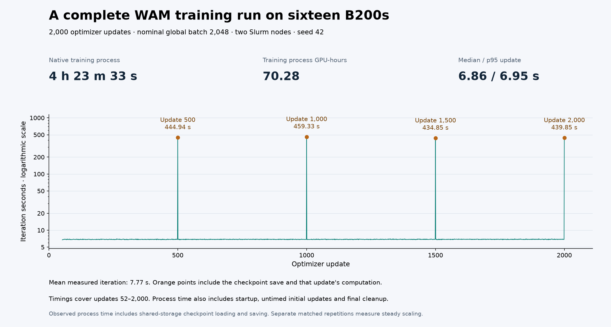

# Completed sixteen-B200 WAM training

Two reserved eight-B200 nodes completed all 2,000 optimizer updates in
**15,813.018 seconds (4 h 23 m 33 s)**, consuming **70.28 training-process
GPU-hours**. Slurm recorded `COMPLETED`, `0:0`, and 15,906 allocated seconds
(70.69 allocated GPU-hours). Both native processes returned zero. No data-loader
tracebacks or skipped updates were accepted.



[measurement.json](measurement.json) and [iteration-series.csv](iteration-series.csv)
are the unmodified reporter outputs. Updates 52–2,000 contain 1,949 timed rows:
mean 7.7656 s, median 6.86 s, p95 6.95 s. The four checkpoint-bearing iterations
were 444.94, 459.33, 434.85 and 439.85 s. They include complete iteration work;
they are not isolated storage timings. Final model, optimizer, scheduler and
trainer components contain 68 files totaling about 177.28 GB. Every file in
[checkpoint-hashes.json](checkpoint-hashes.json) matches the independently
uploaded and full-GET-verified private archive.

The logical final checkpoint manifest hash is
`40899ace94d4e9ce26b8f2d5600a1d5236ea92b00ecb1ce0b26b59612e773b94`.
This covers all four checkpoint components and differs from the model-only
hash used for evaluation. [checkpoint-times.json](checkpoint-times.json)
links actual one-second-resolution native save events to complete iterations.
[evidence.json](evidence.json) links both completion receipts, launch/config
hashes and sanitized Slurm allocation. Raw operational records stay private.

The runtime used committed recipe `315f68f31d0158d848df8d97e5dc72da99328e32`
and the immutable model/data/framework pins in its report. Global batch 2,048,
sample cap 64, accumulation two, seed 42, BF16 compute, FP32 parameters and EMA
match the eight-GPU contract. Artifacts and runtime caches were staged before
training. The controller-local SSD was exported to the other host through NFS;
evaluation and archival did not overlap this full run. Earlier eight-GPU
full-run storage conditions differed as documented in that record, so the
[six-repeat comparison](../cosmos3-wam-scaling/README.md) is the primary steady
scaling result. Preparation, archive and evaluation time are separate.

## Reproduce

Follow the [native Slurm recipe](../../../../npa/workflows/workbench/cosmos3-wam-slurm/README.md),
plan `--nodes 2 --steps 2000`, submit the generated `train.sbatch`, then run
`report.py --run-dir "$WAM_FULL_RUN"`. Require both node completions, successful
Slurm accounting and all final checkpoint files. Run the documented four full
evaluations and `quality_curve.py` to join checkpoint identity and save times;
[policy quality](../cosmos3-wam-quality-16/README.md) is measured separately.

With Matplotlib 3.11.2 and NumPy 2.5.3, regenerate the committed figure:

```bash
npa/.venv/bin/python docs/workbench/evidence/cosmos3-wam-full-16/plot.py
```

The plot verifies input hashes. Its second rendering reproduced the image hash
in [render-manifest.json](render-manifest.json). Historical training-report
quality fields describe training-only scope, not the later campaign status.
