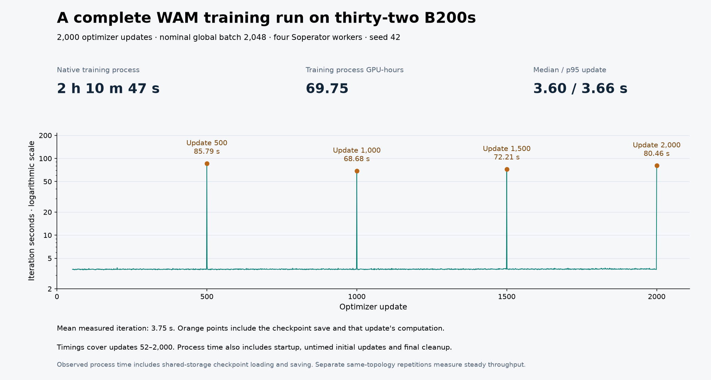

# Completed four-node, 32-B200 WAM training

Four reserved eight-B200 nodes completed all **2,000 optimizer updates** in
**2 h 10 m 47 s** (7847.286812 seconds),
using **69.75 training-process GPU-hours**.
All four native processes returned zero. Slurm recorded `COMPLETED`, `0:0`,
and 8,124 allocated seconds
(72.21 allocated GPU-hours).



[measurement.json](measurement.json) and [iteration-series.csv](iteration-series.csv)
are the reporter outputs. Updates 52–2,000 supply 1,949 timed
rows: mean 3.7528 s, median 3.60 s,
p95 3.66 s. The checkpoint-bearing iterations were
85.79, 68.68, 72.21, 80.46 seconds. These include iteration work and are not isolated storage timings.
The final model, optimizer, scheduler and trainer checkpoint contains
132 files totaling 177.29 GB.
Every file in [checkpoint-hashes.json](checkpoint-hashes.json) matches the
independently uploaded, full-GET-verified private archive. The logical manifest
SHA-256 is `a18b5a026b44b275ef89da1f05cd7e626bfd15d5d446d1f90224b02cb37604f3`.

The predeclared protocol retained global batch 2,048, sample cap 64, seed 42,
FP32 parameters, BF16 compute and EMA. Accumulation is one; FSDP shards within
each eight-GPU node and HSDP replicates across four nodes. Source/model/data pins
are in the measurement. The executed FIFO-compatible launcher and launch/config
hashes are linked by [evidence.json](evidence.json).

This run used the real NPA Soperator control plane: Soperator 4.1.6, Slurm 25.11.3,
driver 580.159.04 and a shared VirtioFS jail. The older 8/16-GPU runs used native
Slurm and NFS. These are separate operational cohorts; a cross-cohort elapsed-time
ratio does not isolate GPU count. Evaluation and archival did not overlap training.
Preparation, queue delay, evaluation and archival are separate from training time.

The successful ten-job validation campaign spanned **4 h 58 m 52 s**
from the first full-run allocation start through the final visual allocation end.
Its ten workload allocations total **150.54 GPU-hours**;
see [campaign-accounting.json](campaign-accounting.json). This includes repeated
timing runs, profiling and evaluation, not just one training schedule. Preparation,
provisioning, excluded attempts, health jobs, CPU reduction, archival and idle
reservation billing are outside that allocation total. It is not a cloud bill.

[dataset-warning-audit.json](dataset-warning-audit.json) covers all four complete
native logs (1,080,000 iterable-length warnings).
The pinned dataset cycles indefinitely while its reported length is finite.
The source audit explains this warning, and runtime logs cover ranks 0–31 with
world size 32. It is not a sample-by-sample disjointness trace. Warnings were not
suppressed; full-process timing includes their logging. All four logs contain
zero tracebacks, skipped-update messages and NCCL warnings under the recorded checks.
The 200-update timing repetitions end before the finite-length warning threshold.

## Reproduce

Follow the [recipe](../../../../npa/workflows/workbench/cosmos3-wam-slurm/README.md) through NPA Soperator deployment and qualification,
then plan `--nodes 4 --steps 2000` and submit the generated `train.sbatch`.
Run `report.py --run-dir "$WAM_FULL_RUN"` after successful Slurm completion and
all four native completions. Preserve all four saved checkpoints for the
[checkpoint-linked evaluations](../cosmos3-wam-quality-32/README.md).
Historical reporter `quality_measured` fields describe training-only scope;
the separate quality curve supplies the later evaluation results.

Regenerate this figure from committed data:

```bash
npa/.venv/bin/python docs/workbench/evidence/cosmos3-wam-full-32/plot.py
```

The renderer verifies input hashes. [render-manifest.json](render-manifest.json)
records plotting versions and image hashes. [All-device telemetry](../cosmos3-wam-full-gpu-activity-32/README.md)
and [live process attribution](../cosmos3-wam-live-training-32/README.md) provide
separate GPU execution evidence.
