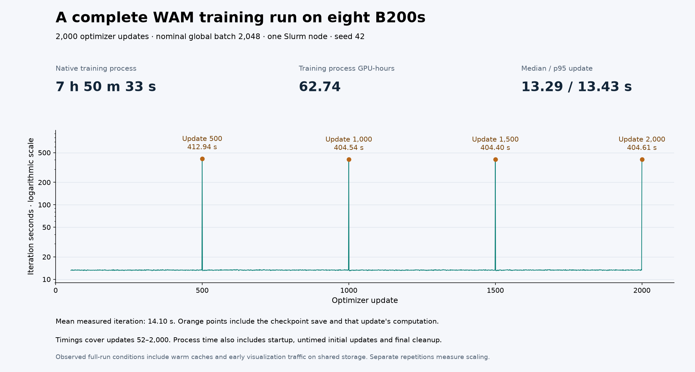

# Completed eight-B200 WAM training run



The native Cosmos3-Nano LIBERO-10 WAM trainer completed all 2,000 optimizer
updates on eight reserved B200 GPUs under Slurm on September 26, 2026. The
worker returned zero, Slurm recorded `COMPLETED` with exit code `0:0`, and the
reporter found no Python failures or skipped optimizer updates. All four
scheduled checkpoints completed.

| Measurement | Observed result |
| --- | --- |
| Native training-process duration | 28,233.477 s — 7 h 50 m 33 s |
| Slurm allocation duration | 28,266 s — 7 h 51 m 6 s |
| Native training-process GPU-hours | 62.741 |
| Slurm allocated GPU-hours | 62.813 |
| Measured iterations | 1,949, covering updates 52–2,000 |
| Mean / median / p95 measured iteration | 14.098 / 13.29 / 13.43 s |
| Tokens across those measured iterations | 1,780,514,298 |
| Token throughput across those measured intervals | 64,798.38 tokens/s |
| Final checkpoint size | 177,284,648,524 bytes in 36 files |

The nominal global batch was 2,048, with a per-rank sample cap of 64, four
gradient-accumulation steps and seed 42. The framework, model, dataset,
tokenizer, VAE and simulator revisions appear in `measurement.json`. The
runtime used PyTorch 2.10.0+cu130 and CUDA 13.0. The recorded preflight proves
eight NCCL ranks on one host, with the expected all-reduce sum of 36.

## Timing scope and limitations

Training-process time includes model loading, the initial untimed updates,
training, checkpoint saves and final cleanup. It excludes environment setup,
input preparation, distributed preflight, archival and policy evaluation.
Slurm allocation time includes the launch wrapper and preflight. These GPU-hour
figures describe this training job; they are not the complete research campaign
or reserved-VM lifetime.

The native callback starts regular iteration measurements at update 52.
Periodic checkpoint writes remain inside the measured iterations. Updates
500, 1,000, 1,500 and 2,000 took 412.94, 404.54, 404.40 and 404.61 seconds,
respectively. Those durations include the associated training computation;
they are not pure storage-write times. The
[GPU and disk timeline](../cosmos3-wam-checkpoint-io/README.md) shows two of
these intervals in detail. The reported token throughput includes those
checkpoint-bearing intervals and excludes the first 51 updates.

This full run used caches primed by preparation and the earlier excluded
partial attempt. An early visualization worker also accessed shared storage
during part of training. These are observed results under those recorded
conditions. Separate, unprofiled 200-update repetitions provide the primary
scaling comparison; that comparison is still pending. Full 500-trial policy
evaluation and time to the predeclared 90% success target are also pending.

## Evidence and reproduction

- `measurement.json` is the unmodified output of the recipe's `report.py`.
- `iteration-series.csv` preserves every measured timing, native rank-zero
  last-microbatch loss, token count and overlapping VAE/data-preparation timer.
- `checkpoint-hashes.json` records SHA-256 for every final checkpoint file.
  The reporter's checkpoint fingerprint hashes the sorted JSON mapping, rather
  than the indented manifest file's raw bytes.
- `checkpoint-times.json` preserves checkpoint-ready training-time intervals
  derived from the native UTC log. Its timestamps have one-second resolution
  and are separate from the time later spent evaluating each checkpoint.
- `distributed-preflight.json` records the actual collective result.
- `evidence.json` links the public files and private completion/accounting
  receipts by hash, and records the allocation and run conditions.

The final checkpoint contains 121,408,256,743 model bytes, 55,876,182,901
optimizer bytes, 13,250 scheduler bytes and 195,630 trainer bytes. Original
logs and infrastructure details remain in private operator evidence.

To regenerate the figure with the Workbench Python environment and Matplotlib
3.11.2:

```bash
npa/.venv/bin/python docs/workbench/evidence/cosmos3-wam-full-8/plot.py
```

The renderer verifies the input hashes and canonical checkpoint fingerprint,
then recomputes the mean and median from the CSV. `render-manifest.json`
records the rendered PNG hash. For a fresh execution, follow the
[Slurm runbook](../../cookbooks/cosmos3-wam-slurm.md).
