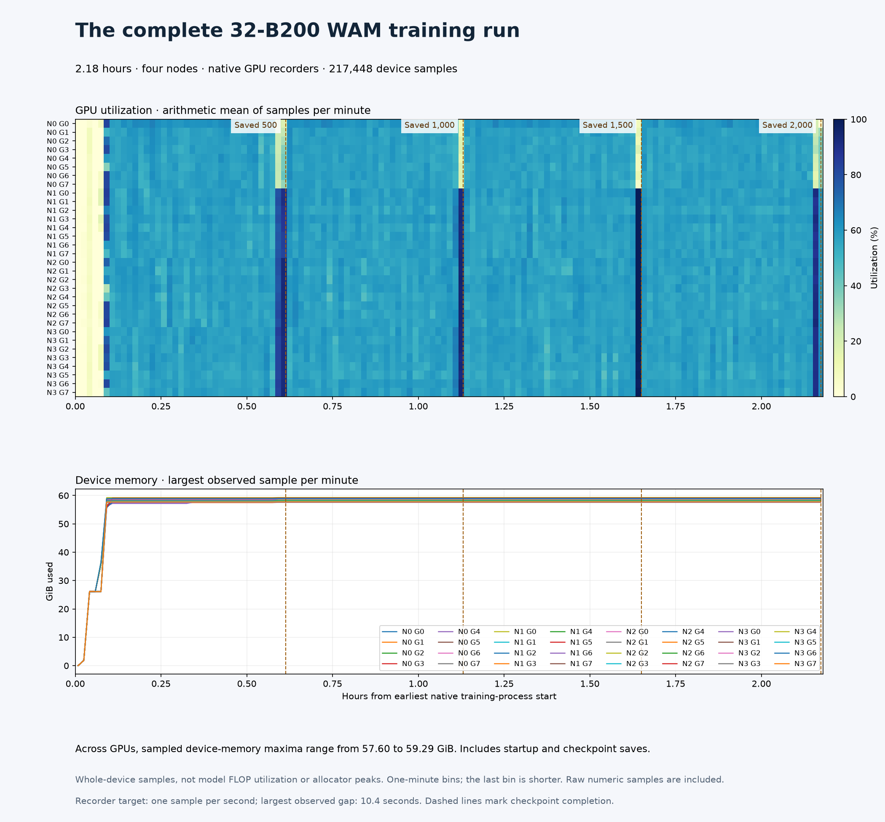

# Full 32-GPU training telemetry

**217,448 real device samples** span the union of all four completed native
training-process intervals. The recorder targeted one-second sampling; the
largest observed per-device gap was **10.379 seconds**. Sampled per-device
memory maxima ranged from **57.60 to 59.29 GiB**.



Ranks come from the actual Slurm allocation and native process attribution;
pod ordinals do not establish node rank. Checkpoint-ready markers align to the
earliest native-process start. No samples were selected to hide checkpoint pauses.
Utilization is sampled whole-device activity, not useful model work or FLOP
utilization. Sampled memory maxima are not allocator or subsecond peaks.
Arithmetic sample means are not time-weighted integrals. Missing bins remain blank.

[evidence.json](evidence.json) links all four node exports. Each records original
settings/completion hashes, raw-row hashes and numeric CSV hashes. Original
recorders were stopped only after the campaign and preserved in the verified
private archive. [Live process proof](../cosmos3-wam-live-training-32/README.md)
separately attributes all 32 GPUs to the native training command.

## Reproduce

Record each host's actual `nvidia-smi` stream alongside the [recipe](../../../../npa/workflows/workbench/cosmos3-wam-slurm/README.md).
After training completes, export each recorder using its verified Slurm node rank:

```bash
npa/.venv/bin/python docs/workbench/evidence/cosmos3-wam-full-gpu-activity-32/export.py \
  --run-dir "$WAM_FULL_RUN" --node-rank "$WAM_NODE_RANK" \
  --telemetry "$WAM_GPU_CSV" \
  --numeric-reducer docs/workbench/evidence/cosmos3-wam-full-gpu-activity-16/export.py \
  --output-dir "$WAM_NODE_EXPORT"
```

Use fresh output directories and preserve all four native completion receipts.
The exporter reuses the earlier numeric reducer, with four-node interval and
identity checks. Canonical compressed CSVs were generated with training Python
3.13.15; gzip headers can differ between Python versions even with identical rows.

```bash
npa/.venv/bin/python docs/workbench/evidence/cosmos3-wam-full-gpu-activity-32/plot.py
```

The renderer verifies all node hashes and checkpoint times. Plotting versions
and rendered image hashes are recorded in [render-manifest.json](render-manifest.json).
