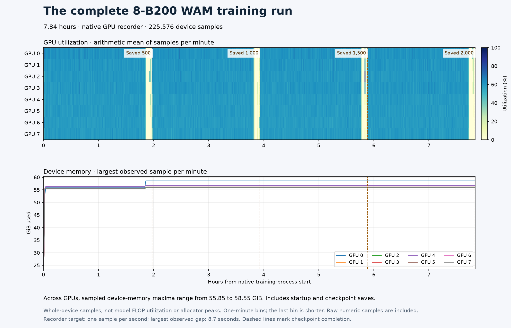

# GPU activity across the completed eight-B200 training run



The GPU recorder captured 225,576 device samples during the completed
2,000-update WAM training process: 28,197 samples from each of eight B200s.
The [completed-run record](../cosmos3-wam-full-8/README.md) establishes the
28,233.477-second process duration, successful training and checkpoint hashes.
The [process-attributed snapshot](../cosmos3-wam-live-training/README.md)
independently identifies the actual training processes on all eight devices.

The pale utilization bands coincide with the four checkpoint-bearing
iterations. Dashed lines mark the native checkpoint-completion events, with
one-second timestamp resolution. These are device measurements across the
whole native process, including startup and saves. They are not model FLOP
utilization or a measurement of pure checkpoint-write time.

| GPU index | Largest sampled device memory |
| --- | --- |
| 0 | 58.55 GiB |
| 1 | 55.95 GiB |
| 2 | 55.85 GiB |
| 3 | 56.17 GiB |
| 4 | 56.78 GiB |
| 5 | 56.15 GiB |
| 6 | 56.00 GiB |
| 7 | 55.98 GiB |

These maxima describe sampled whole-device memory use. They are not PyTorch
allocator peaks, and sampling can miss shorter spikes. The recorder requested
one sample per second; the largest observed interval was 8.7 seconds. The
manifest retains each device's sample count, first and last timestamps, median
and maximum sampling interval, and memory/utilization/power statistics.

## Reproduce the figure

The compressed CSV contains the original selected numeric measurements,
expressed as seconds from native training-process start. Its columns are
elapsed seconds, GPU index, device memory in MiB, utilization percent and power
in watts. The export omits the recorder's other columns. It preserves a SHA-256
of the selected original recorder rows and hashes both the compressed and
uncompressed numeric CSV.

`plot.py` verifies the CSV hashes and reconciles per-device counts and summary
statistics before plotting. Each utilization cell is the arithmetic mean of
samples in that minute; the memory lines show each minute's largest sample.
The last bin is shorter than one minute. Neither aggregation interpolates
missing samples. `checkpoint-times.json` is copied byte-for-byte from the
completed-run evidence.

With Matplotlib 3.11.2 and NumPy 2.5.3 in the Workbench environment:

```bash
npa/.venv/bin/python docs/workbench/evidence/cosmos3-wam-full-gpu-activity/plot.py
```

The inspected figure reproduced the identical SHA-256 on a second render.
`render-manifest.json` records the image and input-manifest hashes. The GPU
recorder and its UTC clock convention are documented in
[native-cluster.md](../../../../npa/workflows/workbench/cosmos3-wam-slurm/native-cluster.md).

To extract another completed one-node run, choose private paths for its run
directory, raw recorder CSV and fresh export directory. Run `export.py` in the
native training Python environment:

```bash
"$WAM_SHARED_ROOT/framework/.venv/bin/python" "$WAM_GPU_EXPORT_SCRIPT" \
  --run-dir "$WAM_RUN" --telemetry "$WAM_GPU_TELEMETRY" \
  --output-dir "$WAM_GPU_EXPORT_OUTPUT"
```

`WAM_GPU_EXPORT_SCRIPT` selects this directory's `export.py`. The exporter
derives native process start from the completion receipt's end time minus
training-process duration. The launcher's earlier start also includes
preflight, so it would select a different interval. Export only after timing
runs finish. Keep original recorder files and operational metadata in private
evidence; publish only the reviewed numeric export.
