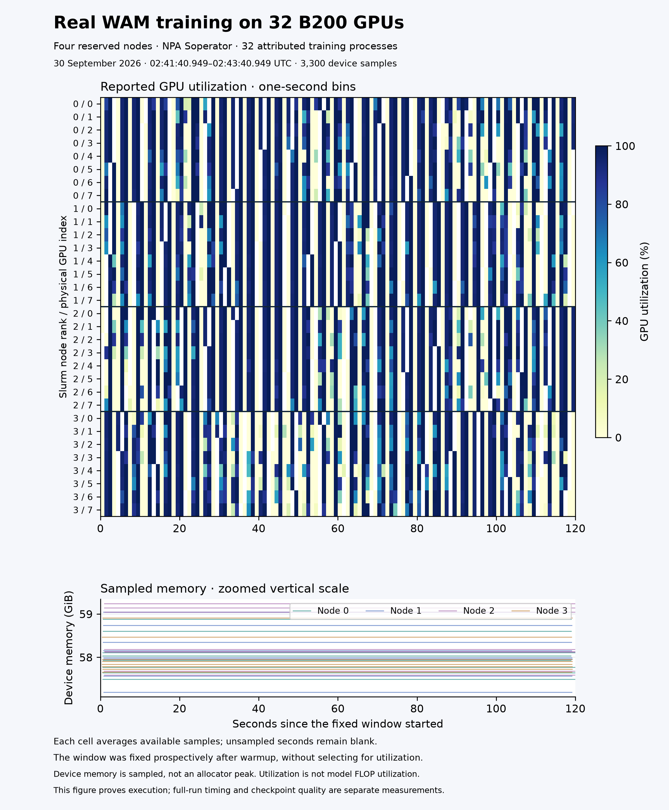

# Real four-node, 32-B200 WAM execution



Four reserved eight-B200 workers executed the native Cosmos 3 Nano WAM trainer
through NPA Soperator, Slurm and torchrun. The four `node-*.json` snapshots
attribute **all 32 GPU processes** to the native training command, exact TOML,
Slurm cgroup, local rank and global rank. Each snapshot observed completed
optimizer update 74. The distributed preflight verified four hosts, 32 distinct
rank/device placements, and the correct NCCL all-reduce sum **528**.

These receipts were captured early in the 2,000-update run. Their historical
bytes remain unchanged. The later [completed schedule](../cosmos3-wam-full-32/README.md),
[repeated timings](../cosmos3-wam-timing-32/README.md) and
[checkpoint evaluations](../cosmos3-wam-quality-32/README.md) establish duration,
throughput and quality; this early window alone does not. The
[deployment record](../cosmos3-wam-soperator-32/README.md) preserves the corrected
NCCL FIFO failure from the excluded first attempt.

## A prospectively selected window

The window was fixed after observing the 50-update warmup, before collecting
its future samples. It covers **02:41:40.949–02:43:40.949 UTC on September 30,
2026**. The original endpoints and selection rule are in `live-window.json`.
There was no utilization-based window selection.

The window contains **3,300 device samples**. Every local GPU index appears on
every worker. Per-device arithmetic sample means range from **50.83% to 62.88%**
utilization; sampled device memory ranges from **57.19 to 59.24 GiB**. The largest
observed sampling interval was **1.237 seconds**. A requested one-second recorder
loop does not guarantee one observation in each wall-clock second. Each heatmap
cell averages available readings; missing bins stay blank without interpolation.
These are device-utilization readings, not model FLOP utilization or exposed
communication overhead. Memory maxima are sampled device usage, not allocator
peaks or guarantees about shorter spikes.

Node labels are the Slurm node ranks read from the attributed processes. Their
mapping to physical worker ordinals was verified during capture; it was not
inferred from pod names. Each worker's telemetry uses its own recorded timestamps.

## Transport proof

The four `transport-node-*.json` receipts match the **active native training
processes** to frozen prefixes of their individual NCCL logs. All 32 contain
completed initialization of the 32-rank communicator and select InfiniBand.
There are no `NCCL WARN` lines in the captured prefixes. The earlier preflight
processes are excluded from these transport receipts. This establishes selected
transport and initialization, not NIC line rate or collective bandwidth.

`capture_transport.py` is the exact executed source; its hash and the reused
attribution source hash appear in every receipt. Raw logs include private host
details and remain in access-controlled evidence. Their hashes are retained.

## Reproduce the capture and figure

On every worker, use the existing
[`capture.py`](../cosmos3-wam-live-training-16/capture.py) with the active run,
job ID and fresh output path. Then freeze its transport diagnostics:

```bash
"$WAM_SHARED_ROOT/framework/.venv/bin/python" "$WAM_TRANSPORT_CAPTURE" \
  --run-dir "$WAM_RUN_DIR" --job-id "$WAM_JOB_ID" --output "$WAM_TRANSPORT_OUTPUT"
```

`WAM_TRANSPORT_CAPTURE` selects this directory's `capture_transport.py` in the
same checkout layout. Preserve the referenced sixteen-GPU `capture.py` beside
this evidence directory. Output logs are private; only the numeric JSON
summaries should be published. Each output path must be fresh.

Record prospective window endpoints before collecting its future samples.
After the window ends, use this directory's `export_window.py` for each actual
Slurm node rank and its corresponding telemetry file:

```bash
"$WAM_SHARED_ROOT/framework/.venv/bin/python" "$WAM_WINDOW_EXPORTER" \
  --window "$WAM_OBSERVATION_WINDOW" --node-rank "$WAM_NODE_RANK" \
  --telemetry "$WAM_NODE_TELEMETRY" --output-dir "$WAM_NODE_EXPORT"
```

This four-node wrapper reuses the original numeric reducer without changing its
bytes. Receipts record that reducer's hash; `evidence.json` also records the
wrapper hash. It validates timestamp order, boundary coverage and all eight
local devices. Regenerate the figure from committed samples with:

```bash
npa/.venv/bin/python docs/workbench/evidence/cosmos3-wam-live-training-32/plot_window.py
```

The renderer verifies the input hashes before drawing. It was executed and the
result inspected. The render manifest records exact library versions and the
image hash. No generated or interpolated device readings are used.
