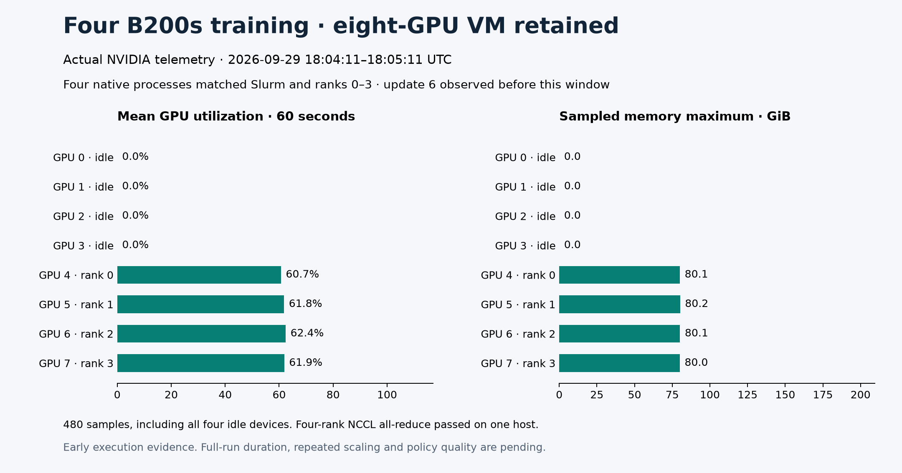

# Four-B200 WAM execution proof

**Cancelled after topology correction.** The requested extension is four nodes
with eight B200s each (32 GPUs), not four active GPUs. This attempt stopped at
observed update 535; checkpoint 500 was retained. All 16 owned queued/running
jobs were cancelled, the queue was verified empty, and both owned workers are
stopped. [The cancellation receipt](cancellation.json) supersedes the pending
status in the immutable startup capture below. No completed timing or quality
result from this attempt enters the scaling comparison.



On September 29, 2026, the pinned native WAM trainer completed initial optimizer
updates with four B200 ranks on one reserved eight-GPU VM. The process snapshot
followed update six. All four CUDA processes matched the native training command,
its exact TOML path, the Slurm job cgroup and `WORLD_SIZE=4`; their distinct
rank/local-rank pairs covered zero through three. The real NCCL preflight passed
with four ranks on one host and an all-reduce sum of ten.

This is **early execution evidence**. The 2,000-update schedule, three timing
repetitions, separate profile and checkpoint evaluations were still pending at
capture. It establishes that the unchanged FP32-parameter, BF16-compute, EMA
configuration can begin training on four B200s. It does not establish completed
training, throughput, time to quality or the minimum GPU count.

## Active devices and allocated capacity

The exclusive Slurm job retained all eight GPUs on the existing VM. Its training
step requested four GPUs and `torchrun` launched four ranks. Physical GPU indices
4–7 ran the trainer; indices 0–3 were idle. No four-GPU VM or reduction in allocated
cloud capacity is claimed. Training GPU-hours must use four active GPUs, while
the retained VM has eight provisioned GPUs.

Global batch remains 2,048, with a sample cap of 64 per rank, accumulation eight
and seed 42. Source, model, tokenizer, dataset, precision and EMA settings match
the completed eight/sixteen-GPU campaign. The
[four-GPU protocol](../../../../npa/workflows/workbench/cosmos3-wam-slurm/benchmark-protocol-4.json)
was recorded before execution. The
[recipe](../../../../npa/workflows/workbench/cosmos3-wam-slurm/README.md#four-gpu-experiment)
documents the `--gpus-per-node 4` launch option.

## Recorded GPU activity

The fixed window starts at the first process-attributed snapshot's timestamp,
rounded down to a second, and retains the following sixty seconds. All 480
device samples are included: sixty per GPU, including idle devices. Active-GPU
mean utilization was 60.7–62.4%; sampled memory maxima were 80.0–80.2 GiB. The
four idle devices recorded zero utilization and zero device memory use.

These means describe this early window, which includes data preparation and
other pauses. They are not throughput measurements or whole-run averages.
The instantaneous process snapshot itself recorded zero utilization between
compute intervals; those original values are preserved. Memory figures are
sampled device usage, not allocator peaks.

`live-training-startup.json` contains the sanitized process-attribution receipt.
`live-training-window.csv` preserves all numeric samples, and its companion JSON
records the exact UTC bounds and selection rule. `evidence.json` binds the source
files by SHA-256 and records the execution scope. Raw infrastructure identifiers
and process details remain in private operator evidence.

To reproduce the figure from committed records:

```bash
npa/.venv/bin/python docs/workbench/evidence/cosmos3-wam-live-training-4/plot.py
```

The renderer checks the input hashes, sample counts and rank coverage before
plotting. `render-manifest.json` records its Matplotlib version and output hash.
