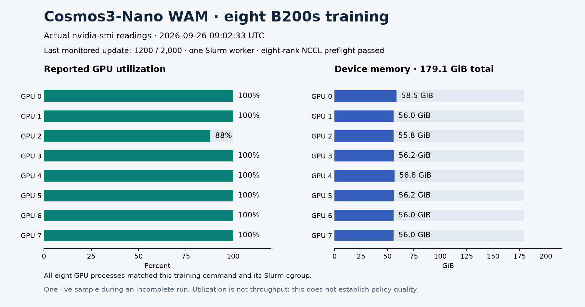

# Live eight-B200 training snapshot



This records the native WAM training run at 09:02:33 UTC on September 26,
2026, shortly after the monitor observed update 1,200 of 2,000. All eight
NVIDIA B200s had a live training process. Each process was checked against the
actual native training command, its planned TOML and the running Slurm job's
cgroup. The same allocation had passed an eight-rank NCCL all-reduce preflight.

The [numeric readings](evidence.json) come from `nvidia-smi`. Its per-device
queries span 48 milliseconds. Reported utilization was 88–100%; used device
memory was 55.85–58.55 GiB. These are sampled readings, not peak memory,
model FLOP utilization, throughput or completed-training measurements. The
run was incomplete when this snapshot was taken. Raw process identifiers and
infrastructure details remain in private operator evidence.

The devices reported driver 580.173.02 and 179.06 GiB total memory through
`nvidia-smi`; CUDA's usable memory can differ because of runtime reservations.
The plot uses the recorded `nvidia-smi` denominator.

To reproduce the figure from the recorded observations, use the Workbench
Python environment with Matplotlib 3.11.2:

```bash
npa/.venv/bin/python docs/workbench/evidence/cosmos3-wam-live-training/plot.py
```

`render-manifest.json` links the numeric input and rendered PNG by SHA-256.
The recipe's [native deployment guide](../../../../npa/workflows/workbench/cosmos3-wam-slurm/native-cluster.md#evidence-and-cleanup)
documents continuous GPU telemetry collection for a fresh run.
