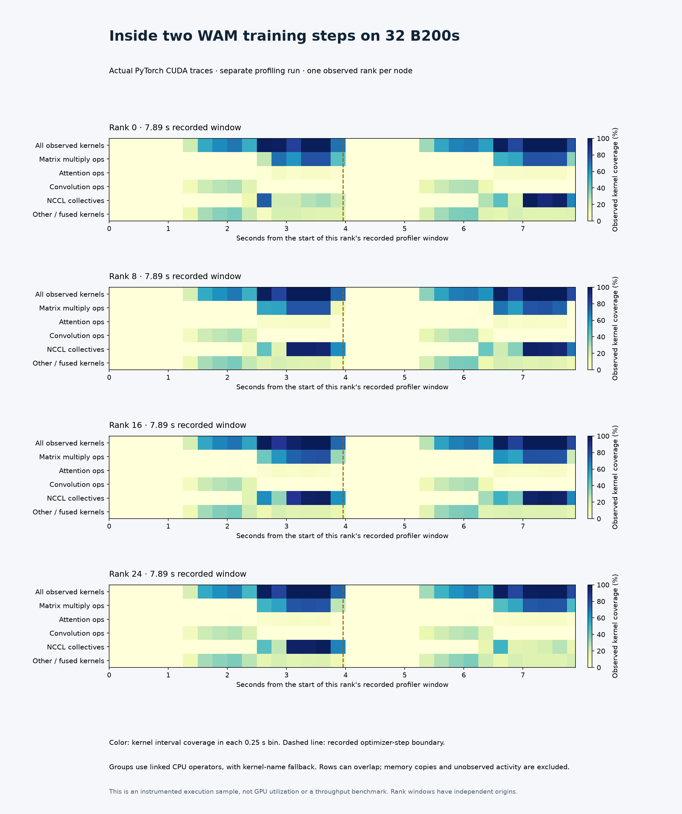

# CUDA profiling across four B200 nodes

A separate 110-update, 32-B200 profiling run completed successfully. It observed
global ranks **0, 8, 16 and 24**, one per node, over native profiler steps 98 and 99.
This instrumented run is excluded from the three-repeat throughput measurement.
Native process time was **789.329 seconds**;
Slurm allocation was **1,060 seconds**.
[run-evidence.json](run-evidence.json) links all four successful native completions,
the full training report and the independently verified final checkpoint.

| Global rank | Window seconds | CUDA kernels | Observed kernel union seconds | NCCL events | Summed NCCL seconds |
| --- | --- | --- | --- | --- | --- |
| 0 | 7.893612 | 99,450 | 4.043889 | 320 | 1.715955 |
| 8 | 7.892750 | 99,450 | 4.072362 | 320 | 2.347235 |
| 16 | 7.892678 | 99,450 | 4.078372 | 320 | 2.870375 |
| 24 | 7.892798 | 99,450 | 3.991751 | 320 | 1.783160 |



Kernel categories prefer linked CPU operators; fused kernels without stronger
attribution remain `other`. Categories overlap in time and must not be stacked
as wall-time fractions. Summed NCCL durations are not exposed communication
overhead. The observed kernel union excludes memcpy, CPU work and unobserved
activity. Four sampled ranks do not represent aggregate 32-GPU utilization.

[evidence.json](evidence.json) links original trace hashes, analyzer/exporter
hashes, [profile-summary.json](profile-summary.json) and exported numeric timelines.
All original traces remain in the independently full-GET-verified private archive.

## Reproduce

Use a fresh `--nodes 4 --steps 110 --profile` plan from the [recipe](../../../../npa/workflows/workbench/cosmos3-wam-slurm/README.md).
After all four native processes and Slurm complete successfully, run
`profile_report.py --run-dir "$WAM_PROFILE_RUN"`. Export to a fresh directory:

```bash
npa/.venv/bin/python docs/workbench/evidence/cosmos3-wam-profile-32/export.py \
  --recipe-dir "$WAM_RECIPE" --run-dir "$WAM_PROFILE_RUN" \
  --output-dir "$WAM_PROFILE_EXPORT"
```

Regenerate the committed figure from its numeric exports:

```bash
npa/.venv/bin/python docs/workbench/evidence/cosmos3-wam-profile-32/plot.py
```

The renderer verifies numeric hashes; [render-manifest.json](render-manifest.json)
records plotting versions and image hashes.
