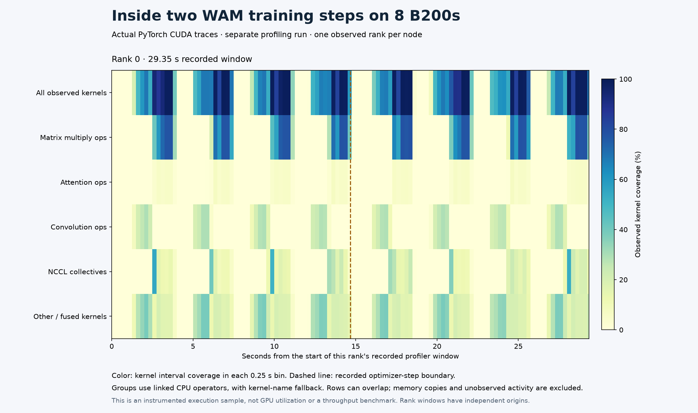

# Actual CUDA profile of eight-B200 WAM training



A separate 110-update native training run completed on eight reserved B200s.
Its native process took 2,021.073 seconds; Slurm recorded `COMPLETED`, exit
`0:0`, and 2,054 allocated seconds. This instrumented run is excluded from
throughput and scaling comparisons. The normal completion report, source
revisions, batch settings and actual eight-rank NCCL preflight are included.

The PyTorch trace observes rank zero, which uses GPU zero, across two distinct
host profiler steps. The recorded window is 29.3515 seconds. It contains
397,612 CUDA kernel events; 397,526 have an unambiguous linked CPU operator.
The union of observed kernel intervals covers 15.1309 seconds on that device.
This is neither GPU utilization nor model FLOP utilization: it omits memory
copies and other unobserved activity, and a running kernel need not fill the GPU.

| Kernel group | Kernel events | Summed kernel duration |
| --- | --- | --- |
| Matrix multiply operators | 13,736 | 7.2130 s |
| Convolution operators | 33,792 | 2.1418 s |
| Attention operators | 3,328 | 0.5928 s |
| NCCL collectives | 906 | 2.3062 s |
| Other and fused kernels | 345,850 | 4.7996 s |

These duration sums overlap across streams. They must not be added into a
wall-time breakdown, and the NCCL sum is not exposed communication overhead.
The heatmap instead merges overlapping intervals within each category and
each 0.25-second bin. Categories can still overlap with one another; do not
stack the rows. Gaps in observed kernel activity call for inspecting host
work and memory copies before attributing a bottleneck.

## Classification and trace integrity

Kernel names alone are insufficient on this runtime. The same Blackwell
`nvjet` family appears under matrix multiplication and convolution operators,
and an implicit-GEMM convolution name contains `gemm`. The analyzer joins
kernel events to `cpu_op` events through the trace's `External id` field.
Ambiguous links are discarded. NCCL kernels are recognized by name; unlinked
kernels retain a name-based fallback. Fused Triton kernels remain in the
other category because their generated names can mention several operations.
These are operator-origin groups, including their helper kernels, not exact
model-stage boundaries or FLOP counts.

This link follows the [pinned Kineto trace writer](https://github.com/pytorch/kineto/blob/31f85df8fbd89c188f14ef10f1ec65379786b943/libkineto/src/output_json.cpp):
an event with a linked activity receives that activity's correlation ID as
its `External id`. CPU events use their own correlation ID. The analyzer
therefore uses the trace's recorded relationship to the host operator.

The trace also contains GPU annotations repeating the host profiler-step
names. Only distinct host annotations define the step markers. A duplicated
CPU/GPU annotation cannot satisfy the requirement for two recorded steps.
The figure's dashed line is the actual boundary between the two host steps.

This analysis uses the unchanged native trace, whose compressed size is
71,058,433 bytes and whose SHA-256 is recorded in both report and manifest.
`provenance.json` links the completed run and the original archived report.
Reanalysis changed classification and step-marker handling; it preserved the
trace hash, window, total kernel count and all-kernel interval union.
The original report and raw trace remain in private evidence. No training
rerun was substituted for the captured execution.

## Reproduce the analysis and figure

`profile-summary.json` is the current recipe analyzer's result.
`rank-0-timeline.csv` contains numeric interval unions for every displayed bin;
`evidence.json` records its hash, the exact trace hash, analyzer source hash
and exporter hash. `plot.py` verifies those inputs and reconciles the total
binned kernel coverage with the report before rendering.

With Matplotlib 3.11.2 and NumPy 2.5.3 in the Workbench environment:

```bash
npa/.venv/bin/python docs/workbench/evidence/cosmos3-wam-profile-8/plot.py
```

The inspected image reproduced the identical hash on a second render.
`render-manifest.json` records the renderer versions and output hash.

To analyze a new completed `--profile` run, select its private run directory
in `WAM_PROFILE_RUN`, a fresh report path outside the archived run in
`WAM_PROFILE_SUMMARY`, this directory's `export.py` in
`WAM_PROFILE_EXPORT_SCRIPT`, and a fresh directory in `WAM_PROFILE_EXPORT_OUTPUT`:

```bash
"$WAM_SHARED_ROOT/framework/.venv/bin/python" "$WAM_RECIPE/profile_report.py" \
  --run-dir "$WAM_PROFILE_RUN" --output-path "$WAM_PROFILE_SUMMARY"
"$WAM_SHARED_ROOT/framework/.venv/bin/python" "$WAM_PROFILE_EXPORT_SCRIPT" \
  --recipe-dir "$WAM_RECIPE" --run-dir "$WAM_PROFILE_RUN" \
  --summary-path "$WAM_PROFILE_SUMMARY" --output-dir "$WAM_PROFILE_EXPORT_OUTPUT"
```

The exporter defaults to 0.25-second bins; `--bin-seconds` changes that width.
`--summary-path` selects a separately saved analysis and otherwise defaults to
the run's `profile-summary.json`. It requires one trace per node, on ranks
0, 8 and so on. Multiple rank windows have independent time origins. Preserve
original reports when reanalyzing, keep raw traces private, and perform large
trace reads after timing runs have finished.
