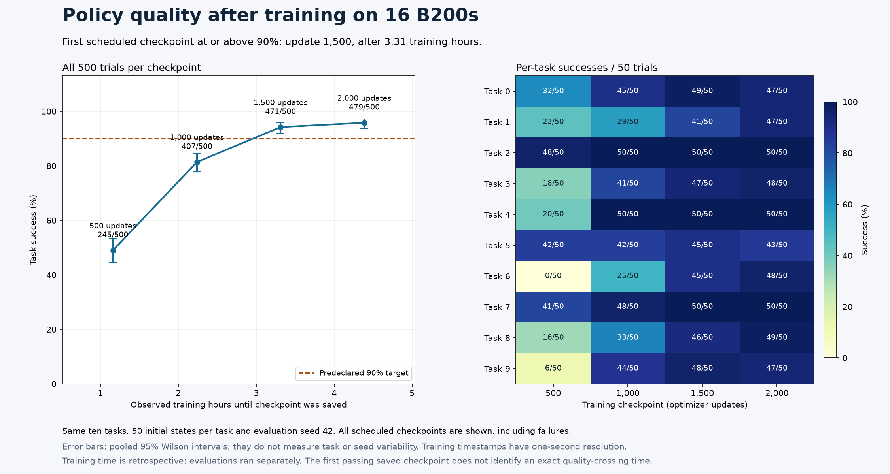

# Sixteen-B200 checkpoint-linked policy quality

Four 500-trial LIBERO-10 evaluations completed with **zero infrastructure
errors**, each using eight B200 policy servers and eight simulator environments
per server, fifty initial states per task, seed 42. The training used sixteen
GPUs; evaluation used eight. All 2,000 trial records across distinct checkpoints
are retained and must not be pooled into one policy accuracy.

| Update | Checkpoint ready after training start | Successes | Rate | Evaluation process seconds |
| --- | --- | --- | --- | --- |
| 500 | 1 h 9 m 38 s | 245/500 | 49.0% | 2,728.398 |
| 1,000 | 2 h 14 m 23 s | 407/500 | 81.4% | 2,388.036 |
| 1,500 | 3 h 18 m 46 s | 471/500 | 94.2% | 2,239.108 |
| 2,000 | 4 h 23 m 17 s | 479/500 | 95.8% | 2,230.071 |



The first saved checkpoint above the predeclared 90% aggregate target was
update 1,500, ready in the interval **[11,925.654, 11,926.654] seconds**.
Quality was verified afterward; training continued to 2,000. This is not an
exact threshold crossing or online early stopping. One-second log precision
bounds save timestamps. The final model saved roughly sixteen seconds before
native process exit. All evaluation processes together took 9,585.613 seconds
and 21.3014 evaluation-process GPU-hours; training, queue delay and idle
reservations are excluded.

Native servers loaded trained EMA weights using thirty UniPC denoising steps,
guidance 1.0, sixteen-action chunks, 20 Hz, 10D rot6d/quantile_rot actions and
zero_one gripper mapping. CPU MuJoCo with OSMesa rendered observations. The
pinned evaluator uses initial-state indices 0–49 per task and a 520-step limit,
including ten stabilization steps. Vectorized per-episode elapsed values share
a wave's duration and are not isolated inference latencies.

`quality-step-*.json` retains every native trial, with positive steps and null
errors. `model-hashes-step-*.json` retains all seventeen model components per
checkpoint, matched against full-GET-verified training archives. The final
model hash matches the [actual policy videos](../cosmos3-wam-final-visual-16/README.md).
`quality-curve.json` is the executed reducer output: it rehashes real model
payloads and joins native save events, settings and full evaluations.
[evidence.json](evidence.json) links 75 original private source files per
checkpoint, all eight completion receipts and actual successful Slurm accounting.

Pooled Wilson intervals describe trial sampling, not training-seed or task
variation. The same ten task types are used; no unseen-task or physical-robot
performance is established. The difference from the eight-GPU final 95.0%
result does not establish a GPU-count quality advantage with one training seed.
Source attribution is in the [visual notice](../cosmos3-wam-final-visual-16/NOTICE.md).
Historical training-only report bytes are retained; this later evaluation
establishes quality independently.

## Reproduce the measurements and figure

Follow the [native Slurm recipe](../../../../npa/workflows/workbench/cosmos3-wam-slurm/README.md)
through training, simulator preparation, runtime checks and guardrail prefetch.
Keep its documented HF token-file environment in the Slurm job environment.
Set `WAM_FULL_RUN` to the completed training run and `WAM_EVAL_ROOT` to a fresh
private evaluation parent directory. On the reserved B200 Slurm cluster:

```bash
set -euo pipefail
for WAM_STEP in 500 1000 1500 2000; do
  srun --nodes=1 --ntasks=1 --gpus-per-task=8 --cpus-per-task=128 --exclusive \
    "$WAM_SHARED_ROOT/framework/.venv/bin/python" "$WAM_RECIPE/evaluate.py" \
    --shared-root "$WAM_SHARED_ROOT" --run-dir "$WAM_FULL_RUN" \
    --step "$WAM_STEP" --output-dir "$WAM_EVAL_ROOT/step-$WAM_STEP" \
    --workers 8 --envs 8 --trials 50 --seed 42
done
"$WAM_SHARED_ROOT/framework/.venv/bin/python" "$WAM_RECIPE/quality_curve.py" \
  --run-dir "$WAM_FULL_RUN" \
  --evaluations "$WAM_EVAL_ROOT/step-500" "$WAM_EVAL_ROOT/step-1000" \
                "$WAM_EVAL_ROOT/step-1500" "$WAM_EVAL_ROOT/step-2000" \
  --output-path "$WAM_EVAL_ROOT/quality-curve.json"
```

Keep all four model checkpoints and the original training log until reduction
finishes. Require successful Slurm completion and all eight worker completion
receipts for each evaluation. A repeated run need not reproduce identical
weights, trajectories or outcomes; preserve every new result.

To regenerate this figure from the committed evidence, with the Workbench
Python environment, NumPy and Matplotlib:

```bash
npa/.venv/bin/python docs/workbench/evidence/cosmos3-wam-quality-16/plot.py
```

For a new measurement, use a separate directory containing its generated
`quality-curve.json`, `quality-step-STEP.json` and
`model-hashes-step-STEP.json` files for all four steps, plus a copy of `plot.py`.
Do not replace the committed observations with a new run's results.
