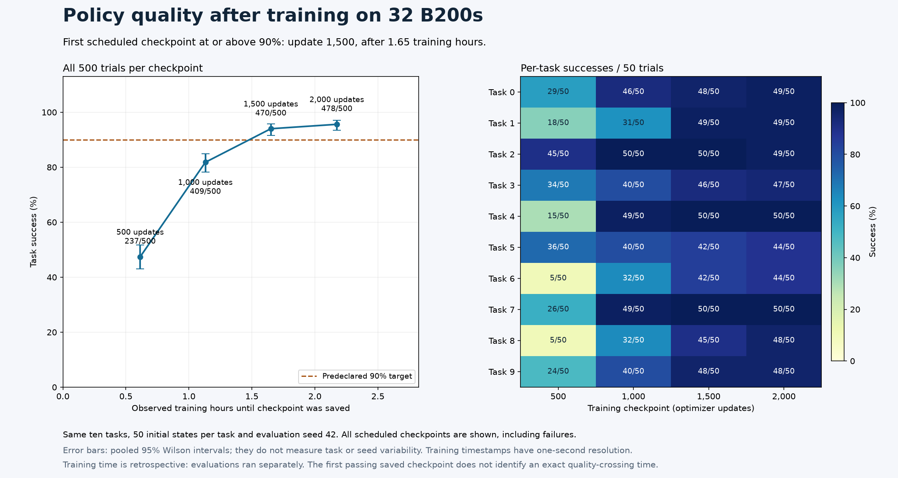

# Four-node WAM checkpoint-linked policy quality

Four 500-trial LIBERO-10 evaluations completed with zero infrastructure errors.
Training used **32 B200s**; each evaluation used **eight B200 policy servers**,
eight simulator environments per server and fifty initial states per task,
seed 42. The 2,000 trials belong
to four distinct checkpoints and must not be pooled as one policy accuracy.

| Update | Weights ready after training start | Successes | Rate | Evaluation process seconds |
| --- | --- | --- | --- | --- |
| 500 | 0 h 36 m 48 s | 237/500 | 47.4% | 3753.137 |
| 1,000 | 1 h 07 m 52 s | 409/500 | 81.8% | 3561.653 |
| 1,500 | 1 h 39 m 02 s | 470/500 | 94.0% | 3299.588 |
| 2,000 | 2 h 10 m 27 s | 478/500 | 95.6% | 3279.512 |



The first saved checkpoint meeting the predeclared 90% target was update **1,500**, ready in **[5942.036, 5943.036] training seconds**. This is an observed scheduled checkpoint, not an exact threshold crossing. Evaluation happened afterward; training continued to update 2,000.
One-second native log precision bounds checkpoint-ready timestamps. Evaluation
processes consumed 30.8753 GPU-hours
in total, separately from training. Evaluations ran on separate exclusive
nodes when capacity was available, so their summed durations are not campaign wall time.

Native servers loaded trained EMA weights with thirty UniPC denoising steps,
guidance 1.0 and sixteen-action chunks at 20 Hz. Actions use 10D rot6d,
quantile_rot normalization and zero_one gripper mapping. CPU MuJoCo with
OSMesa rendered observations. The evaluator uses initial states 0–49 and a
520-step limit, including ten stabilization steps. Per-episode elapsed times
in a vectorized wave are not isolated inference latency.

`quality-step-*.json` preserves every trial. `model-hashes-step-*.json` identifies
the evaluated weights and matches the independently full-GET-verified archive.
The final model also matches the [native visual pass](../cosmos3-wam-final-visual-32/README.md).
The source reducer output [quality-curve.json](quality-curve.json) joins model
identity, native save events and evaluation records. [evidence.json](evidence.json)
retains hashes and successful scheduler allocations.

Wilson intervals describe pooled trial sampling; they do not measure variation
across training seeds or tasks. All ten task types are represented in training.
These results do not establish unseen-task or physical-robot generalization,
and differences from the 8/16-GPU policies do not establish a GPU-count quality effect.

## Reproduce

Use the four-checkpoint evaluation commands in the [recipe](../../../../npa/workflows/workbench/cosmos3-wam-slurm/README.md), with
the completed four-node run as `WAM_FULL_RUN`. Each invocation needs its own
exclusive eight-GPU host because server ports are fixed. Retain the documented
HF token-file environment, all model checkpoints and the original training log.
Require all eight worker completions, successful Slurm accounting and 500
error-free trial records at each checkpoint before running `quality_curve.py`.
A new run need not reproduce identical weights, trajectories or outcomes.

Regenerate the committed figure:

```bash
npa/.venv/bin/python docs/workbench/evidence/cosmos3-wam-quality-32/plot.py
```
