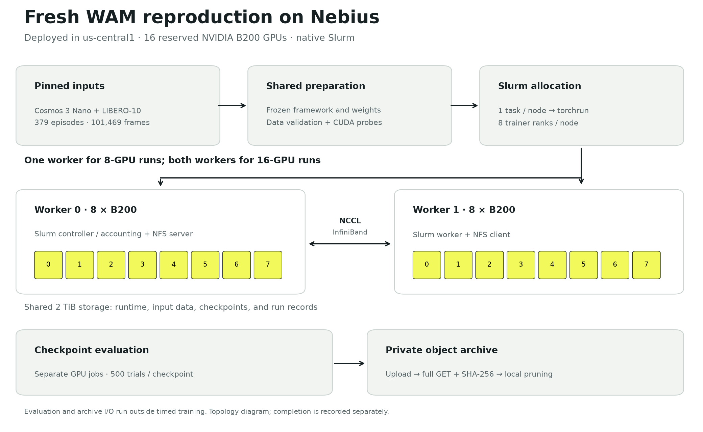
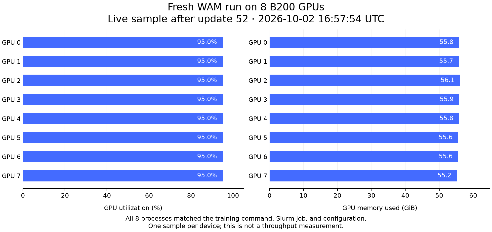
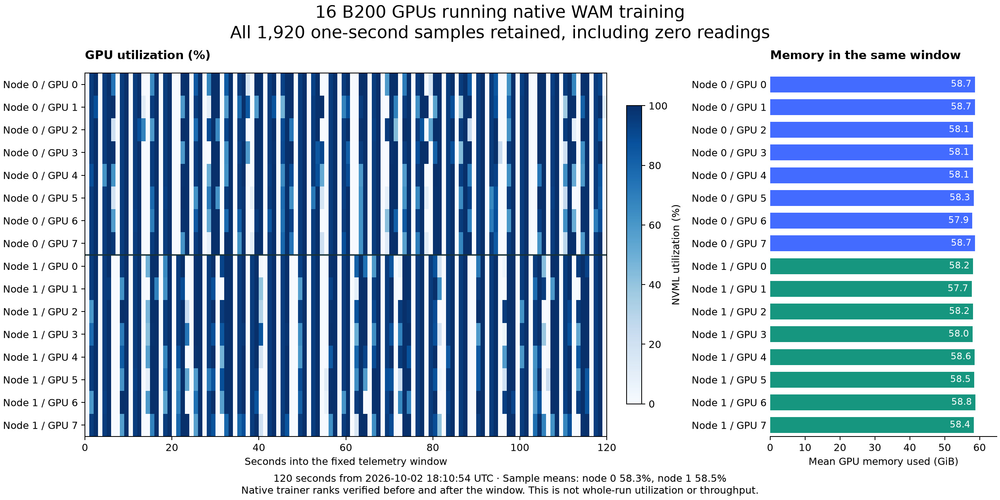

# Fresh Cosmos 3 WAM reproduction

This campaign started from merged Workbench revision
`a26a2d1c08b3fc9feafe3d973bb6e7bb6a396974` on October 2, 2026. It uses a new
operator-owned project, two reserved eight-B200 workers in `us-central1`,
fresh downloads, and newly converted base weights. Original campaign records
remain unchanged.

The [protocol](protocol.json) was recorded before training. It fixes 2,000
updates per full schedule, three 200-update timing repeats per topology,
separate 110-update profile runs, and 500-trial evaluations at each saved
checkpoint. Checkpoint upload and complete-object read-back verification run
between jobs, outside training and profiling windows.

**Measurement status: in progress.** The first eight- and sixteen-GPU timing
repetitions completed successfully. The remaining repetitions, full schedules, profiles,
and checkpoint evaluations are still pending. These records do not yet
establish a new scaling aggregate or policy-quality result.

## First completed timing pair

Both measurements cover all 149 timed updates, 52–200. The unchanged committed
reducer validates their numeric series and matching source/settings contracts.

| GPUs | Mean step time | Processed tokens/s | Measurement |
| --- | --- | --- | --- |
| 8 | 13.2284 s | 69,067.84 | [First repeat](repeat-8-1/measurement.json) |
| 16 | 6.8385 s | 133,614.67 | [First repeat](repeat-16-1/measurement.json) |

The first pair gives 1.9344× step speedup, compared with the original
three-repeat result of 1.9334×. Token work differs by 0.0068%. The fresh step
means are 0.60% and 0.65% below the respective original means. One repetition
per topology does not estimate run-to-run variability; the declared six-run
reducer remains gated on three completed repetitions per topology.

Both jobs completed with Slurm exit `0:0`. Training-process durations were
3,137.80 and 1,930.45 seconds, including final checkpoint saves of 399.61 and
398.64 seconds outside the timed iterations. Slurm allocation durations were
3,172 and 1,963 seconds, respectively.
These are durations for a 200-update timing run, not a full 2,000-update
schedule. The other reserved worker was idle during this baseline; reported
training GPU-hours do not include that idle capacity or represent a bill.
The archive receipts for [8 GPUs](repeat-8-1/archive-verification.json) and
[16 GPUs](repeat-16-1/archive-verification.json) confirm that all 75 and 125
files, respectively, passed complete-object SHA-256 read-back before local
checkpoint pruning. Archive work did not overlap training allocations.

## Deployment and inputs

The diagram shows the deployed native cluster and the campaign's job and
artifact flow. Completion status is reported separately above.



An [SVG version](reproduction-topology.svg) is available for editorial use.
Run `plot-topology.py` with the repository virtualenv to reproduce both
formats; the [render manifest](topology-render-manifest.json) binds the
renderer, readiness and input receipts, and output hashes.

The [readiness receipt](readiness.json) records 16 distinct physical GPUs and
16 independent passing CUDA attention/backward and native fused-optimizer
probes. Both workers passed the shared-memory survival check after logout.
Native Slurm, IPv4/IPv6 filtering, and the service dependency on firewall
restoration were installed on both workers. The driver, PyTorch, CUDA, and
NCCL versions match the original native 8/16-GPU cohort.

The [input receipt](inputs.json) records the six pinned upstream revisions,
payload hashes, 379 episodes, 101,469 frames, and ten tasks. Preparation
validated every action/state row and decoded a frame from each camera file.

The initial four-node Soperator preflight lacked both reserved GPU headroom
and non-GPU CPU quota. This reproduction therefore started on the documented
native Slurm path. Its readiness results do not constitute a fresh Soperator
deployment or an RTX PRO 6000 qualification.

## Cross-node qualification and MEMLOCK fix

The first separate 16-rank collective diagnostic failed while allocating
InfiniBand resources. Both worker daemons had unlimited memory-lock limits,
but the systemd submitter had an 8 MiB limit that Slurm propagated into its
jobs. The [before/after receipt](memlock-remediation.json) preserves this
failed attempt and actual Slurm task-limit probes on both workers.

The native template now sets `PropagateResourceLimitsExcept=MEMLOCK`. After
applying the same policy to the idle cluster, a submitter with the unchanged
8 MiB limit launched tasks with unlimited allowances. The identical collective
diagnostic then completed with exit `0:0` in 25 allocated seconds. Every
element at each of the four buffer sizes equaled 136, the expected rank sum.

The [numeric result](collective-16/bandwidth.json) retains all measured
durations. Separate [NCCL log verification](collective-16/transport.json)
confirms 16 initialized InfiniBand ranks, zero Socket selections, and
GPUDirect RDMA markers. This is the existing custom PyTorch diagnostic,
not `nccl-tests`, model-training throughput, or a network link-rate claim.
Raw failed and successful logs remain private and hash-bound to the receipts.
The first eight-GPU repetition preceded this cluster-policy fix; subsequent
runs use it. Model, data, seed, batch, and framework pins were unchanged.

## Live GPU evidence

The [live capture](live-gpu-8.json) matches eight physical-device processes to
the native trainer, selected configuration, and Slurm job after optimizer
update 52. It also binds the successful eight-rank NCCL preflight. GPU device
identifiers, process IDs, hostnames, and cloud resource identifiers remain
private.



This figure describes one live sample per GPU. Its source JSON and renderer
are linked by the [render manifest](render-manifest.json); a second render
produced identical PNG bytes. Recreate the figure with the Matplotlib and
NumPy versions recorded in that manifest:

```bash
npa/.venv/bin/python docs/workbench/evidence/cosmos3-wam-reproduction-20261002/plot-gpu.py
```

The two-node captures after updates 52 and 53 match all 16 active trainer
ranks to the same job and configuration. Their frozen NCCL logs also match
those actual trainer processes, with InfiniBand selected and no Socket
selections or NCCL warnings. The instantaneous utilization readings were zero;
they remain in the original receipts.

The [fixed telemetry window](live-training-16/window.json) contains every
one-second sample for the following 120 seconds: 1,920 readings, including
676 zeros. Both nodes reached 100% in this window; their sample means were
58.3% and 58.5%. Additional captures verify the same trainer assignments after
the window. These are sampled utilization readings for this interval, not
whole-run utilization, scaling efficiency, or policy quality.



Recreate this figure with the hash-bound CSV inputs and renderer:

```bash
npa/.venv/bin/python docs/workbench/evidence/cosmos3-wam-reproduction-20261002/plot-telemetry.py
```

The [telemetry render manifest](telemetry-render-manifest.json) records the
source and output hashes and library versions. A second render produced
identical PNG bytes.

## Repository validation

The [native Linux validation receipt](offline-validation.json) records 37,258
passing tests, 186 skips, one expected-failure test that passed, and zero
failures or errors. The separate security regression gate passed all 898
tests using the real CPU PyTorch checkpoint runtime. Its source revision and
private log/report hashes are retained in the receipt.

A first-use Rerun welcome banner exposed an existing brittle test assertion on
unchanged main. The assertion now requires the exact successful verification
line while retaining the independent decoded-recording checks. Fresh-configuration
verification and the full native suite passed after this test-only correction.
The isolated CPU validation VM and its disk were removed after preserving
the reports; provider queries verified both absent.
