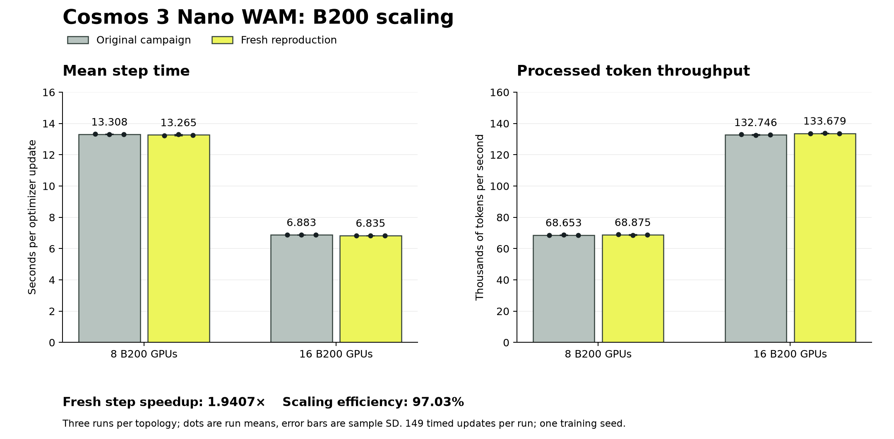
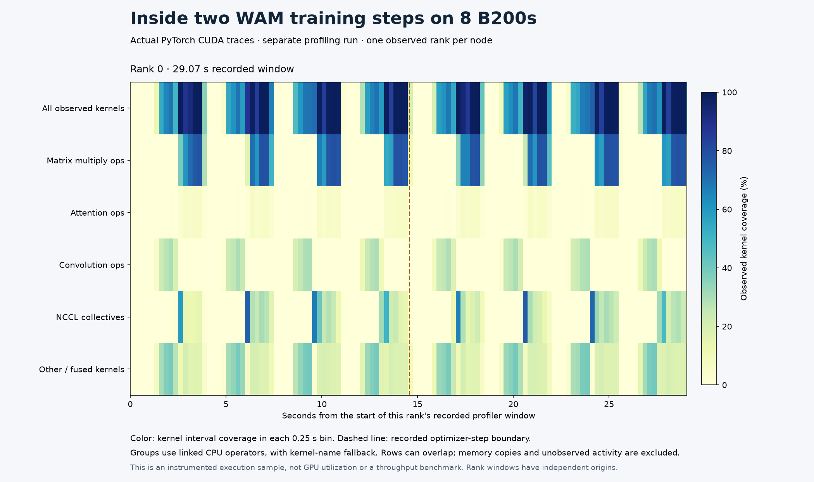

# Fresh Cosmos 3 WAM reproduction

This campaign started from merged Workbench revision
`a26a2d1c08b3fc9feafe3d973bb6e7bb6a396974` on October 2, 2026. It uses a new
operator-owned project, two reserved eight-B200 workers in `us-central1`,
fresh downloads, and newly converted base weights. Original campaign records
remain unchanged.

The [protocol](protocol.json) was recorded before training. It fixes 2,000
updates per full schedule, three 200-update timing repeats per topology,
separate 110-update profile runs, and 500-trial evaluations at each saved
checkpoint. Checkpoint upload and complete-object read-back verification run
between jobs, outside training and profiling windows.

**Measurement status: in progress.** All six timing repetitions completed
successfully, and every run's complete archive passed SHA-256 read-back.
Profiling is running; full schedules and checkpoint evaluations remain pending. These timing
records do not establish a new full-schedule duration or policy-quality result.

## Repeated timing results

Each repetition covers all 149 timed updates, 52–200. The unchanged committed
reducer validates every numeric series and matching source/settings contract.

| GPUs | Mean of three run means | Sample SD | Pooled tokens/s |
| --- | --- | --- | --- |
| 8 | 13.2651 s | 0.0430 s | 68,874.89 |
| 16 | 6.8353 s | 0.0039 s | 133,678.87 |

The [six-run reduction](repeated-scaling.json) gives **1.9407× step speedup**
and **97.03% scaling efficiency**. Actual token work differs by 0.01096%.
The original campaign measured 1.9334× speedup; fresh step means are 0.32%
and 0.70% below its eight- and sixteen-GPU means, respectively. These repeats
measure execution variability under one training seed.

Set `WAM_SCALING_REPORT` to a writable output file outside this evidence
directory. The documented command below reproduces `repeated-scaling.json`
byte for byte and is exercised by the repository's scaling-report tests:

```bash
npa/.venv/bin/python npa/workflows/workbench/cosmos3-wam-slurm/scaling_report.py \
  --run-dirs \
  docs/workbench/evidence/cosmos3-wam-reproduction-20261002/repeat-8-1 \
  docs/workbench/evidence/cosmos3-wam-reproduction-20261002/repeat-16-1 \
  docs/workbench/evidence/cosmos3-wam-reproduction-20261002/repeat-8-2 \
  docs/workbench/evidence/cosmos3-wam-reproduction-20261002/repeat-16-2 \
  docs/workbench/evidence/cosmos3-wam-reproduction-20261002/repeat-8-3 \
  docs/workbench/evidence/cosmos3-wam-reproduction-20261002/repeat-16-3 \
  --output-path "$WAM_SCALING_REPORT"
```



Bars show arithmetic means across run measurements; dots show individual run
means and error bars show sample standard deviation. The table reports pooled
token throughput. Run `plot-scaling.py` to reproduce the figure; its inputs and
output are hash-bound in the [render manifest](scaling-render-manifest.json).

For the first completed pair, training-process durations were
3,137.80 and 1,930.45 seconds, including final checkpoint saves of 399.61 and
398.64 seconds outside the timed iterations. Slurm allocation durations were
3,172 and 1,963 seconds, respectively.
These are durations for a 200-update timing run, not a full 2,000-update
schedule. The other reserved worker was idle during eight-GPU baselines; reported
training GPU-hours do not include that idle capacity or represent a bill.
The archive receipts for [8 GPUs](repeat-8-1/archive-verification.json) and
[16 GPUs](repeat-16-1/archive-verification.json) confirm that all 75 and 125
files, respectively, passed complete-object SHA-256 read-back before local
checkpoint pruning. Archive work did not overlap training allocations.

## Deployment and inputs

The diagram shows the deployed native cluster and the campaign's job and
artifact flow. Completion status is reported separately above.


An [SVG version](reproduction-topology.svg) is available for editorial use.
Run `plot-topology.py` with the repository virtualenv to reproduce both
formats; the [render manifest](topology-render-manifest.json) binds the
renderer, readiness and input receipts, and output hashes.

The [readiness receipt](readiness.json) records 16 distinct physical GPUs and
16 independent passing CUDA attention/backward and native fused-optimizer
probes. Both workers passed the shared-memory survival check after logout.
Native Slurm, IPv4/IPv6 filtering, and the service dependency on firewall
restoration were installed on both workers. The driver, PyTorch, CUDA, and
NCCL versions match the original native 8/16-GPU cohort.

The controller's 2 TiB `NETWORK_SSD` disk holds the shared inputs and outputs;
the second worker mounts them through NFS. Input and runtime caches persist
across jobs and are not explicitly flushed. Full schedules follow the timing
repeats and profiles, so their process durations are not cold-start measurements.
Evaluation and archive transfers run outside training allocations. The original
eight-GPU full run also recorded an overlapping visualization storage reader;
its observed duration has that separate scope. Use the matched timing repeats
for the steady-step scaling comparison.

The [input receipt](inputs.json) records the six pinned upstream revisions,
payload hashes, 379 episodes, 101,469 frames, and ten tasks. Preparation
validated every action/state row and decoded a frame from each camera file.
The [fresh native window export](data-window-reproduction.json) reproduced
the committed sample JSON and both camera PNGs byte for byte. Its loader
retained 375 training episodes and 94,250 windows; each window pairs 17 video
frames with 16 actions, converting seven stored action values into ten.

The separate [CPU simulator preflight](simulation-readiness.json) validated
all 500 evaluation initial states and rendered both cameras for every task.
All 20 camera-file and decoded-pixel hashes were independently checked after
collection. The receipt identifies the pinned simulator packages; its camera
files are retained with the private qualification evidence. This preflight executes no
model policy and does not establish task success.

The initial four-node Soperator preflight lacked both reserved GPU headroom
and non-GPU CPU quota. This reproduction therefore started on the documented
native Slurm path. Its readiness results do not constitute a fresh Soperator
deployment or an RTX PRO 6000 qualification.

## Cross-node qualification and MEMLOCK fix

The first separate 16-rank collective diagnostic failed while allocating
InfiniBand resources. Both worker daemons had unlimited memory-lock limits,
but the systemd submitter had an 8 MiB limit that Slurm propagated into its
jobs. The [before/after receipt](memlock-remediation.json) preserves this
failed attempt and actual Slurm task-limit probes on both workers.

The native template now sets `PropagateResourceLimitsExcept=MEMLOCK`. After
applying the same policy to the idle cluster, a submitter with the unchanged
8 MiB limit launched tasks with unlimited allowances. The identical collective
diagnostic then completed with exit `0:0` in 25 allocated seconds. Every
element at each of the four buffer sizes equaled 136, the expected rank sum.

The [numeric result](collective-16/bandwidth.json) retains all measured
durations. Separate [NCCL log verification](collective-16/transport.json)
confirms 16 initialized InfiniBand ranks, zero Socket selections, and
GPUDirect RDMA markers. This is the existing custom PyTorch diagnostic,
not `nccl-tests`, model-training throughput, or a network link-rate claim.
Raw failed and successful logs remain private and hash-bound to the receipts.
The first eight-GPU repetition preceded this cluster-policy fix; subsequent
runs use it. Model, data, seed, batch, and framework pins were unchanged.

## Live GPU evidence

The [live capture](live-gpu-8.json) matches eight physical-device processes to
the native trainer, selected configuration, and Slurm job after optimizer
update 52. It also binds the successful eight-rank NCCL preflight. GPU device
identifiers, process IDs, hostnames, and cloud resource identifiers remain
private.


This figure describes one live sample per GPU. Its source JSON and renderer
are linked by the [render manifest](render-manifest.json); a second render
produced identical PNG bytes. Recreate the figure with the Matplotlib and
NumPy versions recorded in that manifest:

```bash
npa/.venv/bin/python docs/workbench/evidence/cosmos3-wam-reproduction-20261002/plot-gpu.py
```

The two-node captures after updates 52 and 53 match all 16 active trainer
ranks to the same job and configuration. Their frozen NCCL logs also match
those actual trainer processes, with InfiniBand selected and no Socket
selections or NCCL warnings. The instantaneous utilization readings were zero;
they remain in the original receipts.

The [fixed telemetry window](live-training-16/window.json) contains every
one-second sample for the following 120 seconds: 1,920 readings, including
676 zeros. Both nodes reached 100% in this window; their sample means were
58.3% and 58.5%. Additional captures verify the same trainer assignments after
the window. These are sampled utilization readings for this interval, not
whole-run utilization, scaling efficiency, or policy quality.


Recreate this figure with the hash-bound CSV inputs and renderer:

```bash
npa/.venv/bin/python docs/workbench/evidence/cosmos3-wam-reproduction-20261002/plot-telemetry.py
```

The [telemetry render manifest](telemetry-render-manifest.json) records the
source and output hashes and library versions. A second render produced
identical PNG bytes.

## CUDA profiling

The separate 110-update eight-GPU run completed successfully. Its recorded
rank-zero window covers two native profiler steps in 29.07 seconds.
The [timeline export](profile-8/timeline/evidence.json) verifies the original
compressed trace against the completed profile report before computing interval
unions. The 16-GPU profile remains pending.



The heatmap reports kernel interval coverage in 0.25-second bins. Categories
overlap, so their rows cannot be added into exposed communication stalls or
wall-time fractions. Only rank zero is sampled here. The profiled run is
excluded from throughput comparisons.

Set `WAM_PROFILE_RUN` to the retained run directory containing the native trace,
settings, and `profile.json`; set `WAM_PROFILE_EXPORT` to a new output directory.
The existing exporter checks trace hashes and regenerates the public numeric
timeline. The renderer checks its input hashes and aggregate interval unions:

```bash
npa/.venv/bin/python docs/workbench/evidence/cosmos3-wam-profile-16/export.py \
  --recipe-dir npa/workflows/workbench/cosmos3-wam-slurm \
  --run-dir "$WAM_PROFILE_RUN" \
  --summary-path "$WAM_PROFILE_RUN/profile.json" \
  --output-dir "$WAM_PROFILE_EXPORT"
npa/.venv/bin/python docs/workbench/evidence/cosmos3-wam-reproduction-20261002/plot-profile.py \
  --evidence-dir "$WAM_PROFILE_EXPORT"
```

For rendering directly from committed numeric data, point `--evidence-dir` at
`docs/workbench/evidence/cosmos3-wam-reproduction-20261002/profile-8/timeline`.
A second render produced identical PNG bytes. The render manifest records the
renderer hash and library versions.

## Repository validation

[PR validation run 37074416512](https://github.com/nebius/nebius-physical-ai/actions/runs/37074416512)
passed on `eb51389ca19d85d34315822a4549942059bfb446`: 20 successful jobs,
four expected skips, and zero failures. This includes the Python 3.12 shards
and merged coverage, browser/compatibility checks, image policy, and required
security gate. See the PR checks for validation of later evidence revisions.

The [native Linux validation receipt](offline-validation.json) records 37,258
passing tests, 186 skips, one expected-failure test that passed, and zero
failures or errors. The separate security regression gate passed all 898
tests using the real CPU PyTorch checkpoint runtime. Its source revision and
private log/report hashes are retained in the receipt.

A first-use Rerun welcome banner exposed an existing brittle test assertion on
unchanged main. The assertion now requires the exact successful verification
line while retaining the independent decoded-recording checks. Fresh-configuration
verification and the full native suite passed after this test-only correction.
The isolated CPU validation VM and its disk were removed after preserving
the reports; provider queries verified both absent.
