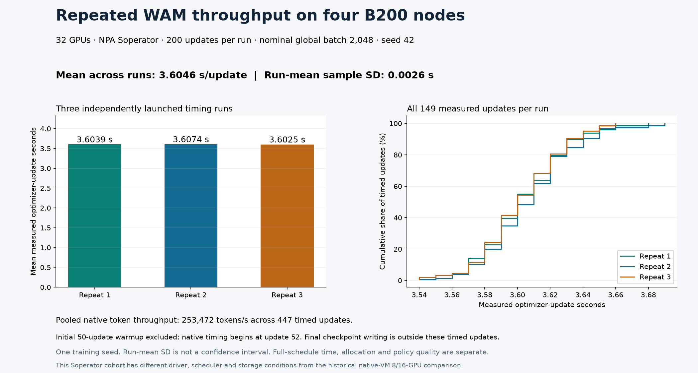

# Three repeated 32-B200 timing measurements

Three independent launches from the same base checkpoint and training seed
completed 200 updates each on four reserved eight-B200 nodes. Native timing
starts at update 52 after the 50-update warmup; updates 52–200 contribute
149 measured iterations per repetition, **447 total**.

| Repetition | Mean seconds/update | Median | p95 | Native tokens |
| --- | --- | --- | --- | --- |
| 1 | 3.603893 | 3.60 | 3.65 | 136,137,280 |
| 2 | 3.607450 | 3.61 | 3.65 | 136,135,308 |
| 3 | 3.602483 | 3.60 | 3.64 | 136,135,984 |

The mean of the three run means is **3.604609 seconds per update**;
sample standard deviation is **0.002559 seconds**.
Pooled throughput is **253,471.55 native tokens/s**.
Native per-update durations are logged to 0.01 seconds; additional digits in
run means come from averaging those observations, not finer timer precision.
This variability describes repeated execution with one seed, not independent
policy-training seeds or a confidence interval over optimizer steps.



Each `repeat-*` directory contains the reporter output, all timed rows, final
checkpoint hashes and the 32-rank collective preflight. [evidence.json](evidence.json)
links all four native completions per repetition and successful Slurm accounting.
The final checkpoint is saved after the timed update loop; its writing is included
in native process duration, not these steady-step statistics. Profiling,
evaluation and archival did not overlap these unprofiled runs.

## Reproduce from committed data

From the repository root, set `WAM_TIMING_REPORT` to a fresh output path:

```bash
npa/.venv/bin/python npa/workflows/workbench/cosmos3-wam-slurm/scaling_report.py \
  --single-topology --run-dirs \
  docs/workbench/evidence/cosmos3-wam-timing-32/repeat-1 \
  docs/workbench/evidence/cosmos3-wam-timing-32/repeat-2 \
  docs/workbench/evidence/cosmos3-wam-timing-32/repeat-3 \
  --output-path "$WAM_TIMING_REPORT"
cmp "$WAM_TIMING_REPORT" docs/workbench/evidence/cosmos3-wam-timing-32/repeated-timing.json
```

The producer and reducer use `math.fsum` for floating-point totals. The reducer
computes sample deviation at 80-digit decimal precision before converting to a
float, avoiding Python-version differences from rounding the variance first.
This preserves the original committed numeric records. It rehashes and recomputes
every repetition from its CSV. Its standalone-topology
mode deliberately produces no scaling comparison. The 32-GPU Soperator cohort
has different scheduler, driver and storage conditions from the older native
8/16-GPU cohort; the [controlled 8-to-16 comparison](../cosmos3-wam-scaling/README.md)
remains separate.

```bash
npa/.venv/bin/python docs/workbench/evidence/cosmos3-wam-timing-32/plot.py
```

For new GPU measurements, follow the [recipe](../../../../npa/workflows/workbench/cosmos3-wam-slurm/README.md), create three fresh
`--nodes 4 --steps 200` plans, complete and report each, then use the command
above with their new directories. Preserve new observations separately;
identical training weights or floating-point timing are not promised.
