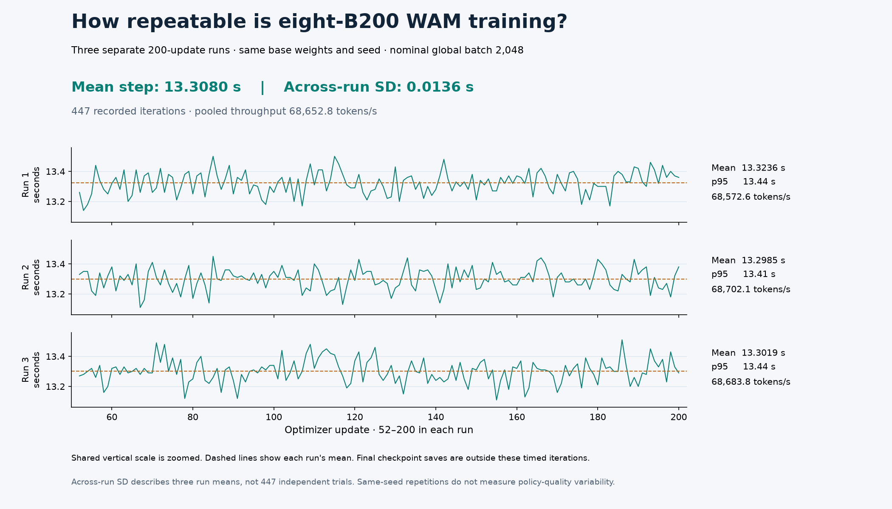

# Three measured eight-B200 WAM timing repetitions



Three separate native Cosmos3-Nano LIBERO-10 WAM runs completed 200 updates
each on one reserved eight-B200 node under Slurm. Every run started from the
same base checkpoint with seed 42, nominal global batch 2,048, a per-rank
sample cap of 64 and four accumulation steps. Profiling was disabled. All
three jobs exited successfully with complete final checkpoints, no reported
Python failures and no skipped optimizer updates.

The average of the three step means is **13.3080 seconds**, with a sample
standard deviation of **0.0136 seconds** across run means. The 447 recorded
iterations processed 408,392,722 tokens at a pooled rate of
**68,652.78 tokens/s**. This establishes the eight-GPU timing baseline; it
does not establish multi-node speedup or policy quality.

| Repetition | Mean step | Median / p95 step | Measured tokens | Tokens/s | Native process | Slurm allocation |
| --- | --- | --- | --- | --- | --- | --- |
| 1 | 13.323557 s | 13.330 / 13.440 s | 136,131,011 | 68,572.60 | 3,148.705 s | 3,182 s |
| 2 | 13.298456 s | 13.300 / 13.410 s | 136,131,116 | 68,702.08 | 3,141.720 s | 3,173 s |
| 3 | 13.301946 s | 13.300 / 13.436 s | 136,130,595 | 68,683.80 | 3,142.537 s | 3,174 s |

Each numeric series contains all 149 regular timing records from updates
52–200. Native iteration durations are logged to 0.01 seconds; means and
quantiles are calculated from those recorded values. The first 51 updates
are outside that measured series; they are not
all model startup. The final checkpoint save occurs after the timed loop and
is included in native process duration. Each final checkpoint contains
177,284,648,532 bytes across 36 model, optimizer, scheduler and trainer files.
Slurm allocation additionally includes the launch wrapper and preflight.

The runs used warm runtime and filesystem caches. Evaluation and archival
I/O did not overlap these training executions. Three repetitions on the same
node and seed describe this campaign's execution variability. Their standard
deviation is neither a confidence interval nor an estimate from 447 independent
trials, and it does not measure variation across independently trained seeds.
The figure uses the same zoomed vertical scale for all three runs.

These clean timing windows form the primary scaling baseline. The separately
[completed full schedule](../cosmos3-wam-full-8/README.md) answers total
training duration and includes four checkpoint-bearing iterations. Multiplying
a steady step mean by 2,000 would omit startup and those saves; it is not a
replacement for the observed full-run duration.

## Evidence and reproduction

Each `repeat-N` directory contains the unmodified `measurement.json`, original
`iteration-series.csv`, final `checkpoint-hashes.json` and actual eight-rank
`distributed-preflight.json`. The CSV bytes retain their original CRLF line
endings so their recorded SHA-256 remains valid after checkout.
`evidence.json` hashes these inputs and links the private completion and run
settings receipts, with non-identifying Slurm accounting fields. Infrastructure
details and native logs remain in private operator evidence.

`repeated-scaling.json` is the actual recipe analyzer's output. It verifies
the source, batch, seed and hardware contracts, CSV hashes, every update number,
and recalculated timing and token aggregates. Its status is `baseline_measured`
and its comparison is `null` because no sixteen-GPU measurement is supplied.

From the Workbench checkout, select a new output file in `WAM_TIMING_SUMMARY`
and reproduce the aggregation:

```bash
npa/.venv/bin/python npa/workflows/workbench/cosmos3-wam-slurm/scaling_report.py \
  --run-dirs \
  docs/workbench/evidence/cosmos3-wam-timing-8/repeat-1 \
  docs/workbench/evidence/cosmos3-wam-timing-8/repeat-2 \
  docs/workbench/evidence/cosmos3-wam-timing-8/repeat-3 \
  --output-path "$WAM_TIMING_SUMMARY"
```

The figure also recalculates the complete summary and requires exact agreement
with the saved output before rendering. With Matplotlib 3.11.2:

```bash
npa/.venv/bin/python docs/workbench/evidence/cosmos3-wam-timing-8/plot.py
```

The image was visually inspected and reproduced with an identical SHA-256;
`render-manifest.json` records the renderer version and output hash. To execute
fresh training repetitions, use the [recipe](../../../../npa/workflows/workbench/cosmos3-wam-slurm/README.md)
and [Slurm runbook](../../cookbooks/cosmos3-wam-slurm.md). Preserve each new
run's actual measurements rather than expecting identical weights or timings.
