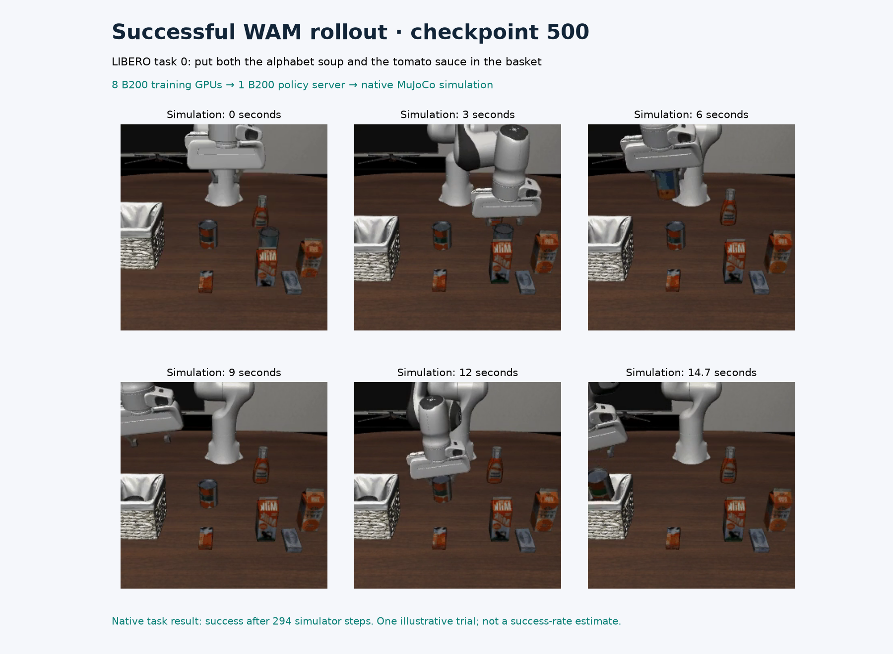
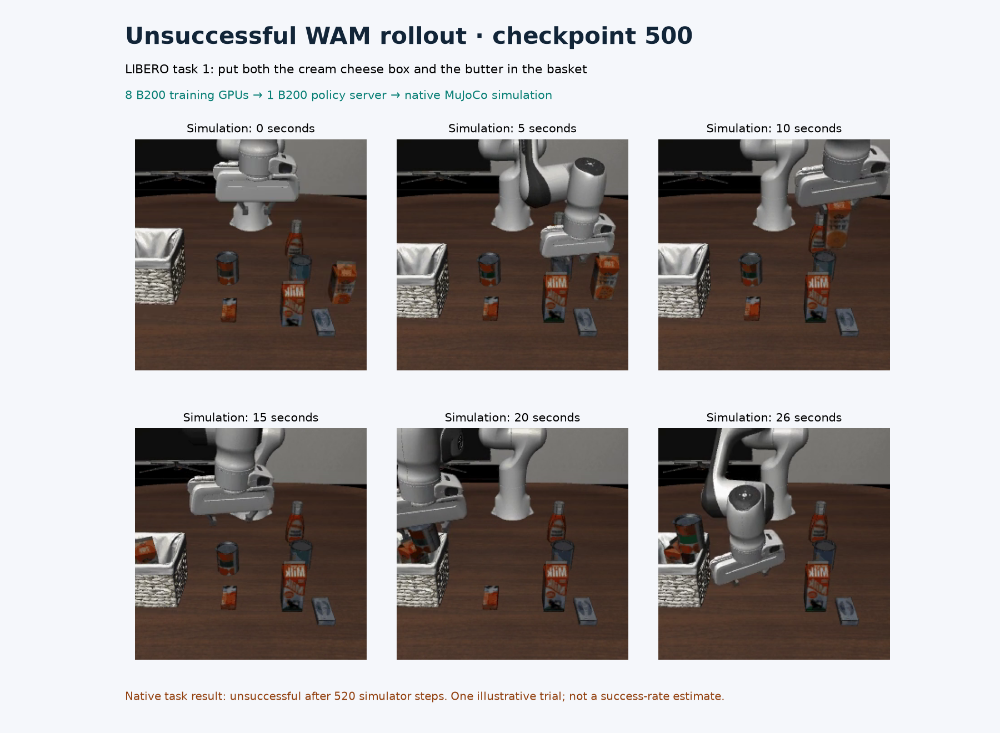

# Trained Cosmos3-Nano WAM: actual B200 policy rollouts

These videos execute the model saved after **500 optimizer updates on eight
B200s**. A separate reserved B200 runs the native policy server; CPU MuJoCo
with OSMesa renders the robot responding to its predicted actions. The frames
are actual simulator outputs, not an illustration generated from a description.

The completed visual pass covers one initial state on each of ten LIBERO-10
tasks: **four successes, six failures, zero infrastructure errors**. This is an
execution check. It does not replace the prescribed fifty trials per task,
establish a population success rate, or establish time to quality. All ten
outcomes are preserved in [quality.json](quality.json).

| Example | Native outcome | Simulator steps | Recorded playback | Trial wall time |
| --- | --- | --- | --- | --- |
| Task 0: alphabet soup and tomato sauce into the basket | Success | 294 | 14.75 s | 132.707 s |
| Task 1: cream cheese and butter into the basket | Failure | 520 | 26.05 s | 207.273 s |

These are the first successful and first unsuccessful trials in this completed
pass. The native task termination condition supplies the outcome. Trial wall
time includes simulation, inference and media writing; playback runs at the
dataset's 20 Hz and is not a real-time policy latency measurement.



[Successful rollout](task-000.mp4) · [WAM prediction versus actual simulation](task-000-comparison.mp4)



[Unsuccessful rollout](task-001.mp4) · [WAM prediction versus actual simulation](task-001-comparison.mp4)

In the comparison videos, the left panel is the WAM's predicted camera sequence
and the right panel is the actual simulator sequence produced by executing its
actions. Each panel contains the front and wrist views. Native comparison
recording omits the ten initial stabilization steps and avoids duplicating
conditioning frames between action chunks.

## Evidence and scope

- [Manifest](evidence.json): pinned sources, checkpoint identity, settings,
  video hashes, decoded frame counts and raw-log hashes.
- [Model component hashes](model-hashes.json): all nine files in the trained
  checkpoint's 121,408,256,743-byte model component. Its canonical manifest hash
  is `09c01c29bfa163cd6795a6cacc89cd31bd0c44f9b5aeb6d1f1e827bf2f43a7c9`.
- [Runtime probe](runtime.json): actual B200 CUDA attention forward/backward
  and fused Adam checks with driver 580.173.02, PyTorch 2.10.0 and CUDA 13.0.
- [Policy GPU telemetry](policy-gpu-telemetry.csv): 1,580 one-second samples
  spanning the first through last policy request. Sampled utilization reached
  47%, memory 34,236 MiB, and power 379.97 W. The native server completed 278
  policy requests. Shorter peaks may fall between samples.

The visual process took 1,799.104 seconds, including checkpoint hashing, server
setup and all ten trials. This is evaluation time, not training duration.
It used one policy server, one simulator environment, seed 42, thirty denoising
steps, guidance 1.0 and sixteen actions per chunk. The server loaded the trained
EMA weights. Framework and LIBERO sources remained unmodified at their pins.

A preceding visual attempt hit the native client's 30-second HTTP timeout
during a 32.9-second initial inference. The recipe rejected that attempt and
reran all ten tasks with the native batch client's 300-second request timeout.
Its diagnostic outcomes are not substituted into this completed pass.
Repeated closed-loop trajectories need not be bitwise identical even with
the same recorded seed; an illustrative success is not a qualification claim.

## Reproduce

Follow the [Slurm recipe](../../../../npa/workflows/workbench/cosmos3-wam-slurm/README.md)
through training and simulator preparation. Require the native checkpoint-save
completion event before selecting step 500. Configure the documented private
guardrail token file and prefetch the pinned payload. Choose a fresh output
directory in `WAM_VISUAL_OUTPUT`, then run on one reserved B200:

```bash
"$WAM_SHARED_ROOT/framework/.venv/bin/python" "$WAM_RECIPE/evaluate.py" \
  --shared-root "$WAM_SHARED_ROOT" --run-dir "$WAM_FULL_RUN" \
  --step 500 --output-dir "$WAM_VISUAL_OUTPUT" \
  --workers 1 --trials 1 --envs 1 --seed 42 --record-rollouts
```

Require exit status zero, ten trial records with no errors, a complete
`quality.json`, and a manifest hash matching the checkpoint you selected.
Retraining need not reproduce this run's checkpoint bytes or outcomes; preserve
the new run's actual results. This visual command
must not replace the eight-server, eight-environment, fifty-trial benchmark.

The native GIFs are under `worker-0/rollouts/gifs/task_000/episode_000.gif` and
`worker-0/rollouts/comparisons/task_000/episode_000.gif`, with corresponding
paths for task 001. Convert each complete GIF without trimming:

```bash
ffmpeg -v error -i "$WAM_SOURCE_GIF" \
  -vf 'pad=ceil(iw/2)*2:ceil(ih/2)*2' \
  -c:v libx264 -crf 18 -pix_fmt yuv420p -movflags +faststart "$WAM_OUTPUT_MP4"
ffprobe -v error -count_frames \
  -show_entries stream=width,height,nb_read_frames,r_frame_rate,duration \
  -of json "$WAM_OUTPUT_MP4"
```

The committed posters regenerate from the committed MP4 bytes and recorded
frame indices, using FFmpeg, NumPy and Matplotlib 3.11.2:

```bash
npa/.venv/bin/python docs/workbench/evidence/cosmos3-wam-trained-visual/plot.py
```

[render-manifest.json](render-manifest.json) records poster hashes. See
[NOTICE.md](NOTICE.md) for source attribution.
