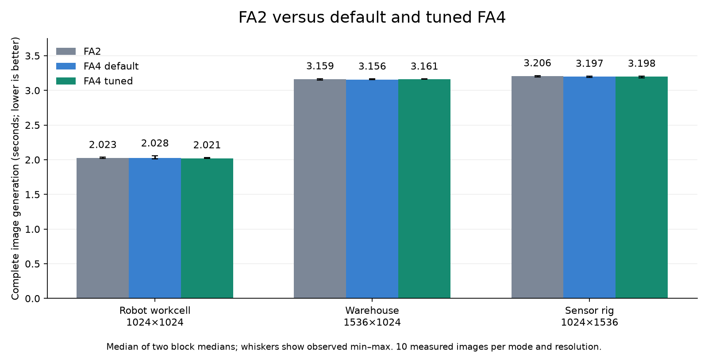
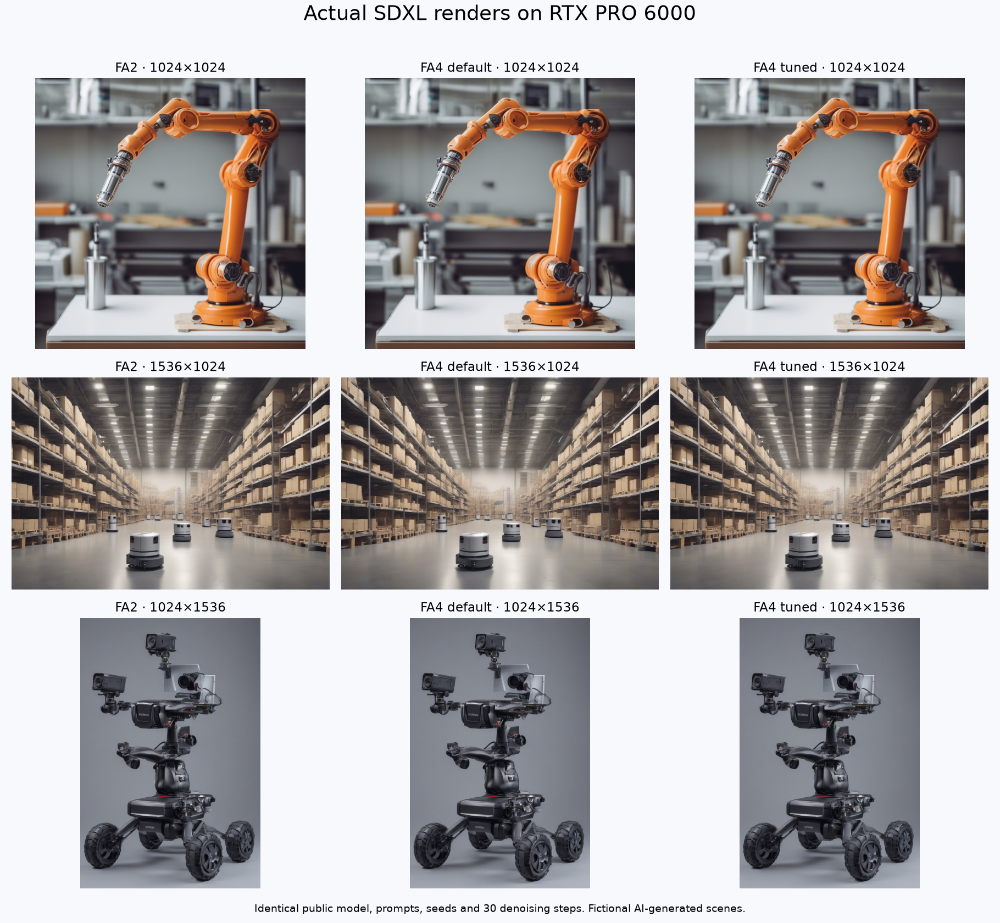

# FA2 versus tuned FA4 on RTX PRO 6000

[Build and comparison guide](guides/fa2-fa4-comparison.md) · [Application adoption](guides/rtx6000-fa4.md)

**FA4 is supported on the tested RTX PRO 6000, and the opt-in inference profile
improves selected attention calls. Complete SDXL generation is effectively tied
with standalone FA2.** This evidence supports explicit adoption and measurement,
not a global model-backend switch or a general training speedup.

On one Nebius RTX PRO 6000 Blackwell Server Edition, the guarded callable was
**1.16–1.29× default FA4** and **1.07–1.16× standalone FA2** on the four measured
causal BF16 inference shapes. The 4096-token SDXL self-attention call improved
by about 1.10× versus both. FA2 remained faster on short cross-attention calls.
All shapes, including ties and regressions, are listed below.

## Complete-model result

The final comparison completed **108 SDXL generations**: 18 full warmups and
90 timed renders, each with 30 denoising steps. It used separate containers in
FA2 → default FA4 → tuned FA4 → tuned FA4 → default FA4 → FA2 order. Each block
ran five measured generations at each of three resolutions after its warmup.
The table reports the median of the two block medians for each mode.

| Scene / resolution | FA2, s | Default FA4, s | Tuned FA4, s | FA2 time / tuned FA4 time |
| --- | ---: | ---: | ---: | ---: |
| robot-workcell / 1024×1024 | 2.0234 | 2.0283 | 2.0208 | 1.0013× |
| warehouse / 1536×1024 | 3.1593 | 3.1564 | 3.1606 | 0.9996× |
| sensor-rig / 1024×1536 | 3.2064 | 3.1968 | 3.1980 | 1.0026× |

Tuned FA4 versus FA2 differs by less than 0.3% here. Relative to default FA4,
the tuned profile was about 0.37% faster in the square case and 0.13% / 0.04%
slower in the larger cases. These small changes overlap observed run variation;
they do not establish an application speedup. Faster individual attention calls
do not imply the same gain for text encoding, all denoising operations, decoding
and watermarking together.

The [summary and provenance](validation/fa2-fa4-20260928/summary.json) contain both
block medians and observed ranges. Raw blocks:
[FA2 first](validation/fa2-fa4-20260928/final-0-fa2.json),
[default first](validation/fa2-fa4-20260928/final-1-default.json),
[tuned first](validation/fa2-fa4-20260928/final-2-tuned.json),
[tuned second](validation/fa2-fa4-20260928/final-3-tuned.json),
[default second](validation/fa2-fa4-20260928/final-4-default.json),
[FA2 second](validation/fa2-fa4-20260928/final-5-fa2.json).

## Actual renders and numerical checks

These are fictional AI-generated scenes from the measured public SDXL model.
Every output decoded at the requested dimensions with finite final latents.
Repeated renders were pixel-identical within each mode, prompt and seed,
including across the two container blocks. Different attention implementations
produce small floating-point differences that can accumulate during diffusion.

| Scene | FA2 vs tuned image SSIM | Final-latent relative L2 |
| --- | ---: | ---: |
| robot-workcell | 0.990984 | 0.013001 |
| warehouse | 0.993473 | 0.007688 |
| sensor-rig | 0.992996 | 0.011747 |

SSIM and latent differences are descriptive comparisons, not perceptual-quality
or training-convergence guarantees. Full-resolution outputs:
[robot FA2](validation/fa2-fa4-20260928/robot-workcell-fa2.png),
[robot default](validation/fa2-fa4-20260928/robot-workcell-fa4-default.png),
[robot tuned](validation/fa2-fa4-20260928/robot-workcell-fa4-tuned.png),
[warehouse FA2](validation/fa2-fa4-20260928/warehouse-fa2.png),
[warehouse default](validation/fa2-fa4-20260928/warehouse-fa4-default.png),
[warehouse tuned](validation/fa2-fa4-20260928/warehouse-fa4-tuned.png),
[sensor rig FA2](validation/fa2-fa4-20260928/sensor-rig-fa2.png),
[sensor rig default](validation/fa2-fa4-20260928/sensor-rig-fa4-default.png),
and [sensor rig tuned](validation/fa2-fa4-20260928/sensor-rig-fa4-tuned.png).

The exact images passed **72 FP64 output/gradient cases**: 24 for standalone
FA2, 24 for native FA4 and 24 for the FA4 root adapter. Each covers dense, GQA
and variable-length attention, FP16/BF16, head dimensions 64/128 and both causal
settings. Separately, all **44 final attention timing cases** passed an
independent FP32 math-attention reference before measurement. The tuned callable
also passed four FP64 comparisons on unlisted shapes and five runtime rejection
checks. The [boundary receipt](validation/fa2-fa4-20260928/tuning-boundaries.json)
binds those checks to the actual baked implementation hash.

## Attention-call measurements

These are synchronized wall-clock **attention-call** latencies, including Python
launch overhead, rather than isolated device instruction timings. Each result
uses five warmups, seven blocks of 50 iterations, and an untimed CUDA profiler
capture. CUDA-event samples and kernel names are retained in the raw reports.
A ratio above 1 favors tuned FA4. The profile is inference-only.

All cases use batch 2. SDXL cases use FP16, D=64, noncausal attention, H=20 for
Q=1024/1536 and H=10 for Q=4096/6144. Transformer cases use BF16, D=128, causal
attention, Hq=16 and the listed number of KV heads.

| Case | FA2, ms | Default FA4, ms | Tuned FA4, ms | Default / tuned | FA2 / tuned |
| --- | ---: | ---: | ---: | ---: | ---: |
| `sdxl-q1024-k77` | 0.0250 | 0.0402 | 0.0326 | 1.231× | 0.765× |
| `sdxl-q1024-k1024` | 0.0421 | 0.0428 | 0.0405 | 1.055× | 1.038× |
| `sdxl-q1536-k77` | 0.0308 | 0.0427 | 0.0353 | 1.208× | 0.871× |
| `sdxl-q1536-k1536` | 0.0851 | 0.0863 | 0.0832 | 1.037× | 1.023× |
| `sdxl-q4096-k77` | 0.0298 | 0.0416 | 0.0355 | 1.171× | 0.838× |
| `sdxl-q4096-k4096` | 0.2718 | 0.2719 | 0.2474 | 1.099× | 1.099× |
| `sdxl-q6144-k77` | 0.0301 | 0.0421 | 0.0346 | 1.216× | 0.870× |
| `sdxl-q6144-k6144` | 0.5958 | 0.5958 | 0.5959 | 1.000× | 1.000× |
| `transformer-s1024-kv4` | 0.0564 | 0.0650 | 0.0505 | 1.288× | 1.118× |
| `transformer-s1024-kv16` | 0.0586 | 0.0645 | 0.0505 | 1.276× | 1.159× |
| `transformer-s4096-kv4` | 0.4872 | 0.5318 | 0.4574 | 1.163× | 1.065× |
| `transformer-s4096-kv16` | 0.4913 | 0.5327 | 0.4580 | 1.163× | 1.073× |

Training was measured through the native APIs, with mixed results. The inference
profile refuses gradients and makes no backward-performance claim:

| Forward + backward case | FA2, ms | Native FA4, ms | FA2 / FA4 |
| --- | ---: | ---: | ---: |
| `transformer-s1024-kv4` | 1.3575 | 1.2829 | 1.058× |
| `transformer-s1024-kv16` | 1.2586 | 1.2173 | 1.034× |
| `transformer-s4096-kv4` | 1.7666 | 1.9495 | 0.906× |
| `transformer-s4096-kv16` | 1.7181 | 2.1771 | 0.789× |

Raw measurements: [FA2](validation/fa2-fa4-20260928/final-fa2-kernels.json),
[default FA4](validation/fa2-fa4-20260928/final-default-kernels.json), and
[tuned FA4](validation/fa2-fa4-20260928/final-tuned-kernels.json).
The exploratory tile reports also retain rejected choices; for example, using
128×128 tiles indiscriminately regressed the causal D=128 cases substantially.
The shipped profile selects only the measured shapes and retains native FA4
for other shapes. See the [API and reproduction procedure](guides/fa2-fa4-comparison.md#experiment-with-fa4-inference-tiles).

## Reproducibility and scope

The FA2 image is `npa-base:cuda13-blackwell-fa2-dev-8ab03390f2029bf7273d463b6528cf1747878a32`.
The FA4 image is `npa-base:cuda13-blackwell-dev-522f5f9987af68cced326d1561b557e615cffcf6`.
They are retained local artifacts, with exact Docker image IDs in the summary;
this work does not publish or promote a supported registry release. The FA2
variant is compiled for SM120 and does not qualify B200/B300.

Both use CUDA 13.0, PyTorch 2.13.0+cu130, CUTLASS DSL 4.6.2, Quack 0.6.4 and
upstream FlashAttention revision `eed1971f5132630dc296fe37601e834d4b57a248`.
Installed versions are FA2 2.8.4 and FA4 4.0.0b33.dev10+geed1971. Package
inventories match apart from the attention distribution. Driver: 580.173.02.
The common SDXL runtime uses Diffusers 0.35.2 and Transformers 4.57.1; the
public model revision is `462165984030d82259a11f4367a4eed129e94a7b`. All 19 model
files are hash-checked before every block. No model weights are baked into the
base images or included in this report.

Final GPU runs used benchmark sources from commit
`522f5f9987af68cced326d1561b557e615cffcf6`; every raw report hashes those mounted
sources. Later helper extraction in the benchmark runner changes source hashes,
so use the recorded commit to reproduce this exact experiment. The image's
inference implementation remains bound by its receipt hash. Exploratory tile
runs used the earlier `8ab03390f2029bf7273d463b6528cf1747878a32` worker and record
their own image/source identities; do not pool them with final timings.

The measured processor explicitly replaces all 140 SDXL UNet attention layers,
with 4,200 attention calls per generation. Coverage recording is disabled during
timing for every mode. Text encoders and the VAE retain their stock attention.
Times include text encoding, 30 denoising steps, decoding and watermarking;
loading, JIT warmup, profiling and file writes are excluded. GPU clocks used
the provider's default policy; no other workload ran during timing. Block ranges
are descriptive, not confidence intervals. These results establish neither
full-model training convergence nor multi-GPU communication performance.

Use the [comparison guide](guides/fa2-fa4-comparison.md) to build and test your
own application. The inference factory is opt-in; model defaults remain unchanged.
Artifact integrity is recorded in [SHA-256 hashes](validation/fa2-fa4-20260928/artifact-sha256.json).
