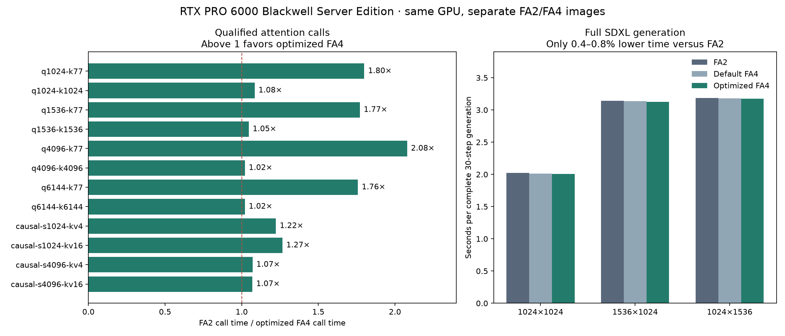
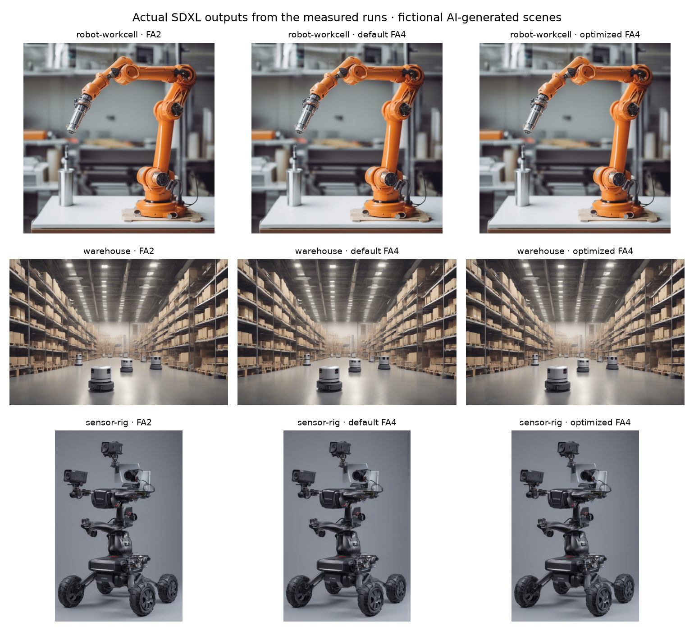

# RTX FA4 optimization and FA2 comparison — September 30, 2026

[Build and use the profile](guides/fa2-fa4-comparison.md) · [Application guide](guides/rtx6000-fa4.md) · [Earlier tile-only result](fa2-fa4-validation.md)

**FA4 works on RTX PRO 6000 and can beat FA2 on the qualified inference calls.
It is not a general application or training speedup.** The revised opt-in helper
reduces repeated Python dispatch and selects measured configurations of the
unchanged, pinned upstream SM120 kernel. It reaches **1.76–2.08× FA2** on the
four short cross-attention calls and **1.07–1.27× FA2** on the four causal calls.
The full SDXL result is only **0.4–0.8% lower generation time** than FA2.
Keep the choice explicit and measure the actual application.

## Complete model, including cold-start cost

One RTX PRO 6000 Blackwell Server Edition completed **108 full SDXL generations**:
18 first/coverage generations and 90 steady-state timed generations, all 30 steps.
Six separate containers ran in FA2 → default FA4 → optimized FA4 → optimized FA4 →
default FA4 → FA2 order. Each generated three scenes, with five timed repeats per
scene after the first generation. Values are medians of the two block medians.

| Resolution | FA2, s | Default FA4, s | Optimized FA4, s | FA2 / optimized |
| --- | ---: | ---: | ---: | ---: |
| 1024×1024 | 2.0221 | 2.0104 | 2.0053 | 1.0083× |
| 1536×1024 | 3.1432 | 3.1381 | 3.1254 | 1.0057× |
| 1024×1536 | 3.1857 | 3.1790 | 3.1727 | 1.0041× |

This small model-level difference is not a material migration justification by
itself. Both backends use the same processor in all 140 UNet attention layers
(4,200 calls per generation); text encoders and VAE retain their stock attention.
Timing includes text encoding, denoising, decoding and watermarking. It excludes
model loading, file writes and the separately recorded first generation.

The first square generation, with coverage recording and a cold per-container
CuTe cache, took **5.67–5.70 s optimized FA4**, **4.41–4.44 s default FA4**, and
**2.79–3.04 s FA2**. The first landscape generation needed another **5.85–5.86 s**
with optimized FA4 because it introduced new shapes. The portrait reused them.
These are complete first-generation costs, not isolated compilation times.
The optional persistent cache reload passed with compilation explicitly
forbidden; cached full-model startup latency was not measured.

[Optimized comparison](validation/fa4-rtx-20260930/comparison-tuned.json) and
[default comparison](validation/fa4-rtx-20260930/comparison-default.json) retain
both block medians, individual-run ranges and first-generation times. Their
ranges are descriptive, not confidence intervals. All six raw reports and
source fingerprints are in the [artifact directory](validation/fa4-rtx-20260930/).

## Actual renders and correctness

These are fictional AI-generated scenes produced by the measured SDXL runs.
All saved PNGs decoded at the requested dimensions, matched their recorded pixel
hashes and had finite final latents. Within each backend, scene and seed, all
repeats and both containers produced identical pixels. Against FA2, optimized
FA4 image SSIM was **0.9894–0.9937** and latent relative L2 **0.0083–0.0150**.
These descriptive differences are not a perceptual-quality guarantee.
Full-resolution renders and [quality measurements](validation/fa4-rtx-20260930/quality.json)
are retained with the report.

The public `validate_rtx_attention.py` worker passed **125 checks**: 64 with a
new cache and 61 in a fresh process that rejected any compilation. It verifies
FP64 references on all 12 optimized shapes using fresh inputs, including zero
and larger logits; distinct output allocations; two CUDA streams; graph replay
with changed input values; and native dispatch for padded strides and an
unlisted shape. Maximum relative L2 was **0.002055**, from BF16 and within its
0.01 limit. FP16 uses a 0.002 limit. The reload run excludes the three native
path checks because its purpose is to prove persistent reuse of the new launcher.

Receipts: [populate](validation/fa4-rtx-20260930/qualification-populate.json),
[reload](validation/fa4-rtx-20260930/qualification-reload.json).
All **88 final attention timing rows** also passed output checks before timing;
the 16 native forward/backward rows additionally checked dQ/dK/dV. The prior
72-case dense/GQA/varlen image qualification remains bound to its original
images; these additional checks do not replace application validation.

## Every attention-call result

These are synchronized wall-clock call latencies, including Python launch
overhead. Each fresh container used 1,000 warmups and nine blocks of 200
iterations per case. CUDA-event samples and untimed profiler kernel names are
retained alongside wall time. Two independent containers were used per backend;
the table uses the median of their medians. These timings are not pure GPU
execution time, and are not compared numerically with the earlier short-warmup
exploration.

All cases use batch 2. SDXL shapes use FP16, head dimension 64 and noncausal
attention, with 20 heads at Q=1024/1536 and 10 at Q=4096/6144. Transformer shapes
use BF16, dimension 128, causal square attention, 16 query heads and the listed
number of KV heads.

| Forward case | FA2, ms | Default FA4, ms | Optimized FA4, ms | FA2 / optimized |
| --- | ---: | ---: | ---: | ---: |
| `sdxl-q1024-k77` | 0.02382 | 0.03771 | 0.01323 | 1.800× |
| `sdxl-q1024-k1024` | 0.04025 | 0.03967 | 0.03711 | 1.085× |
| `sdxl-q1536-k77` | 0.02898 | 0.04005 | 0.01636 | 1.771× |
| `sdxl-q1536-k1536` | 0.08383 | 0.08232 | 0.08009 | 1.047× |
| `sdxl-q4096-k77` | 0.02882 | 0.03995 | 0.01386 | 2.079× |
| `sdxl-q4096-k4096` | 0.27125 | 0.27086 | 0.26568 | 1.021× |
| `sdxl-q6144-k77` | 0.02934 | 0.03980 | 0.01669 | 1.758× |
| `sdxl-q6144-k6144` | 0.59528 | 0.59688 | 0.58305 | 1.021× |
| `transformer-s1024-kv4` | 0.05554 | 0.05974 | 0.04540 | 1.223× |
| `transformer-s1024-kv16` | 0.05748 | 0.05847 | 0.04541 | 1.266× |
| `transformer-s4096-kv4` | 0.48604 | 0.52938 | 0.45400 | 1.071× |
| `transformer-s4096-kv16` | 0.48899 | 0.53046 | 0.45715 | 1.070× |

Training remains on the native APIs. The new helper refuses gradients.
The long training cases still favor FA2:

| Forward + backward case | FA2, ms | Native FA4, ms | FA2 / FA4 |
| --- | ---: | ---: | ---: |
| `transformer-s1024-kv4` | 1.27271 | 1.13573 | 1.121× |
| `transformer-s1024-kv16` | 1.21480 | 1.11354 | 1.091× |
| `transformer-s4096-kv4` | 1.75583 | 1.93914 | 0.905× |
| `transformer-s4096-kv16` | 1.71945 | 2.17055 | 0.792× |

[All block medians and observed ranges](validation/fa4-rtx-20260930/summary.json)
link back to the six raw kernel reports in the same directory. The final matrix
is separate from the tuning search, so the reported result is not the best
sample selected from that search.

## What was optimized, and what was rejected

The search covered 40 tile/thread/stage/register configurations on six
representative shapes: 240 case outcomes, with **141 numerical passes, 60
resource/layout rejections and 39 numerical failures**. A resource eligibility
check alone was insufficient: some combinations of Q in registers and two
pipeline stages produced wrong outputs or NaNs. No such configuration is used.
Four additional confirmation containers checked the selected cross-attention
and register choices on all 12 shapes, passing 48 cases. All failures and
candidate settings are preserved in [exploration evidence](validation/fa4-rtx-20260930/exploration/).

The retained path uses 128 threads and one pipeline stage. Contiguous,
16-byte-aligned qualified inputs directly launch a compiled upstream kernel
with fresh Q/K/V pointers and a fresh output on every call. Short cross-attention
uses 64×64 tiles; selected self-attention shapes use 128×64 with Q in registers;
the other measured tiles remain shape-specific. Strided inputs retain the
previous private tiled API, and unlisted shapes retain native FA4. Cache keys
include the helper source, upstream source/software fingerprint, shapes, dtype
and causal configuration. Compilation and execution errors propagate.

This is explicit `make_inference_attention()` integration. It does not change
the root adapter, training, other architectures or model defaults. It requires
the exact FA4 pin and SM120, and exposes only Q/K/V plus boolean `causal` with
the standard head-dimension scale. Required masks, custom scales, dropout or
other advanced semantics must continue using an appropriate native API.

## How online results informed the experiment

The [official FA4 report](https://tridao.me/blog/2026/flash4/) reports up to
1.3× cuDNN and 2.7× Triton on **B200** using its asynchronous MMA and tensor-memory
path. Those comparisons are neither RTX PRO 6000 results nor FA2 comparisons.
The [SM120 forward proposal #2599](https://github.com/Dao-AILab/flash-attention/pull/2599)
reports benefits on RTX 5090 and RTX PRO 5000. It is an open implementation
proposal, not validation of this Workbench stack. A separate
[SM120 research project](https://github.com/qu0b/fa4-sm120-research) motivated
checking wider thread configurations; they did not justify replacing the
measured 128-thread configurations here.

The forward proposal was reviewed but not installed: it targets an older
internal kernel interface. Its published results are context for further work,
not measurements of a candidate tested in this report.

The open [backward proposal #2771](https://github.com/Dao-AILab/flash-attention/pull/2771)
was tested separately at revision `41f27f3f8cbb201c060f651d0dd94200911f8e1f` against
the exact pinned base. It improved the long native-FA4 backward cases but
regressed one short case, and the long cases still favored FA2. Its candidate
reports are retained, but **none of that patch is included in the image**.
The current upstream main checked at `fb97d25ea8dd6586f6a184a21491d1e23a3a1428`
contained no new SM120 performance fix beyond the pinned revision. The shared
FA4/CUTLASS/Quack dependency set therefore remains unchanged in this follow-up.
This is a measured improvement over the tested baseline, not proof of a global
performance maximum or exhaustive coverage of every model and kernel design.

## Exact software and delivery

The matched performance comparison reused these separate retained local images:

- FA2: `npa-base:cuda13-blackwell-fa2-dev-8ab03390f2029bf7273d463b6528cf1747878a32`,
  config `sha256:b8bf7067f54bbce01a568d940a098733a1fc41c0bdd154d88e4a451605324718`.
- FA4: `npa-base:cuda13-blackwell-dev-522f5f9987af68cced326d1561b557e615cffcf6`,
  config `sha256:6a94f7d90751f1679687d0f10d7eed122ab2a9998e5892c6b5ff63b1ab10dace`,
  with the new helper mounted read-only at its installed path.

The overlay is explicit: the actual helper SHA256 is
`10dc701a6a303561287779ea503e5e67b88874d14aa9621f74c9be8209cd70de`.
Final benchmark and helper source is commit
`b002a53e32d7d149219ec45a11f96ec7d8b42904`. Every final report records the worker
hashes and actual installed helper hash; the comparator rejects mixing helper
implementations under one image ID. These are not measurements of the unchanged
historical FA4 image.

Both images use CUDA 13.0.1, Torch 2.13.0+cu130, CUTLASS DSL 4.6.2, Quack 0.6.4,
FA source `eed1971f5132630dc296fe37601e834d4b57a248`, and driver 580.173.02.
Installed attention versions are FA2 2.8.4 and FA4 4.0.0b33.dev10+geed1971.
Common package inventories match. The common SDXL overlay uses Diffusers 0.35.2
and Transformers 4.57.1, with all 19 model files verified against public model
revision `462165984030d82259a11f4367a4eed129e94a7b` before each container run.
Default provider clock policy was retained; GPU workloads did not overlap.

### Rebuilt image qualification

The canonical Dockerfile was also built from
`60d6908f09942e1c76a066ccc05ff15870d1eafb` as
`npa-base:cuda13-blackwell-dev-60d6908f09942e1c76a066ccc05ff15870d1eafb`.
Its config ID is
`sha256:da0b6eb71c0d36eea037aeb6485e5727c72db212c23ea2a8b710ed54654c25f4`.
The helper is baked into that image; no source override is used for its
qualification. Its SHA256 is
`21631e50bd98bdb10abd731a2129f6b2779c9f6776262eb8237051dc5033634b`.

This rebuild exposed a startup-check defect: Git now chose an eight-character
abbreviation in `4.0.0b33.dev10+geed1971f`, while the earlier package version
used seven. The full source pin did not change. The guard now checks the
qualified public version and requires the suffix to identify that exact full
commit; dirty versions and mismatching revisions still fail. The
[recorded source comparison](validation/fa4-rtx-20260930/version-guard-change.json)
verifies unchanged kernel construction, dispatch, layouts, cache keys and call
semantics. The earlier timing receipts retain their original hashes.

The baked helper passed another **125 checks**:
[population](validation/fa4-rtx-20260930/baked-populate.json) and
[fresh-process reload](validation/fa4-rtx-20260930/baked-reload.json).
The baked [native FA4](validation/fa4-rtx-20260930/baked-flash_attn.cute.json) and
[root adapter](validation/fa4-rtx-20260930/baked-flash_attn.json) each passed all
24 FP64 output/gradient cases, including varlen, in **83.33 s** and **82.73 s**
respectively with cold caches. Those durations qualify RTX only; they do not
measure the pending B300 cold-compilation gate.

The rebuilt image then completed another **18 full SDXL generations** with the
baked optimized helper: three first generations and 15 steady-state repeats.
All three saved scenes decoded correctly with finite latents and exactly matched
the corresponding optimized-run pixel hashes above. The
[full-model receipt](validation/fa4-rtx-20260930/baked-sdxl.json) and
[render-integrity receipt](validation/fa4-rtx-20260930/baked-render-integrity.json)
bind that result to the new image and helper bytes. This additional run qualifies
the baked image; it is not a new interleaved FA2 performance comparison.

[Image provenance](validation/fa4-rtx-20260930/baked-image.json) retains the
config, layer identities, non-root user and changed package versions. Six
package versions differ from the retained image: the equivalent FA4 suffix
and five utility/cloud dependencies. CUDA, Torch, CUTLASS and Quack are unchanged.
These new bytes are qualified separately and are not pooled into the matched
FA2/FA4 timing comparison above.

No model weights, credentials, live infrastructure identifiers or proprietary
workloads are included. No image was pushed or promoted by this experiment.
B200/B300/H100 qualification of the updated shared dependency set remains pending;
RTX measurements do not qualify those GPUs or multi-node communication.
Follow the [comparison guide](guides/fa2-fa4-comparison.md) to build and validate
your own application. Artifact hashes are listed in
[artifact-sha256.json](validation/fa4-rtx-20260930/artifact-sha256.json).
