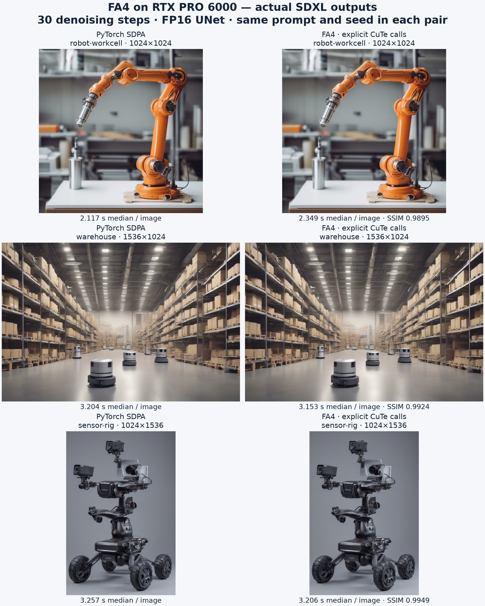
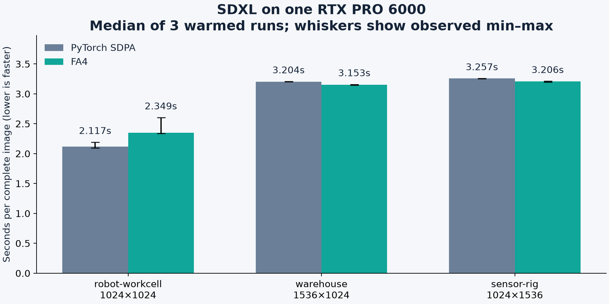

# Full-model FA4 rendering validation

[FlashAttention on RTX PRO 6000](flash-attention.md)

This qualification runs the pretrained SDXL base model through text encoding,
30 denoising steps, VAE image decoding and watermarking on one RTX PRO 6000.
The FA4 processor replaces every UNet self/cross-attention layer. Text encoders
and the VAE retain their stock attention implementations. This is inference
evidence, not training convergence or SpAItial's private 3D reconstruction pipeline.

The comparison uses the stock Diffusers `AttnProcessor2_0` (PyTorch SDPA) on the
same GPU. It does not compare against the standalone FA2 package or another GPU.
Each of three prompts uses a fixed seed and resolution. After one complete
warmup per backend and resolution, three complete generations per backend run
in alternating order. Timings include text encoding, denoising, decoding and
watermarking; they exclude model loading, JIT warmup, profiling and PNG writes.
Peak memory is total PyTorch allocation; the FA4 recorder also retains one QKV
triple for an untimed profiler replay.

## Measured result: 2026-09-25

All **24 complete generations** finished on RTX PRO 6000 Blackwell Server
Edition: six warmups plus 18 measured images. The 2,567,463,684-parameter UNet
has 140 attention layers. Each FA4 generation executed exactly 4,200 explicit
FA4 calls, for **50,400 calls across 12 generations**. Real self-attention
sequences reached 6,144 tokens. All outputs decoded at the requested dimensions
with finite latents; repeated generations were pixel-identical within each
backend and prompt/seed configuration.

| Scene / resolution | FA4 median, seconds | SDPA median, seconds | Image SSIM | Final-latent relative L2 |
| --- | ---: | ---: | ---: | ---: |
| Robot workcell, 1024×1024 | 2.349 | 2.117 | 0.9895 | 0.01275 |
| Warehouse, 1536×1024 | 3.153 | 3.204 | 0.9924 | 0.00990 |
| Sensor rig, 1024×1536 | 3.206 | 3.257 | 0.9949 | 0.00614 |

The square case was about 11% slower with FA4; the larger cases were about
1.6% faster in this three-repetition sample. This does not establish a general
speedup or justify switching every model's default. CUDA profiling captured
`FlashAttentionForwardSm120` for FA4 and `pytorch_flash::flash_fwd_kernel` for
the SDPA replay. FA4 did not silently fall back to SDPA.

The [complete measurements](validation/fa4-sdxl-20260925/report.json) include
individual timings and kernel names. [Provenance](validation/fa4-sdxl-20260925/provenance.json)
binds them to the local base image, runtime packages, source hashes and output
hashes. This local candidate used the CUDA 13 base from source commit
`e197df759bd1edf72f3c79203b6e2293d475ddd4`; it was not published or promoted.





Full-resolution outputs: [robot FA4](validation/fa4-sdxl-20260925/robot-workcell-fa4.png),
[robot SDPA](validation/fa4-sdxl-20260925/robot-workcell-sdpa.png),
[warehouse FA4](validation/fa4-sdxl-20260925/warehouse-fa4.png),
[warehouse SDPA](validation/fa4-sdxl-20260925/warehouse-sdpa.png),
[sensor rig FA4](validation/fa4-sdxl-20260925/sensor-rig-fa4.png), and
[sensor rig SDPA](validation/fa4-sdxl-20260925/sensor-rig-sdpa.png).
These are AI-generated fictional scenes from the measured model runs.

## Reproduce

Build the [qualified CUDA 13 base](flash-attention.md#reproduce-on-a-reserved-rtx-gpu)
on an operator-owned Nebius RTX PRO 6000. Mount this checkout's `npa/scripts`
at `/scripts`, writable output at `/output`, a writable runtime directory at
`/runtime`, and the model directory at `/model`. The image runs as UID 1000.

Install the benchmark-only dependencies into a separate runtime environment;
this does not change the base image or published Workbench dependencies:

```bash
python -m venv /runtime/venv
# A nested venv does not inherit its parent's site-packages automatically.
printf '%s\n' 'import site; site.addsitedir("/opt/npa/venv/lib/python3.11/site-packages")' \
  > /runtime/venv/lib/python3.11/site-packages/workbench-base.pth
printf '%s\n' 'torch==2.13.0+cu130' 'nvidia-cutlass-dsl==4.6.2' \
  'quack-kernels==0.6.4' > /runtime/constraints.txt
/runtime/venv/bin/python -m pip install -c /runtime/constraints.txt \
  diffusers==0.35.2 transformers==4.57.1 \
  invisible-watermark==0.2.0 scikit-image==0.25.2
```

Fetch the exact model revision at runtime, before GPU execution. This public
checkpoint uses the [CreativeML Open RAIL++-M license](https://huggingface.co/stabilityai/stable-diffusion-xl-base-1.0/blob/462165984030d82259a11f4367a4eed129e94a7b/LICENSE.md).
The benchmark generates fictional robotics scenes for backend evaluation; no
model weights or input dataset are shipped in Workbench or in the report.

```python
import json
from pathlib import Path
from huggingface_hub import snapshot_download

manifest = json.loads(Path("/scripts/fa4_sdxl_model.json").read_text())
snapshot_download(
    manifest["model"], revision=manifest["revision"],
    allow_patterns=list(manifest["files"]), local_dir="/model", token=False,
)
```

Then run offline in the same base image with the prepared runtime environment:

```bash
docker run --rm --gpus all --network none \
  --cap-drop ALL --security-opt no-new-privileges \
  --read-only --tmpfs /tmp:rw,exec,mode=1777 \
  -e HOME=/tmp -e HF_HUB_OFFLINE=1 -e TRANSFORMERS_OFFLINE=1 \
  -e HF_HOME=/tmp/huggingface -e TRANSFORMERS_CACHE=/tmp/huggingface \
  -e CUDA_CACHE_PATH=/tmp/cuda-cache \
  -v "$PWD/npa/scripts:/scripts:ro" \
  -v "$PWD/fa4-model:/model:ro" \
  -v "$PWD/fa4-runtime:/runtime:ro" \
  -v "$PWD/fa4-results:/output" \
  "$FA4_IMAGE" /runtime/venv/bin/python /scripts/fa4_sdxl_validation.py \
  --model-path /model --output-path /output --steps 30 --repeats 3
```

The harness verifies SHA-256 and size for all 19 pinned model files before
loading. `--steps` defaults to 30 and `--repeats` to 3; both must be positive.
Changing either produces a different experiment, which the JSON records.
`--model-path` and `--output-path` are required. Every FA4 call uses the explicit
CuTe namespace with `pack_gqa=False` and `num_splits=1`; unsupported processor
semantics raise instead of silently losing masks or normalization.

The report contains all warmups and measured timings, Q/K/V shapes and call
counts, package versions, script hashes, verified model hashes, image hashes,
and an untimed CUDA profiler replay using Q/K/V captured from the real model.
It requires finite latents, nonblank correctly sized decoded images, and the
expected FA4 call count for every UNet attention layer at every denoising step.
FA4/SDPA image SSIM, PSNR and final-latent differences are descriptive measurements,
not a perceptual quality score or a claim of bitwise equivalence. The separate
[FP64 kernel comparison](flash-attention.md#qualification-scope) checks numerical
correctness of attention outputs and gradients.

Raw profiler traces can contain local execution metadata; keep them in private
run evidence. Publish only sanitized kernel names/counts and model/output hashes.
Keep the exact base image ID and runtime package freeze with the results. Stop
the workload and remove the task-owned VM and disk after collecting artifacts.

## Default selection

This harness explicitly opts the SDXL UNet into FA4. It does not register SDXL
as a Workbench tool or change any model's default attention backend. Updated
FA4 dependencies are the default for new CUDA 13 base builds; published images
and existing SDPA/FA2 model integrations keep their current behavior.
