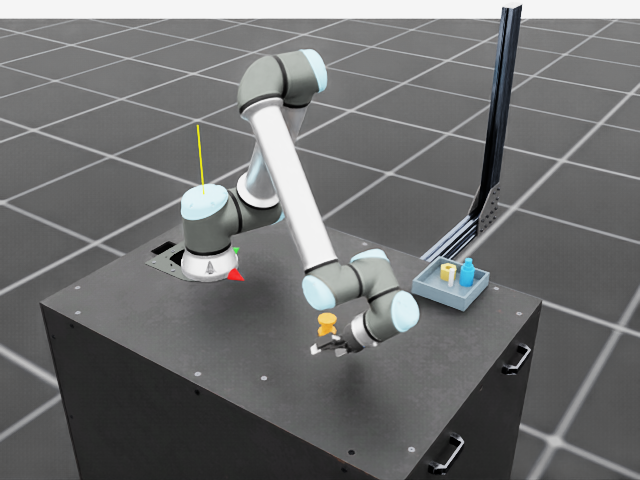
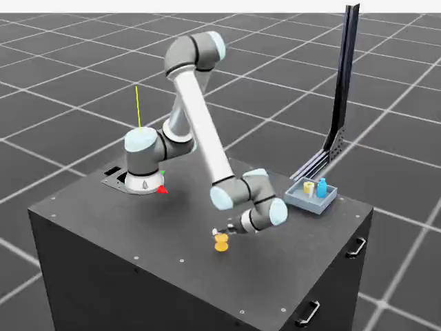
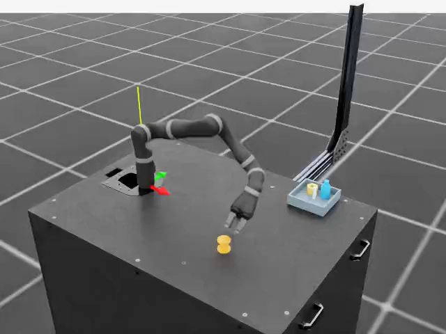
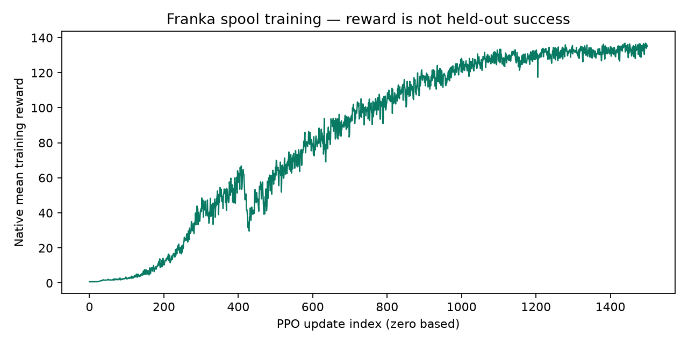
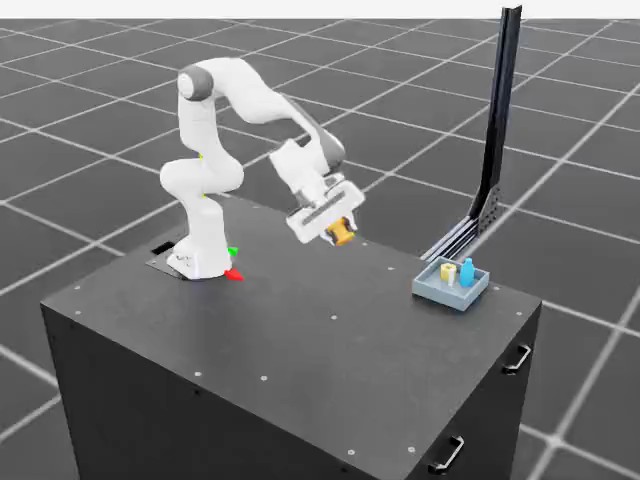
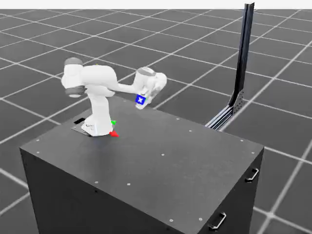

# Embodied RL: train in simulation, measure the transfer gap

Run [`franka-rl-transfer.yaml`](../../../workflows/testing/franka-rl-transfer.yaml)
on a reserved RTX PRO 6000 with the `rtx-rendering` cluster profile. It trains
an articulated robot in Isaac Lab using native RSL-RL PPO, evaluates the selected
weights under physical perturbations, and judges actual timestamped rollouts
through Token Factory. Franka Panda is the default; UR10e/Robotiq and Kinova
JACO2 use explicit native embodiment bindings. It exports LeRobotDataset v3 and
Rerun evidence.

**Current result: physics qualification remains false.** The latest native
UR10e diagnostic failed, and retained candidate motion still violated physical
constraints. [Diagnostic evidence](../evidence/manipulation-native-conformance.json)
and [passing CPU checks](../evidence/manipulation-integrated-cpu-validation.json)
have separate scopes; neither establishes improved task success or physical transfer.

The workflow defaults to `learning_recipe=adaptive-bounded-exploration`: learned joint commands,
physically bounded servo targets, richer observations, stable-goal rewards, and
a training-only curriculum driven by completed episode outcomes. Use
`--var learning_recipe=joint-baseline` to select the historical learning objective.
Newly prepared runs always include measured-state validity checks; exact historical
reproduction also requires the original source commit and sealed recipe.
The module-level `prepare --learning-recipe` option defaults to `joint-baseline`
for compatibility; the workflow passes its selected recipe explicitly.

The five stages are **prepare → train → evaluate → visual-evaluate → report**.
Each workflow uses one RTX GPU for sequential training and rendering. Separate
embodiments can run concurrently on separate workers. The hosted VLM stage uses
CPU resources and the operator's Token Factory credential.

This complements the [LeRobot PushT benchmark](lerobot-transfer.md). PushT
measures imitation-learning robustness in a planar task. This workflow provides
the articulated robot, gripper, contact dynamics, and reinforcement-learning
experiment needed to study embodied transfer. Neither experiment proves
physical robot transfer without a subsequent hardware trial.

## Additional embodiments

The same five-stage workflow accepts `--var embodiment=ur10e_robotiq85` or
`--var embodiment=kinova_jaco7`; the default remains `franka`. Give each robot
a fresh run ID, output prefix, and isolated runtime directory. Each trains its
own PPO policy from initialization and exports its actual articulation joints.

| Embodiment | Arm and gripper | Policy actions | Rerun output |
| --- | --- | ---: | --- |
| `franka` | Panda, two-finger parallel gripper | 7 joint targets + 1 gripper command | `franka.rrd` |
| `ur10e_robotiq85` | UR10e, Robotiq 2F-85 | 6 joint targets + 1 gripper command | `ur10e_robotiq85.rrd` |
| `kinova_jaco7` | JACO2 N7S300, three-finger gripper | 7 joint targets + 1 command controlling six finger joints | `kinova_jaco7.rrd` |

`Isaac-Lift-Cube-Franka-v0` remains the upstream task template and PPO settings
source. Before constructing the environment, the adapter replaces its robot,
action bindings, command body, and end-effector sensor with the selected
[UR10e](https://github.com/isaac-sim/IsaacLab/blob/ffff603eafc6b74264a5261cc0183d6a65390d78/source/isaaclab_assets/isaaclab_assets/robots/universal_robots.py)
or [JACO2](https://github.com/isaac-sim/IsaacLab/blob/ffff603eafc6b74264a5261cc0183d6a65390d78/source/isaaclab_assets/isaaclab_assets/robots/kinova.py)
configuration. Vendor robot USD assets are fetched at runtime under the existing
Isaac asset terms; they are not included in this repository or its images.

The recipe seals the embodiment and control convention. Runtime checks verify
the actual action order, gripper joints, base/tool bodies, and exported names.
The evidence records the effective USD path/variant, root pose, initial joints,
gravity, self-collision, and actuator settings. Capture merging and VLM auditing
reject a different embodiment or inconsistent telemetry.

The pinned Isaac Lab 3 runtime uses XYZW quaternions; all robots retain the
identity base rotation `(0, 0, 0, 1)`. UR10e's shoulder-pan initialization changes
from pi to zero to face the positive-X task workspace. Kinova retains its
upstream initial joints and identity root pose. UR10e's nominal grasp
frame is 14.5 cm along the wrist's tool axis. JACO2 uses its authored
`j2n7s300_end_effector` frame. These are simulation conventions, not physical
TCP calibrations. Native gravity and collision settings remain recorded separately;
new UR10e recipes apply the gripper compatibility profile described below.

UR10e uses `shoulder_link` as the frame sensor's source because the pinned PhysX
frame-view initialization unexpectedly includes the Robotiq gripper's nested
`base_link` when the arm's `base_link` is requested. The robot root remains
`base_link`; the sensor target remains `wrist_3_link` plus the grasp offset.
The lift reward consumes that target's world position, while object goals and
held-out metrics use the articulation root independently. No shoulder-relative
position is used as a policy observation, reward, or success measurement.
The legacy receipt key `controls.base_frame` names the **sensor reference**;
`profile.base_body` and `asset.root_position_m` describe the robot base.
At each native environment's initialization, an independent check compares the
sensor's world TCP with the articulation link pose and rotated grasp offset,
rejecting nonfinite values or error above 0.1 mm. This is a startup check, not
continuous monitoring. The pinned [link-pose API](https://github.com/isaac-sim/IsaacLab/blob/ffff603eafc6b74264a5261cc0183d6a65390d78/source/isaaclab_physx/isaaclab_physx/assets/articulation/articulation_data.py)
specifies XYZW quaternions; the [sensor kernel](https://github.com/isaac-sim/IsaacLab/blob/ffff603eafc6b74264a5261cc0183d6a65390d78/source/isaaclab_physx/isaaclab_physx/sensors/frame_transformer/kernels.py)
computes world TCP from the target body independently of the source frame.

Object assets, PPO update count, lift/hold thresholds, and physics shifts remain
fixed. New recipes additionally reject invalid physics and task-domain departures.
All recipes interpret raw arm actions as offsets from the native default
joint positions with a 0.5-radian scale. The adaptive recipe then constrains the
physical target and its slew; it does not clip raw actions to a small reachable
neighborhood. The historical common control convention is a comparison baseline, not a claim of optimal
embodiment-specific tuning. Initial/trained resets are paired within each embodiment.
Joint dimensions and adaptive observation widths can change random-number
consumption, so equal seeds do not establish identical object/goal resets across
robots or recipes. This is a comparison of
independently trained systems, not a controlled estimate of morphology alone.
Each embodiment has its own live evidence below; historical Franka results are
kept separate from the new Kinova and UR10e measurements.

## Learning to hold without a scripted policy

The baseline rewards a lift above 4 cm even though the part starts at 6 cm and
falls onto the table. Its joint-velocity and action-change penalties increase
1,000-fold after 10,000 environment steps. It rewards proximity to the goal but
does not directly reward the low-speed hold required by evaluation. These are
training incentives, not successful manipulation evidence.

The `adaptive-exploration` recipe addresses those mechanisms with one common definition for
all three embodiments:

- **Bound physical targets.** The policy still chooses every arm and gripper
  action. Arm targets stay within the native soft joint limits and move at most
  `min(2 rad/s, native joint velocity limit) × control_dt` per command. This
  constrains target slew, not a claim that actual joint velocity never overshoots.
  Servo memory resets from measured joint positions and its target error is
  observed by the policy. Native gravity, contacts, and actuators remain intact.
- **Observe the relevant state.** Add object-to-tool and object-to-goal vectors,
  object/tool orientations, object linear/angular velocity, servo tracking error,
  and the current hold duration to the original proprioceptive observations.
- **Reward the evaluated behavior.** Lifting uses the same 10 cm threshold as
  evaluation. Dense reaching and goal rewards are supplemented by a continuous
  low-speed hold reward; partial progress toward the goal earns distance reward
  before the full lift threshold, while lift and hold bonuses still require it; the hold counter uses the unchanged 5 cm, 3 cm/s,
  20-consecutive-step predicate and excludes terminal reset steps. A small fixed,
  bounded action-change penalty replaces the scheduled penalty jump. PPO uses
  observation normalization (restored from checkpoints and fingerprinted before/after
  inference), initial exploration standard deviation 1.0, entropy coefficient
  0.02, and discount 0.99, with the existing update count and rollout horizon.
- **Advance from training outcomes.** Start with narrower object/goal XY ranges
  and goal heights of 15.25–26 cm, interpolated toward the full 25–50 cm range.
  Assess disjoint windows of at least
  8,192 completed episodes at the current difficulty. A strict-success rate of
  at least 70% expands difficulty by 0.15, from 0.25 to 1.0. Old easier episodes
  cannot promote a newer level. At 1.0 the ranges exactly match the original
  distribution. The log records every assessed window, including failed ones.
  Adaptive training disables the baseline's randomized initial episode lengths
  so the first curriculum outcomes cover complete episodes. This also synchronizes
  timeout resets across the parallel environments and can increase sample correlation.

The earlier `learning_recipe=adaptive` remains reproducible with its original
gated goal reward, lift weight 5, exploration standard deviation 0.5, and
native entropy coefficient 0.006. Training checkpoint diagnostics were consistent with
an open-gripper, table-level local optimum with narrowing exploration. The
`adaptive-exploration` recipe restores lift weight 15, starts exploration at
1.0, increases entropy regularization to 0.02, and gives partial goal-distance
credit. Entropy regularization encourages exploration; it does not guarantee
a minimum action variance or command a grasp. Distance reward can be positive
below the lift threshold and is never treated as task success. These choices
come from training diagnostics, independently of held-out policy selection.

The default `learning_recipe=adaptive-bounded-exploration` keeps those rewards
and entropy settings but parameterizes each learned action standard deviation
as `0.05 + 1.45 * sigmoid(raw_std)`, initialized at 1.0. In training-only
diagnostics, the unbounded recipe's standard deviations grew above 21 on Franka
and above 12 on UR10e while strict training successes stayed at zero. Once
commands encounter physical servo limits, increasing raw variance can earn
entropy reward without producing useful movement. The bounded distribution
removes that unlimited incentive. Its limits are shared hyperparameters, not
embodiment-specific grasp commands; the actor still learns every action mean.
Sampling, probability ratios, entropy, and KL all use the same transformed
standard deviation. Checkpoints preserve both the learned raw parameters and
the bounds, and evaluation verifies that neither changes during inference.
The frozen bounded follow-up completed 1,500 PPO updates for each embodiment,
but none achieved a strict held-out placement. Its artifacts are independently
verified; its physics is not qualified:

| Embodiment | Raw trained height events | Strict held-out placements |
| --- | ---: | ---: |
| Franka Panda | 266/512 | 0/512 |
| Kinova JACO2 | 125/512 | 0/512 |
| UR10e + Robotiq | 53/512 | 0/512 |

Initial policies recorded zero height events and placements. The trained height
counts are threshold crossings, **not verified lifts**: the retained captures
include articulation-limit violations, including another extreme UR object
launch. Training curricula stayed at their initial difficulty. The
[bounded-run evidence](../evidence/manipulation-bounded-exploration-rtx.json)
records checkpoint selection, counts, timings, full artifact hashes, and visual
auditing separately from physics qualification. Improved strict task success
has not been demonstrated.

### Simulation integrity before learning

Finite numbers and bounded commands do not establish valid contact dynamics.
An earlier UR10e capture reached an object height of 6,544 m after its gripper
joint diverged; later Kinova and Franka captures also exceeded native finger
position limits. Raw height events from those runs are not evidence of valid
lifting. Their original artifacts remain unchanged and unqualified. The
[counterexample evidence](../evidence/manipulation-physics-counterexamples.json)
binds measured values to the exact raw-array and source hashes; it does not
retroactively classify every held-out trial from a small capture sample.

Every newly prepared recipe seals a separate measured-state contract. A native
termination term checks all arm, gripper, passive, and mimic joint positions and
velocities, robot/object finite state, and unit quaternions after each control
step and before reward or reset. Initial and reset states are checked before
reaching the learner. A breach aborts the stage and publishes
`simulation-validity-failure.json` with the measured joint, native bounds,
allowances, step, and command. It does not clamp observations or rewrite actions.
These checks sample control steps, not every physics substep, and do not prove
complete simulator correctness.

Position allowance is one native-velocity-limited physics tick plus floating-point
rounding. Velocity allowance is four dtype epsilons scaled by the native bound;
there is no fitted speed multiplier. A violation means the declared contract
was exceeded, not necessarily that the solver exploded. Continuous joint angles
retain their native unbounded domain. Numerical tolerances apply in each joint's
native units: metres for Franka fingers, radians for revolute joints.

Object departure beyond half the native scene spacing on any environment-local
XYZ axis is a separate ordinary task failure. The Z extent is a task envelope,
not a planar neighbor-cell boundary. Departure gives zero terminal reward and
revokes earlier episode success while preserving its measured hold trace.
Every trial stays in the denominator. Reports require successful training,
validation, test, and capture validity evidence; the VLM cannot use invalid or
unverified simulator heights as positive calibration references.

New UR10e recipes additionally seal `ur10e-mimic-asset-v1`. The pinned USD uses
five mimic followers, whereas the inherited Isaac configuration supplies
loop-style follower drives and restrictive follower velocity limits. The adapter
now inherits the composed gripper USD's gains, limits, and armature, and uses its
standalone gripper's 64/1 solver iterations. Startup verifies the actual variant,
mimic references/gearing, composed solver properties, and initialized actuator
buffers. This follows the mechanism discussed in NVIDIA's
[Robotiq tuning guide](https://docs.omniverse.nvidia.com/kit/docs/omni_physics/110.0/dev_guide/guides/gripper_tuning_example.html).
The learned arm/gripper command mapping stays the same. The native diagnostic
of this compatibility candidate ended **FAILED**. Independent review verified
59 retained files and measured 813 native RGB frames across four cases. All four
original case-summary receipts remain missing after simulator shutdown; the
post-hoc audit does not reconstruct or replace them.

The two recorded-action replays used the same initial snapshot and action sequence:

| Replay | Peak absolute joint position (rad) | Peak absolute joint velocity (rad/s) | Peak mimic-relation residual (rad) |
| --- | ---: | ---: | ---: |
| Legacy configuration | 263,572,512 | 12,552,627,200 | 273,411,584 |
| Compatibility candidate | 3.663995 | 285.661133 | 0.897502 |

Extreme angle divergence did not recur in this candidate replay, but its later
velocity, gripper-driver position, and mimic-relation violations remain
disqualifying. Small first-fault speed overages alone do not establish catastrophic
instability. These diagnostic replays disabled episode resets and termination
to expose the failure mechanism; they are excluded from training, held-out
scoring, and VLM calibration. There is no task-success improvement claim. The
[native diagnostic record](../evidence/manipulation-native-conformance.json)
binds each measurement to retained arrays, frame hashes, and both source versions.

The integrated source at `e15124dd2b0643783d6e5fc36c3b67b635261a27` separately
passed 21,860 non-live Linux tests (103 skipped, one xpassed), with 75.90% package
coverage, 279 focused manipulation tests, and 738 security regressions. Ruff,
guardrails, docs drift, and the built-in confidentiality scan also passed.
[Exact CPU evidence](../evidence/manipulation-integrated-cpu-validation.json)
records the tested commit and log hashes. These checks do not qualify native physics.

Replacing the cube with a procedural part now preserves the task's rigid-body
solver and depenetration properties, without inheriting the cube's geometry scale.
Evidence distinguishes composed USD values from direct simulator-state tensors.

Continuous joints retain their native angle and speed domains. When Isaac's
float32 soft-limit calculation overflows on continuous-joint sentinel bounds,
the controller reconstructs that same calculation in float64; it leaves finite
native soft limits unchanged. This enables Kinova's continuous joints without
inventing a rotation limit.

There is no grasp trajectory, waypoint sequence, timed gripper closure, or
success-conditioned action override. The curriculum changes only the training
distribution. Validation selects checkpoints independently of all four test
conditions and Token Factory judgments. The lift/hold thresholds remain unchanged;
new physics and task-domain checks can invalidate an otherwise positive result.
The visual judge never supplies training rewards.

Adaptive captures additionally retain `telemetry.npz` with actual object, goal,
and tool poses, object velocities, and the physical controller targets. Poses
correspond to the captured frame before the recorded action; targets correspond
to that action after servo constraints. Joint order and timing are declared in
the capture metadata. Historical baseline artifacts remain separate, and their
measurements do not establish that the adaptive recipe improves success.

The first native `adaptive` Franka run completed all five stages and 1,500 PPO
updates, but its selected policy achieved **0/512 lifts and 0/512 strict
successes** on the held-out tests. Its curriculum stayed at the initial
difficulty. The independent visual audit also failed: five invalid responses
and two positive lift judgments against negative synchronized height references
among 32 captures. This is a retained negative result, not an improvement over
the historical baseline. Higher training reward alone does not establish better control.
The [failure evidence](../evidence/franka-initial-adaptive-parts-rtx.json),
[individual trials](../evidence/franka-initial-adaptive-parts-rtx-trials.csv), and
[training curve](../evidence/franka-initial-adaptive-parts-rtx-training.png)
retain this result separately from the follow-up.

The unbounded `adaptive-exploration` Franka follow-up also completed all five
stages but achieved **0/512 lifts and 0/512 strict successes**. Its visual audit
retained four invalid responses and three positive lift judgments against
negative synchronized height references. Its [complete evidence](../evidence/franka-exploration-parts-rtx.json)
and [individual trials](../evidence/franka-exploration-parts-rtx-trials.csv) remain
separate from both the initial adaptive run and the bounded follow-up.

Reporting streams RGB frames into the video encoder and accumulates image
statistics in a fixed-size per-channel histogram. It preserves LeRobot pixel
normalization without retaining every rollout image or converting the complete
video collection into a floating-point array.
Replaying the complete report on the retained 8,000 frames used **541 MiB**
maximum resident memory, reproduced all 32 MP4 files byte-for-byte, and differed
from the prior image statistics by less than `9e-15`. This
[report replay](../evidence/isaac-lerobot-streaming-report.json) measures the
conversion fix independently; it does not repeat policy training or evaluation.
The subsequent native exploration workflow also completed reporting and its full
artifact audit. An intermediate observation of the entire report worker recorded
zero cgroup OOM events; its memory includes runtime setup and file cache and is
not a final measurement of the converter alone.

## Relationship to the reference Sim2Real pipeline

The reference is [`workflows/main/sim2real.yaml`](../../../workflows/main/sim2real.yaml).
This compact workflow retains its relevant experimental contracts:

| Reference responsibility | Embodied RL implementation |
| --- | --- |
| Task and embodiment contract | Pin the upstream lift task, selected robot and joint control, geometric success criteria, and reset streams before training |
| Stage 9: genuine PPO | Use the upstream Franka PPO configuration, randomized object mass/friction, native optimizer updates, initial weights, and periodic checkpoints |
| Validation-only selection | Rank checkpoint success on the same validation resets; break ties by closest goal distance, then earlier iteration |
| Stage 10: exact held-out policy | Evaluate the initial and selected weights on paired, untouched test resets; verify initial physical-state hashes |
| Stage 11: quality decision | Report the measured success threshold independently of workflow completion |
| Stage 8: visual evaluation | Independently judge paired initial/trained captures through Token Factory; compare frame-cited judgments with synchronized physical measurements |
| Stage 14: factual visualization | Convert actual Isaac RTX frames and synchronized state/actions with the existing Isaac-to-LeRobot adapter; record the selected robot's named telemetry and embedded videos in Rerun |

The experiment uses simulator rewards and privileged object state. Its VLM
evaluation is a post-training audit; its outputs do not shape PPO rewards or
checkpoint selection. It omits Cosmos augmentation and environment generation.
Its task is **lift and hold at a commanded goal**, not object release
onto a support surface. A hardware student still needs validated perception,
calibrated action conversion, and a separate physical evaluation. The adaptive
teacher additionally consumes simulator object pose/velocity and a hold-progress
observation computed from those measurements. A hardware policy needs calibrated
state estimation, validated sensing latency, or distillation into a sensor-based
student; exporting LeRobot episodes alone does not provide that policy.

## Reproduce on Nebius

Configure an operator-owned project, writable S3 storage, and an exact
Kubernetes context. Provision a render-capable RTX node with
`npa cluster up --gpu-workload-profile rtx-rendering`, selecting its reserved
capacity group. The profile verifies CUDA and the graphics-driver interfaces.
See [GPU provisioning](../../../skills/tools/gpu-cluster-provisioning/SKILL.md).

The workflow pins the existing payload-clean Isaac Lab 3.0 beta 2 patch 1 image
and LeRobot image by digest. Isaac Lab remains a **beta** runtime. Its NVIDIA
runtime is fetched under the existing [Isaac acceptance and explicit opt-out
policy](../../../skills/atomic/third-party-eula-preflight/SKILL.md); optional
telemetry remains disabled. No model weights or gated dataset are downloaded.
Token Factory hosts the selected vision model under the operator's account.
See [Isaac Lab 3 packaging](../isaac-lab-3.md).

The sealed recipe restores `gpu_total_aggregate_pairs_capacity` to 2,097,152
for the richer scene. The pinned [upstream lift task](https://github.com/isaac-sim/IsaacLab/blob/ffff603eafc6b74264a5261cc0183d6a65390d78/source/isaaclab_tasks/isaaclab_tasks/manager_based/manipulation/lift/lift_env_cfg.py)
reduces this buffer to 16,384, which produced missed-interaction errors with
4,096 parts environments. Native stages reject recorded PhysX errors even when
the process exits zero; failed-stage logs are retained beside the normal output
under a unique `-failures/` prefix. Such an attempt cannot qualify the policy.

Set `NPA_PROJECT`, `NPA_KUBE_CONTEXT`, `NPA_OUTPUT_BUCKET`, and a fresh
`NPA_RUN_ID`. Set `NPA_SKYPILOT_ISOLATED_CONFIG_DIR` to a new private directory
for this run and use the project's private configuration. The spec enables `source_overlay: "1"` so both
images execute this checkout's modules. Stage the source before starting its API:

```bash
npa/.venv/bin/npa workbench health preflight --project "$NPA_PROJECT" --checks nebius,s3
npa/.venv/bin/npa workbench token-factory verify
npa/.venv/bin/npa workbench token-factory models
npa/.venv/bin/npa workbench workflow stage-src --project "$NPA_PROJECT" --bucket "$NPA_OUTPUT_BUCKET"
npa/.venv/bin/npa workbench workflow validate-spec workflows/testing/franka-rl-transfer.yaml --json
npa/.venv/bin/npa workbench workflow plan-spec workflows/testing/franka-rl-transfer.yaml --run-id "$NPA_RUN_ID" --waves --json
npa/.venv/bin/npa workbench workflow preflight-images workflows/testing/franka-rl-transfer.yaml --json
npa/.venv/bin/npa workbench workflow submit workflows/testing/franka-rl-transfer.yaml \
  --project "$NPA_PROJECT" --infra "k8s/$NPA_KUBE_CONTEXT" \
  --isolated-config-dir "$NPA_SKYPILOT_ISOLATED_CONFIG_DIR" \
  --run-id "$NPA_RUN_ID" --runtime --stage-src --max-wait-seconds 0 \
  --var "bucket=$NPA_OUTPUT_BUCKET" \
  --var "prefix=franka-rl-transfer/$NPA_RUN_ID" \
  --secret-env AWS_ACCESS_KEY_ID --secret-env AWS_SECRET_ACCESS_KEY \
  --secret-env NEBIUS_TOKEN_FACTORY_KEY
```

The standard runtime owns all five stages. Stages exchange checksum-verified
S3 directories; native Isaac processes run inside their assigned GPU task.
Evaluation starts separate simulator processes for validation, held-out tests,
and each capture arm/condition, giving every capture case its own Replicator
lifecycle. The stage publishes only after all completion records are verified.
Keep each experiment's prefix and isolated API configuration unchanged while
it owns jobs. Use a fresh run identity after changing the experimental recipe.
An explicit `--resume-run "$NPA_RUN_ID"` reuses successful stages after checking
their durable outputs. First confirm that the previous driver stopped and
verify its exact recorded jobs. Preserve the source snapshot, run prefix, and
isolated API directory so recovery reaches the same controller and job history.
A terminal payload retry requires explicit `--retries` and retains that history.
Changing the source requires a separately verified run or a documented migration
procedure.

## Protocol and configuration

| Setting | Default | Meaning |
| --- | --- | --- |
| `seed` | 42 | Training initialization; cannot overlap reserved evaluation streams |
| `iterations` | 1,500 | Real PPO iterations, with 24 transitions per environment per iteration |
| `num_envs` | 4,096 | Parallel training environments; default total is 147,456,000 transitions |
| `eval_episodes` | 128 | Environments per validation checkpoint and per test condition/arm |
| `minimum_success` | 0.7 | Required success rate in every test condition |
| `asset` | `spool` | Target part: `spool`, `hex_nut`, or `bottle`; changing it requires a new training run |
| `embodiment` | `franka` | Native robot: `franka`, `ur10e_robotiq85`, or `kinova_jaco7`; each trains independently |
| `learning_recipe` | `adaptive-bounded-exploration` | Bound learned action variance; `adaptive-exploration`, `adaptive`, and `joint-baseline` retain earlier learning objectives, with validity checks on newly prepared runs |
| `vlm_model` | `MiniMaxAI/MiniMax-M3` | Exact Token Factory vision model, checked against the account's model list |
| `bucket`, `prefix` | Project binding and run-specific prefix | Durable stage artifacts |

## Simulation assets

Preparation authors self-contained USD assets in metres: an orange spool with
flanges, a brass hex nut with a real central opening, a blue bottle-shaped part,
and a tray with walls and a locating peg. The target is a dynamic 80 g rigid
body with compound collision shapes. The nut uses six convex collision pieces
so its central opening remains open. The other two parts are fixed distractors;
the tray and peg also participate in collisions. These original procedural
assets are distributed under the repository's Apache-2.0 license; no external
asset library or texture download is required.

Select a target with `--var asset=hex_nut` or `--var asset=bottle`. The experiment
trains and tests that one target; selecting an alternative does not establish
cross-object generalization. The prepared recipe records every USD file's SHA-256,
and every simulator process verifies those bytes before loading them. Missing or
changed assets fail visibly instead of reverting to the stock cube. The upstream
task ID remains `Isaac-Lift-Cube-Franka-v0` because its Franka controls, reward
configuration, and task managers are reused with the sealed target replacement.

Training randomizes object mass to 0.7–1.3 times the stock mass and object
friction to 0.5–1.5. Applied values are read back from Isaac's rigid-body view.
The resolved PPO architecture and optimizer settings remain explicit in
`training.json`. The historical `joint-baseline` uses the pinned task's stock
reward terms; adaptive profiles replace them with the sealed learning definition
described above. The run records the actual policy parameter change, framework
versions, accelerator, optimizer settings, elapsed training time, and native
checkpoint hashes.

Native periodic checkpoint filenames use the runner's zero-based iteration
counter. The workflow also writes a final checkpoint after all requested
updates; validation may select an earlier checkpoint with equivalent or better
measured behavior.

Validation uses the nominal condition at reset stream 100,000. Checkpoint
selection finishes and writes `selection.json` before test stream 200,000 is
opened. Every test condition compares the initial and trained actor on 128
paired environments. Initial physical-state hashes must match across the arms
and conditions. Environment indices identify independent resets within each
seeded vector environment; they are not invented per-episode RNG seeds.

| Test condition | Object mass | Object friction | Action delay |
| --- | --- | --- | --- |
| Nominal | 1× | 1.0 | None |
| Heavy | 2× | 1.0 | None |
| Slippery | 1× | 0.25 | None |
| Delay | 1× | 1.0 | One control step |

Success requires the object to remain above 10 cm, within 5 cm of its commanded
goal, and below 3 cm/s for **20 consecutive control steps**. Automatic-reset
observations cannot complete or restart that streak. Lift achievement and
closest distance remain diagnostic metrics. Qualification requires every
condition to clear the configured threshold; completing the workflow alone
cannot qualify a policy. The paired bootstrap interval is clustered by vector
environment index across conditions and measures reset variability for one
training seed.

A separate matched PPO ablation is needed to attribute gains specifically to
mass/friction randomization. The ranges are experimental perturbations; a
physical deployment needs measured robot and object calibration.

## Meaningful visual evaluation

Capture records four independent resets for each initial/trained policy and
each physics condition: **32 episodes**, separate from validation and held-out
testing. Applied mass, friction, delayed actions, initial-state hashes, weights,
RGB, and synchronized object geometry retain their provenance. The two policies
start from identical physical states. Episodes are judged individually in a
fixed shuffled order, with no policy arm, checkpoint, simulator score, or success
label sent to the model.

Each request identifies the target by shape and color and sends up to 16 actual
frames, including the beginning, the whole rollout, and a denser final half-second.
Every image has its measured timestamp and frame index. The sealed rubric asks
for three visual events: **object elevated** (`lifted`), **held at the end**, and **scene disturbed**.
Elevation does not establish a grasp: a tossed object counts as elevated, while
the final-hold judgment separately requires visible retention in the gripper.
Each receives `yes`, `no`, or `uncertain`, cited frame indices, and an explanation.
Failure tags distinguish missed grasps, slipping/dropping, unstable holding,
wrong-object handling, fixture contact, and occlusion.

The parser rejects an unexpected served model, truncated or malformed responses,
missing events, citations to unsent frames, contradictory tags, and a claimed
final hold without a lift and support from both final frames. It retains sampled JPEGs,
the exact prompt, raw provider response, model ID, rubric hash, request ID, usage,
latency, and retries. Provider cost is recorded only when returned; otherwise it
is null. There is no stub or score-override path.
An invalid model response is recorded as `status: invalid_response`, with a null
verdict and a validation reason. The audit continues through every episode;
invalid responses remain in its denominators and close the audit gate. They are
never replaced with invented `uncertain` judgments or retried until accepted.
Input, lineage, authentication, transport, and storage errors still fail the stage.
Available evidence is then published under a unique `visual-failures/` directory;
a failed stage cannot satisfy a completion output.

For an interrupted audit, the `npa.workflows.franka_rl visual-evaluate` stage
accepts `--prior-judgments-path` pointing to a checksum-verified prior artifact.
Its `capture-contract.json` must bind the exact evaluation and capture metadata
hashes. Every saved request must match the current model, prompt, and sampled
image hashes, and every saved JPEG is checked before the raw response is
revalidated. Both valid and invalid first responses are retained. Only missing
episodes make new hosted requests. Missing historical transport accounting is
reported as null. After an implementation change, use a separate CPU
visual-evaluate → report workflow consuming the immutable evaluation and prior
audit artifacts; retain both source revisions and the original failed run.

The report compares visual lift judgments against synchronized simulator height
measurements at the exact supplied frame indices. The reference requires the
object center above 10 cm in at least two supplied frames; an event occurring
only between samples does not count. This elevation proxy reports sensitivity,
specificity, uncertainty, and false positives, without claiming grasp detection.
The predeclared audit gate requires balanced lift agreement of at least 80%, with
both positive and negative references present and zero invalid responses; uncertain judgments count against
agreement. The visual task gate requires at least 70% observed final holds in
every trained condition and no observed scene disturbance. Final simulation
qualification requires **the original strict physics gate and both visual gates**.
A good-looking video cannot override a failed physical criterion.

This is an independent diagnostic audit, not a human-calibrated VLM benchmark.
Sampled monocular images cannot establish exact centimetres, velocities, forces,
or continuous stability between frames. The visible-lift reference is deliberately
separate from strict goal-and-velocity success, and 32 capture episodes do not
replace the 1,024 paired physical test trials. Changing the rubric or model after
seeing results requires a newly sealed experiment.

## Review the artifacts

The output prefix contains `prepared/recipe.json`, `training/training.json`,
native initial/periodic checkpoints and logs, `evaluation/selection.json`,
per-checkpoint validation, paired test episodes, and raw capture trajectories.
The final `reports/` directory contains:

- `report.json`, `trials.csv`, and `success.png`: measured simulation outcomes.
- `visual-evaluation.json`: per-episode VLM judgments, physical comparisons, model usage, and additional quality gates. The `visual/` stage retains exact request, response, and sampled-frame artifacts.
- `lerobot/`: selected robot state, applied joint-control actions, and actual RTX video.
- `capture.json`: exact checkpoint, capture stream, timing, and per-episode
  success labels. Recorded failures remain failures; these are policy rollouts,
  not automatically accepted expert demonstrations.
- `<embodiment>.rrd`: the actual rendered embodiment with its synchronized telemetry.
- `recording-validation.json`: decoded row counts for every camera, joint, and
  action channel, with the workflow run ID used as the recording ID.

Capture uses a third stream beginning at 300,000, independent of checkpoint selection and
test scoring; each capture index has a fixed seed reused across arms and conditions.
The export records actual articulation joint names and action ordering. The
Franka default has nine joint positions and eight actions: seven scaled
joint-position targets and one binary gripper command. Other embodiments retain
their own native joint dimensions and gripper bindings.
These normalized simulator actions require an explicit controller mapping
before use on hardware.

The teacher also consumes privileged joint velocities, object position, and a
commanded goal. The review export contains RGB, joint positions, and actions;
student training needs an explicit observable-goal contract and additional
input features as appropriate.

Download and inspect the recording with `rerun <recording.rrd>` and decode the
LeRobot MP4s before treating an artifact reference as visual evidence. When the
run is complete, cancel its jobs before removing its dedicated cluster and
workflow identity; retain the artifact storage for reproduction.

## Measured embodiment comparison

All three robots have native PPO, paired physics, and visual evidence. The new
Kinova and UR10e runs completed all five workflow stages. Franka is the retained
earlier baseline, including its documented visual-audit recovery.

| Embodiment | Trained lifts | Trained strict successes | Selected iteration | Learning + final export |
| --- | ---: | ---: | ---: | ---: |
| Franka Panda | 508/512 | 2/512 | 1499 | 24.8 min |
| Kinova JACO2 | 0/512 | 0/512 | 500 | 22.5 min |
| UR10e + Robotiq | 0/512 | 0/512 | 1499 | 28.7 min |

Each trained-policy denominator covers 128 episodes in each of four physics
conditions. Every initial policy recorded zero lifts and strict successes in
its 512 tests. Each robot trained for 1,500 updates and 147,456,000 transitions;
reported training time excludes package installation and simulator startup.

The shared, untuned joint-space PPO baseline does not solve this task on the
additional embodiments. Franka learns to lift frequently but rarely meets the
strict goal-and-stability criterion. None of these results establishes hardware
transfer or qualifies a policy for deployment. The different native actuators,
grippers, control dimensions, and reset distributions prevent attributing the
outcome to morphology alone.

The [comparison validation record](../evidence/embodiment-parts-validation.json)
records exact source commits, tests, native TCP checks, and cleanup. Both new
runs preserve all first Token Factory responses, including invalid judgments.

## UR10e parts result

The UR10e/Robotiq replacement run completed 1,500 PPO updates across 4,096
environments in 28.7 minutes. Its independent CPU checkpoint audit verified
finite actor weights, parameter change, and 30,000 optimizer steps per parameter.
All five checkpoints scored zero strict successes on validation; the sealed
selection rule chose iteration 1499 using goal distance and then iteration order.
The selected policy recorded 0/512 lifts and
0/512 strict successes across the held-out conditions.

The actual articulation exports 12 named joint states and 7 policy actions.
Its 32 paired capture episodes contain 8,000 synchronized frames. The
Token Factory audit retains 6 invalid first responses; sensitivity against the
sampled-height proxy is not established, specificity is 78.12%, and
balanced accuracy is not established. These are visual-audit measurements,
not evidence of physical transfer or human-calibrated grasp recognition.

The audit records 25 negative judgments, six invalid responses, and one positive
judgment against a negative height reference. In that disagreement (trained
delayed-action capture 1, episode 17), the model calls the spool lifted and held,
but its centre is about 2.3 cm high at the cited 4.9-second frame, below the
sealed 10 cm threshold. The synchronized frame and telemetry remain available;
the model judgment cannot override the failed physics gate.



The first attempt failed in native sensor initialization before any PPO update.
The replacement uses the source-body correction and startup world-TCP check
described above. The failed attempt remains in private execution evidence and
is summarized in the comparison validation record; it is not counted as a
successful training run.



See [measured UR10e evidence](../evidence/ur10e_robotiq85-parts-rtx.json) and
[all held-out trials](../evidence/ur10e_robotiq85-parts-rtx-trials.csv).

## Kinova parts result

The JACO2 N7S300 completed all five stages with the same spool, distractors,
physics shifts, and untuned PPO recipe. Its 1,500 updates produced 147,456,000
transitions in **22.5 minutes** of learning and checkpoint export. Independent
CPU checkpoint decoding verified nine finite actor tensors, an L2 parameter
change of 32.6395, and 30,000 optimizer steps per parameter.

Validation selected update **500** from five checkpoints using 640 validation
episodes. Both initial and selected policies recorded **zero lifts and zero
strict successes in 512 held-out trials each**. This establishes a failed
policy under the common recipe, not an absence of training.

All 32 independent capture episodes contain 250 frames. Token Factory returned
29 valid no-lift judgments and three invalid responses, retained without
replacement. Every supplied-frame height reference is negative, so lift
sensitivity and balanced accuracy remain unestablished. Specificity including
the invalid responses is 29/32. Physics qualification and both visual gates are
false; no hardware evaluation was performed.

The downloaded evidence passed complete file checksums, source verification in
all four execution workers, every LeRobot state/action value and feature name,
all 32 MP4 decodes, sampled RGB/JPEG comparisons, and all 704 dynamic Rerun
entities including scalar values, embedded videos, timestamps, and references.
The export has **8,000 frames, 13 joint states, and eight policy actions**.
VLM coverage, prompts, frame bindings, outcomes, and gates were independently
recomputed. The paired demo uses the first capture reset of every condition,
with initial/trained policies shown at real speed.



See [measured Kinova evidence](../evidence/kinova_jaco7-parts-rtx.json) and
[all held-out trials](../evidence/kinova_jaco7-parts-rtx-trials.csv).

## Franka parts and hosted judge validation

The spool experiment completed **1,500 PPO updates and 147,456,000 transitions**
on one RTX PRO 6000. Learning and final checkpoint export took **24.8 minutes**,
excluding installation and simulator startup. Independent S3 and local checks
verified all 14 training files. Nine actor tensors are finite; their independently
decoded parameter change is 38.9880 in L2 norm, and the optimizer records 30,000
updates per parameter. All eleven native training/evaluation logs are free of
recorded PhysX errors and missed-interaction messages.



Five checkpoints were compared on 640 validation trials before selecting
`model_1499.pt`. All five had zero strict validation successes; closest goal
distance narrowed the tie, and the earlier-iteration rule selected iteration
1499 over the identical final actor. The selected actor equals the final actor tensor for
tensor. All **1,024 held-out trials** passed checkpoint-lineage and exact
physical-reset pairing checks. The initial policy had zero lifts and zero
strict successes. The trained policy produced:

| Held-out condition | Spool lifts | Strict successes |
| --- | ---: | ---: |
| Nominal | 128/128 | 0/128 (0.0%) |
| Heavy | 128/128 | 2/128 (1.6%) |
| Slippery | 126/128 | 0/128 (0.0%) |
| Delay | 126/128 | 0/128 (0.0%) |

That is **508/512 lifts but only 2/512 strict successes**. The mean strict
improvement is 0.39 percentage points; the paired 95% bootstrap interval is
0.00–0.98 points. This policy **does not qualify** under the sealed 70%-per-condition
threshold. For example, the first nominal trained capture ends within 1.01 cm
of its goal, but the simulator reports 16.1 cm/s object speed against a 3 cm/s
limit. Visual retention alone cannot establish the required stable hold.

Token Factory evaluated **all 32 paired captures across four reset seeds** using the sealed
MiniMax-M3 model, rubric, and sampled frames. The first audit stopped after 21
valid responses when another response claimed no lift but a successful final
hold. Recovery preserved all 22 raw responses, including that rejected response,
and requested only the ten missing episodes. No response was replaced to obtain
a passing result. The completed audit contains **2 invalid responses**;
its balanced lift agreement against the sampled-height proxy is
**93.8%**. Invalid responses remain in denominators
and close the audit gate. The judge also flags scene disturbance in the delayed
drop episode, although its explanation describes the target falling rather than
fixture contact or distractor movement. That interpretation is an uncalibrated
judgment, not verified fixture contact. Both the physical and visual audit gates
remain closed.
Human-label calibration and physical Franka execution remain untested.

The original GPU stages used source `45622059`. The separate CPU audit/report
recovery used `d5a096fc` and immutable original evaluation
and failure artifacts. Their source hashes, first-response lineage, and actual
worker modules were verified separately. The original run's failed visual stage
is preserved; it is not relabeled as a successful uninterrupted five-stage run.

All 32 MP4s decode at 640×480 and 50 fps, with **7,891 real simulator frames**.
Decoded samples match their original RGB arrays. The LeRobot export contains
7,891 synchronized state/action rows; the Rerun recording's frame/time timelines
and camera, joint, and action channels were decoded and checked. The paired demo
uses the first capture reset in each condition, with both policies at real speed.
The delayed trained rollout ends after 141 frames following a drop; the remaining
31 clips contain 250 frames each. Its paired demo uses an explicit episode-ended
slate instead of freezing or inventing motion.



The updated implementation passed **21,441 Linux tests** (116 skipped and one
existing unexpected pass), **736 security regressions** with CPU Torch 2.13.0,
and **3,507 guardrails**. Recovery-focused tests passed 81 cases locally with six
Warp-dependent skips; the Linux run covers those dependencies. The earlier 114
CLI smoke cases passed. One additional real Token Factory parts test passed;
its call is separate from the 32-capture audit accounting.

The [measured result](../evidence/franka-parts-rtx.json),
[every held-out trial](../evidence/franka-parts-rtx-trials.csv), and
[validation record](../evidence/franka-parts-validation.json) retain the
measurements and cryptographic evidence. These results cover a spool target
with nut/bottle distractors and a tray fixture, not cross-object policy
generalization or physical deployment.

## Historical cube baseline on RTX PRO 6000

The measurements below belong to the original four-stage cube experiment at
commit `461841cf`. They remain preserved as a baseline; they do not validate the
new parts scene or Token Factory evaluation.

The native run completed **1,500 PPO updates across 4,096 Franka environments**:
147,456,000 transitions in 22.1 minutes of learning and final checkpoint export,
excluding worker installation and renderer startup. The actor's parameter
change had L2 norm 32.6653. Validation evaluated five saved checkpoints on
640 episodes and selected checkpoint `model_1499.pt` before opening the test
stream. The final native checkpoint contains the same learned actor after the
requested updates; checkpoint counters follow the upstream runner convention.

All 1,024 test trials passed the exact reset-pairing and checkpoint-lineage
checks. Two evaluation attempts using the same saved weights and recipe in
fresh workers produced byte-identical evaluation JSON, including all validation
and held-out trial records. The initial actor never lifted the cube and had
zero strict successes in every condition. The trained actor learned to lift reliably, but rarely
satisfied the stable-hold criterion:

| Held-out condition | Trained cube lifts | Trained strict successes |
| --- | ---: | ---: |
| Nominal | 128/128 | 10/128 (7.8%) |
| Heavy | 128/128 | 3/128 (2.3%) |
| Slippery | 128/128 | 4/128 (3.1%) |
| One-step delay | 119/128 | 0/128 (0.0%) |

Mean strict success improved from 0% to 3.3%; the paired 95% bootstrap interval
for the improvement is **+1.4 to +5.7 percentage points**. Every condition
failed the preregistered 70% threshold. **Simulation qualification is false;
physical transfer is untested.** Stock lift/tracking reward is not sufficient
evidence of a stable hold. A subsequent experiment should address settling and
actuation robustness, select changes on validation, and seal a new held-out
stream before testing.

The pinned beta simulator reported its TGS warning about potentially noisy
velocities. This run retains the sealed velocity threshold and measured results;
it does not establish whether that warning contributed to the low hold scores.

Four independent capture episodes produced 1,000 synchronized 640×480 RGB
frames at 50 Hz, nine joint positions, and eight applied actions. All four
lifted the cube; none satisfied the strict hold criterion. One reached 19 of
the required 20 stable steps and remains labeled as a failure. Every MP4 was
fully decoded; all 72 Rerun camera/telemetry entities matched their frame and
time timelines and the sealed run identity.



This is an unedited decoded frame from the recorded policy rollout. See the
[measured evidence and hashes](../evidence/franka-rl-rtx.json),
[complete held-out trial table](../evidence/franka-rl-rtx-trials.csv),
[native learning curve](../evidence/franka-rl-rtx-training.png), and
[success comparison](../evidence/franka-rl-rtx-success.png).
