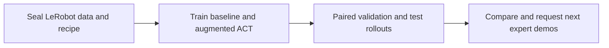
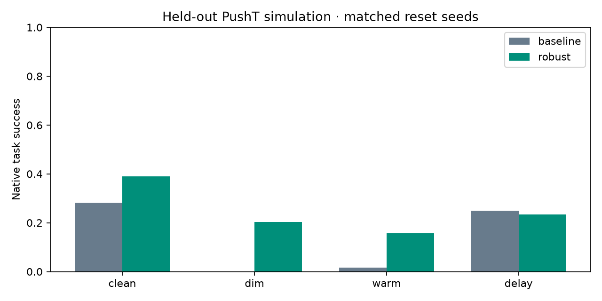

# LeRobot transfer: demonstrations, policy, evidence, next data

Run [`lerobot-transfer.yaml`](../../../workflows/testing/lerobot-transfer.yaml)
on Nebius reserved B200 capacity for training and evaluation.
It is a four-phase alternative for teams that already have useful
demonstrations and want to find the next data that their policy needs.

The executable benchmark uses **native LeRobot ACT and native PushT physics**.
It tests the hypothesis that photometric augmentation improves transfer
robustness. A completed workflow can report that this hypothesis failed.
Physical robot transfer requires a subsequent hardware experiment.
The first complete B200 run increased average held-out success from 13.7% to
24.6%, but failed the benchmark's absolute-success gate. See the
[measured results](#measured-b200-results) before using these checkpoints.

For an articulated arm and real simulation RL, use the companion
[Franka PPO workflow](franka-rl-transfer.md). It retains this benchmark and adds
Franka Panda contact dynamics, physical perturbations, held-out evaluation, and
genuine RTX rollouts exported to LeRobotDataset.



## Why this design

Demonstrations supply action supervision directly. A compact imitation policy
can use that supervision without scene reconstruction, video generation, or
learned reward orchestration. The existing 14-stage
[Sim2Real workflow](sim2real-workflow.md) remains useful when those components
are part of the experiment.

The useful feedback artifact is `next-demonstrations.json`: a ranked list of
**validation** failures, with condition, reproducible simulator reset seed,
observed reward, and a request for an expert recovery. Failed policy actions
never become expert labels. Collecting these requested demonstrations and
retraining is an operator experiment; this version does not automatically
acquire new demonstrations or claim an autonomous improvement loop.

## Reproduce on Nebius

Use an operator-owned project in `us-central1`, writable project-scoped storage,
and a verified Kubernetes context with two schedulable B200 devices.
Bind the GPU node groups to the tenant's verified reservations
with `--capacity-block-group`; see [GPU provisioning](../../../skills/tools/gpu-cluster-provisioning/SKILL.md).
PushT uses Pymunk and software-rendered observations, so it requires no Isaac
installation or RT rendering driver profile.

Set `NPA_PROJECT` and `NPA_KUBE_CONTEXT` to that project's local alias and exact
context; set `NPA_RUN_ID` to a new run identity and `NPA_OUTPUT_BUCKET` to the
project's authorized output bucket name, without `s3://`. Select the matching private
`NPA_CONFIG_DIR` and `KUBECONFIG` when using isolated operator configuration.
Use a dedicated operator account whose Nebius CLI configuration contains the
project-scoped service-account profile and its authorized RSA key. Set
`NPA_NEBIUS_PROFILE` to that profile and `NPA_SKYPILOT_ISOLATED_CONFIG_DIR` to a
new private directory for each experiment. Stage source before starting its
SkyPilot API, then keep the configuration unchanged while it owns jobs.
From the checkout containing this change:

```bash
npa/.venv/bin/npa workbench health preflight --project "$NPA_PROJECT" --checks nebius,s3
npa/.venv/bin/npa workbench workflow stage-src --project "$NPA_PROJECT" --bucket "$NPA_OUTPUT_BUCKET"
npa/.venv/bin/npa workbench workflow validate-spec workflows/testing/lerobot-transfer.yaml --json
npa/.venv/bin/npa workbench workflow plan-spec workflows/testing/lerobot-transfer.yaml --run-id "$NPA_RUN_ID" --waves --json
npa/.venv/bin/npa workbench workflow preflight-images workflows/testing/lerobot-transfer.yaml --json
npa/.venv/bin/npa workbench workflow submit workflows/testing/lerobot-transfer.yaml \
  --project "$NPA_PROJECT" --infra "k8s/$NPA_KUBE_CONTEXT" \
  --isolated-config-dir "$NPA_SKYPILOT_ISOLATED_CONFIG_DIR" \
  --run-id "$NPA_RUN_ID" --runtime --stage-src --max-wait-seconds 0 \
  --var "bucket=$NPA_OUTPUT_BUCKET" \
  --var "prefix=lerobot-transfer/$NPA_RUN_ID" \
  --secret-env AWS_ACCESS_KEY_ID --secret-env AWS_SECRET_ACCESS_KEY
```

The selected project supplies storage credentials and the endpoint. The
`--var bucket=...` binding replaces the checked-in `example-bucket` placeholder.
The bucket must be authorized for that project.
The explicit prefix prevents an inherited storage prefix from redirecting a new
experiment into an older namespace. An isolated API is bound to its storage
scope; retain that directory for resume and use a fresh one for a new experiment.
Use the same checkout, source identity, configuration directory and run id with
`--resume-run` when resuming a durable run. Incomplete training restarts its
wave; this adapter does not promise mid-optimizer resume.

The workflow pins the B200-validated LeRobot 0.6.0 image by digest. CPU
preparation and reporting share the B200 node's image cache without requesting
GPU devices. This avoids a separate large image unpack on a small CPU boot disk.
The separate service-account configuration avoids a shared human-login token
cache changing during refresh and invalidating the API's credential-identity check.
`--stage-src` supplies the new adapters; no container build or image publication is needed.
The live submit matrix registers the real runtime path with two parallel
training tasks. The public dataset is MIT-licensed; LeRobot is Apache-2.0.
No gated model access or hosted VLM credential is required.

## Fixed data and configurable experiment

The benchmark pins `lerobot/pusht` at
`7628202a2180972f291ba1bc6723834921e72c19`: 206 episodes, 25,650 frames, 10 Hz,
96×96 RGB observations, and two-dimensional absolute actions in `[0, 512]`.
Preparation checks counts, finite actions, contiguous frames and timestamps.
An episode split reserves 20% of demonstrations; normalization uses only the
80% training subset and fixed ImageNet camera statistics. Reserved episodes
are not scored by this benchmark's closed-loop simulator evaluation.

These `config` settings accept submit's `--var key=value` overrides. Preparation
seals them before training; both arms must carry that recipe's exact hash.

| Key | Default | Meaning |
| --- | --- | --- |
| `seed` | `42` | Episode split, training, and bootstrap RNG seed |
| `train_steps` | `20000` | Optimizer updates for each ACT arm |
| `batch_size` | `64` | Training batch size for both arms |
| `validation_episodes` | `32` | Matched reset seeds per validation condition |
| `test_episodes` | `64` | Matched reset seeds per held-out test condition |
| `eval_batch_size` | `8` | Simultaneously evaluated native environments |
| `minimum_success` | `0.7` | Minimum test success in every condition for an improvement claim |
| `bucket`, `prefix` | project binding, `lerobot-transfer/{{run.id}}` | Run-scoped durable artifacts |
| `prepared_uri`, `baseline_uri`, `robust_uri`, `evaluation_uri`, `report_uri` | children of the run prefix | Stage exchange directories |
| `arm`, `training_uri` | `baseline`, baseline directory | Training member defaults; the robust member overlays both |

ACT uses action chunks of 16 and executes eight actions before replanning.
Both arms use the same split, seed, mixed precision and learning rates:
0.0001 for the policy and 0.00001 for the visual backbone. Native TorchCodec
decoding caches video readers to reduce time spent on random frame reads.
The candidate adds brightness, contrast, saturation, hue and sharpness variation. Affine
transforms have zero weight because moving pixels alone would break the
absolute action-coordinate contract. No synthesized frame or inferred action
is added to the dataset.

## What the evaluation means

Each arm sees the same reset seeds under clean observations, 45% brightness,
a fixed warm RGB response, and one 100 ms action delay. The delay buffer is
cleared on every reset. Success is the simulator's native block coverage
criterion: greater than 95%. Simulator episode termination is unchanged.

The report selects the arm with the highest worst-condition **validation**
success, with baseline winning ties. It reports both preregistered arms on a
disjoint test seed range. Paired bootstrap intervals resample whole reset seeds
across conditions, preserving their correlation. An improvement claim requires:

- the candidate wins validation;
- the lower 95% bound on paired average test improvement exceeds zero;
- the clean-condition lower bound is at least −5 percentage points;
- every candidate test condition meets `minimum_success`.

Missing, duplicate, unexpected, nonfinite or unpaired trials fail reporting.
Intervals describe reset variability for **one training seed**, not variation
across independent training runs. Test seeds must stay out of subsequent
collection and tuning; refresh the sealed test protocol for a new confirmatory
experiment after inspecting those results.

## Inspect the result

Every stage publishes SHA-256 hashes and verifies uploaded bytes by readback.
Training retains native logs, optimizer checkpoints, exported inference
checkpoint bytes, package versions and accelerator identity. Evaluation
retains all trial records and one real MP4 per arm/split/condition (16 videos).
Reporting decodes every video and writes:

- `reports/report.json`: measured rates, selection, confidence intervals and limitations;
- `reports/next-demonstrations.json`: expert collection requests from validation only;
- `reports/success.png`: paired test comparison;
- `reports/transfer.rrd`: factual success and reward values on a `reset_seed` timeline.

Use `npa workbench workflow artifacts` to discover these run-scoped outputs.
After downloading the recording, run `rerun rrd verify` and `rerun rrd print -vv`
to inspect its `npa_lerobot_transfer` application identity and trial entities.
The recording timeline is a simulator reset index, not physical capture time.

## Taking the idea to a real robot

This reference intentionally fixes the benchmark's embodiment and calibration.
Another LeRobot dataset cannot be substituted merely by changing a repo id.
An extension must validate its camera transforms, action units and frame,
control rate, task-success evaluator, reset protocol, and physical safety
procedure. Start from real demonstrations, retain an untouched hardware test
set, and collect the expert recoveries that validation identifies. The report
always keeps `ready_for_robot_deployment=false` until a separate physical
validation process exists.

## Measured B200 results

The 2026-09-13 run completed all four phases with LeRobot 0.6.0, PyTorch
2.11.0+cu130 and one B200 per training arm. Both arms completed 20,000 updates
at batch size 64; native training and export took 9.8 minutes for baseline and
14.9 minutes for the augmentation candidate. Evaluation used all 768 planned
trials: 32 validation and 64 test resets per arm and condition.

| Held-out condition | Baseline | Augmentation candidate |
| --- | ---: | ---: |
| Clean | 18/64 · 28.1% | 25/64 · 39.1% |
| Dim | 0/64 · 0.0% | 13/64 · 20.3% |
| Warm | 1/64 · 1.6% | 10/64 · 15.6% |
| One-step delay | 16/64 · 25.0% | 15/64 · 23.4% |
| Mean across conditions | 13.7% | 24.6% |

The paired mean difference was **+10.9 percentage points**, with a 95% interval
of **+4.7 to +17.2 points**. Validation selected the candidate, but its success
remains far below 70% in every condition. The report therefore correctly keeps
`improvement_demonstrated=false` and `ready_for_robot_deployment=false`.
Photometric augmentation helped the measured visual shifts; it did not resolve
the task's low absolute success or improve the delayed-control condition.
The resulting collection queue contains 108 validation failures requiring
expert demonstrations. This benchmark does not yet prove physical transfer.



The [evidence record](../evidence/lerobot-transfer-b200.json) includes the pinned
protocol, runtime, checkpoint hashes, executed module hashes and exact counts.
The [complete trial CSV](../evidence/lerobot-transfer-b200-trials.csv) permits
independent recomputation. The audit verified all five stage manifests,
matched native and exported checkpoint bytes, recomputed both paired intervals,
decoded all 16 MP4s, and verified and decoded the Rerun recording.

## Validation

See the workflow's [readiness record](../../../workflows/testing/lerobot-transfer.readiness.json)
for the distinction between planning checks and live execution evidence.
Focused regression coverage:

```bash
npa/.venv/bin/python -m pytest npa/tests/workflows/test_lerobot_transfer.py -q
```
