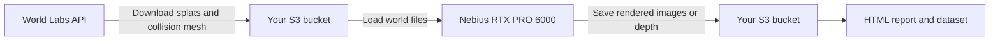

# From World Labs Marble to a Nebius GPU

Marble creates the world on World Labs' servers. Workbench downloads the world
as files, stores them in your S3 bucket, and starts a separate job on your
Nebius GPU. That job reads the files and renders new images or computes depth.
The Marble model itself stays at World Labs.



**The bridge is the downloaded files.** There is no direct connection between
the World Labs GPU and the Nebius GPU, and rendering each additional frame
does not call the World Labs API.

## What each step does

| YAML stage | Runs where | Reads and writes |
| --- | --- | --- |
| `acquire` | CPU worker calling the World Labs API | Sends the prompt with `WLT_API_KEY`, waits for generation, downloads `world.spz` and `collider.glb`, and saves them with a hashed `world.json` manifest in S3 |
| `capture` | One Nebius RTX PRO 6000 GPU | Downloads and verifies that bundle, renders the splats with gsplat CUDA, and uploads RGB frames, camera poses, and measured GPU timings |
| `report` | CPU worker | Verifies the output hashes and publishes the interactive HTML report and its assets |

`world.spz` is the visual scene represented by Gaussian splats.
`collider.glb` is a triangle mesh used by the spatial-scan variant. The
[World API documentation](https://docs.worldlabs.ai/api) describes both exports.

This is the same native workflow mechanism as PAIDF: one
`npa.workflow/v0.0.1` YAML, real tool stages, S3 handoffs, and SkyPilot jobs.
The YAML requests `RTXPRO6000:1`; the submission's project and Kubernetes
context select **your Nebius cluster**. `cloud: kubernetes` alone does not
identify a cloud provider.

## 1. Prepare the two accounts and storage

- Configure NPA, a Nebius GPU Kubernetes cluster, and project S3 access using
  the [getting-started guide](../getting-started.md). Run the commands below
  from the repository root with the repository virtualenv activated.
- Obtain a funded World API key from the
  [World Labs platform](https://platform.worldlabs.ai/api-keys). API credits
  are separate from the Marble web subscription.
- Set the project, context, and bucket to your actual configured values:

```bash
source npa/.venv/bin/activate
export NPA_MARBLE_PROJECT=your-project-alias
export NPA_MARBLE_CONTEXT=your-kube-context
export NPA_MARBLE_BUCKET=your-bucket
export NPA_MARBLE_RUN_ID="marble-capture-$(date -u +%Y%m%dt%H%M%sz)"

# CI can inject WLT_API_KEY directly. Otherwise read an operator-owned file.
export NPA_MARBLE_KEY_FILE=/run/secrets/worldlabs-api-key
export WLT_API_KEY="$(cat "$NPA_MARBLE_KEY_FILE")"

npa workbench health preflight \
  --project "$NPA_MARBLE_PROJECT" --checks nebius,s3 --json
```

Keep `WLT_API_KEY` out of the YAML and HTML. Native submit resolves it from
the environment or `tokens.WLT_API_KEY` in NPA's private credentials file and
forwards it to the workers. S3 uses the configured project credentials or
`AWS_ACCESS_KEY_ID` / `AWS_SECRET_ACCESS_KEY`. The health command above checks
Nebius and S3; it does not validate World Labs billing or token validity.

## 2. Submit the complete workflow headlessly

```bash
npa workbench workflow validate-spec \
  workflows/testing/marble-world-capture.yaml --json

npa workbench workflow submit \
  workflows/testing/marble-world-capture.yaml \
  --project "$NPA_MARBLE_PROJECT" \
  --infra "k8s/$NPA_MARBLE_CONTEXT" \
  --run-id "$NPA_MARBLE_RUN_ID" \
  --stage-src --runtime \
  --var "bucket=$NPA_MARBLE_BUCKET" \
  --var 'world_prompt=An empty manufacturing receiving bay with wide aisles and overhead lights.' \
  --secret-env WLT_API_KEY \
  --secret-env AWS_ACCESS_KEY_ID --secret-env AWS_SECRET_ACCESS_KEY \
  --max-wait-seconds 0 --image-bootstrap-timeout-seconds 0 \
  --output-format json
```

This single command runs all three stages. No browser, desktop session, or
manual export is needed. `--stage-src` supplies this checkout's tool code;
`--runtime` schedules the stages through Workbench. The zero wait values retain
the runtime's unbounded wait behavior.

Missing `WLT_API_KEY` stops submission before remote work. Rejected credentials
or insufficient World API credits stop acquisition before the GPU stage.
Generation records its operation in S3 so an accepted request can be polled
again without posting another generation request. If acceptance is uncertain,
reconcile the operation in World Labs before retrying that prefix.

To reproduce the existing-world demo, use a new run ID and add
`--var world_source=sample-hobbit`, omitting `--secret-env WLT_API_KEY`.
That explicitly downloads the pinned, MIT-licensed sample instead of calling
generation. It still runs real Nebius GPU work. Do not use that override for
the manufacturing benchmark, which requires a newly generated world.

## 3. Inspect and download the result

The capture workflow writes these run-scoped prefixes:

```text
s3://YOUR_BUCKET/runs/YOUR_RUN_ID/marble-capture/world/
s3://YOUR_BUCKET/runs/YOUR_RUN_ID/marble-capture/results/
s3://YOUR_BUCKET/runs/YOUR_RUN_ID/marble-capture/report/
```

`results/result.json` records the GPU model, CUDA version, engine, frame count,
per-frame CUDA timings, camera matrices, and SHA-256 hashes. These timings
measure the GPU consumer, not total workflow duration. The report is a replay
and inspection of completed outputs; opening HTML does not start a GPU job.

With AWS CLI configured for the same S3 credentials and endpoint, download the
**whole report directory**, then serve it locally:

```bash
export NPA_MARBLE_REPORT_URI="s3://$NPA_MARBLE_BUCKET/runs/$NPA_MARBLE_RUN_ID/marble-capture/report/"
# AWS_ENDPOINT_URL must be your configured project S3 endpoint.
aws --endpoint-url "$AWS_ENDPOINT_URL" s3 sync \
  "$NPA_MARBLE_REPORT_URI" "output/$NPA_MARBLE_RUN_ID/report/"
npa/.venv/bin/python -m http.server 8768 --bind 127.0.0.1 \
  --directory "output/$NPA_MARBLE_RUN_ID/report/"
```

Open `http://127.0.0.1:8768/`. Downloading only `index.html` leaves its frames
and world files missing. The 3D explorer also loads pinned Spark and Three.js
modules from their public CDNs. Use another local port if 8768 is occupied.

## Other workflows and the current validation boundary

| Workflow | Nebius GPU work | Status |
| --- | --- | --- |
| [Camera capture](../../../workflows/testing/marble-world-capture.yaml) | gsplat rendering of 120 RGB views | GPU consumer validated on the imported sample |
| [Spatial scan](../../../workflows/testing/marble-spatial-scan.yaml) | Warp raycasting for depth and a hit cloud | GPU consumer validated on the imported sample |
| [Warehouse rover](marble-warehouse-rover.md) | gsplat RGB and Warp depth synchronized with CPU rigid-body motion | Real API generation and one-GPU collection validated: 240 observations over 7.98 simulated meters |
| [Manufacturing pallet detection](../../../workflows/testing/marble-manufacturing-pallet-detection.yaml) | Render backgrounds, then train/evaluate two Faster R-CNN detectors | Implemented experiment; funded API key and real labeled data needed for live validation |

The spatial-scan YAML uses `marble-scan` in its output prefix. It follows the
same submit procedure, with a new run ID. Manufacturing has an additional
dataset-validation stage and GPU training stage; follow its
[dataset and submission guide](../marble-manufacturing.md).

The completed demo runs used one NVIDIA RTX PRO 6000 Blackwell Server Edition.
They proved the imported-world download, S3 handoffs, GPU processing, and HTML
publication. They did not exercise paid generation or establish manufacturing
accuracy gains. Read the [recorded evidence](../marble.md#live-validation--2026-10-03).
RL additionally needs a simulator, robot, task, and action-dependent sensors;
the [RL requirements](../marble.md#which-workloads-benefit) are not implemented
by these camera-sweep workflows.
