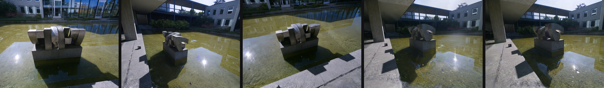

# Turn a real photo capture into a 3D scene you can fly through

Point a camera at a thing. Get back a 3D scene you can re-render from angles the
camera never visited.

That is **NuRec** — NVIDIA's Neural Reconstruction Engine (NRE). This guide runs
it on Nebius + SkyPilot as one declarative workflow: real capture in, renderable
USDZ and novel views out, and a Rerun recording the NPA agent displays for you.

Here is the actual output of the run this guide describes — five views rendered
from the trained Gaussians at an offset rig pose, i.e. viewpoints that were never
photographed:



## Ingredients

| | |
| --- | --- |
| **Input** | `nvidia/PhysicalAI-NuRec-PPISP` — ungated, CC-BY-4.0, real photos of a sculpture, already in NCore V4 |
| **Engine** | `nvcr.io/nvidia/nre/nre-ga:26.04` from NGC (pulled, never rebuilt) |
| **GPU** | One RTX PRO 6000 Blackwell (or L40S). **Must have RT cores** |
| **Time** | ~45 minutes end to end |
| **Credentials** | `NGC_API_KEY`, `HF_TOKEN`, and S3 keys |

> **Why RT cores?** Gaussian rasterization and ray tracing are RT-core work.
> H100 and H200 are faster chips with **no RT cores** and are the wrong choice
> here. See `skills/atomic/gpu-selection/SKILL.md`.

## The spec

**`npa/workflows/workbench/npa-workflows/nurec-reconstruct.yaml`**

Six stages, each a real `npa workbench nurec` command — no manifest stubs:

```
check ──▶ fetch ──▶ reconstruct ──▶ render ──▶ visualize ──▶ finalize
 GPU      GPU          GPU           GPU         CPU          CPU
```

| Stage | What it does |
| --- | --- |
| `check` | Entitlement, real HF download authorization, RT-core detection — before spending a 14 GB pull or a GPU-minute |
| `fetch` | Downloads the NCore V4 shards and derives the `rig -> world` pose edge NRE demands |
| `reconstruct` | Trains 3DGUT Gaussians, exports the USDZ and real PSNR/SSIM/LPIPS |
| `render` | Renders **novel** views at an offset rig pose |
| `visualize` | Builds `reports/sim2real.rrd` for the agent's Rerun panel |
| `finalize` | Aggregates the run tree into `reports/final.json` |

## Fast path

Free, no GPU, no credentials — see the shape of the pipeline before committing to
it:

```bash
npa workbench workflow plan-spec \
  npa/workflows/workbench/npa-workflows/nurec-reconstruct.yaml
```

Then the cheap real preflight (seconds, no image pull):

```bash
export NGC_API_KEY=...  HF_TOKEN=...
npa workbench nurec check --json
```

This probes actual **download authorization**, not just visibility — a gated
Hugging Face repo still answers `200` on its metadata endpoint, so "I can see it"
is not "I can fetch it".

> **Never** test a token with `echo "${HF_TOKEN:+yes}${HF_TOKEN:-no}"`. That
> prints the token: `${VAR:-no}` only falls back when the variable is *empty*.
> Use `hf auth whoami` or `echo ${#HF_TOKEN}`.

## Go bigger: the real GPU run

The NRE container has no `npa` inside it, so stage the source the pods install:

```bash
export NPA_SRC_S3_URI=s3://<your-bucket>/npa-src/<tag>
```

Submit:

```bash
RUN_ID="nurec-$(date -u +%Y%m%dt%H%M%S)z"

npa workbench workflow submit \
  npa/workflows/workbench/npa-workflows/nurec-reconstruct.yaml \
  --run-id "$RUN_ID" \
  --infra k8s/<your-rt-core-context> \
  --var bucket=<your-bucket> \
  --var prefix="checkpoints/neural-reconstruction/$RUN_ID" \
  --secret-env AWS_ACCESS_KEY_ID --secret-env AWS_SECRET_ACCESS_KEY \
  --secret-env HF_TOKEN --secret-env NGC_API_KEY
```

Watch it:

```bash
sky jobs queue
```

A healthy run looks like this — `reconstruct` is the long pole:

```
check 4m26s → fetch 3m31s → reconstruct 25m33s → render → visualize → finalize
```

## Look at it

Open the NPA agent, pick the run, and it loads `reports/sim2real.rrd`
automatically. Entities you get:

| Entity | What it shows |
| --- | --- |
| `novel_view/<camera>` | Views rendered from the Gaussians at an offset rig pose — **not** training views |
| `reconstruction/<camera>` | NRE's own validation renders |
| `input/<sensor>` | The real capture frames that were reconstructed |
| `gaussians/summary` | PSNR / SSIM / LPIPS |
| `pipeline/*` | Per-stage reports, including how the rig pose edge was derived |

The `.usdz` is offered as a **download**, not an inline preview — it is ~240 MB
and belongs in Omniverse, Isaac Sim, or CARLA.

From the shell instead — a stage-by-stage accounting of what the run prefix
actually holds:

```bash
npa workbench nurec status \
  --run-uri "s3://<your-bucket>/checkpoints/neural-reconstruction/$RUN_ID/" \
  --output json
```

Expect `PSNR ≈ 31`, `SSIM ≈ 0.83`, `LPIPS ≈ 0.27` on the default scene.

## When it breaks

The first failure is nearly always one specific thing:

> **`rig -> world` is missing.** Object-centric captures store per-camera
> `<camera> -> world` poses and no rig node, so NRE refuses to load them. NVIDIA's
> own COLMAP converter does not write that edge either. **This workflow derives it
> for you** — for a single-camera capture the rig *is* the camera, so the derived
> edge is exact.

For everything else — 402s from NGC, placeholder sensor ids in the stock recipes,
the missing `sudo`, the 64 MB `/dev/shm` — see the troubleshooting table in
`skills/workflows/neural-reconstruction/SKILL.md`. Most are already handled
automatically; the table tells you which.

## Dig deeper

- **Skill:** `skills/workflows/neural-reconstruction/SKILL.md` — recipe selection,
  the pose-edge derivation, container quirks, capability routing, limitations.
- **Single-pod variant:** `npa/src/npa/workflows/skypilot/nurec-reconstruct.yaml`
  runs all six stages in one pod sharing `/tmp`, so it needs no S3 handoff. The
  declarative spec above gives every stage its own pod, which is why the NCore
  sequence and USDZ travel through S3.
- **Tool / CLI / SDK:** `npa/src/npa/workbench/nurec/`, `npa/src/npa/cli/nurec/`,
  `npa.sdk.workbench.nurec`.
- **Upstream:** NVIDIA's own NuRec skills live at
  <https://github.com/NVIDIA/nurec-skills>. Things this workbench deliberately
  does *not* implement — simulator streaming over `serve-grpc`, LiDAR sweeps,
  object harvesting, frame cleanup — are listed as upstream-owned in the skill's
  routing table.
