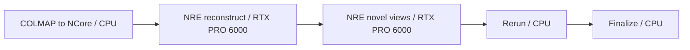

# Reconstruct a COLMAP source capture with NCore and NRE

The new COLMAP ingestion path is **not yet live validated**. It extends the
existing NuRec capability with NVIDIA's Apache-2.0 NCore converter. The full
workflow runs conversion on CPU, then uses the existing, separately licensed
NRE engine on one RTX PRO 6000 to reconstruct and render the scene.

The earlier [NuRec workflow](neural-reconstruction.md) fetches data that NVIDIA
has already converted to NCore. Its results do not validate this new source
ingestion path, and the images in that guide are not results from this workflow.

## Source and licensing boundaries

| Component | Exact source | Terms and role |
| --- | --- | --- |
| NCore converter and V4 reader | [NVIDIA/ncore at 59c698d206da92b406a4f72619fce3b3a2c64bfd](https://github.com/NVIDIA/ncore/tree/59c698d206da92b406a4f72619fce3b3a2c64bfd/tools/data_converter/colmap) | Apache-2.0 source-capture conversion |
| COLMAP model reader | [trueprice/pycolmap at fe7a7c45df803b6c391777e349f0d8d65d39d777](https://github.com/trueprice/pycolmap/tree/fe7a7c45df803b6c391777e349f0d8d65d39d777) | MIT; the reader and Python 3 patch pinned by NCore, distinct from the PyPI COLMAP bindings |
| Reference capture | [NVIDIA PhysicalAI-NuRec-PPISP at 2521064a3af6ab1c1caa2ba1b01ddde7eecded69](https://huggingface.co/datasets/nvidia/PhysicalAI-NuRec-PPISP/tree/2521064a3af6ab1c1caa2ba1b01ddde7eecded69) | CC-BY-4.0 dataset, fetched only at runtime |
| Reconstruction and rendering | `nvcr.io/nvidia/nre/nre-ga:26.04` | Proprietary NVIDIA NRE runtime with separate NGC access and terms |
| Independent NuRec reader | `nvidia-ncore` 19.5.1, wheel SHA256 `a753f81470ba1b35567cbca26794a7f9ceefe04ec306b962a52dd18dc988fe29` | Official Apache-2.0 wheel fetched by immutable URL/hash at runtime in the existing NRE path; not baked into the converter image |

The OSS addition is COLMAP conversion. It does not make NRE open source or add
a new partner-roadmap tier. The `npa-ncore` development image is a validation
candidate, with no accepted public release. Keep datasets, weights, and NRE out
of its layers. Preserve upstream copyright/license notices and dataset
attribution with runtime evidence; see [the attribution notice](../../../skills/NOTICE-NVIDIA-NCORE-COLMAP).

## Full reference input

The upstream object is `colmap/struktur28_colmap.zip`. Its SHA256 is
`cf7ab7f100da66b2bf05b178ebcfa3a950e1bf2b1d7ff64a6c7a1e1f682afa8d`.
It contains two independent captures:

| Directory | Registered images | Cameras | Sparse source points |
| --- | ---: | ---: | ---: |
| `struktur28/` | 518 | 3 | 163,453 |
| `struktur28_auto/` | 59 | 2 | 17,130 |

The workflow explicitly selects **all of `struktur28/`**, with `images/` and
`sparse/0/` beneath it. It imposes no source-data cap. The converter's default
directory discovery rejects an archive with multiple captures; keep
`dataset_root: struktur28` for this ZIP. Images, calibration, camera poses and
sparse points all come from the real COLMAP reconstruction.

Upstream assigns per-camera image-order timestamps at **1 FPS**. These are
virtual photographic timestamps, not measured timing or evidence of camera
synchronization. V4 stores the sparse SfM cloud as a point-cloud component in
the world frame; it is not physical LiDAR. The upstream converter excludes
float32 points at distance `<= 1e-6` from the origin, and provenance records
that count. Available downsampled image directories become additional cameras;
the reference ZIP has none.

## Workflow and S3 handoffs

[`workflows/testing/nurec-colmap-reconstruct.yaml`](../../../workflows/testing/nurec-colmap-reconstruct.yaml)
owns the complete stage graph:



Each state runs in a separate pod. `workbench.nurec.convert_colmap` publishes
`sequence.json`, every referenced `.zarr.itar` shard, `npa-rig.json` and
`conversion.json` directly under `config.ncore_sequence_uri`. That exact prefix,
including its trailing slash, is passed to the existing reconstruction command
as `--ncore-uri`. No extra source-directory or `sequence/` suffix is appended
by conversion.

Use a fresh output prefix for each conversion. A provider-conditional permanent
claim prevents overlapping writers or replacement of an earlier generation.
Interrupted publication also requires a new prefix; claims do not expire or get
taken over. NuRec verifies the complete file inventory, hashes and claim before
opening a converted sequence, including when reusing a local download cache.

Conversion independently reopens every output image, calibration, camera pose
and sparse point, compares them with the source, checks finite geometry, and
records hashes before publishing the discovery meta-file. `rig_mode: derive`
uses the existing rig adapter and `poses_component_group: npa_rig` feeds NRE.
The reference camera defaults to the longest trajectory; this supplies NRE's
required rig edge without claiming that independently photographed cameras
formed a measured synchronized rig.

Reconstruction keeps the full native
`configs/experimental/3dgut/3dgut_colmap.yaml` recipe: `max_epochs: "0"` preserves
the upstream default, with `world_size: "1"`. Rendering uses a nonzero rig
offset. Both GPU stages explicitly request
`RTXPRO-6000-BLACKWELL-SERVER-EDITION:1`; B200, H100 and H200 cannot run this
RT-core path.

## Run with an operator-selected development image

Stage the original archive at a configurable S3 object, retaining its dataset
source, revision, CC-BY-4.0 attribution and any transformation description
beside the run. Alternatively, the live matrix below performs pinned source
staging and writes `source/attribution.json` automatically.

With the converter runtime installed in its image, the standalone command is:

```bash
npa workbench nurec convert-colmap \
  --input-path 's3://<bucket>/<source-prefix>/struktur28_colmap.zip' \
  --output-path 's3://<bucket>/<run-prefix>/ncore/sequence/' \
  --dataset-root struktur28 --colmap-dir sparse/0 --images-dir images \
  --rig-mode derive --output-format json
```

`--input-path` also accepts an S3 dataset prefix. `--cache-dir` and
`--scratch-dir` select disposable local staging space. `--masks-dir` selects a
relative masks directory; an empty value keeps upstream mask discovery.
`--reference-camera` pins the trajectory used for rig derivation. Use
`--rig-mode preserve` only for conversion-only consumers that do not require
the NRE rig edge; the shipped reconstruction workflow requires `derive`.

Configure S3 and NGC access using the standard NPA credential path, run
`npa workbench nurec check --json`, and stage the matching NPA source with the
standard `NPA_SRC_S3_URI` mechanism for the vendor NRE pods. Then preview:

```bash
npa workbench workflow validate-spec workflows/testing/nurec-colmap-reconstruct.yaml
npa workbench workflow plan-spec workflows/testing/nurec-colmap-reconstruct.yaml --run-id preview
```

Submit after replacing the placeholders with your input and the exact image
digest produced by development-image validation:

```bash
npa workbench workflow submit workflows/testing/nurec-colmap-reconstruct.yaml \
  --run-id '<run-id>' --infra 'k8s/<rt-core-context>' \
  --var 'bucket=<bucket>' --var 'prefix=<run-prefix>' \
  --var 'colmap_input_uri=s3://<bucket>/<source-prefix>/struktur28_colmap.zip' \
  --image-override 'workbench.nurec.convert_colmap=<registry>/npa-ncore@sha256:<digest>' \
  --secret-env AWS_ACCESS_KEY_ID --secret-env AWS_SECRET_ACCESS_KEY \
  --secret-env NGC_API_KEY
```

The digest above is an explicit placeholder, not a published or accepted image.
Keep the NCore image override scoped to conversion; the NRE resource profiles
and Rerun image serve different stages.

## Live-matrix coverage and acceptance

The workflow is registered as a real `gpu` case in `SUBMIT_LIVE_MATRIX` and
participates in the normal rotation. It has no plan-only exemption. The seeder
downloads the immutable public ZIP, verifies its complete hash and uploads it
unchanged. An existing copy can be selected with
`NPA_E2E_NUREC_COLMAP_ARCHIVE`; it must pass the same hash check.

```bash
export NPA_E2E_IMAGE_OVERRIDE_NCORE='<registry>/npa-ncore@sha256:<digest>'
NPA_E2E_NPA_WORKFLOW_SUBMIT_TIERS=gpu \
NPA_E2E_NPA_WORKFLOW_SUBMIT_SPECS=nurec-colmap-reconstruct.yaml \
  ./scripts/npa-workflow-submit-live-e2e.sh
```

Use the standard live-matrix project, registry, storage, NGC and source-staging
configuration. The public source does not require `HF_TOKEN`. Clear generic
accelerator remaps/forced GPU settings: the matrix rejects them for this case
to preserve CPU conversion and the explicit RTX resource request.

After terminal success the matrix checks all conversion-member hashes and
sizes against S3, the full source counts, attribution, and downstream final
accounting, metrics and RRD presence. These checks complement the converter's
full V4 decode; they do not establish rendering quality. Before marking the
feature live validated, retain exact-image scan evidence, independently reopen
the sequence, parsed NRE metrics, USDZ and RRD, decode the novel-view images,
and visually inspect the results. Record numeric outcomes without publishing
live infrastructure identifiers. Those GPU and image acceptance results remain
pending.
