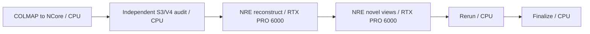

# Reconstruct a COLMAP source capture with NCore and NRE

[Guides](README.md)

The new COLMAP ingestion path is **not yet live validated**. It extends the
existing NuRec capability with NVIDIA's Apache-2.0 NCore converter. The full
workflow runs conversion on CPU, then uses the existing, separately licensed
NRE engine on one RTX PRO 6000 to reconstruct and render the scene.

The earlier [NuRec workflow](neural-reconstruction.md) fetches data that NVIDIA
has already converted to NCore. Its results do not validate this new source
ingestion path, and the images in that guide are not results from this workflow.

## Source and licensing boundaries

| Component | Exact source | Terms and role |
| --- | --- | --- |
| NCore converter and V4 reader | [NVIDIA/ncore at 59c698d206da92b406a4f72619fce3b3a2c64bfd](https://github.com/NVIDIA/ncore/tree/59c698d206da92b406a4f72619fce3b3a2c64bfd/tools/data_converter/colmap) | Apache-2.0 source-capture conversion |
| COLMAP model reader | [trueprice/pycolmap at fe7a7c45df803b6c391777e349f0d8d65d39d777](https://github.com/trueprice/pycolmap/tree/fe7a7c45df803b6c391777e349f0d8d65d39d777) | MIT; the reader and Python 3 patch pinned by NCore, distinct from the PyPI COLMAP bindings |
| Reference capture | [NVIDIA PhysicalAI-NuRec-PPISP at 2521064a3af6ab1c1caa2ba1b01ddde7eecded69](https://huggingface.co/datasets/nvidia/PhysicalAI-NuRec-PPISP/tree/2521064a3af6ab1c1caa2ba1b01ddde7eecded69) | CC-BY-4.0 dataset, fetched only at runtime |
| Reconstruction and rendering | `nvcr.io/nvidia/nre/nre-ga:26.04` | Proprietary NVIDIA NRE runtime with separate NGC access and terms |
| Independent NuRec reader | `nvidia-ncore` 19.5.1, wheel SHA256 `a753f81470ba1b35567cbca26794a7f9ceefe04ec306b962a52dd18dc988fe29` | Official Apache-2.0 wheel fetched by immutable URL/hash at runtime in the existing NRE path; not baked into the converter image |

The OSS addition is COLMAP conversion. It does not make NRE open source or add
a new partner-roadmap tier. The `npa-ncore` development image is a validation
candidate, with no accepted public release. Keep datasets, weights, and NRE out
of its layers. Preserve upstream copyright/license notices and dataset
attribution with runtime evidence; see [the attribution notice](../../../skills/NOTICE-NVIDIA-NCORE-COLMAP).

The workflow pins the NRE 26.04 runtime and its initialization container to
`sha256:97f43e7130c5636ce3e80ea3184d97f56a87fdd989b05cce42230881dbdea284`;
the version label above is descriptive, not a mutable runtime selector.

## Full reference input

The upstream object is `colmap/struktur28_colmap.zip`. Its SHA256 is
`cf7ab7f100da66b2bf05b178ebcfa3a950e1bf2b1d7ff64a6c7a1e1f682afa8d`.
It contains two independent captures:

| Directory | Registered images | Cameras | Sparse source points |
| --- | ---: | ---: | ---: |
| `struktur28/` | 518 | 3 | 163,453 |
| `struktur28_auto/` | 59 | 2 | 17,130 |

The workflow explicitly selects **all of `struktur28/`**, with `images/` and
`sparse/0/` beneath it. It imposes no source-data cap. The converter's default
directory discovery rejects an archive with multiple captures; keep
`dataset_root: struktur28` for this ZIP. Images, calibration, camera poses and
sparse points all come from the real COLMAP reconstruction.

Upstream assigns per-camera image-order timestamps at **1 FPS**. These are
virtual photographic timestamps, not measured timing or evidence of camera
synchronization. V4 stores the sparse SfM cloud as a point-cloud component in
the world frame; it is not physical LiDAR. The upstream converter excludes
float32 points at distance `<= 1e-6` from the origin, and provenance records
that count. Available downsampled image directories become additional cameras;
the reference ZIP has none.

## Workflow and S3 handoffs

[`workflows/testing/nurec-colmap-reconstruct.yaml`](../../../workflows/testing/nurec-colmap-reconstruct.yaml)
owns the complete stage graph:



Each state runs in a separate pod. `workbench.nurec.convert_colmap` publishes
`sequence.json`, every referenced `.zarr.itar` shard, `npa-rig.json` and
`conversion.json` directly under `config.ncore_sequence_uri`.
`workbench.nurec.audit_colmap` then independently lists that prefix, downloads
the original ZIP and every published object, rejects changed/extra objects,
recomputes hashes, and reopens every V4 image, calibration, pose and sparse
point. It writes a separate non-overwriting audit JSON. Only after that gate
does the exact sequence prefix, including its trailing slash, pass to
reconstruction as `--ncore-uri`. No extra source-directory or `sequence/`
suffix is appended.

Use a fresh output prefix for each conversion. A provider-conditional permanent
claim prevents overlapping writers or replacement of an earlier generation.
Interrupted publication also requires a new prefix; claims do not expire or get
taken over. NuRec verifies the complete file inventory, hashes and claim before
opening a converted sequence, including when reusing a local download cache.

Conversion independently reopens every output image, calibration, camera pose
and sparse point, compares them with the source, checks finite geometry, and
records hashes before publishing the discovery meta-file. `rig_mode: derive`
uses the existing rig adapter and `poses_component_group: npa_rig` feeds NRE.
The reference camera defaults to the longest trajectory; this supplies NRE's
required rig edge without claiming that independently photographed cameras
formed a measured synchronized rig.

Reconstruction selects all discovered cameras. With the default native
`configs/experimental/3dgut/3dgut_colmap.yaml` recipe and a derived rig, selecting
multiple cameras switches its background initializer to the supported native
`accumulated_point_cloud` config group. The recipe's `sfm_point_cloud` initializer
asserts that the complete data source has exactly one camera; setting a separate
initializer camera list does not satisfy that assertion.

Before launching NRE, the public NCore V4 reader exports every sparse point's
world XYZ and original uint8 RGB to `initialization/ncore-sfm.ply` under the
reconstruction output directory. It requires nonempty finite world geometry and
one valid RGB triplet per point, matches the conversion point inventory, and
verifies the unchanged conversion inventory before and after export. It never
writes into the converted sequence. NRE applies its own world-to-NRE transform.
There is no point subsampling, image resizing, calibration change, or synthesized
LiDAR. The initializer's point count equals the complete exported count, and its
optional random near/far point counts are deliberately zero to retain the
existing SfM initialization's source-point-only behavior. This is an
initialization choice, not a training budget change.

The remaining native recipe and training budget are retained: `max_epochs: "0"`
preserves the native 30,000 samples per epoch and one epoch, with
`world_size: "1"`. Single-camera selections retain native SfM initialization.
Repeatable `--camera-id` and `--override dataset.camera_ids=[...]` selections
remain explicit subsets; multi-camera subsets use all source points. A custom
recipe or explicit background initialization override leaves initializer
selection with the caller, who must choose a compatible native configuration.
Explicit training overrides also remain intact.

`reconstruct --dry-run --ncore-json <staged-sequence.json>` reports the actual
planned native arguments without writing a PLY or launching NRE. Converted
captures obtain the point count from their verified inventory; older NCore
captures without a conversion report require the public NCore reader even for
planning. Real export requires that reader in the executing Python environment.
The reconstruction JSON and published `initialization/ncore-sfm.json` retain the
recipe, configured image, selected cameras, source metadata/conversion hashes,
decoded component counts, and exported PLY hash. An image digest in the runtime
configuration binds this evidence to that image; a version tag alone does not.
The stage also publishes `reconstruction/reconstruction.json`, which hashes the
exact NCore member inventory, parsed config, native metrics and USDZ and records
the `nvidia-smi` GPU observation and requested exact NRE digest. The acceptance
tuple separately requires a control-plane runtime image-ID attestation; a digest
parsed from the request is not mislabeled as observed execution identity. Rendering publishes
`novel_views/nre-render.json`, which binds the same USDZ, the nonzero offset and
every independently decoded frame hash. These are workload receipts, not a
substitute for reopening the USDZ, render tree and RRD after S3 read-back.

The native parsed configuration records effective recipe settings. The USDZ's
`data_info.json` copies the input sequence metadata; it proves available data,
not train/validation split membership or which frames were sampled during
training. The separately exported ground truth also represents input frames.
Neither an available-frame count nor the 30,000-sample recipe establishes that
each of the 518 images contributed a training sample. Retain split and sampler
evidence from the real native run before making that stronger claim.

Rendering uses a nonzero rig
offset. Both GPU stages explicitly request
`RTXPRO-6000-BLACKWELL-SERVER-EDITION:1`; B200, H100 and H200 cannot run this
RT-core path.

The visualization stage binds COLMAP provenance to the review artifact. If its
pre-download S3 inventory or local run contains any COLMAP lineage marker, it
requires all of `source/attribution.json`, `ncore/sequence/conversion.json`, and
`ncore/sequence/npa-rig.json`. A missing, unreadable, or failed download aborts
RRD creation; novel-view media alone is not sufficient provenance. Subtrees
that are unrelated to COLMAP lineage remain optional for other visualization
workflows.
Source attribution and the conversion report identify a COLMAP run; a rig
sidecar alone also occurs in preconverted NCore and does not trigger this rule.

## Run with an operator-selected development image

Stage the original archive at a configurable S3 object, retaining its dataset
source, revision, CC-BY-4.0 attribution and any transformation description
beside the run. Alternatively, the live matrix below performs pinned source
staging and writes `source/attribution.json` automatically.

Before staging an image or source, prove that the fresh run prefix supports the
operations the workflow needs. The probe conditionally creates one random
object, reads and hashes it, verifies a second create cannot overwrite it,
enumerates the exact object, deletes it, and proves absence. Its private receipt
contains only hashes, counts, and dispositions:

```bash
npa workbench nurec acquire-source \
  --output-path '<private-analysis>/qualification/struktur28_colmap.zip' \
  --receipt-path '<private-analysis>/qualification/source-acquisition.json' \
  --output-format json

npa workbench nurec probe-storage \
  --prefix 's3://<bucket>/<fresh-run-prefix>/' \
  --receipt-path '<private-analysis>/qualification/s3-handoff-probe.json' \
  --output-format json

npa workbench nurec stage-source \
  --source-path '<private-analysis>/qualification/struktur28_colmap.zip' \
  --output-path 's3://<bucket>/<run>/source/struktur28_colmap.zip' \
  --expected-archive-sha256 cf7ab7f100da66b2bf05b178ebcfa3a950e1bf2b1d7ff64a6c7a1e1f682afa8d \
  --receipt-path '<private-analysis>/qualification/source-staging.json' \
  --scratch-dir '<private-analysis>/qualification/staging-readback' \
  --output-format json
```

`acquire-source` is anonymous, refuses replacement, verifies the immutable
archive hash, and writes an owner-only receipt. Pre-publication qualification
does not push the candidate converter merely to make it reachable from
Kubernetes. After the committed OCI build and check phases have loaded and
verified the local export, use the committed runner. It recomputes the
OCI-to-local-image relation, creates three separately inspected containers with
`--pull=never`, runs the wrong-source control before conversion, then runs the
positive conversion and independent conversion audit:

```bash
npa/.venv/bin/python npa/scripts/run_ncore_qualification.py \
  --source-sha '<reviewed-40-character-commit>' \
  --analysis-root '<private-analysis>' \
  --gate-dir '<private-analysis>/gates' \
  --evidence-dir '<private-analysis>/qualification' \
  --cache-dir '<private-analysis>/qualification/cache' \
  --s3-env-file '<owner-only-S3-env-file>' \
  --run-id '<run-id>' \
  --input-path 's3://<bucket>/<run>/source/struktur28_colmap.zip' \
  --control-output-path 's3://<bucket>/<run>/controls/wrong-source/' \
  --conversion-path 's3://<bucket>/<run>/ncore/sequence/' \
  --audit-output-path 's3://<bucket>/<run>/evidence/ncore-conversion-audit.json' \
  --expected-archive-sha256 cf7ab7f100da66b2bf05b178ebcfa3a950e1bf2b1d7ff64a6c7a1e1f682afa8d
```

After the independent conversion audit, submit
`workflows/testing/nurec-reconstruct-render.yaml`. This downstream-only spec
pulls the separately licensed, digest-pinned NRE image and never needs the
candidate image in a registry. While each GPU-stage pod remains observable,
run the committed observer concurrently with submit. It reads only live,
non-cached workflow status, captures each stage while `RUNNING`, binds the exact
managed-job name and ID to the pod, and retains terminal status:

```bash
npa/.venv/bin/python npa/scripts/observe_ncore_workflow.py \
  --source-sha '<reviewed-40-character-commit>' \
  --run-id '<run-id>' --workflow-s3-uri 's3://<bucket>/<workflow-state-prefix>' \
  --project '<project-alias>' --sky-bin '<pinned-sky-executable>' \
  --context '<exact-context>' --namespace '<namespace>' \
  --expected-image 'nvcr.io/nvidia/nre/nre-ga@sha256:97f43e7130c5636ce3e80ea3184d97f56a87fdd989b05cce42230881dbdea284' \
  --evidence-dir '<private-analysis>/qualification' --poll-seconds 5
```

The observer discovers only pods whose SkyPilot job annotations match the exact
stage job name and ID in the fresh workflow-status JSON. The bundle binds one
parent workflow run and rejects reused job, pod, or task identities.

Visual review uses the committed one-shot harness only after objective workload
checks pass. `freeze` deterministically selects two source-camera positives,
builds one fixed 32-pixel block-rotation control and one local seam/floater
control from real rendered frames, and selects four novel-view frames by index
from one explicitly selected camera trajectory. An independent reviewer must
open all controls and final frames, review the prompts, and emit the exact
owner-only freeze-review receipt before `accept-freeze`. Every hosted call then
conditionally creates and reads back a separate marker under an external S3
attempt prefix. Run `final` once only when calibration has TP=2, TN=2, FP=0,
and FN=0:

```bash
npa/.venv/bin/python npa/scripts/ncore_publication/vlm_evidence.py freeze \
  --source-zip '<private>/struktur28_colmap.zip' \
  --source-sha256 cf7ab7f100da66b2bf05b178ebcfa3a950e1bf2b1d7ff64a6c7a1e1f682afa8d \
  --render-dir '<read-back>/novel_views' \
  --render-camera '<one-camera-directory>' \
  --rubric npa/scripts/ncore_publication/vlm-rubric-v2.txt \
  --calibration-task npa/scripts/ncore_publication/vlm-calibration-task-v2.txt \
  --final-task npa/scripts/ncore_publication/vlm-final-task-v2.txt \
  --output-root '<private-analysis>/qualification/vlm'

# The independent reviewer creates freeze-review.json with the committed
# npa_ncore_vlm_freeze_review_v1 schema. Retain the exact external prefix in
# owner-only external-attempt-prefix.txt for acceptance re-verification.
npa/.venv/bin/python npa/scripts/ncore_publication/vlm_evidence.py accept-freeze \
  --evidence-root '<private-analysis>/qualification/vlm' \
  --freeze-sha256 '<freeze-sha256>' \
  --review-path '<private-analysis>/qualification/vlm/freeze-review.json' \
  --external-attempt-prefix 's3://<bucket>/<run>/vlm-attempts/'

npa/.venv/bin/python npa/scripts/ncore_publication/vlm_evidence.py calibrate \
  --evidence-root '<private-analysis>/qualification/vlm' \
  --freeze-sha256 '<freeze-sha256>' \
  --freeze-acceptance-sha256 '<freeze-acceptance-sha256>' \
  --external-attempt-prefix 's3://<bucket>/<run>/vlm-attempts/' \
  --rubric npa/scripts/ncore_publication/vlm-rubric-v2.txt \
  --calibration-task npa/scripts/ncore_publication/vlm-calibration-task-v2.txt
npa/.venv/bin/python npa/scripts/ncore_publication/vlm_evidence.py final \
  --evidence-root '<private-analysis>/qualification/vlm' \
  --freeze-sha256 '<freeze-sha256>' \
  --freeze-acceptance-sha256 '<freeze-acceptance-sha256>' \
  --external-attempt-prefix 's3://<bucket>/<run>/vlm-attempts/' \
  --calibration-sha256 '<calibration-sha256>' \
  --rubric npa/scripts/ncore_publication/vlm-rubric-v2.txt \
  --calibration-task npa/scripts/ncore_publication/vlm-calibration-task-v2.txt \
  --final-task npa/scripts/ncore_publication/vlm-final-task-v2.txt
```

The harness makes no retries, requires exact served-model identity, writes an
immutable external attempt marker before every call, and retains request/response
bytes, prompt/frame hashes, HTTP status/body on failures, provider request ID,
timing, finish/usage metadata, and a transport manifest. Final execution
rebuilds each request and re-derives each score/rationale from raw response
bytes, requires the complete attempt set, and rejects a calibration from any
other freeze.

The converter image fetches its immutable, hash-locked Python dependencies on
first use. Downloads require no artificial credential gate. A writable cache
uses a lock and an atomic ready state; it is ephemeral unless operator storage
is explicitly mounted. No populated cache or application wheels enter the
published layers. The standalone command is:

```bash
npa workbench nurec convert-colmap \
  --input-path 's3://<bucket>/<source-prefix>/struktur28_colmap.zip' \
  --output-path 's3://<bucket>/<run-prefix>/ncore/sequence/' \
  --expected-archive-sha256 cf7ab7f100da66b2bf05b178ebcfa3a950e1bf2b1d7ff64a6c7a1e1f682afa8d \
  --dataset-root struktur28 --colmap-dir sparse/0 --images-dir images \
  --rig-mode derive --output-format json

npa workbench nurec audit-colmap \
  --input-path 's3://<bucket>/<source-prefix>/struktur28_colmap.zip' \
  --conversion-path 's3://<bucket>/<run-prefix>/ncore/sequence/' \
  --output-path 's3://<bucket>/<run-prefix>/evidence/ncore-conversion-audit.json' \
  --expected-archive-sha256 cf7ab7f100da66b2bf05b178ebcfa3a950e1bf2b1d7ff64a6c7a1e1f682afa8d \
  --dataset-root struktur28 --rig-mode derive --output-format json

# After terminal success, conditionally add the host-observed control-plane
# evidence to this run's retained prefix before taking one complete read-back.
npa workbench nurec publish-evidence \
  --source-path '<private-analysis>/qualification/nre-runtime.json' \
  --output-path 's3://<bucket>/<run>/evidence/nre-runtime.json' \
  --kind runtime-attestation --run-id '<run-id>' \
  --receipt-path '<private-analysis>/qualification/runtime-handoff.json' \
  --output-format json
npa workbench nurec publish-evidence \
  --source-path '<private-analysis>/qualification/workflow-status.json' \
  --output-path 's3://<bucket>/<run>/evidence/workflow-status.json' \
  --kind workflow-status --run-id '<run-id>' \
  --receipt-path '<private-analysis>/qualification/status-handoff.json' \
  --output-format json
npa workbench nurec readback-qualification \
  --prefix 's3://<bucket>/<run>/' \
  --destination '<private-analysis>/qualification/readback' \
  --receipt-path '<private-analysis>/qualification/qualification-readback.json' \
  --output-format json

# Install the pinned Apache-2.0 Pixar USD audit extra in this worktree's
# private venv; audit-qualification reopens the post-readback USDZ with it.
uv pip install --python npa/.venv/bin/python 'usd-core==25.11'
npa workbench nurec audit-qualification \
  --root '<private-analysis>/qualification/readback' --recording-id '<run-id>' \
  --expected-image 'nvcr.io/nvidia/nre/nre-ga@sha256:97f43e7130c5636ce3e80ea3184d97f56a87fdd989b05cce42230881dbdea284' \
  --expected-source-sha256 cf7ab7f100da66b2bf05b178ebcfa3a950e1bf2b1d7ff64a6c7a1e1f682afa8d \
  --readback-receipt '<private-analysis>/qualification/qualification-readback.json' \
  --receipt-path '<private-analysis>/qualification/qualification-audit.json' \
  --output-format json

npa workbench nurec cleanup-qualification \
  --run-id '<run-id>' \
  --workflow-status '<private-analysis>/qualification/workflow-status.json' \
  --context '<exact-context>' --namespace '<namespace>' \
  --storage-prefix 's3://<bucket>/<run>/' \
  --local-image '<exact-local-candidate-ref>' --builder '<run-owned-builder>' \
  --build-receipt '<private-analysis>/build/build.json' \
  --source-sha '<reviewed-40-character-commit>' \
  --isolated-config-dir '<private-sky-state>' \
  --receipt-path '<private-analysis>/qualification/cleanup.json' \
  --output-format json
```

Cleanup enumerates every exact managed-job attempt in the complete four-state
workflow status, asks for each cancellation, waits for terminal or absent state,
and only then downs run compute. It retains the shared controller and declared
evidence prefix, removes the loaded candidate and run-owned builder, and fails
if any exact-job pod remains active.

Finally, fill the proposed manifest only from the retained receipts, then use
the committed acceptance assembler. `statement` validates the gate and
workload receipts, re-verifies every raw VLM response, and inventories every
bound evidence file. A different reviewer must create
`acceptance/review.json` for that exact statement before `finalize` emits the
only manifest the publication command will consume:

```bash
npa/.venv/bin/python npa/scripts/assemble_ncore_acceptance.py statement \
  --analysis-root '<private-analysis>' --gate-dir '<private-analysis>/gates' \
  --evidence-root '<private-analysis>/qualification' \
  --proposed-manifest '<private-analysis>/qualification/proposed-manifest.json' \
  --output '<private-analysis>/acceptance/statement.json'
npa/.venv/bin/python npa/scripts/assemble_ncore_acceptance.py finalize \
  --analysis-root '<private-analysis>' \
  --statement '<private-analysis>/acceptance/statement.json' \
  --review '<private-analysis>/acceptance/review.json' \
  --output '<private-analysis>/acceptance/accepted-manifest.json'
```

The publisher rehashes the statement, independent review, and complete bound
evidence inventory immediately before any registry write; it rejects an
arbitrary standalone accepted-manifest JSON.

`--input-path` also accepts an S3 dataset prefix. `--cache-dir` and
`--scratch-dir` select private local staging parents, defaulting to
`~/.cache/npa/ncore/colmap/cache` and `~/.cache/npa/ncore/colmap/scratch`.
Tilde expands for the executing user, including inside workflow pods. Missing
directories are created with mode `0700`; existing selected directories must
belong to the current user with mode `0700`. Ancestors must belong to the current
user or root. Symlinks and ancestors writable by other users are rejected
(root-owned sticky ancestors are allowed).
Each invocation allocates fresh private children and removes only those children
on completion or failure. Concurrent invocations can share these parents; source
bytes are never reused, and existing permissions are never changed automatically.
Explicit overrides follow the same checks. `--masks-dir` selects a
relative masks directory; an empty value keeps upstream mask discovery.
`--reference-camera` pins the trajectory used for rig derivation. Use
`--rig-mode preserve` only for conversion-only consumers that do not require
the NRE rig edge; the shipped reconstruction workflow requires `derive`.

Configure S3 and NGC access using the standard NPA credential path, run
`npa workbench nurec check --json`, and stage the matching NPA source with the
standard `NPA_SRC_S3_URI` mechanism for the vendor NRE pods. Then preview:

```bash
npa workbench workflow validate-spec workflows/testing/nurec-colmap-reconstruct.yaml
npa workbench workflow plan-spec workflows/testing/nurec-colmap-reconstruct.yaml --run-id preview
```

Submit after replacing the placeholders with your input and the exact image
digest produced by development-image validation:

```bash
npa workbench workflow submit workflows/testing/nurec-colmap-reconstruct.yaml \
  --run-id '<run-id>' --infra 'k8s/<rt-core-context>' \
  --var 'bucket=<bucket>' --var 'prefix=<run-prefix>' \
  --var 'colmap_input_uri=s3://<bucket>/<source-prefix>/struktur28_colmap.zip' \
  --image-override 'workbench.nurec.convert_colmap=<registry>/npa-ncore@sha256:<digest>' \
  --image-override 'workbench.nurec.audit_colmap=<registry>/npa-ncore@sha256:<same-digest>' \
  --secret-env AWS_ACCESS_KEY_ID --secret-env AWS_SECRET_ACCESS_KEY \
  --secret-env NGC_API_KEY
```

The digest above is an explicit placeholder, not a published or accepted image.
Keep the same exact NCore image override scoped to conversion and its audit; the
NRE resource profiles and Rerun image serve different stages.

## Live-matrix coverage and acceptance

The workflow is registered as a real `gpu` case in `SUBMIT_LIVE_MATRIX` and
participates in the normal rotation. It has no plan-only exemption. The seeder
downloads the immutable public ZIP, verifies its complete hash and uploads it
unchanged. An existing copy can be selected with
`NPA_E2E_NUREC_COLMAP_ARCHIVE`; it must pass the same hash check.

```bash
export NPA_E2E_IMAGE_OVERRIDE_NCORE='<registry>/npa-ncore@sha256:<digest>'
NPA_E2E_NPA_WORKFLOW_SUBMIT_TIERS=gpu \
NPA_E2E_NPA_WORKFLOW_SUBMIT_SPECS=nurec-colmap-reconstruct.yaml \
  ./scripts/npa-workflow-submit-live-e2e.sh
```

Use the standard live-matrix project, registry, storage, NGC and source-staging
configuration. The public source does not require `HF_TOKEN`. Clear generic
accelerator remaps/forced GPU settings: the matrix rejects them for this case
to preserve CPU conversion and the explicit RTX resource request.

After terminal success the matrix requires the separate post-S3 audit, checks
all conversion-member hashes and sizes, rejects extra or changed objects,
matches the full source counts and attribution, and verifies downstream final
accounting, metrics and RRD presence. These checks do not establish rendering
quality. The RRD retains the
producer's effective frame selection, resize and JPEG quality settings in
`provenance/rrd_review`. Readback derives the selected camera/frame identities
from the ordered source render paths, requires each selected identity exactly
once, and compares JPEG bytes independently re-encoded from the source renders
using those settings. Deliberately sampled recordings remain valid; missing or
duplicate review frames fail readback even when every camera still has an image.

Before marking the feature live validated, retain exact-image scan evidence,
independently reopen the sequence, parsed NRE metrics, USDZ and RRD, decode the
novel-view images, and visually inspect the results. Record numeric outcomes
without publishing live infrastructure identifiers. Those GPU and image
acceptance results remain pending.

## Clean up

Idle GPU clusters keep billing after the run finishes. When you are done,
tear them down:

```bash
npa destroy --project "<alias>" --all
```

The plan previews read-only until you pass `--yes`, and the Nebius project
itself is retained by default. See [teardown](../../teardown.md) for what
`npa destroy` removes (cloud spend) versus what it keeps.
