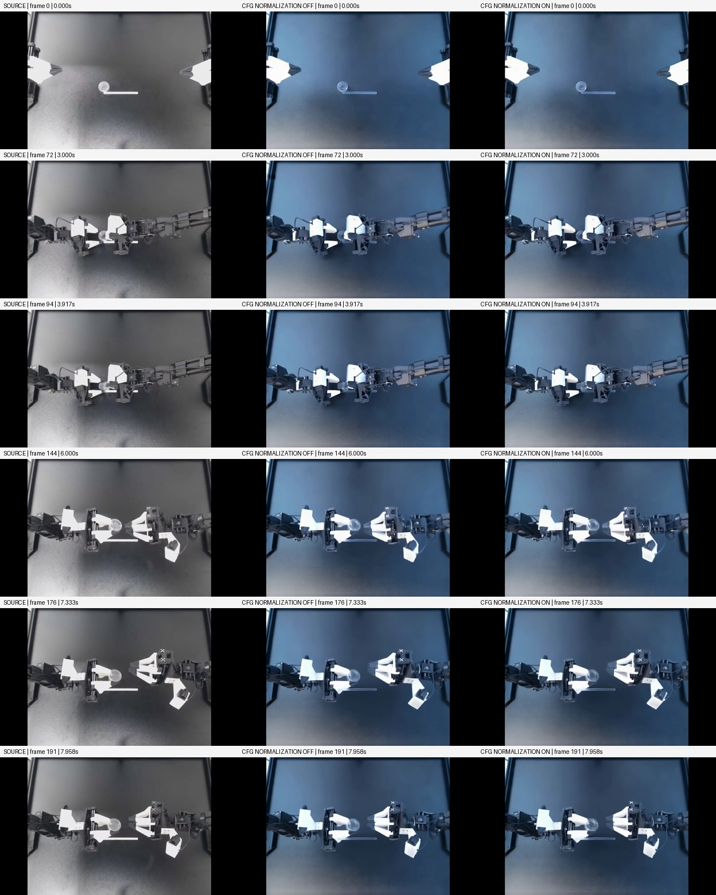
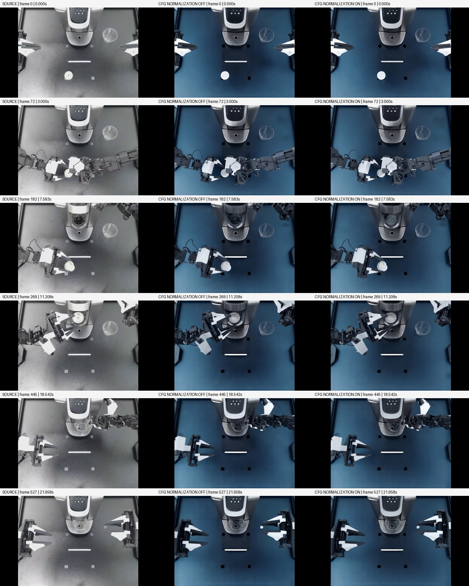
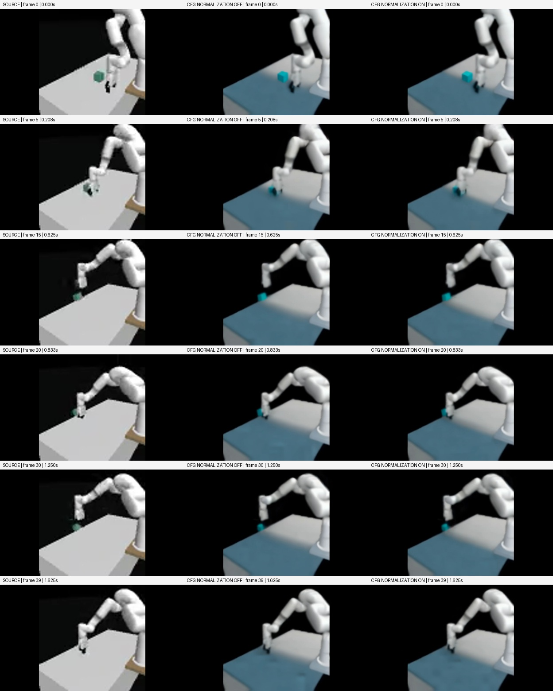
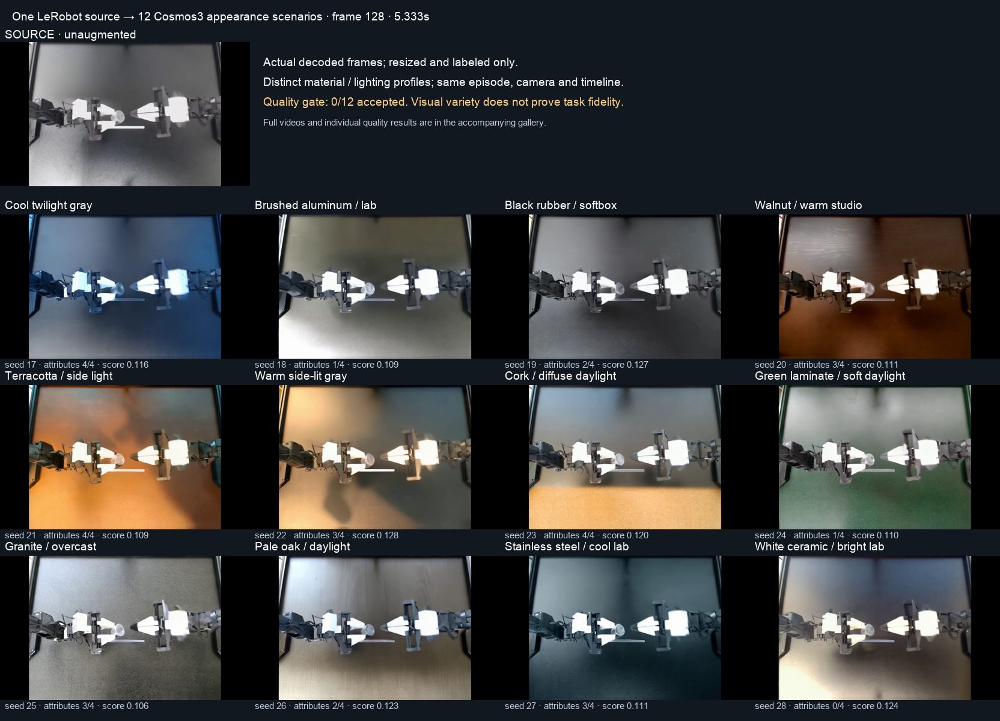

# Compare Cosmos 3 augmentation across LeRobot tasks

Use [PAIDF Cosmos 3](../../../workflows/guides/paidf-cosmos3.md) to compare the
same appearance edit on different recorded tasks. A plausible tabletop edit
does not establish a faithful manipulation. Review objects, transparency,
contacts, trajectories and the final state separately from appearance.

## Pinned source selections

The [source manifest](../examples/paidf-lerobot-realism-sources.json) records
immutable dataset revisions, downloaded file hashes, episode windows, cameras
and task-specific review questions. All three dataset cards declare MIT.
Episode zero is selected explicitly in each case; none uses the battery dataset.

| Dataset | Camera | Source | Prepared timeline | Main review challenge |
| --- | --- | --- | --- | --- |
| [Cup opening](https://huggingface.co/datasets/lerobot/aloha_static_cups_open/tree/d793c969cf716001dcca18a0842c3d7e9de9e41b) | `observation.images.cam_high` | 640×480, 50 fps | 192 frames, 8 seconds | Transparent cup and lid; small grasp contacts |
| [Coffee preparation](https://huggingface.co/datasets/lerobot/aloha_static_coffee/tree/b144896feb1f37398a862927b22cd3abdf005a6b) | `observation.images.cam_high` | 640×480, 50 fps | 528 frames, 22 seconds | Capsule, cup, tray and machine controls; several generation joins |
| [Simulated cube lift](https://huggingface.co/datasets/lerobot/xarm_lift_medium/tree/79efb0e3cef0e530ddec4b8569b190966ab45808) | `observation.image` | 84×84, 15 fps | 40 frames, 1.667 seconds | Low-resolution fingers and cube; upsampling cannot recover missing evidence |

Preparation retains the complete selected episode, letterboxes it to 832×480,
and samples at 24 fps. The source manifest's video hashes identify the downloaded
shared video files; the run's provenance separately hashes its selected and
prepared video. Different FFmpeg builds can produce different encoded hashes,
so use the run's actual prepared source for synchronized comparisons.

## Specify one visible edit and task invariants

The controlled edit changes only the existing tabletop to muted blue. It keeps
neutral illumination and white balance so a global color cast cannot substitute
for the intended surface edit. Use this coherent profile:

```json
[
  {
    "lighting": "soft neutral diffuse illumination with coherent contact shadows",
    "background": "the existing tabletop changed to a muted blue surface, with its original boundaries and layout retained",
    "color_grade": "neutral white balance with muted blue confined to the tabletop",
    "surface_finish": "matte low-gloss blue tabletop finish"
  }
]
```

Set `augment_subject` to the visible task and put its invariant objects and
contacts in `prompt`. Preserve transparent plastic as transparent plastic, the
cube's turquoise identity color, and existing robot parts. Do not introduce
objects from a task label when the source does not show them. Keep black
letterbox padding separate from scene surfaces in both prompting and review.

Use the setup guide's explicit `--lerobot-uri`, `--lerobot-camera`,
`--lerobot-episode 0`, and `--require-explicit-lerobot-selection` submission flags.
Stage the pinned README, metadata and selected camera video while preserving
their directory layout. Supply the exact selected storage bucket and endpoint;
generic credential health does not prove the eventual output destination.

## Fan out several appearance scenarios

The blue tabletop is an experiment profile, not a pipeline restriction.
`appearance_profiles_json` accepts coherent lighting, background, color-grade,
and surface-finish instructions. The [twelve-profile example](../examples/paidf-cups-fanout-profiles.json)
requests oak, walnut, aluminum, stainless steel, granite, terracotta, rubber,
cork, ceramic, green laminate, warm side lighting and cool twilight lighting on
the cup-opening source. Material changes apply to the existing tabletop;
foreground identities and the task remain explicit invariants.

Set `variant_count=12` and supply all twelve profiles through
`appearance_profiles_json`. The sampler shuffles the profiles using
`augmentation_seed`, then generates one video per selected profile. Read each
variant's recorded `variables` to identify its scenario; JSON array order is
not output order. With the existing `seed=17` and no refinement, actual diffusion
seeds are 17 through 28. More variants than profiles repeats the profile cycle
with different seeds, which is seed diversity rather than new scenarios.

`variant_parallelism` controls GPU concurrency independently of scenario count.
Use one for sequential execution or request multiple visible GPUs for
concurrent variants. The implementation caps concurrency by the variant count
and visible GPUs, leases an available GPU for each generation, and records
the effective value in the augmentation manifest.

For another fanout using a retained source, reuse its `input_uri`, `images_uri`,
`conditioning_video_uri`, `input_provenance_uri` and `captions_uri`. Keep
`configs_uri` under the new run prefix because the appearance manifest must be
regenerated. Use the five-stage graph `generate-configs → generate-variants →
evaluate → quality-disposition → visualize-quality-evidence`, ending at the
review recording. Replace a color-specific preservation prompt with one that
permits the selected appearance profiles while retaining objects, geometry,
contacts, camera, trajectories and timing. Keep model settings and strict
thresholds from the controlled comparison unchanged.

This is appearance scenario fanout: it does not generate validated new actions,
object arrangements or physics. Evaluate each output and retain failures.

## Compare one sampling change at a time

The baseline uses low Canny thresholds, native RGB hint weight 0.25, zero
first-window source RGB frames, control guidance 1.0, text guidance 5.0, 35
steps, seed 17, and 93-frame generation windows. These are experimental controls,
not training-qualified defaults. Full source controls, model guardrails and
timestamp alignment remain required; output pixels are never blended with source
pixels.

For the matched comparison, change only
`transfer_cfg_normalization=disabled` to `enabled`. This forwards the pinned
framework's native `normalize_cfg` option. Reuse the same prepared source,
caption report, appearance manifest, effective prompt and seed. Re-captioning
would change the model input and invalidate a one-parameter comparison.
Keep separate run IDs, output prefixes, NPA configurations and owned SkyPilot
API directories. The receipt records the effective normalization boolean.

Build a single-pass review graph from the reference workflow's actual toolRefs:
`prepare-input → generate-configs → annotate-original → generate-variants →
evaluate → quality-disposition → visualize-quality-evidence`. Make the final
state terminal, with no refinement loop or promotion stage. Use a distinct
workflow metadata name so the canonical starter does not select its built-in
input. For the matched candidate, reuse the baseline's `conditioning_video_uri`,
`input_provenance_uri`, `captions_uri` and `configs_uri`; begin at
`generate-variants` and keep the remaining four-stage chain. Changing the
candidate's output prefix must not redirect those four source references.

Retain `matched-inputs.json` in private evidence with hashes of the source
provenance, timeline, captions and configuration manifest. The read-only
`npa/tests/e2e/test_paidf_cosmos3_realism_live.py` audit takes a private JSON array
of `baseline_uri`, `candidate_uri`, `episode`, `camera` and `prepared_frames`
records through `NPA_PAIDF_REALISM_CASES`, plus `NPA_INTEGRATION_E2E=1` and
`NPA_E2E_PROJECT`. It verifies actual videos, matched generation inputs, native
controls, guardrails, alignment and rejection accounting. It does not submit
jobs or certify visual realism. Follow the setup guide's cleanup procedure for
each owned run after retaining its artifacts.

Keep `grade_threshold=0.75`, `attribute_threshold=1.0`,
`temporal_consistency_mode=required`, and
`temporal_consistency_threshold=0.8` fixed. The temporal metric is a source-relative
image-motion diagnostic, not a physics test. A failed gate stays failed even if
the new image looks more pleasing. A passing gate still needs task review.

Inspect the first and last frames, task contacts, releases and each join. Record
the actual reviewed frame indices and any limits of sampled visual review.
Retain complete source/output videos and all rejected candidates. Measure edit
magnitude only within the original image area; generated letterbox content is
an artifact to report, not useful augmentation diversity. Use the
[synchronized comparison procedure](paidf-realistic-augmentation.md#make-a-synchronized-comparison)
to retain every aligned frame.

These outputs are augmented videos. No action/state dataset reconstruction,
multi-view consistency, policy improvement or real-world transfer is implied.

## Measured comparison

The six complete Cosmos3-Nano outputs below were generated with the controls
above. Native CFG normalization changed appearance slightly, but this comparison
does not establish a realism improvement. Keep it disabled by default and retain
all six outputs as rejected review evidence.

| Task | Temporal score, normalization off | Temporal score, normalization on | Attribute checks, both | Disposition, both |
| --- | ---: | ---: | ---: | --- |
| Cup opening | 0.122709 | 0.121682 | 3/4 | Rejected |
| Coffee preparation | 0.096260 | 0.097463 | 3/4 | Rejected |
| Cube lift | 0.032292 | 0.032106 | 3/4 | Rejected |

The required temporal threshold is 0.8; these scores also determine the aggregate
minimum in these runs. All videos decode fully and match the source frame count,
24 fps timeline and timestamps. Native text/video guardrails passed, including
publication of the video guardrail's processed tensor. Those execution checks do
not certify realism. The read-only live audit passed all three matched pairs.

The [result manifest](../evidence/paidf-lerobot/results.json) contains video and
receipt hashes, all reviewed frame indices, decoded timing and measured edit
magnitude. Its source-relative image-motion score is not calibrated to contact
physics. Intended recoloring can also change that diagnostic. The advisory
appearance score was 1.0 for both cube outputs despite the visible cube-color and
surface changes; do not interpret it as an object-identity guarantee.

Every failed attribute check concerned `surface_finish`. The VLM selected
“matte low-gloss backdrop finish” instead of “matte low-gloss blue tabletop
finish.” These answers overlap, so this failure alone does not establish an
incorrect material. Preserve the raw failure and inspect the actual options;
future evaluations need mutually exclusive alternatives before comparing their
attribute pass rates. The generation inputs were matched, but evaluation question
generation was not frozen. The deterministic temporal measurements and direct
frame comparisons are the stronger evidence for this particular ablation.

The contact sheets show prepared source, normalization off, then normalization
on. Frames were decoded from the actual videos, resized and arranged without
retouching or source/output blending. Complete synchronized videos and reports
are retained in the operator's evidence directory. The sheets below are samples,
not a review of every contact in every frame.

### Cup opening

The blue tabletop and broad arm movement are plausible. Transparent plastic
remains visible in the sampled frames, but gripper details, plate markings and
shadows differ from the source. Normalization leaves those differences visible;
small grasp contacts remain unverified.



### Coffee preparation

The full 22-second sequence retains the broad action progression. Gray tabletop
registration squares become black, and capsule shading, machine details and
gripper detail change. Neither setting demonstrates faithful preservation of all
small task objects or contacts. The normalized version looks very similar to the
baseline at the sampled generation joins and final frame.



### Cube lift

The original turquoise cube becomes brighter cyan, robot detail is smoothed, and
the tabletop edit is uneven in early frames. The 84×84 source limits any contact
judgment after upsampling. Normalization does not resolve these visible issues.



### Apply the findings to another task

Keep the requested appearance edit separate from task invariants in the prompt.
Pin the source and reuse captions/configuration for every sampling comparison.
Review object colors, markings and contact geometry even when the overall image
looks plausible. Report both the active-image edit and padding artifacts: the
mean absolute RGB differences here were about 25.5/255 for cups, 50.3/255 for
coffee and 35.7/255 for the lift, excluding the letterbox. Those values describe
edit size, not quality. Fewer than 0.15% of padding pixels had a channel above 16
in every output, but even that padding change is not useful scene diversity.

This is one episode and one seed per task, with sampled visual review. It does
not establish a universal sampling setting or policy-training benefit. The
generalized code change exposes and records a native model control; it does not
change per-dataset behavior, blend source pixels, or relax quality thresholds.

## Measured twelve-scenario fanout

The cup-opening episode produced twelve distinct, complete Cosmos3-Nano videos
using the [profile example](../examples/paidf-cups-fanout-profiles.json). Each has
192 frames at 24 fps and an eight-second duration. Two GPUs generated variants
concurrently. All twelve passed full decoding, timestamp alignment and native
text/video guardrails, with no source-pixel blending. Completed videos were
observed in storage while the batch was still running.

The unchanged strict gate accepted **0/12** outputs. The temporal
column is the source-relative image-acceleration diagnostic, with threshold
0.8; it is not a contact-physics score. Requested attribute checks require 4/4.
Lighting and material edits can affect the temporal diagnostic, and overlapping
attribute answer options can make an individual VLM failure ambiguous. Preserve
these results alongside direct visual review rather than treating them as a
ranking of material realism.

| Scenario | Seed | Attributes | Temporal score | Gate |
| --- | ---: | ---: | ---: | --- |
| Cool twilight gray | 17 | 4/4 | 0.115510 | Rejected |
| Brushed aluminum / lab | 18 | 1/4 | 0.109092 | Rejected |
| Black rubber / softbox | 19 | 2/4 | 0.126789 | Rejected |
| Walnut / warm studio | 20 | 3/4 | 0.110584 | Rejected |
| Terracotta / side light | 21 | 4/4 | 0.109223 | Rejected |
| Warm side-lit gray | 22 | 3/4 | 0.128480 | Rejected |
| Cork / diffuse daylight | 23 | 4/4 | 0.120458 | Rejected |
| Green laminate / soft daylight | 24 | 1/4 | 0.109734 | Rejected |
| Granite / overcast | 25 | 3/4 | 0.106305 | Rejected |
| Pale oak / daylight | 26 | 2/4 | 0.122940 | Rejected |
| Stainless steel / cool lab | 27 | 3/4 | 0.110785 | Rejected |
| White ceramic / bright lab | 28 | 0/4 | 0.123870 | Rejected |



The walnut and oak outputs show visible wood grain, granite shows fine speckles,
and the side-lighting profile changes light direction and robot shadows. Cork
appears mainly in a lower band with a strong horizontal boundary; ceramic stays
mostly gray, and stainless steel reads more clearly as cool relighting than a
specific metal. Across the sampled outputs, small gripper markings and plate
details change. These are useful appearance experiments, with unresolved task
fidelity and inconsistent material adherence. Cork received 4/4 attribute
checks despite the visible boundary, while ceramic received 0/4. Attribute
verification alone therefore does not establish that the whole requested surface
changed correctly. All twelve temporal scores were below 0.8; thresholds were
not relaxed to accept visually appealing examples.

The [eight-second overview video](../evidence/paidf-lerobot/cups-fanout.mp4)
shows the complete source and twelve outputs together. It uses resized decoded
frames and static labels, with no scene retouching. Original-resolution videos
are retained separately.

The [fanout results](../evidence/paidf-lerobot/cups-fanout-results.json) retain all
twelve hashes, requested profiles, measurements and per-scenario observations.
Visual review compares actual source/output frames 0, 64, 88, 128, 176 and 191,
including the two generation joins. The operator's retained gallery includes
all complete videos, shared playback controls, exact-frame sheets and a full
source-plus-twelve overview video. Sampled frames do not certify every contact.

The initial attempt encountered a native prompt-guardrail rejection for the
color description “sage.” The repeated experiment used “muted green,” with
guardrails still enabled. That failure exposed two general reliability issues:
completed variants were only published after the whole batch succeeded, and
index-based GPU assignment could overlap work on a busy GPU. Completed variants
now publish incrementally with typed progress evidence, and workers lease an
available GPU. A failed variant still fails the batch and prevents a new
successful batch manifest. Recovery remains at workflow-stage granularity;
retained videos do not implement per-variant checkpoint resume.
