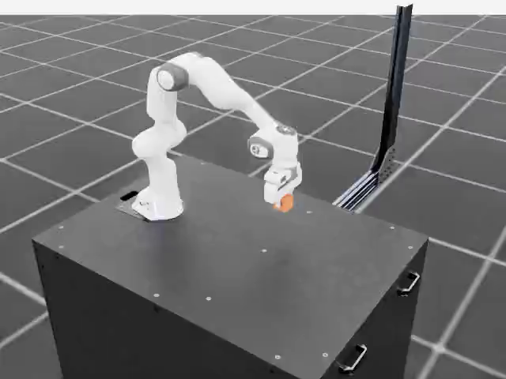

# Physical augmentation with executed actions

[`workflows/testing/physical-augmentation.yaml`](../../../workflows/testing/physical-augmentation.yaml)
collects new Franka cube-lift demonstrations on an RTX PRO 6000 GPU through the
standard Workbench/SkyPilot runtime. It changes object position, mass, and
friction, then runs a measured-state Cartesian controller again in each scene.
Every saved action was submitted to Isaac Lab. This is a public manipulation
reference, not a learned world action model, a reconstruction importer, or
evidence of improved robot-policy performance.

## Run

From an editable checkout, launch and download the complete demo with one command:

```bash
npa/.venv/bin/python npa/scripts/run_physical_augmentation_demo.py \
  --project "$NPA_PROJECT" --cluster "$NPA_CLUSTER" --provision \
  --output-path ./physical-augmentation-demo
```

Open `physical-augmentation-demo/demo.html` directly in Chrome, Edge or Safari.
It embeds every actual recording and measurement: play the four physical
conditions together, scrub time, change speed, and select each paired reset.
The HTML needs no server, network, account or GPU to view. `demo.mp4` is the
shareable four-condition film; `demonstrations.rrd` retains the accepted dataset's
full video/state/action recording. All outcomes remain visible in the HTML.

The runner checks project credentials, ensures one RTX PRO 6000 GPU plus a CPU
node, verifies CUDA and GLX/EGL/Vulkan readiness, stages this checkout, submits
the canonical workflow below, and verifies each downloaded artifact's checksum.
Use `--capacity-block-group` with your own reservation selector when required.
Use `--kubeconfig`, `--sky-bin`, and `--isolated-config-dir` for operator-owned
runtime locations. Omit `--provision` to use an existing ready RTX cluster.
The configured project must have writable S3 storage. An initial Isaac runtime
fetch and shader compilation can take several minutes. The demo does not
automatically destroy shared infrastructure; follow the normal run cleanup and
cluster teardown procedure when finished.

Isaac execution follows the documented runtime-fetch EULA defaults;
`--no-accept-eula` stops before provisioning or submission. To download an
existing run without allocating compute, replace `--provision` with
`--fetch-run "$NPA_RUN_ID"`. `--run-id` optionally names a new run; otherwise
the runner generates a timestamped name. These are thin launch and fetch
conveniences; the YAML still owns all three execution stages.

Use a configured project with writable S3 storage and an RTX-capable cluster.
All stages use the pinned Isaac Lab runtime-fetch image. Preparation and export
use its CPU Python environment, including the LeRobot-format writer and Rerun;
only collection fetches and launches Isaac. B200 cannot supply the required RTX
camera rendering.

```bash
npa workbench workflow validate-spec workflows/testing/physical-augmentation.yaml
npa workbench workflow plan-spec workflows/testing/physical-augmentation.yaml
npa workbench workflow submit workflows/testing/physical-augmentation.yaml \
  --project "$NPA_PROJECT" --infra "k8s/$NPA_CLUSTER" --runtime \
  --run-id "$NPA_RUN_ID" --var "bucket=$NPA_S3_BUCKET" \
  --secret-env AWS_ACCESS_KEY_ID --secret-env AWS_SECRET_ACCESS_KEY
```

Submission automatically stages the current editable checkout and overlays it
inside the pinned images. Clear stale explicit `NPA_SRC_S3_URI` exports, or pass
`--stage-src` to restage deliberately. See the
[workflow guide](../../../workflows/guides/README.md) for source staging and
submission. `episodes_per_condition` controls attempted demonstrations and
`episode_steps` defines when an unfinished task fails; failed attempts are never
silently retried until the desired number of successes appears.

The four sealed conditions are nominal, displaced object (+4 cm X, +8 cm Y),
double object mass, and lower object friction (0.25). All use matching reset
seeds and the same controller. Isaac's native body view must confirm the
requested mass and friction. Native joint limits, finite measured states,
quaternions, and task-domain checks run before rewards and automatic resets.
The frame sensor and IK controller share the same 107 mm offset from
`panda_hand`; every recorded snapshot checks their agreement. The controller
limits changes between commanded poses, advances persistent targets despite
actuator lag, and verifies measured downward orientation before descending.
Binary gripper commands pass through a persistent target ramp at one quarter of
the native finger velocity limit (0.05 m/s for this Franka). This avoids an
instantaneous close-target jump; the native measured-velocity guard stays active.
Each finger's actuator force is limited to 20 N, and the action term verifies
that limit through the native articulation data before accepting commands.
The TGS solver applies external forces every position iteration. Both robot and
cube use 16 position iterations and one velocity iteration, verified against
their composed USD attributes before collection. The upstream Franka requests
zero velocity iterations; the explicit velocity solve addresses contact velocity
errors without loosening the 3 cm/s stable-hold threshold or native validity
checks. Physics uses 2.5 ms steps (400 Hz) for finer contact resolution, while
actions and camera frames stay at 50 Hz through eight physics substeps per action.
The runtime verifies both clocks before collection. See NVIDIA's
[solver guidance](https://docs.omniverse.nvidia.com/kit/docs/omni_physics/107.3/dev_guide/simulation_control/simulation_control.html).

## What the artifacts mean

- `collection/` retains every attempt, its requested and measured physics,
  RGB frames, joint states, eight-dimensional absolute TCP/gripper actions,
  next joint states, object/tool telemetry, and simulation timestamps.
- `reports/report.json` reports all attempts and per-condition acceptance.
  Acceptance requires a measured lift of at least 10 cm, low object velocity,
  proximity to the closed tool, limited lateral drift, and 30 consecutive stable
  control steps. A terminated attempt cannot pass.
- `reports/demo.html` embeds all HD recordings, measured actions, and outcomes
  in an offline comparison viewer. `demo.mp4` compares the first paired seed
  across all conditions, holds final frames when a trial ends, and labels every
  measured outcome. `demo-validation.json` records decoded video counts,
  dimensions, rates and content hashes. The camera uses 1280 × 720 RTX frames.
- `reports/lerobot/` contains only accepted demonstrations, with real RTX video.
  `accepted-provenance.json` maps every exported episode to its original
  condition, attempt, action semantics, and source-file hashes.
  Its sealed recipe, recipe hash, native runtime version, and implementation
  module hashes are also embedded in the Rerun recording's static provenance.
- `reports/demonstrations.rrd` shows the exported video, state, action, and
  measured outcome. The report stage independently decodes and checks its entities.

`rgb[t]` and `state[t]` precede `action[t]`; `next_state[t]` follows it. The
validator checks consecutive timestamps, exact state continuity, finite arrays,
unit action quaternions, valid gripper commands, and nonblank moving video.
It recomputes acceptance from the measured telemetry. Zero accepted attempts
fails the export stage and retains diagnostics under a separate failure prefix.
The action space is **absolute TCP pose in the robot root frame (XYZ metres,
XYZW quaternion) plus +1 open / -1 close**. It is not joint torque, joint target,
or an arbitrary robot's policy action space.

## Native validation

A complete run on one NVIDIA RTX PRO 6000 Blackwell Server Edition used Isaac
Lab 3.0.0b2.post1 and three paired reset seeds per condition. The unchanged
physical acceptance checks produced:

| Condition | Accepted / attempted |
|---|---:|
| Nominal | 0 / 3 |
| Displaced object | 2 / 3 |
| Double mass | 1 / 3 |
| Lower friction | 0 / 3 |

This validates collection and selective export, not a reliable demonstration
controller across all conditions. All nine rejected attempts remain in the
collection and report. Qualify a task-specific controller before collecting a
training dataset; these three seeds do not establish generalization.

The [sanitized execution evidence](../evidence/physical-augmentation-rtx.json)
records the measured physics, native validity checks, source hashes, and
independent dataset/video/Rerun readback. All 936 exported state/action pairs
matched their source arrays; all three videos decoded at 640 × 480 and 50 fps;
all 54 dynamic Rerun entities passed inspection. The preview below is an actual
frame from an accepted displaced-object demonstration.



## Adapting a reconstructed scene

A Lyra-exported mesh or Gaussian reconstruction supplies visual geometry; it
does not establish a correct articulated manipulation environment. Adapt the
task configuration and controller to a specific robot and task, then verify:

1. Metric scale, gravity, transforms, collision meshes, and initial penetration.
2. Separately movable rigid objects, mass, inertia, friction, and any joints.
3. Robot joint limits, TCP, actuator settings, and the action-coordinate contract.
4. Camera intrinsics/extrinsics, timestamps, and wrist-camera motion/occlusion.
5. A measured task-success predicate and recorded failure cases.

This reference uses a procedural collision-bearing cube and the public Franka
scene. It does not accept an arbitrary USD as a drop-in manipulation task.
For task-specific demonstrations, replace its scripted controller with validated
teleoperation, a compatible policy, or a properly annotated Isaac Lab Mimic
adapter; preserve the transition and acceptance checks.

## Appearance augmentation afterward

Use the accepted simulator videos as inputs to
[`workflows/main/paidf-cosmos3.yaml`](../../../workflows/main/paidf-cosmos3.yaml)
for appearance variants. Keep the original actions and physical provenance
separate until geometry, contact, timing, and camera consistency are checked.
Cosmos video output alone does not certify action labels or produce executed
robot actions. This workflow does not automatically relabel generated videos.

For wrist haze, inspect the original synchronized capture, calibration, motion
blur, reconstruction coverage, and dynamic-robot masking before changing the
training pipeline. Better-looking reconstruction alone does not prove contact
accuracy. Measure any policy benefit on held-out tasks and physical hardware
separately; neither is claimed by demonstration collection.
