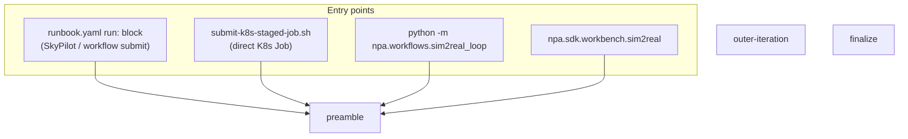
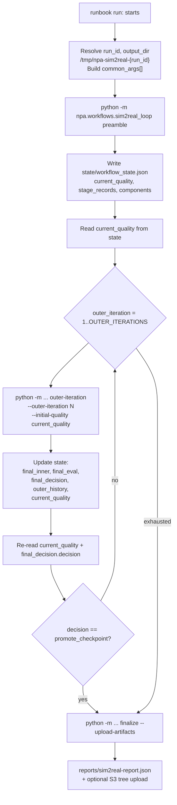
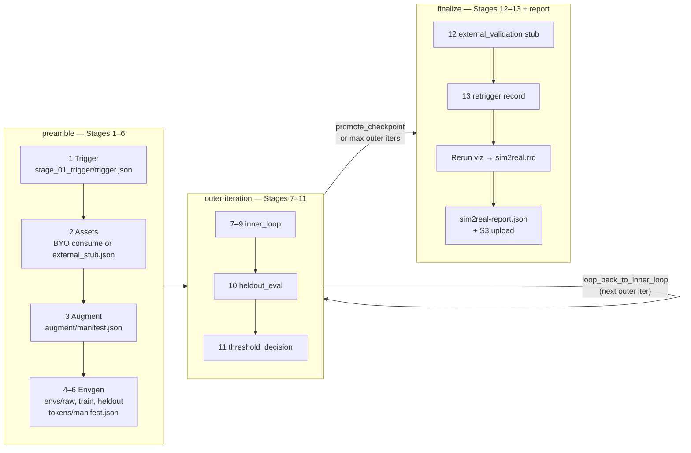
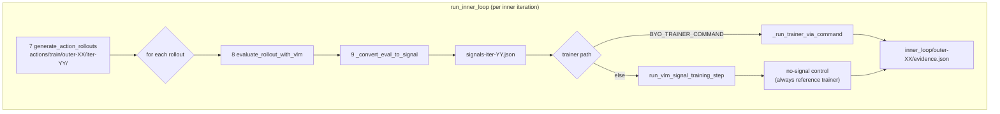
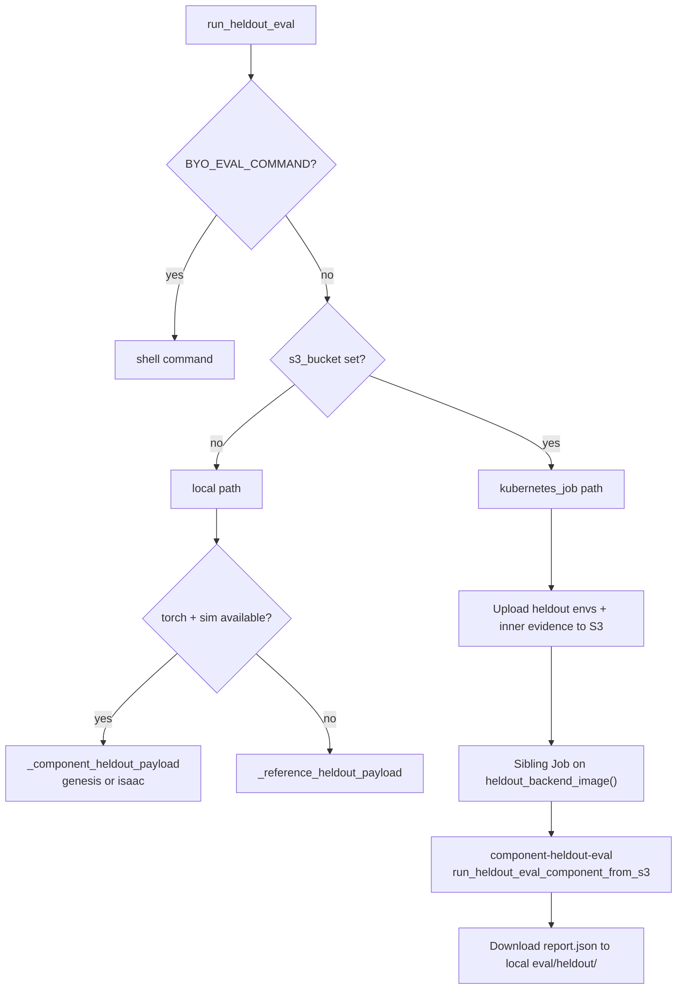
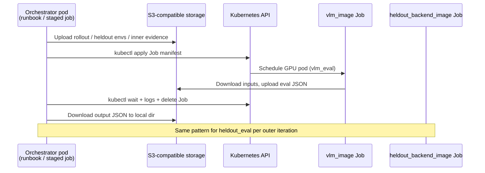

# Sim-to-Real VLM→RL — Architecture (as implemented)

This document describes the **current** control flow in code and YAML. It is not a
roadmap or desired-state design.

**Sources of truth:**

| Layer | Path |
| --- | --- |
| SkyPilot runbook | `npa/workflows/workbench/sim2real/runbook.yaml` (`run:` block) |
| Stage CLI | `npa/src/npa/workflows/sim2real_loop.py` |
| SDK wrappers | `npa/src/npa/sdk/workbench/sim2real.py` |
| Direct K8s submit | `ops/private/sim2real-rtxpro/submit-k8s-staged-job.sh` |

User-facing guide: [sim2real-workflow.md](./sim2real-workflow.md)

---

## Entry points (all call the same Python stages)

`submit-k8s-staged-job.sh` mirrors the runbook bash loop: it clones NPA source into
the orchestrator pod, installs `kubectl`, then runs `preamble` → bash outer loop →
`finalize` with `--upload-artifacts`.

The SDK (`sim2real.run`) calls `run_full_loop()` in one process; staged helpers
(`preamble`, `outer_iteration`, `finalize`) map 1:1 to the CLI subcommands the
runbook invokes.

---

## YAML orchestration layer

The runbook `run:` block is the outer shell. It does **not** embed loop logic in
Python for staging — bash drives stage boundaries and reads persisted state.

**State file:** `{output_dir}/state/workflow_state.json`

Fields the bash loop depends on:

- `current_quality` — fed into the next `outer-iteration` as `--initial-quality`
- `final_decision.decision` — `promote_checkpoint` breaks the bash loop early

---

## Python stage map (Stages 1–13)

---

## Inner loop (Stages 7–9) — always in the orchestrator process

`run_inner_loop()` runs `INNER_ITERATIONS` times per outer iteration. Action
rollouts are **always** generated locally (`generate_action_rollouts`); they are
not sibling K8s jobs today.

### VLM eval routing (`evaluate_rollout_with_vlm`)

Priority order (first match wins):

| Condition | Mode | Output |
| --- | --- | --- |
| `BYO_VLM_COMMAND` set | `command` | Shell command reads rollout dir env vars |
| `s3_bucket` empty | `local_reference` | `_reference_vlm_payload_from_rollout` (in-process) |
| `s3_bucket` set | `kubernetes_job` | Upload rollout → sibling Job on `vlm_image` |

Sibling VLM job contract:

1. Orchestrator uploads rollout dir to S3 (`NPA_SIM2REAL_ROLLOUT_URI`).
2. `kubectl apply` Job named `sim2real-{run_id}-vlm-eval-{attempt}`.
3. Container runs `python -m npa.workflows.sim2real_loop component-vlm-eval`.
4. `run_vlm_eval_component_from_s3` downloads rollout, calls `_component_vlm_payload`
   (Cosmos-Reason VLM when model/GPU available in image).
5. Orchestrator downloads `NPA_SIM2REAL_OUTPUT_URI` → `vlm_eval/train/.../{rollout_id}.json`.

### Signal conversion (`_convert_eval_to_signal`)

| Condition | Converter |
| --- | --- |
| `BYO_SIGNAL_CONVERTER` set | Shell command; reads `NPA_SIM2REAL_EVALUATION_JSON`, writes RL signal JSON |
| else | In-process `convert_vlm_eval_to_rl_signal` |

Signal conversion always runs in the orchestrator pod — never a sibling Job.

### Trainer update

| Condition | Trainer |
| --- | --- |
| `BYO_TRAINER_COMMAND` set | Shell command; reads signal batch JSON |
| else | In-process `run_vlm_signal_training_step` |

A **no-signal control** trainer step always runs in-process for attribution,
even when BYO trainer is configured.

---

## Held-out eval (Stage 10)

`run_heldout_eval()` writes `eval/heldout/report.json`.

**`heldout_backend_image()`** (actual code):

- `sim_backend=isaac` → `isaac_image` (Isaac Lab / Isaac Sim)
- `sim_backend=genesis` (default) → `eval_image`

Sibling held-out job injects NPA source via `NPA_SOURCE_REPO`/`NPA_SOURCE_REF` or
`NPA_SIM2REAL_SOURCE_TARBALL_URI` before running the component subcommand.

---

## Threshold gate (Stage 11)

`threshold_decision()` compares `heldout_report.success_rate` to `SUCCESS_THRESHOLD`.

| Outcome | Decision | Artifacts |
| --- | --- | --- |
| `success_rate >= threshold` | `promote_checkpoint` | `checkpoints/candidate/candidate.json` |
| else | `loop_back_to_inner_loop` | `outer_loop/loopback.json` |

Always writes `outer_loop/decision.json`. The runbook bash loop breaks on
`promote_checkpoint`; otherwise it continues to the next outer iteration (up to
`OUTER_ITERATIONS`). `run_single_outer_iteration` bumps `current_quality` when not
promoted.

---

## Finalize (Stages 12–13, report, viz, upload)

`run_finalize()`:

1. **Stage 12** — `stage_12_external_validation/external_stub.json` (documented BYO seam).
2. **Stage 13** — `stage_13_retrigger/retrigger.json` (loop-of-loops metadata;
   `should_retrigger` when `LOOP_OF_LOOPS_ITERATIONS > 1`).
3. **Rerun viz** — `_run_sim2real_viz_stage` → `reports/sim2real.rrd` when
   `NPA_SIM2REAL_RERUN=1` (default). Degrades to WARN if `rerun-sdk` missing.
   Optional `BYO_RERUN_COMMAND` override.
4. **Report** — `reports/sim2real-report.json` (schema `npa.sim2real.e2e_report.v1`).
5. **Upload** — when `--upload-artifacts` and `s3_bucket` set,
   `upload_run_artifacts()` uploads the full local tree to
   `s3://{bucket}/{prefix}/{run_id}/`.

The finalize CLI reads `final_inner`, `final_eval`, `final_decision` from
`workflow_state.json` (written by the last `outer-iteration`).

---

## Sibling K8s jobs (when `s3_bucket` is set)

Only **VLM eval** and **held-out eval** spawn sibling Jobs from the orchestrator.
The orchestrator pod must have `kubectl` and cluster credentials.

Job labels: `app=npa-sim2real`, `run-id`, `component`. GPU node selector uses
`NPA_SIM2REAL_K8S_GPU_PRODUCT`. Env secrets from `NPA_SIM2REAL_K8S_ENV_SECRET_NAMES`.

---

## Local reference fallbacks (no `s3_bucket`)

When `s3_bucket` is empty, sibling Jobs are **not** spawned:

| Component | Fallback |
| --- | --- |
| VLM eval | `_reference_vlm_payload_from_rollout` (deterministic from rollout manifest + PPM frames) |
| Held-out eval | `_component_heldout_payload` if `torch` + sim import succeeds; else `_reference_heldout_payload` |
| S3 upload | Skipped (`upload.status = skipped`) |

Local smoke runs and unit tests use this path. Production runbook **requires** a
real bucket (`NPA_SIM2REAL_BUCKET`); the YAML exits if it is missing or
`example-bucket`.

---

## Artifact and state paths

Local root: `{output_dir}` (default `/tmp/npa-sim2real-{run_id}`).

| Path | Purpose |
| --- | --- |
| `state/workflow_state.json` | Cross-stage state; bash loop reads `current_quality`, `final_decision` |
| `stage_01_trigger/trigger.json` | Stage 1 trigger record |
| `stage_02_assets/` | BYO assets or `external_stub.json` |
| `augment/manifest.json` | Stage 3 augmentation manifest |
| `envs/raw/`, `envs/train/`, `envs/heldout/` | Stage 4–6 env manifests |
| `tokens/manifest.json` | Stage 6 token manifest |
| `actions/train/outer-XX/iter-YY/` | Stage 7 rollouts |
| `vlm_eval/train/outer-XX/iter-YY/` | Stage 8 VLM evaluations |
| `training_signal/train/outer-XX/iter-YY/` | Stage 9 RL signals |
| `inner_loop/outer-XX/evidence.json` | Inner-loop evidence per outer iteration |
| `eval/heldout/report.json` | Stage 10 held-out report |
| `outer_loop/decision.json` | Stage 11 threshold decision |
| `checkpoints/candidate/` | Promoted checkpoint metadata |
| `stage_12_external_validation/` | Stage 12 stub |
| `stage_13_retrigger/retrigger.json` | Stage 13 retrigger record |
| `reports/sim2real-report.json` | E2E report |
| `reports/sim2real.rrd` | Rerun recording (when enabled) |

S3 mirror (when uploaded): `s3://{NPA_SIM2REAL_BUCKET}/{NPA_SIM2REAL_PREFIX}/{run_id}/`
— see `artifact_uris()` in `sim2real_loop.py` for canonical URIs.

---

## BYO seams (runtime overrides)

All optional; empty means use the in-process reference path.

| Env / flag | Stage | Contract |
| --- | --- | --- |
| `BYO_VLM_COMMAND` | 8 | Reads rollout env vars; writes eval JSON to `NPA_SIM2REAL_OUTPUT_JSON` |
| `BYO_SIGNAL_CONVERTER` | 9 | Reads `NPA_SIM2REAL_EVALUATION_JSON`; writes RL signal JSON |
| `BYO_TRAINER_COMMAND` | 9 | Reads signal batch; writes trainer update JSON |
| `BYO_EVAL_COMMAND` | 10 | Reads held-out env vars; writes `report.json` |
| `BYO_RERUN_COMMAND` | viz | Reads run dir + report; writes `.rrd` |

Image overrides: `VLM_IMAGE`, `EVAL_IMAGE`, `TRAINER_IMAGE`, `ISAAC_IMAGE`, etc.
(map to `Sim2RealLoopConfig` via `build_config_from_env`).
