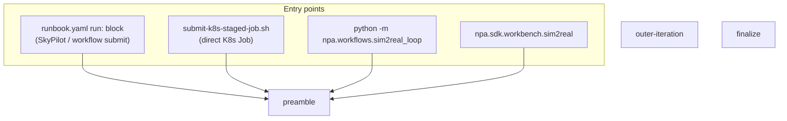
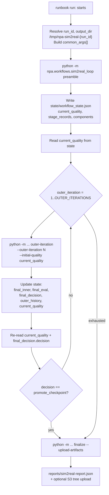
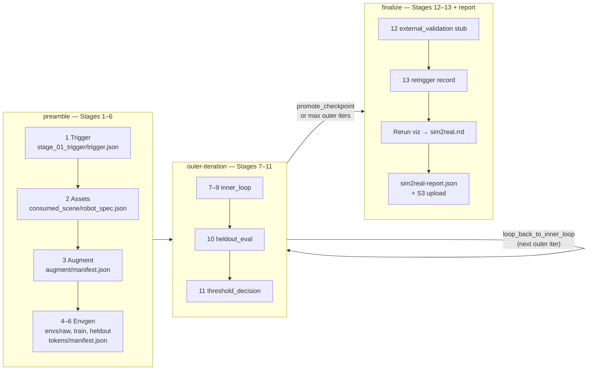
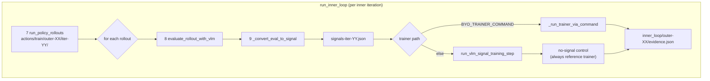
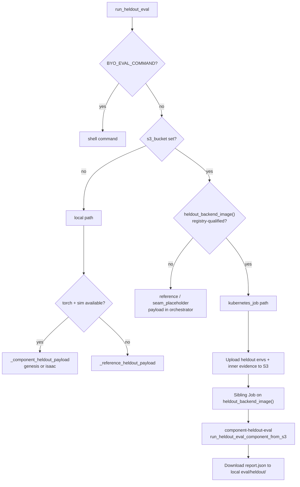
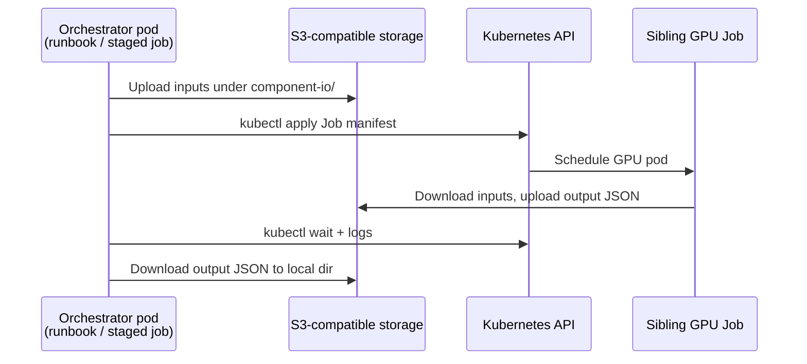

# Sim-to-Real VLM→RL — Architecture (as implemented)

This document describes **control flow**, K8s sibling jobs, and fallbacks.

**Formats & schemas:** [sim2real-data-contracts.md](./sim2real-data-contracts.md)  
**Operator guide:** [sim2real-workflow.md](./sim2real-workflow.md)  
**Customer uploads:** [sim2real-customer-assets.md](./sim2real-customer-assets.md)

**Sources of truth (code):**

| Layer | Path |
| --- | --- |
| SkyPilot runbook | `npa/workflows/workbench/sim2real/runbook.yaml` (`run:` block) |
| Stage CLI | `npa/src/npa/workflows/sim2real_loop.py` |
| SDK wrappers | `npa/src/npa/sdk/workbench/sim2real.py` |
| Direct K8s submit | `ops/private/sim2real-rtxpro/submit-k8s-staged-job.sh` |

---

## Entry points (all call the same Python stages)

`submit-k8s-staged-job.sh` mirrors the runbook bash loop: it clones NPA source into
the orchestrator pod, installs `kubectl`, then runs `preamble` → bash outer loop →
`finalize` with `--upload-artifacts`.

The SDK (`sim2real.run`) calls `run_full_loop()` in one process; staged helpers
(`preamble`, `outer_iteration`, `finalize`) map 1:1 to the CLI subcommands the
runbook invokes.

---

## YAML orchestration layer

The runbook `run:` block is the outer shell. It does **not** embed loop logic in
Python for staging — bash drives stage boundaries and reads persisted state.

**State file:** `{output_dir}/state/workflow_state.json`

Fields the bash loop depends on:

- `current_quality` — fed into the next `outer-iteration` as `--initial-quality`
- `final_decision.decision` — `promote_checkpoint` breaks the bash loop early

---

## Python stage map (Stages 1–13)

---

## Inner loop (Stages 7–9)

`run_inner_loop()` runs `INNER_ITERATIONS` times per outer iteration. Stage 7
policy rollouts route like Stage 3 augment: sibling K8s job when
`s3_bucket` + registry-qualified `POLICY_IMAGE` + S3 `train_envs_uri`; else
local reference rollouts in the orchestrator. Stages 8–9 (VLM, signal, trainer)
always orchestrate from the parent pod; only VLM eval spawns sibling Jobs among
the inner-loop GPU components.

### VLM eval routing (`evaluate_rollout_with_vlm`)

Priority order (first match wins):

| Condition | Mode | Output |
| --- | --- | --- |
| `BYO_VLM_COMMAND` set | `command` | Shell command reads rollout dir env vars |
| `s3_bucket` empty | `local_reference` | `_reference_vlm_payload_from_rollout` (in-process) |
| `s3_bucket` set | `kubernetes_job` | Upload rollout → sibling Job on `vlm_image` |

Sibling VLM job contract:

1. Orchestrator uploads rollout dir to S3 (`NPA_SIM2REAL_ROLLOUT_URI`).
2. `kubectl apply` Job named `sim2real-{run_id}-vlm-eval-{attempt}`.
3. Container runs `python -m npa.workflows.sim2real_loop component-vlm-eval`.
4. `run_vlm_eval_component_from_s3` downloads rollout, calls `_component_vlm_payload`
   (Cosmos-Reason VLM when model/GPU available in image).
5. Orchestrator downloads `NPA_SIM2REAL_OUTPUT_URI` → `vlm_eval/train/.../{rollout_id}.json`.

### Signal conversion (`_convert_eval_to_signal`)

| Condition | Converter |
| --- | --- |
| `BYO_SIGNAL_CONVERTER` set | Shell command; reads `NPA_SIM2REAL_EVALUATION_JSON`, writes RL signal JSON |
| else | In-process `convert_vlm_eval_to_rl_signal` |

Signal conversion always runs in the orchestrator pod — never a sibling Job.

### Stage 3 augment routing (`run_augment_stage`)

| Condition | Mode | Tier |
| --- | --- | --- |
| `s3_bucket` + registry-qualified `AUGMENT_IMAGE` | Sibling Job on `augment_image` (`cosmos2_transfer`) | **WORKS** |
| `s3_bucket` + unresolved/placeholder `AUGMENT_IMAGE` | In-process reference augment | **SEAM** |
| no `s3_bucket` | In-process reference augment | **WORKS** (smoke) |

### Stage 7 policy routing (`run_policy_rollouts`)

| Condition | Mode | Tier |
| --- | --- | --- |
| `s3_bucket` + S3 `train_envs_uri` + registry-qualified `POLICY_IMAGE` | Sibling Job (`policy_actions`) | **WORKS** |
| `s3_bucket` + missing/placeholder `POLICY_IMAGE` | `generate_action_rollouts` in orchestrator | **SEAM** |
| `BYO_POLICY_COMMAND` | Shell command | **WORKS** |
| no `s3_bucket` | Local reference rollouts | **WORKS** (smoke) |

### Trainer update

| Condition | Trainer |
| --- | --- |
| `BYO_TRAINER_COMMAND` set | Shell command; reads signal batch JSON |
| else | In-process `run_vlm_signal_training_step` |

A **no-signal control** trainer step always runs in-process for attribution,
even when BYO trainer is configured.

---

## Held-out eval (Stage 10)

`run_heldout_eval()` writes `eval/heldout/report.json`.

**`heldout_backend_image()`** (actual code):

- `sim_backend=isaac` (default) → `isaac_image` (Isaac Lab / Isaac Sim)
- `sim_backend=genesis` → `eval_image`

Sibling held-out job injects NPA source via `NPA_SOURCE_REPO`/`NPA_SOURCE_REF` or
`NPA_SIM2REAL_SOURCE_TARBALL_URI` before running the component subcommand.

---

## Threshold gate (Stage 11)

`threshold_decision()` compares `heldout_report.success_rate` to `SUCCESS_THRESHOLD`.

| Outcome | Decision | Artifacts |
| --- | --- | --- |
| `success_rate >= threshold` | `promote_checkpoint` | `checkpoints/candidate/candidate.json` |
| else | `loop_back_to_inner_loop` | `outer_loop/loopback.json` |

Always writes `outer_loop/decision.json`. The runbook bash loop breaks on
`promote_checkpoint`; otherwise it continues to the next outer iteration (up to
`OUTER_ITERATIONS`). `run_single_outer_iteration` bumps `current_quality` when not
promoted.

---

## Finalize (Stages 12–13, report, viz, upload)

`run_finalize()`:

1. **Stage 12** — `stage_12_external_validation/external_stub.json` (documented BYO seam).
2. **Stage 13** — `stage_13_retrigger/retrigger.json` (loop-of-loops metadata;
   `should_retrigger` when `LOOP_OF_LOOPS_ITERATIONS > 1`).
3. **Rerun viz** — `_run_sim2real_viz_stage` → `reports/sim2real.rrd` when
   `NPA_SIM2REAL_RERUN=1` (default). Degrades to WARN if `rerun-sdk` missing.
   Optional `BYO_RERUN_COMMAND` override.
4. **Report** — `reports/sim2real-report.json` (schema `npa.sim2real.e2e_report.v1`).
5. **Upload** — when `--upload-artifacts` and `s3_bucket` set,
   `upload_run_artifacts()` uploads the full local tree to
   `s3://{bucket}/{prefix}/{run_id}/`.

The finalize CLI reads `final_inner`, `final_eval`, `final_decision` from
`workflow_state.json` (written by the last `outer-iteration`).

---

## Sibling K8s jobs (when `s3_bucket` is set)

These components spawn sibling GPU Jobs from the orchestrator when their image
refs are registry-qualified (see routing tables above). The orchestrator pod
must have `kubectl` and cluster credentials.

| Component key | Stage | Image env | When skipped |
| --- | --- | --- | --- |
| `cosmos2_transfer` | 3 | `AUGMENT_IMAGE` | Reference augment locally (**SEAM** tier) |
| `policy_actions` | 7 | `POLICY_IMAGE` | Reference rollouts locally (**SEAM** tier) |
| `vlm_eval` | 8 | `VLM_IMAGE` | One Job per rollout; never skipped with bucket set |
| `heldout_eval` | 10 | `ISAAC_IMAGE` or `EVAL_IMAGE` via `heldout_backend_image()` | Reference heuristic when image not ready |

Trainer, signal converter, and envgen (Stages 4–6) run in the orchestrator pod.

**Job naming:** parent orchestrator `sim2real-{run_id}` (direct K8s submit) or
SkyPilot-managed name; siblings `s2r-{component}-{run_slug}-{uuid8}` (max 63
chars). Labels: `app.kubernetes.io/name=sim2real-sibling-component`,
`app.kubernetes.io/component`, `sim2real.local/run-id`.

---

## Kubernetes deployment inventory

Generic reference for RTX PRO class direct-K8s runs
(`ops/private/sim2real-rtxpro/submit-k8s-staged-job.sh`). Substitute your
cluster, bucket, and registry IDs — no secrets in docs.

| Item | Typical value |
| --- | --- |
| Cluster context | `<cluster-context>` (e.g. managed-K8s workbench target) |
| Kubeconfig | `~/.npa/clusters/<cluster-context>/kubeconfig` |
| Namespace | `default` (`NPA_SIM2REAL_K8S_NAMESPACE`) |
| S3 endpoint | `https://storage.eu-north1.nebius.cloud` (region-specific) |
| Bucket | `<bucket-id>` from `~/.npa/config.yaml` |
| Registry | `cr.<region>.nebius.cloud/<registry-id>` |
| ServiceAccount | `agent-sa` |
| imagePullSecrets | `agent-sa`, `ngc-nvcr-imagepullsecret`, `npa-nebius-registry` |
| envFrom Secrets | `hf-ngc-tokens`, `npa-storage-credentials` |
| GPU resource | `nvidia.com/gpu: 1` |
| Orchestrator nodeSelector | `nvidia.com/gpu.product: NVIDIA-RTX-PRO-6000-Blackwell-Server-Edition` |
| Sibling nodeSelector | `nvidia.com/gpu.compute.major/minor: 12/0` + same `gpu.product` |
| Sibling timeout | `7200s` (`NPA_SIM2REAL_K8S_JOB_TIMEOUT_S`) |

**S3 prefixes:** [sim2real-data-contracts.md § S3 layout](./sim2real-data-contracts.md#artifact-paths)

**Reference images** (tags from `Sim2RealLoopConfig` defaults; prefix with registry):

| Role | Image tag |
| --- | --- |
| Orchestrator + in-process trainer | `npa-lerobot-vlm-rl:0.1.0` |
| Stage 3 augment | `npa-cosmos2-transfer:2.5.0` |
| Stage 7 policy | `npa-sim2real-reference-policy:0.1.1` |
| Stage 8 VLM | `npa-cosmos3-reason:3.0.1-genuine-sm120` |
| Stage 10 held-out (Genesis) | `npa-sim2real-eval:0.1.1-genuine-sm120` |
| Stage 10 held-out (Isaac, default backend) | `npa-isaac-lab:2.3.2.post1` |

Isaac defaults on direct submit: `NPA_SIM2REAL_SIM_BACKEND=isaac`,
`NPA_SIM2REAL_ISAAC_TASK=Isaac-Lift-Cube-Franka-v0`.

Stage-level **WORKS / SEAM / PARTIAL** scorecard:
[sim2real-customer-assets.md](./sim2real-customer-assets.md#production-handoff-scorecard-13-step-reference-pipeline).

---

## Local reference fallbacks (no `s3_bucket`)

When `s3_bucket` is empty, sibling Jobs are **not** spawned:

| Component | Fallback |
| --- | --- |
| Augment | `_reference_augment_local` |
| Policy rollouts | `generate_action_rollouts` |
| VLM eval | `_reference_vlm_payload_from_rollout` (deterministic from rollout manifest + PPM frames) |
| Held-out eval | `_component_heldout_payload` if `torch` + sim import succeeds; else `_reference_heldout_payload` |
| S3 upload | Skipped (`upload.status = skipped`) |

Local smoke runs and unit tests use this path. Production runbook **requires** a
real bucket (`NPA_SIM2REAL_BUCKET`); the YAML exits if it is missing or
`example-bucket`.

---

## Artifact and state paths

Full path list, JSON `schema` values, and format families:
[sim2real-data-contracts.md](./sim2real-data-contracts.md#artifact-paths).

Local root: `{output_dir}` (default `/tmp/npa-sim2real-{run_id}`).  
S3 mirror: `s3://{NPA_SIM2REAL_BUCKET}/{NPA_SIM2REAL_PREFIX}/{run_id}/` — see `artifact_uris()` in `sim2real_loop.py`.

---

## BYO seams (runtime overrides)

All optional; empty means use the in-process reference path.

| Env / flag | Stage | Contract |
| --- | --- | --- |
| `BYO_VLM_COMMAND` | 8 | Reads rollout env vars; writes eval JSON to `NPA_SIM2REAL_OUTPUT_JSON` |
| `BYO_SIGNAL_CONVERTER` | 9 | Reads `NPA_SIM2REAL_EVALUATION_JSON`; writes RL signal JSON |
| `BYO_TRAINER_COMMAND` | 9 | Reads signal batch; writes trainer update JSON |
| `BYO_EVAL_COMMAND` | 10 | Reads held-out env vars; writes `report.json` |
| `BYO_RERUN_COMMAND` | viz | Reads run dir + report; writes `.rrd` |

Image overrides: `VLM_IMAGE`, `EVAL_IMAGE`, `TRAINER_IMAGE`, `ISAAC_IMAGE`, etc.
(map to `Sim2RealLoopConfig` via `build_config_from_env`).
