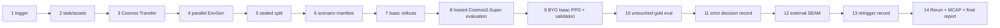

# Sim2Real compositional architecture

The canonical operator surface is
`npa/workflows/workbench/npa-workflows/sim2real.yaml`. It is an ordinary
`npa.workflow/v0.0.1` graph executed through the standard planner, SkyPilot
renderer, and `--runtime` reconciler. There is no Sim2Real detector branch,
controller pod, source tarball, or hidden sibling-Job orchestrator in this path.

```mermaid
flowchart LR
  T[1 trigger] --> A[2 task/assets]
  A --> CT[3 Cosmos Transfer]
  CT --> EG[4 parallel EnvGen]
  EG --> S[5 sealed split]
  S --> M[6 scenario manifest]
  M --> R[7 Isaac rollouts]
  R --> CR[8 hosted Cosmos3-Super evaluation]
  CR --> PPO[9 BYO Isaac PPO + validation]
  PPO --> G[10 untouched gold eval]
  G --> D[11 strict decision record]
  D --> E[12 external SEAM]
  E --> RT[13 retrigger record]
  RT --> V[14 Rerun + MCAP + final report]
```

Stages 7–9 are the inner workflow loop. Stages 7–11 are nested in the outer
workflow loop. Each state receives its iteration through named `{{loop.*}}`
tokens and uses iteration-scoped S3 paths. Parallel EnvGen shards and Cosmos
Reason lanes are ordinary runtime waves with a barrier before their consumer.

Every solution boundary has its own immutable task image and resource profile.
Isaac rollout, training, and evaluation execute inside the admitted workflow
task; they do not create another Job. Stage adapters accept explicit S3/config
inputs and publish explicit S3 outputs plus content-addressed ComponentRecords.
The adapters live in `npa.workflows.sim2real.workflow_stage`; direct Transfer
ownership is in `workflow_transfer`, and S3/evidence primitives are in
`workflow_io`.

The standard runtime ledger at `<run-prefix>/npa-workflow/runtime.json` is the
durable execution checkpoint. On `--resume`, completed waves are reused only
when declared outputs still exist, running managed jobs are adopted, and only
incomplete waves are resubmitted. ComponentRecord pointers are backed by
immutable SHA-256-addressed history objects. This makes the Stage 8→9 barrier
and Stage 14 finalization restartable without private controller memory.

Train, validation, and gold scenario IDs and config digests are disjoint. PPO
checkpoint selection uses validation only; Stage 10 evaluates the selected
digest on untouched gold and preserves its exact render prefix. Stage 11 keeps
the strict stable-placement-within-5-cm metric but records policy quality
without treating a reduced piping proof as an efficacy qualification. Stage 12
is always `SEAM`, never `WORKS`.

The small `engine.py` facade and bounded `legacy_*` modules remain solely for
archived-run compatibility. The canonical graph never calls their
whole-pipeline entrypoints, and independent size ratchets prevent a new
compatibility monolith. See [the execution guide](sim2real-workflow.md) and the detailed
[resume contract](../../architecture/sim2real-compositional-workflow.md).
