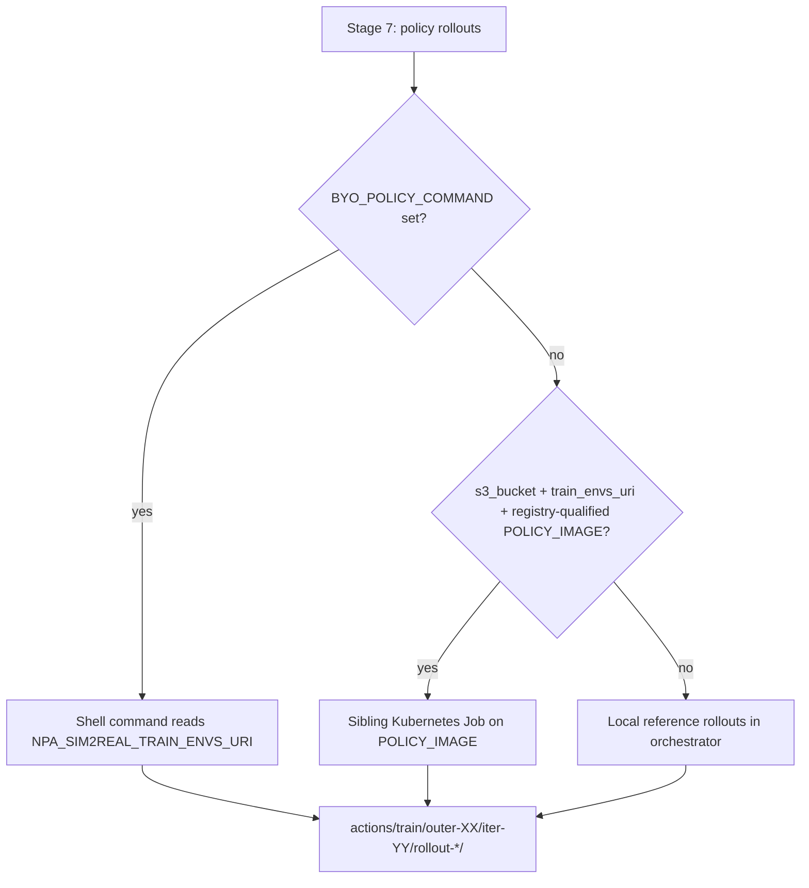

# Sim2Real — Customer asset handoff

**Audience:** What the customer **uploads** (trigger, scene, robot) vs NPA stock smoke paths.

**Data types (schemas, LeRobot vs NPA JSON):** [sim2real-data-contracts.md](./sim2real-data-contracts.md) — read that first if URIs are confusing.

**Also:** [sim2real-workflow.md](./sim2real-workflow.md) · [sim2real-architecture.md](./sim2real-architecture.md) · [sim2real-demo-script-10min.md](./sim2real-demo-script-10min.md)

---

## Configuration reference

| Concern | Where to set | Example vars |
| --- | --- | --- |
| Sim assets (scene/robot/cameras) | BYO URIs, stage 2 assets, operator env | `ASSETS_URI`, `SCENE_SPEC_URI`, `CAMERAS_URI`, `NPA_SIM2REAL_CAMERAS_URI`, `ROBOT_SPEC_URI`, `NPA_SIM2REAL_ROBOT_SPEC_URI`, `ROBOT_PRESET`, `NPA_SIM2REAL_ROBOT_PRESET` |
| Artifact bucket vs trigger bucket | `config.yaml`, operator env, runbook `NPA_SIM2REAL_*` | `NPA_SIM2REAL_BUCKET` (alias `S3_BUCKET`), `NPA_SIM2REAL_TRIGGER_DATASET_URI` (alias `TRIGGER_DATASET_URI`), `storage.bucket`, `storage.sim2real_stock_trigger_uri` |
| External object-store bucket | endpoint + HMAC keys | `AWS_ENDPOINT_URL`, `S3_ENDPOINT_URL`, `storage.endpoint_url`, `~/.npa/credentials.yaml` `storage.aws_*` |
| LeRobot custom/trigger dataset | trigger URI, dataset id | `NPA_SIM2REAL_TRIGGER_DATASET_URI`, `NPA_SIM2REAL_TRIGGER_DATASET_ID` (alias `TRIGGER_DATASET_ID`), default `lerobot/pusht` |
| Custom container images | operator env before submit | `AUGMENT_IMAGE`, `ENVGEN_IMAGE`, `POLICY_IMAGE`, `VLM_IMAGE`, `EVAL_IMAGE`, `TRAINER_IMAGE`, `ISAAC_IMAGE`, `NPA_SIM2REAL_RERUN_IMAGE` |

Trace env names from `ops/private/sim2real-rtxpro/submit-k8s-staged-job.sh`, `runbook.yaml` `envs:`, and `npa.workflows.sim2real.config.build_config_from_env`.

---

## Stock smoke vs customer production

| Path | When to use |
| --- | --- |
| **`stock-smoke`** | Platform validation — LeRobot trigger only, stock Franka/table/cameras |
| **`industrial`** | Production — UR/Flexiv URDF, OBJ parts, scene fixtures, custom cameras together |

Each onboarding axis is independent in one profile:

| Axis | Modes | Customer upload |
| --- | --- | --- |
| **Robot** | `stock_franka` / `preset` / `byo` | `robot-spec.json` + URDF at `robot_uri` |
| **Objects** | `none` / `mesh` / `scene_spec` | OBJ/STL/GLB mesh or manipuland block in `SceneSpec` |
| **Scene** | `stock` / `custom` | Static fixtures (`role: static`) in `SceneSpec` |
| **Cameras** | `stock` / `custom` | `cameras` block in `SceneSpec` or standalone `cameras.json` |

**Sim backend:** default `isaac` (RT-core held-out). `genesis` remains supported as legacy.

Customer trigger URI and train-env URI definitions: [data contracts § Customer input](./sim2real-data-contracts.md#customer-input-vs-workflow-output).

---

## Asset profiles (one knob, four axes)

```bash
export CUSTOMER_ASSET_PROFILE=industrial
export CUSTOMER_TASK_ID=my-batch-20260614       # substitutes YOUR-TASK-ID in profile URIs
export CUSTOMER_ROBOT_PRESET=flexiv             # optional; default ur5e in industrial profile
./ops/private/sim2real-rtxpro/trigger-pipeline.sh
```

Profiles: `ops/private/sim2real-rtxpro/customer-asset-profiles/*.profile.example`.
Copy to `~/.npa/customer-asset.profile` and set `CUSTOMER_ASSET_PROFILE` to that path.

| Profile | Robot | Scene | Objects | Cameras |
| --- | --- | --- | --- | --- |
| `stock-smoke` | Stock Franka | Stock table | — | Stock |
| `industrial` | UR/Flexiv preset + URDF | Custom fixtures via `SceneSpec` | Mesh or `SceneSpec` | Custom in `SceneSpec` or `CAMERAS_URI` |

Dry-run:

```bash
CUSTOMER_ASSET_PROFILE=industrial ./ops/private/sim2real-rtxpro/apply-customer-asset-profile.sh
```

Customer JSON templates (`YOUR-BUCKET` / `YOUR-TASK-ID` placeholders):

- `examples/customer-assets/robot-spec-ur5e.json.example`
- `examples/customer-assets/robot-spec-flexiv.json.example`
- `examples/customer-assets/scene-part-mesh.json.example` — manipuland only
- `examples/customer-assets/scene-spec-full.json.example` — fixtures + part + cameras
- `examples/customer-assets/cameras-custom.json.example` — standalone camera block

Profile fields:

| Field | Values | Meaning |
| --- | --- | --- |
| `ROBOT_MODE` | `stock_franka` / `preset` / `byo` | Arm selection |
| `ROBOT_PRESET` | `franka` / `ur5e` / `ur10e` / `flexiv` | Preset when not stock Franka |
| `ROBOT_SPEC_URI` | S3 URI | `robot-spec.json` (+ URDF at `robot_uri` inside) |
| `SCENE_MODE` | `stock` / `custom` | Custom uses `ASSETS_URI` and/or `SCENE_SPEC_URI` |
| `OBJECT_MODE` | `none` / `mesh` / `scene_spec` | Manipuland wiring |
| `CAMERA_MODE` | `stock` / `custom` | Custom via `SceneSpec.cameras` or `CAMERAS_URI` |
| `CAMERAS_URI` | S3 URI | Optional separate camera JSON |

---

## Stage 2 — sim assets (implemented)

Stage 2 is live in PR stack [#109](https://github.com/nebius/nebius-physical-ai/pull/109)
(staged runbook + K8s ops) and [#110](https://github.com/nebius/nebius-physical-ai/pull/110)
(mandatory stages + asset materialization). `run_assets_stage()` writes:

| Artifact | Purpose |
| --- | --- |
| `stage_02_assets/consumed_scene_spec.json` | Stock tabletop or BYO mesh / `SceneSpec` with provenance |
| `stage_02_assets/consumed_robot_spec.json` | Franka stock, UR/Flexiv preset metadata, or BYO `RobotSpec` |
| `stage_02_assets/assets_manifest.json` | Stage record merged into `workflow_state.json` |

Those URIs flow into envgen (`build_envgen_scene_spec`). Each env record carries an
`embodiment` block (`robot_preset`, `robot_spec_uri`, `sim_backend`, cameras).

### Stock path (no customer upload)

When `ASSETS_URI` and `SCENE_SPEC_URI` are empty:

- Scene status: `stock_tabletop`
- Robot status: `stock_franka` (preset `franka`, source `stock_franka`)
- Component tier: **WORKS**

### BYO scene path

Set **one of**:

- `SCENE_SPEC_URI` — full `SceneSpec` JSON on object storage
- `ASSETS_URI` — directory or single mesh; synthesized into a minimal `SceneSpec`

BYO meshes are downloaded and validated in Stage 2 (sha256 + provenance). A failed
download **raises** — there is no silent fallback to stock geometry.

### BYO robot path — Franka today; UR / Flexiv next

| Preset (`ROBOT_PRESET`) | Monday status | Customer action |
| --- | --- | --- |
| `franka` (default) | **WORKS** — built-in MJCF / Isaac Franka hint | None |
| `ur5e`, `ur10e` | **SEAM** — `preset_pending_urdf` | Upload articulated URDF (+ meshes) via `ROBOT_SPEC_URI` or `robot_source` |
| `flexiv`, `flexiv_rizon`, `rizon` | **SEAM** — `preset_pending_urdf` | Same as UR: URDF required; visual-only meshes are rejected |

Presets seed joint names, EE link, and Isaac hints. Until the URDF lands, envgen and
eval record the preset metadata; held-out rollouts enforce load success for BYO robots
(**no silent fallback to Franka** on eval).

Full override: `ROBOT_SPEC_URI` pointing at `npa.sim2real.robot_spec.v1` JSON.

Wire all customer asset seams at submit (CLI flag, SDK kwarg, and YAML env are 1:1 —
see [runbook README](../../../npa/workflows/workbench/sim2real/README.md#one-byo-seam-one-value)):

```bash
# Trigger only (Monday stock run)
export NPA_SIM2REAL_TRIGGER_DATASET_URI="s3://<bucket>/sim2real-triggers/<run-id>/lerobot-<task>/"

# Optional BYO (same submit — set profile or env vars directly)
export ASSETS_URI="s3://<bucket>/sim2real-assets/<task>/"
export SCENE_SPEC_URI="s3://<bucket>/sim2real-assets/<task>/scene-spec.json"
export CAMERAS_URI="s3://<bucket>/sim2real-assets/<task>/cameras.json"
export ROBOT_PRESET="ur5e"
export ROBOT_SPEC_URI="s3://<bucket>/sim2real-assets/<task>/robot-spec.json"
```

---

## Stage 7 — `POLICY_IMAGE` seam

Policy rollouts are swappable at three tiers (first match wins in `run_policy_rollouts`):



| Mode | When | Tier in report |
| --- | --- | --- |
| **K8s policy job** | `s3_bucket` set, `train_envs_uri` is `s3://…`, `POLICY_IMAGE` is registry-qualified (not a `${…}` placeholder) | **WORKS** |
| **SEAM placeholder fallback** | Bucket set but `POLICY_IMAGE` is missing, bare tag, or unresolved placeholder | **SEAM** — deterministic reference rollouts (`generate_action_rollouts`) until a real image is pushed |
| **Local reference** | No `s3_bucket` (smoke / unit tests) | **WORKS** for offline validation |
| **`BYO_POLICY_COMMAND`** | Operator shell hook | **WORKS** when command writes conforming rollout dirs |

The policy container receives `NPA_SIM2REAL_TRAIN_ENVS_URI` (the **workflow-generated**
train shard, not the trigger dataset). Override the image at submit:

```bash
export POLICY_IMAGE="<registry>/npa-sim2real-reference-policy:0.1.2"
# Optional shell swap:
export BYO_POLICY_COMMAND='your-policy-rollout-hook.sh'
```

Same placeholder pattern applies to **`AUGMENT_IMAGE`** at Stage 3: unresolved image →
reference augment locally, component tier **SEAM** until the operator pushes a
registry-qualified Cosmos Transfer image.

---

## S3 layout

See [sim2real-data-contracts.md § S3 layout](./sim2real-data-contracts.md#artifact-paths).

---

## Production handoff scorecard (13-step reference pipeline)

Tier key: **WORKS** = executable on Nebius today; **PARTIAL** = orchestrated but not
full vendor fidelity; **SEAM** = documented plug point or placeholder fallback until
the operator supplies a registry-qualified image or customer asset.

| Step | Pipeline stage | NPA fit | Notes |
| --- | --- | --- | --- |
| 1 | LeRobot trigger | **WORKS** | `NPA_SIM2REAL_TRIGGER_DATASET_URI` at submit |
| 2 | LanceDB curation | **SEAM** | Trigger path only; no LanceDB stage |
| 3 | Cosmos augment | **WORKS** / **SEAM** | Cosmos Transfer 2.5 K8s job when `AUGMENT_IMAGE` qualified; else reference augment |
| 4 | Sim assets / catalog | **WORKS** | Stock SceneSpec + Franka; BYO mesh / SceneSpec / RobotSpec; UR/Flexiv pending URDF |
| 5 | 10K envgen | **WORKS** | `NPA_ENV_COUNT=10000` via `sim2real_envgen` |
| 6 | 80/20 split | **WORKS** | `NPA_TRAIN_FRACTION=0.8`; state carries `train_envs_uri` / `heldout_envs_uri` |
| 7 | Policy action rollouts | **WORKS** / **SEAM** | `POLICY_IMAGE` K8s job when qualified; placeholder → reference rollouts; `BYO_POLICY_COMMAND` |
| 8–9 | VLM + RL trainer | **WORKS** | Cosmos3 Reason + LeRobot VLM-signal trainer on cluster |
| 10 | Held-out eval | **PARTIAL** | Genesis or Isaac Lab rollouts; BYO robot/scene must load (no silent Franka fallback) |
| 11 | Threshold gate | **WORKS** | Promote vs loop-back |
| 12 | Real-world validation | **SEAM** | `stage_12_external_validation/external_stub.json` — customer deploys checkpoint |
| 13 | Next batch | **Explicit trigger** | Customer uploads new LeRobot batch + runs `trigger-pipeline.sh` (no S3 polling) |

**Overall:** ~**80%** as an NPA orchestration framework on RTX PRO class GPUs; ~**20%**
gap is third-party asset catalogs, LanceDB stage, live real-world loop, and UR/Flexiv
URDF upload before full embodiment parity.

**PR stack:** [#109](https://github.com/nebius/nebius-physical-ai/pull/109) staged
runbook + direct K8s submit (`ops/private/sim2real-rtxpro/submit-k8s-staged-job.sh`);
[#110](https://github.com/nebius/nebius-physical-ai/pull/110) mandatory stages +
Stage 2 asset materialization + `POLICY_IMAGE` / augment placeholder fallbacks.

---

## Preflight

Validate trigger path, optional asset URIs, and image seams before submit:

```bash
npa workbench health sim2real \
  --s3-bucket <bucket> \
  --s3-endpoint <your-s3-compatible-endpoint> \
  --trigger-dataset-uri "s3://<bucket>/sim2real-triggers/<run-id>/lerobot-<task>/" \
  --policy-image "<registry>/npa-sim2real-reference-policy:0.1.2"
```

Add `--assets-uri` and `--scene-spec-uri` when testing BYO scene wiring.

---

## Customer onboarding checklist

1. **Upload** — Land a complete **LeRobot dataset** at your chosen S3 prefix.
2. **Trigger** — `export TRIGGER_DATASET_URI=s3://…/` then `./ops/private/sim2real-rtxpro/trigger-pipeline.sh` (or workflow submit with the same URI).
3. **Robot** — For production: `ROBOT_PRESET` + `ROBOT_SPEC_URI` (UR/Flexiv URDF). Stock Franka is smoke-only.
4. **Images** — Registry-qualified `POLICY_IMAGE`, `AUGMENT_IMAGE`, `VLM_IMAGE`, etc.
5. **Real-world loop** — Deploy promoted checkpoint (BYO), collect new data, upload, trigger again.

---

## Real-world policy deployment (Stage 12 seam)

NPA sim2real **trains and evaluates in simulation** and writes promote artifacts to
S3. It does **not** push a policy to customer hardware automatically.

### What lands on S3 after promote (Stage 11)

Run prefix: `s3://<bucket>/sim2real-b/<run-id>/`

| Path | Format | Contents |
| --- | --- | --- |
| `checkpoints/candidate/candidate.json` | `npa.sim2real.candidate_checkpoint.v1` | Promote record: run id, held-out success rate, threshold |
| `outer_loop/decision.json` | `npa.sim2real.threshold_decision.v1` | `promote_checkpoint` + local `checkpoint_uri` |
| `inner_loop/outer-XX/evidence.json` | inner-loop evidence | Reference trainer `policy_output_after` (action bias), not LeRobot weights |
| `stage_12_external_validation/external_stub.json` | `npa.sim2real.external_stub.v1` | **SEAM** — documents `input_checkpoint`; no robot deploy |
| `eval/heldout/report.json` | `npa.sim2real.heldout_eval.v1` | Held-out `success_rate`, `threshold`, per-env scores (stage 10) |
| `reports/sim2real-report.json` | `npa.sim2real.e2e_report.v1` | E2E summary + `rerun_serve.public_url` when auto-serve ran |

Fetch and inspect (replace bucket/run id):

```bash
PREFIX=s3://<bucket>/sim2real-b/<run-id>
aws s3 cp "${PREFIX}/outer_loop/decision.json" - --endpoint-url "${AWS_ENDPOINT_URL}" \
  | jq '{decision, success_rate, threshold, checkpoint_uri}'
aws s3 cp "${PREFIX}/checkpoints/candidate/candidate.json" - --endpoint-url "${AWS_ENDPOINT_URL}" \
  | jq '{run_id, success_rate, threshold}'
aws s3 cp "${PREFIX}/inner_loop/outer-01/evidence.json" - --endpoint-url "${AWS_ENDPOINT_URL}" \
  | jq '{policy_output_after: (.policy_output_after|keys), reward_trend}'
aws s3 cp "${PREFIX}/stage_12_external_validation/external_stub.json" - --endpoint-url "${AWS_ENDPOINT_URL}" \
  | jq '{input_checkpoint, status}'
```

The reference VLM→RL loop updates a lightweight policy representation inside the
orchestrator. It does **not** emit a LeRobot `pretrained_model/` checkpoint tree
suitable for `npa workbench lerobot serve` without a BYO trainer or export step.

### What the customer deploys

| Deployable today | Status | Notes |
| --- | --- | --- |
| Promote metadata JSON on S3 | **WORKS** | Audit / handoff record |
| LeRobot policy checkpoint for robot | **SEAM (BYO)** | Customer maps trainer output or runs `BYO_TRAINER_COMMAND` to write deployable weights |
| `POLICY_IMAGE` container | **WORKS** in sim | Stage 7 rollouts in cluster — not the on-robot runtime |
| New LeRobot trigger batch | **WORKS** | Stage 13 retrigger → upload dataset → `trigger-pipeline.sh` |

### Suggested BYO robot flow

1. Wait for `outer_loop/decision.json` with `"decision": "promote_checkpoint"`.
2. Export or convert your policy to a LeRobot-compatible checkpoint on S3 (BYO
   trainer hook or offline export from inner-loop evidence).
3. On the robot workstation or edge server:
   `npa workbench lerobot serve --input-path s3://<bucket>/policies/<run-id>/`
   (see [LeRobot skill](../../../skills/tools/lerobot/SKILL.md)).
4. Run hardware episodes; upload a new LeRobot dataset to your trigger prefix.
5. Re-run the workflow with `NPA_SIM2REAL_TRIGGER_DATASET_URI` pointing at the new batch.

Stage 12 remains a **documented external-validation stub** until a customer wires
real-world eval (success metrics, safety checks) into their MLOps stack.
