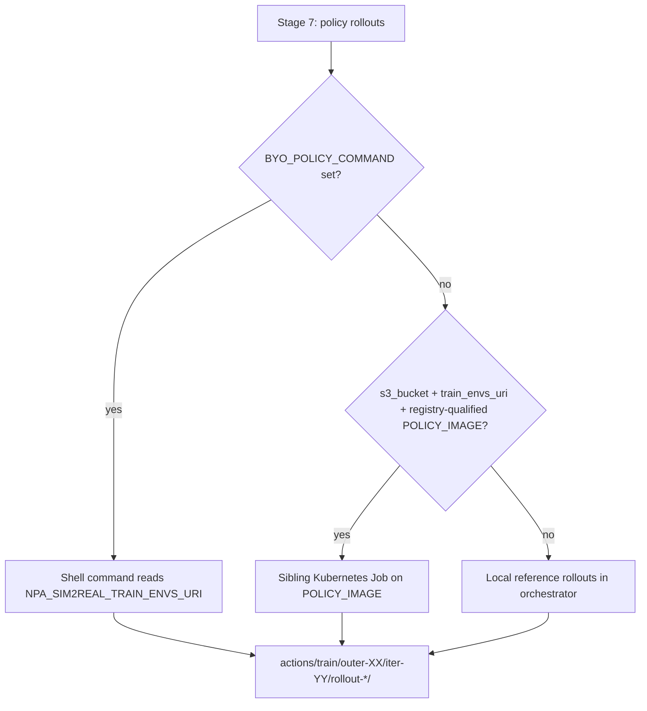

# Sim2Real — Customer asset handoff

**Audience:** Platform operators and robotics teams wiring a first production run  
**Companion docs:** [sim2real-workflow.md](./sim2real-workflow.md) (operator guide),
[sim2real-architecture.md](./sim2real-architecture.md) (stage map),
[sim2real-demo-script-10min.md](./sim2real-demo-script-10min.md) (Monday walkthrough)

This guide answers what a customer **brings** versus what NPA **ships stock** for the
13-stage sim-to-real loop. Language is generic — no project-specific names.

---

## Monday default: stock Franka tabletop

For a first cluster run, supply **only the trigger dataset**. Leave scene and robot
asset URIs empty; Stage 2 materializes stock specs automatically.

| Category | Monday plan | Formats (when you BYO later) |
| --- | --- | --- |
| **1. Robot / embodiment** | **Stock** — Franka Emika Panda (`ROBOT_PRESET=franka`, default) | Later: UR5e / UR10e / Flexiv presets + articulated URDF, or full `RobotSpec` JSON |
| **2. Manipulated objects** | **Stock** — tabletop manipuland bundled with the sim backend | Later: OBJ / STL / GLB / PLY / USD per object + dimensions / mass |
| **3. Scene / environment** | **Stock** — table + simple workspace (Genesis or Isaac defaults) | Later: fixture meshes or `SceneSpec` JSON / USD layout |
| **4. Cameras / sensors** | **Stock** — workspace overhead + wrist EE-mounted (640×480) | Later: custom poses / intrinsics in `SceneSpec` |

**Sim backend** (`NPA_SIM2REAL_SIM_BACKEND`): default is `isaac` (Isaac stock tabletop,
`lift_cube`). Set `genesis` for the Genesis primitive tabletop. Both write the same
consumed-spec schema for downstream envgen and held-out eval.

---

## What you submit vs what the workflow writes

Two URIs are often confused. They are **not interchangeable**.

| URI | Who sets it | When | What it is |
| --- | --- | --- | --- |
| **`NPA_SIM2REAL_TRIGGER_DATASET_URI`** | **Customer / operator** | At workflow submit | LeRobot-format **real-robot demonstration data** that starts the run. Example layout: `s3://<bucket>/sim2real-triggers/<run-id>/lerobot-<task>/` |
| **`TRAIN_ENVS_URI`** (`train_envs_uri` in state) | **Workflow** (Stages 4–6) | After envgen + 80/20 split | **Synthetic simulation environments** (~8K train shard when `NPA_ENV_COUNT=10000`). Written to `state/workflow_state.json` and `envs/train/` — **not** a robot asset. |

**Rule of thumb:** you land data in the **trigger** path; the loop generates **train
envs** and feeds them (among other artifacts) into Stage 7 policy rollouts.

Optional operator override: set `TRAIN_ENVS_URI` only when resuming or replaying a
prior run's train shard — not for initial customer onboarding.

---

## Stage 2 — sim assets (implemented)

Stage 2 is live in PR stack [#109](https://github.com/nebius/nebius-physical-ai/pull/109)
(staged runbook + K8s ops) and [#110](https://github.com/nebius/nebius-physical-ai/pull/110)
(mandatory stages + asset materialization). `run_assets_stage()` writes:

| Artifact | Purpose |
| --- | --- |
| `stage_02_assets/consumed_scene_spec.json` | Stock tabletop or BYO mesh / `SceneSpec` with provenance |
| `stage_02_assets/consumed_robot_spec.json` | Franka stock, UR/Flexiv preset metadata, or BYO `RobotSpec` |
| `stage_02_assets/assets_manifest.json` | Stage record merged into `workflow_state.json` |

Those URIs flow into envgen (`build_envgen_scene_spec`). Each env record carries an
`embodiment` block (`robot_preset`, `robot_spec_uri`, `sim_backend`, cameras).

### Stock path (no customer upload)

When `ASSETS_URI` and `SCENE_SPEC_URI` are empty:

- Scene status: `stock_tabletop`
- Robot status: `stock_franka` (preset `franka`, source `stock_franka`)
- Component tier: **WORKS**

### BYO scene path

Set **one of**:

- `SCENE_SPEC_URI` — full `SceneSpec` JSON on object storage
- `ASSETS_URI` — directory or single mesh; synthesized into a minimal `SceneSpec`

BYO meshes are downloaded and validated in Stage 2 (sha256 + provenance). A failed
download **raises** — there is no silent fallback to stock geometry.

### BYO robot path — Franka today; UR / Flexiv next

| Preset (`ROBOT_PRESET`) | Monday status | Customer action |
| --- | --- | --- |
| `franka` (default) | **WORKS** — built-in MJCF / Isaac Franka hint | None |
| `ur5e`, `ur10e` | **SEAM** — `preset_pending_urdf` | Upload articulated URDF (+ meshes) via `ROBOT_SPEC_URI` or `robot_source` |
| `flexiv`, `flexiv_rizon`, `rizon` | **SEAM** — `preset_pending_urdf` | Same as UR: URDF required; visual-only meshes are rejected |

Presets seed joint names, EE link, and Isaac hints. Until the URDF lands, envgen and
eval record the preset metadata; held-out rollouts enforce load success for BYO robots
(**no silent fallback to Franka** on eval).

Full override: `ROBOT_SPEC_URI` pointing at `npa.sim2real.robot_spec.v1` JSON.

Wire all customer asset seams at submit (CLI flag, SDK kwarg, and YAML env are 1:1 —
see [runbook README](../../../npa/workflows/workbench/sim2real/README.md#one-byo-seam-one-value)):

```bash
# Trigger only (Monday stock run)
export NPA_SIM2REAL_TRIGGER_DATASET_URI="s3://<bucket>/sim2real-triggers/<run-id>/lerobot-<task>/"

# Optional BYO (later)
export ASSETS_URI="s3://<bucket>/sim2real-assets/<task>/"
export SCENE_SPEC_URI="s3://<bucket>/sim2real-assets/<task>/scene-spec.json"
export ROBOT_PRESET="ur5e"                                    # or franka (default)
export ROBOT_SPEC_URI="s3://<bucket>/sim2real-assets/<task>/robot-spec.json"
```

---

## Stage 7 — `POLICY_IMAGE` seam

Policy rollouts are swappable at three tiers (first match wins in `run_policy_rollouts`):



| Mode | When | Tier in report |
| --- | --- | --- |
| **K8s policy job** | `s3_bucket` set, `train_envs_uri` is `s3://…`, `POLICY_IMAGE` is registry-qualified (not a `${…}` placeholder) | **WORKS** |
| **SEAM placeholder fallback** | Bucket set but `POLICY_IMAGE` is missing, bare tag, or unresolved placeholder | **SEAM** — deterministic reference rollouts (`generate_action_rollouts`) until a real image is pushed |
| **Local reference** | No `s3_bucket` (smoke / unit tests) | **WORKS** for offline validation |
| **`BYO_POLICY_COMMAND`** | Operator shell hook | **WORKS** when command writes conforming rollout dirs |

The policy container receives `NPA_SIM2REAL_TRAIN_ENVS_URI` (the **workflow-generated**
train shard, not the trigger dataset). Override the image at submit:

```bash
export POLICY_IMAGE="<registry>/npa-sim2real-reference-policy:0.1.1"
# Optional shell swap:
export BYO_POLICY_COMMAND='your-policy-rollout-hook.sh'
```

Same placeholder pattern applies to **`AUGMENT_IMAGE`** at Stage 3: unresolved image →
reference augment locally, component tier **SEAM** until the operator pushes a
registry-qualified Cosmos Transfer image.

---

## Canonical S3 layout (generic)

```text
s3://<bucket>/sim2real-triggers/<run-id>/lerobot-<task>/   # INPUT: customer trigger
s3://<bucket>/sim2real-assets/<task>/                       # OPTIONAL: BYO meshes / specs
s3://<bucket>/<prefix>/<run-id>/                            # OUTPUT: per-run artifact tree
  stage_02_assets/consumed_scene_spec.json
  stage_02_assets/consumed_robot_spec.json
  envs/train/                    # ~8K train shard (NPA_ENV_COUNT=10000)
  envs/heldout/
  actions/train/outer-XX/iter-YY/
  reports/sim2real-report.json
```

---

## Production handoff scorecard (13-step reference pipeline)

Tier key: **WORKS** = executable on Nebius today; **PARTIAL** = orchestrated but not
full vendor fidelity; **SEAM** = documented plug point or placeholder fallback until
the operator supplies a registry-qualified image or customer asset.

| Step | Pipeline stage | NPA fit | Notes |
| --- | --- | --- | --- |
| 1 | LeRobot trigger | **WORKS** | `NPA_SIM2REAL_TRIGGER_DATASET_URI` at submit |
| 2 | LanceDB curation | **SEAM** | Trigger path only; no LanceDB stage |
| 3 | Cosmos augment | **WORKS** / **SEAM** | Cosmos Transfer 2.5 K8s job when `AUGMENT_IMAGE` qualified; else reference augment |
| 4 | Sim assets / catalog | **WORKS** | Stock SceneSpec + Franka; BYO mesh / SceneSpec / RobotSpec; UR/Flexiv pending URDF |
| 5 | 10K envgen | **WORKS** | `NPA_ENV_COUNT=10000` via `sim2real_envgen` |
| 6 | 80/20 split | **WORKS** | `NPA_TRAIN_FRACTION=0.8`; state carries `train_envs_uri` / `heldout_envs_uri` |
| 7 | Policy action rollouts | **WORKS** / **SEAM** | `POLICY_IMAGE` K8s job when qualified; placeholder → reference rollouts; `BYO_POLICY_COMMAND` |
| 8–9 | VLM + RL trainer | **WORKS** | Cosmos3 Reason + LeRobot VLM-signal trainer on cluster |
| 10 | Held-out eval | **PARTIAL** | Genesis or Isaac Lab rollouts; BYO robot/scene must load (no silent Franka fallback) |
| 11 | Threshold gate | **WORKS** | Promote vs loop-back |
| 12 | Real-world validation | **SEAM** | `stage_12_external_validation/external_stub.json` |
| 13 | Retrigger | **SEAM** | Record only; no auto S3 watcher |

**Overall:** ~**80%** as an NPA orchestration framework on RTX PRO class GPUs; ~**20%**
gap is third-party asset catalogs, LanceDB stage, live real-world loop, and UR/Flexiv
URDF upload before full embodiment parity.

**PR stack:** [#109](https://github.com/nebius/nebius-physical-ai/pull/109) staged
runbook + direct K8s submit (`ops/private/sim2real-rtxpro/submit-k8s-staged-job.sh`);
[#110](https://github.com/nebius/nebius-physical-ai/pull/110) mandatory stages +
Stage 2 asset materialization + `POLICY_IMAGE` / augment placeholder fallbacks.

---

## Preflight

Validate trigger path, optional asset URIs, and image seams before submit:

```bash
npa workbench health sim2real \
  --s3-bucket <bucket> \
  --s3-endpoint <your-s3-compatible-endpoint> \
  --trigger-dataset-uri "s3://<bucket>/sim2real-triggers/<run-id>/lerobot-<task>/" \
  --policy-image "<registry>/npa-sim2real-reference-policy:0.1.1"
```

Add `--assets-uri` and `--scene-spec-uri` when testing BYO scene wiring.

---

## Customer onboarding checklist

1. **Trigger** — Land a LeRobot dataset at `NPA_SIM2REAL_TRIGGER_DATASET_URI`.
2. **Stock run** — Omit `ASSETS_URI` / `SCENE_SPEC_URI`; keep `ROBOT_PRESET=franka`.
3. **Images** — Push registry-qualified `POLICY_IMAGE`, `AUGMENT_IMAGE`, `VLM_IMAGE`,
   `TRAINER_IMAGE`, `EVAL_IMAGE` (or accept **SEAM** reference fallbacks for policy/augment).
4. **Scale** — Set `NPA_ENV_COUNT=10000`, `NPA_TRAIN_FRACTION=0.8` for production envgen.
5. **Later BYO** — Add scene meshes or `SceneSpec`; add UR/Flexiv URDF when ready.
6. **Inspect** — After preamble, open `consumed_*_spec.json` and confirm
   `train_envs_uri` in `state/workflow_state.json` before the outer loop starts.
