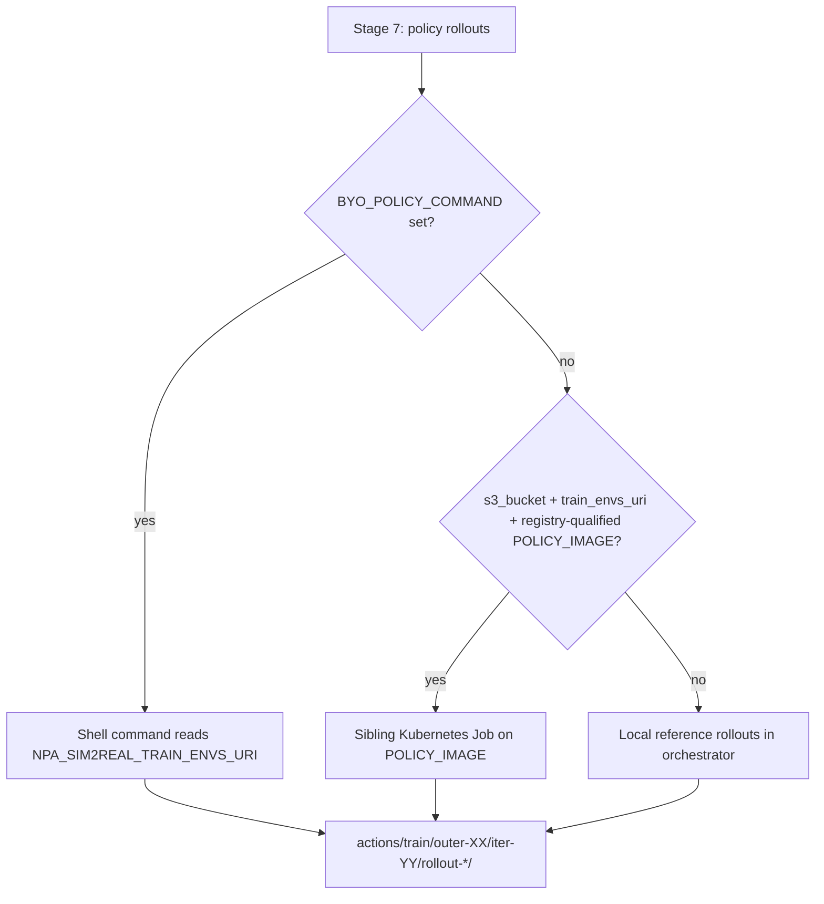

# Sim2Real — Customer asset handoff

**Audience:** What the customer **uploads** (trigger, scene, robot) vs NPA stock smoke paths.

**Data types (schemas, LeRobot vs NPA JSON):** [sim2real-data-contracts.md](./sim2real-data-contracts.md) — read that first if URIs are confusing.

**Also:** [sim2real-workflow.md](./sim2real-workflow.md) · [sim2real-architecture.md](./sim2real-architecture.md) · [sim2real-demo-script-10min.md](./sim2real-demo-script-10min.md)

---

## Configuration reference

| Concern | Where to set | Example vars |
| --- | --- | --- |
| Sim assets (scene/robot/cameras) | BYO URIs, stage 2 assets, operator env | `ASSETS_URI`, `SCENE_SPEC_URI`, `CAMERAS_URI`, `NPA_SIM2REAL_CAMERAS_URI`, `ROBOT_SPEC_URI`, `NPA_SIM2REAL_ROBOT_SPEC_URI`, `ROBOT_PRESET`, `NPA_SIM2REAL_ROBOT_PRESET` |
| Artifact bucket vs trigger bucket | `config.yaml`, operator env, runbook `NPA_SIM2REAL_*` | `NPA_SIM2REAL_BUCKET` (alias `S3_BUCKET`), `NPA_SIM2REAL_TRIGGER_DATASET_URI` (alias `TRIGGER_DATASET_URI`), `storage.bucket`, `storage.sim2real_stock_trigger_uri` |
| External object-store bucket | endpoint + HMAC keys | `AWS_ENDPOINT_URL`, `S3_ENDPOINT_URL`, `storage.endpoint_url`, `~/.npa/credentials.yaml` `storage.aws_*` |
| Task seed/trigger dataset | trigger URI, dataset id | `NPA_SIM2REAL_TRIGGER_DATASET_URI`, `NPA_SIM2REAL_TRIGGER_DATASET_ID` (alias `TRIGGER_DATASET_ID`), default `npa/isaac-lift-cube-franka-seed-v1`; real mode requires a matching `task-dataset-manifest.json` and fails closed on PushT/Franka mismatch |
| Custom container images | operator env before submit | `AUGMENT_IMAGE`, `ENVGEN_IMAGE`, `POLICY_IMAGE`, `VLM_IMAGE`, `EVAL_IMAGE`, `TRAINER_IMAGE`, `ISAAC_IMAGE`, `NPA_SIM2REAL_RERUN_IMAGE` |

Trace portable inputs from `npa/workflows/workbench/npa-workflows/sim2real.yaml` `config:` and the stateless `workflow_stage` adapters.

---

## Stock smoke vs customer production

| Path | When to use |
| --- | --- |
| **`stock-smoke`** | Platform validation — task-aligned Isaac lift seed, stock Franka/table/cameras |
| **`industrial`** | Production — UR/Flexiv URDF, OBJ parts, scene fixtures, custom cameras together |

Each onboarding axis is independent in one profile:

| Axis | Modes | Customer upload |
| --- | --- | --- |
| **Robot** | `stock_franka` / `preset` / `byo` | `robot-spec.json` + URDF at `robot_uri` |
| **Objects** | `none` / `mesh` / `scene_spec` | OBJ/STL/GLB mesh or manipuland block in `SceneSpec` |
| **Scene** | `stock` / `custom` | Static fixtures (`role: static`) in `SceneSpec` |
| **Cameras** | `stock` / `custom` | `cameras` block in `SceneSpec` or standalone `cameras.json` |

**Sim backend:** default `isaac` (RT-core held-out). `genesis` remains supported as legacy.

Customer trigger URI and train-env URI definitions: [data contracts § Customer input](./sim2real-data-contracts.md#customer-input-vs-workflow-output).

---

## Asset profiles (one knob, four axes)

```bash
export CUSTOMER_ASSET_PROFILE=industrial
export CUSTOMER_TASK_ID=my-batch-20260614       # substitutes YOUR-TASK-ID in profile URIs
export CUSTOMER_ROBOT_PRESET=flexiv             # optional; default ur5e in industrial profile
<private-operator-pack>/sim2real-rtxpro/trigger-pipeline.sh
```

Profiles: `<private-operator-pack>/sim2real-rtxpro/customer-asset-profiles/*.profile.example`.
Copy to `~/.npa/customer-asset.profile` and set `CUSTOMER_ASSET_PROFILE` to that path.

| Profile | Robot | Scene | Objects | Cameras |
| --- | --- | --- | --- | --- |
| `stock-smoke` | Stock Franka | Stock table | — | Stock |
| `industrial` | UR/Flexiv preset + URDF | Custom fixtures via `SceneSpec` | Mesh or `SceneSpec` | Custom in `SceneSpec` or `CAMERAS_URI` |

Dry-run:

```bash
CUSTOMER_ASSET_PROFILE=industrial <private-operator-pack>/sim2real-rtxpro/apply-customer-asset-profile.sh
```

Customer JSON templates (`YOUR-BUCKET` / `YOUR-TASK-ID` placeholders):

- `examples/customer-assets/robot-spec-ur5e.json.example`
- `examples/customer-assets/robot-spec-flexiv.json.example`
- `examples/customer-assets/scene-part-mesh.json.example` — manipuland only
- `examples/customer-assets/scene-spec-full.json.example` — fixtures + part + cameras
- `examples/customer-assets/cameras-custom.json.example` — standalone camera block

Profile fields:

| Field | Values | Meaning |
| --- | --- | --- |
| `ROBOT_MODE` | `stock_franka` / `preset` / `byo` | Arm selection |
| `ROBOT_PRESET` | `franka` / `ur5e` / `ur10e` / `flexiv` | Preset when not stock Franka |
| `ROBOT_SPEC_URI` | S3 URI | `robot-spec.json` (+ URDF at `robot_uri` inside) |
| `SCENE_MODE` | `stock` / `custom` | Custom uses `ASSETS_URI` and/or `SCENE_SPEC_URI` |
| `OBJECT_MODE` | `none` / `mesh` / `scene_spec` | Manipuland wiring |
| `CAMERA_MODE` | `stock` / `custom` | Custom via `SceneSpec.cameras` or `CAMERAS_URI` |
| `CAMERAS_URI` | S3 URI | Optional separate camera JSON |

---

## Stage 2 — sim assets (implemented)

Stage 2 is live in PR stack [#109](https://github.com/nebius/nebius-physical-ai/pull/109)
(staged runbook + K8s ops) and [#110](https://github.com/nebius/nebius-physical-ai/pull/110)
(mandatory stages + asset materialization). `run_assets_stage()` writes:

| Artifact | Purpose |
| --- | --- |
| `stage_02_assets/consumed_scene_spec.json` | Stock tabletop or BYO mesh / `SceneSpec` with provenance |
| `stage_02_assets/consumed_robot_spec.json` | Franka stock, UR/Flexiv preset metadata, or BYO `RobotSpec` |
| `stage_02_assets/assets_manifest.json` | Stage record merged into `workflow_state.json` |

Those URIs flow into envgen (`build_envgen_scene_spec`). Each env record carries an
`embodiment` block (`robot_preset`, `robot_spec_uri`, `sim_backend`, cameras).

### Stock path (no customer upload)

When `ASSETS_URI` and `SCENE_SPEC_URI` are empty:

- Scene status: `stock_tabletop`
- Robot status: `stock_franka` (preset `franka`, source `stock_franka`)
- Component tier: **WORKS**

### BYO scene path

Set **one of**:

- `SCENE_SPEC_URI` — full `SceneSpec` JSON on object storage
- `ASSETS_URI` — directory or single mesh; synthesized into a minimal `SceneSpec`

BYO meshes are downloaded and validated in Stage 2 (sha256 + provenance). A failed
download **raises** — there is no silent fallback to stock geometry.

### Canonical BYO robot path

The canonical YAML exposes `config.robot_spec_uri`. Empty selects the unchanged
stock Franka execution. A non-empty exact S3 object must contain a complete
`npa.sim2real.robot_spec.v1` and causes Stage 2 to validate and content-address the
URDF package. Stage 7 resolves it to Isaac USD; rollout, PPO, validation, gold
evaluation, and final reports enforce the same embodiment and dimensions without
silent Franka fallback. See [the RobotSpec guide](./sim2real-robot-spec.md).

Wire all customer asset seams at submit (CLI flag, SDK kwarg, and YAML env are 1:1 —
see [runbook README](../../../npa/workflows/workbench/sim2real/README.md#one-byo-seam-one-value)):

```bash
# Trigger only (Monday stock run)
export NPA_SIM2REAL_TRIGGER_DATASET_URI="s3://<bucket>/sim2real-triggers/<run-id>/lerobot-<task>/"

# Optional BYO (same submit — set profile or env vars directly)
export ASSETS_URI="s3://<bucket>/sim2real-assets/<task>/"
export SCENE_SPEC_URI="s3://<bucket>/sim2real-assets/<task>/scene-spec.json"
export CAMERAS_URI="s3://<bucket>/sim2real-assets/<task>/cameras.json"
export ROBOT_PRESET="ur5e"
ROBOT_SPEC_URI="s3://<bucket>/sim2real-assets/<task>/robot-spec.json"
npa workbench workflow submit npa/workflows/workbench/npa-workflows/sim2real.yaml \
  --runtime --var robot_spec_uri="$ROBOT_SPEC_URI" # plus required runtime vars
```

---

## Stage 7 — `POLICY_IMAGE` seam

Policy rollouts are swappable at three tiers (first match wins in `run_policy_rollouts`):


```mermaid
flowchart TD
  START["Stage 7: policy rollouts"] --> BYO{"BYO_POLICY_COMMAND set?"}
  BYO -->|yes| CMD["Shell command reads NPA_SIM2REAL_TRAIN_ENVS_URI"]
  BYO -->|no| K8S{"s3_bucket + train_envs_uri + registry-qualified POLICY_IMAGE?"}
  K8S -->|yes| JOB["Sibling Kubernetes Job on POLICY_IMAGE"]
  K8S -->|no| REF["Local reference rollouts in orchestrator"]
  CMD --> OUT["actions/train/outer-XX/iter-YY/rollout-*/"]
  JOB --> OUT
  REF --> OUT
```

| Mode | When | Tier in report |
| --- | --- | --- |
| **K8s policy job** | `s3_bucket` set, `train_envs_uri` is `s3://…`, `POLICY_IMAGE` is registry-qualified (not a `${…}` placeholder) | **WORKS** |
| **SEAM placeholder fallback** | Bucket set but `POLICY_IMAGE` is missing, bare tag, or unresolved placeholder | **SEAM** — deterministic reference rollouts (`generate_action_rollouts`) until a real image is pushed |
| **Local reference** | No `s3_bucket` (smoke / unit tests) | **WORKS** for offline validation |
| **`BYO_POLICY_COMMAND`** | Operator shell hook | **WORKS** when command writes conforming rollout dirs |

The policy container receives `NPA_SIM2REAL_TRAIN_ENVS_URI` (the **workflow-generated**
train shard, not the trigger dataset). Override the image at submit:

```bash
export POLICY_IMAGE="<registry>/npa-reference-policy:cuda13-b300-0.1.2-sm80-sm90-sm100-sm103-sm120-20260803T034152Z"
# Optional shell swap:
export BYO_POLICY_COMMAND='your-policy-rollout-hook.sh'
```

Same placeholder pattern applies to **`AUGMENT_IMAGE`** at Stage 3: unresolved image →
reference augment locally, component tier **SEAM** until the operator pushes a
registry-qualified Cosmos Transfer image.

---

## S3 layout

See [sim2real-data-contracts.md § S3 layout](./sim2real-data-contracts.md#s3-layout).

---

## Production handoff scorecard (13-step reference pipeline)

Tier key: **WORKS** = executable on Nebius today; **PARTIAL** = orchestrated but not
full vendor fidelity; **SEAM** = documented plug point or placeholder fallback until
the operator supplies a registry-qualified image or customer asset.

| Step | Pipeline stage | NPA fit | Notes |
| --- | --- | --- | --- |
| 1 | Task-aligned seed trigger | **WORKS** | Verified Isaac trajectory manifest at `NPA_SIM2REAL_TRIGGER_DATASET_URI` |
| 2 | LanceDB curation | **SEAM** | Trigger path only; no LanceDB stage |
| 3 | Cosmos augment | **WORKS** | Canonical submit requires qualified Cosmos Transfer 2.5 and real Job evidence |
| 4 | Sim assets / catalog | **WORKS** | Stock SceneSpec + Franka; BYO RobotSpec validates and content-addresses complete URDF packages |
| 5 | 10K envgen | **WORKS** | `NPA_ENV_COUNT=10000` via `sim2real_envgen` |
| 5–6 | Curated train/validation/gold splits and feature lineage | **WORKS** | `NPA_TRAIN_FRACTION=0.8`; state carries all three disjoint split URIs and Stage 6 declares state-PPO consumption honestly |
| 7 | Policy action rollouts | **WORKS** | Real Isaac standard-workflow task; every frame names the loaded checkpoint |
| 8–9 | VLM + RL trainer | **WORKS** | Cosmos Reason + real Isaac RSL-RL PPO on cluster |
| 10 | Held-out eval | **WORKS** | Candidate-loaded Isaac inference; BYO robot/scene must load with no silent fallback |
| 11 | Threshold gate | **WORKS** | Promote vs loop-back |
| 12 | Real-world validation | **SEAM** | `stage_12_external_validation/external_stub.json` — customer deploys checkpoint |
| 13 | Next batch | **Explicit data gate** | Retriggers only after verified new real failure data or corrected scenario data; no S3 polling |

The remaining intentional seam is Stage 12 external real-world validation.
LanceDB curation and customer embodiment assets are separate capabilities, not
silent substitutions inside the canonical 14-stage qualification run.

---

## Preflight

Validate credentials before submit, then confirm trigger/asset URIs resolve in
object storage:

```bash
npa workbench health preflight
# Confirm the trigger dataset (and optional BYO asset URIs) exist under your bucket.
```

See [sim2real-operate](../../../skills/workflows/sim2real-operate/SKILL.md) for
cluster-side preflight (kube context, registry secret, gated HF models).

---

## Customer onboarding checklist

1. **Upload** — Land a complete task-aligned dataset at your chosen S3 prefix.
   LeRobot format is valid when its task contract matches; the canonical stock
   path uses verified Isaac lift-cube trajectories and never relabels PushT.
2. **Trigger** — `export TRIGGER_DATASET_URI=s3://…/` then `<private-operator-pack>/sim2real-rtxpro/trigger-pipeline.sh` (or workflow submit with the same URI).
3. **Robot** — For production: `ROBOT_PRESET` + `ROBOT_SPEC_URI` (UR/Flexiv URDF). Stock Franka is smoke-only.
4. **Images** — Registry-qualified `POLICY_IMAGE`, `AUGMENT_IMAGE`, `VLM_IMAGE`, etc.
5. **Real-world loop** — Deploy promoted checkpoint (BYO), collect new data, upload, trigger again.

### Capacity-aware GPU placement

Direct-Kubernetes runs accept a preferred product in
`NPA_SIM2REAL_K8S_GPU_PRODUCT` and an ordered surface in
`NPA_SIM2REAL_K8S_GPU_CANDIDATES`. The engine normalizes those values against
actual `nvidia.com/gpu.product` node labels, filters them for the component and
image architecture plus the model/workload VRAM floor, and retries only when Kubernetes reports concrete GPU
capacity or selector evidence. Isaac candidates are limited to L40S and RTX PRO
6000 variants; H100/H200 are never an Isaac fallback. Image pull, credential,
checkpoint, container, and application failures do not change GPU products.
Set `NPA_SIM2REAL_MIN_GPU_VRAM_GB` only when a model requires a stricter floor
than the built-in workload/model rule; an invalid or unsatisfied value fails closed.

The final ComponentRecords expose candidate order, attempts and scheduler
reasons, selected product/node, allocated resource/count, Job name, runtime
image digest, status, duration, and artifact links. Exhausting compatible
candidates blocks the real tier; it never changes to a reference/SEAM backend.

---

## Real-world policy deployment (Stage 12 seam)

NPA sim2real **trains and evaluates in simulation** and writes promote artifacts to
S3. It does **not** push a policy to customer hardware automatically.

### What lands on S3 after promote (Stage 11)

Run prefix: `s3://<bucket>/sim2real-b/<run-id>/`

| Path | Format | Contents |
| --- | --- | --- |
| `checkpoints/candidate/candidate.json` | `npa.sim2real.candidate_checkpoint.v1` | Exact best real `model_*.pt`, SHA-256, size, authenticated download command, and promotion status. Below-threshold runs retain available bytes but set **`deployable_policy: false`**; only passing gates set it true. |
| `outer_loop/decision.json` | `npa.sim2real.threshold_decision.v1` | `promote_checkpoint` or truthful loopback plus the exact S3 `checkpoint_uri` |
| `inner_loop/outer-XX/evidence.json` | inner-loop evidence | Simulator-grounded reward/advantage calibration, PPO telemetry, fixed-validation results, and exact per-iteration checkpoint lineage. |
| `stage_12_external_validation/external_stub.json` | `npa.sim2real.external_stub.v1` | **SEAM** — documents `input_checkpoint`; no robot deploy |
| `eval/gold-heldout/outer-XX/report.json` | `npa.sim2real.heldout_eval.v1` | Final gold-heldout strict stable-placement success, distance diagnostics, decomposed metrics, applied scenario digests, and exact checkpoint proof (stage 10) |
| `reports/sim2real-report.json` | `npa.sim2real.e2e_report.v1` | E2E summary, GPU placement provenance, `policy_access`, recording details, and `rerun_serve.public_url` when auto-serve ran. |

Fetch and inspect (replace bucket/run id):

```bash
PREFIX=s3://<bucket>/sim2real-b/<run-id>
aws s3 cp "${PREFIX}/outer_loop/decision.json" - --endpoint-url "${AWS_ENDPOINT_URL}" \
  | jq '{decision, success_rate, threshold, checkpoint_uri}'
aws s3 cp "${PREFIX}/checkpoints/candidate/candidate.json" - --endpoint-url "${AWS_ENDPOINT_URL}" \
  | jq '{run_id, deployable_policy, policy_checkpoint_uri, policy_checkpoint_sha256, policy_checkpoint_size_bytes, heldout_success_rate, threshold, policy_download_command}'
aws s3 cp "${PREFIX}/inner_loop/outer-01/evidence.json" - --endpoint-url "${AWS_ENDPOINT_URL}" \
  | jq '{policy_output_after: (.policy_output_after|keys), reward_trend}'
aws s3 cp "${PREFIX}/stage_12_external_validation/external_stub.json" - --endpoint-url "${AWS_ENDPOINT_URL}" \
  | jq '{input_checkpoint, status}'
```

The reference VLM→RL loop updates a lightweight policy representation inside the
orchestrator and remains metadata-only. The strict real Isaac path invokes the
BYO RSL-RL trainer and promotes its real PyTorch checkpoint. Rerun visualizes
policy behavior and provides artifact access; it does not execute that checkpoint.

### What the customer deploys

| Deployable today | Status | Notes |
| --- | --- | --- |
| Promote metadata JSON on S3 | **WORKS** | Audit/handoff record; includes byte identity and access instructions when a real `.pt` exists. |
| Isaac RSL-RL PyTorch checkpoint | **WORKS in strict real tier** | `BYO_TRAINER_COMMAND` produces and Stage 11 verifies the promoted `.pt`; the customer still owns on-robot conversion/integration. |
| Reference-mode policy checkpoint for robot | **SEAM (BYO)** | Reference mode emits adapter metadata, not deployable robot weights. |
| `POLICY_IMAGE` container | **WORKS** in sim | Stage 7 rollouts in cluster — not the on-robot runtime |
| New task-aligned trigger batch | **WORKS** | Stage 13 records a retrigger only for verified new failure/corrected scenario data |

### Suggested BYO robot flow

1. Wait for `outer_loop/decision.json` with `"decision": "promote_checkpoint"`.
2. Download the promoted `.pt` using `policy_download_command`, then export or
   convert it to the customer's on-robot format when that runtime does not load
   the Isaac RSL-RL checkpoint directly.
3. On the robot workstation or edge server:
   `npa workbench lerobot serve --input-path s3://<bucket>/policies/<run-id>/`
   (see [LeRobot skill](../../../skills/tools/lerobot/SKILL.md)).
4. Run hardware episodes; upload a new task-aligned dataset and its provenance
   manifest to your trigger prefix.
5. Re-run the workflow with `NPA_SIM2REAL_TRIGGER_DATASET_URI` pointing at the new batch.

Stage 12 remains a **documented external-validation stub** until a customer wires
real-world eval (success metrics, safety checks) into their MLOps stack.
