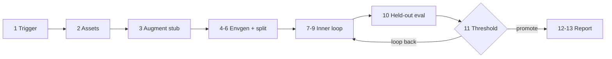

# Sim-to-Real VLM→RL Workflow — User Guide

Closed loop on Nebius GPUs: simulation rollouts → VLM critique → RL signal → policy
update → held-out eval → threshold gate → Rerun observability.

**Canonical workflow file:** `npa/workflows/workbench/sim2real/runbook.yaml`  
**Easy env overlay:** `npa/workflows/workbench/sim2real/quickstart.env`

---

## Pipeline at a glance

You can read the entire loop in the runbook `run:` block — no hidden orchestrator.



| Stage | What happens | Where to look after a run |
| --- | --- | --- |
| **1** Trigger | Consume LeRobot dataset trigger path | `stage_01_trigger/trigger.json` |
| **2** Assets | BYO mesh / SceneSpec (or documented stub) | `stage_02_assets/` |
| **3** Augment | Cosmos transfer manifest (external stub seam) | `augment/manifest.json` |
| **4–6** Envgen | Raw envs + train/held-out split + tokens | `envs/raw/`, `envs/train/`, `envs/heldout/` |
| **7–9** Inner loop | Rollouts → VLM → RL signal → trainer update | `vlm_eval/`, `training_signal/`, `inner_loop/outer-XX/evidence.json` |
| **10** Held-out | Eval on held-out envs | `eval/heldout/report.json` |
| **11** Gate | Promote checkpoint or loop back | `outer_loop/decision.json` |
| **12–13** Finish | External validation stub + retrigger record | `stage_12_*`, `stage_13_retrigger/` |
| **Report** | E2E summary + optional S3 upload | `reports/sim2real-report.json` |
| **Rerun** | Timeline viz (when enabled) | `reports/sim2real.rrd` |

**State between stages:** `state/workflow_state.json` (quality, outer history, latest decision).

---

## Quick start (8 knobs)

Edit **`quickstart.env`** (or pass `--var` on submit):

```bash
# Copy and edit only these for a first run:
NPA_SIM2REAL_RUN_ID=pusht-demo-$(date -u +%Y%m%dT%H%M%SZ)
NPA_SIM2REAL_BUCKET=<your-bucket-without-s3-prefix>
NPA_SIM2REAL_TRIGGER_DATASET_URI=s3://<bucket>/sim2real-triggers/<run-id>/lerobot-pusht/
ASSETS_URI=s3://<bucket>/sim2real-assets/pusht/
AWS_ENDPOINT_URL=https://storage.eu-north1.nebius.cloud
INNER_ITERATIONS=2
OUTER_ITERATIONS=1
SUCCESS_THRESHOLD=0.75
```

Submit:

```bash
npa workbench workflow submit \
  npa/workflows/workbench/sim2real/runbook.yaml \
  --env-file npa/workflows/workbench/sim2real/quickstart.env \
  --var NPA_SIM2REAL_RUN_ID=pusht-demo
```

Preflight first:

```bash
npa workbench health sim2real \
  --s3-bucket <your-bucket> \
  --s3-endpoint <your-endpoint> \
  --k8s-context npa-rtxpro-mk8s \
  --k8s-kubeconfig ~/.npa/clusters/npa-rtxpro-mk8s/kubeconfig
```

> Top-level `npa workbench sim2real` was removed. Use **`workflow submit`**, module CLI
> (`python -m npa.workflows.sim2real_loop …`), or SDK (`npa.sdk.workbench.sim2real`).

---

## How to edit the workflow (agent-friendly)

Open **`npa/workflows/workbench/sim2real/runbook.yaml`**. The `run:` block is the source of truth:

```yaml
# Stage 1-6: preamble
python -m npa.workflows.sim2real_loop preamble "${common_args[@]}"

# Stage 7-11: visible outer loop + threshold gate
for outer_iteration in $(seq 1 "${OUTER_ITERATIONS}"); do
  python -m npa.workflows.sim2real_loop outer-iteration ...
  if decision == promote_checkpoint; then break; fi
done

# Stage 12-13: report + upload
python -m npa.workflows.sim2real_loop finalize ... --upload-artifacts
```

### What to edit where

| You want to… | Edit this | Example |
| --- | --- | --- |
| Scale the loop | `envs:` headline block | `INNER_ITERATIONS`, `ROLLOUT_COUNT`, `HELDOUT_ENV_COUNT` |
| Change success bar | `SUCCESS_THRESHOLD` | `0.75` → `0.85` |
| Swap sim engine | `NPA_SIM2REAL_SIM_BACKEND` | `genesis` or `isaac` |
| Swap trainer / VLM images | `TRAINER_IMAGE`, `VLM_IMAGE`, `EVAL_IMAGE` | your registry tags |
| BYO trainer | `BYO_TRAINER_COMMAND` | shell command honoring § contracts below |
| Add a second outer pass | `OUTER_ITERATIONS` + the bash `for` loop (already there) | `OUTER_ITERATIONS=2` |
| Disable Rerun | `NPA_SIM2REAL_RERUN=0` or `--no-rerun` locally | |

**Do not** put secrets in YAML. Credentials live in `~/.npa/credentials.yaml`.

### Inspect stage progress during a run

On the cluster pod or after a local run, tail artifacts:

```bash
RUN=/tmp/npa-sim2real-<run-id>
cat "$RUN/state/workflow_state.json" | jq '{quality:.current_quality, decision:.final_decision.decision}'
cat "$RUN/inner_loop/outer-01/evidence.json" | jq '{reward_trend, final_quality, signal_diversity}'
cat "$RUN/eval/heldout/report.json" | jq '{success_rate, per_env: .per_env|length}'
cat "$RUN/outer_loop/decision.json" | jq .
```

---

## Local smoke (no cluster)

Run the same three commands the YAML uses:

```bash
OUT=/tmp/s2r-smoke
npa/.venv/bin/python -m npa.workflows.sim2real_loop preamble \
  --run-id smoke --output-dir "$OUT" --inner-iterations 2 --rollout-count 2 --no-rerun
npa/.venv/bin/python -m npa.workflows.sim2real_loop outer-iteration \
  --run-id smoke --output-dir "$OUT" --outer-iteration 1 --initial-quality 0.38 \
  --inner-iterations 2 --rollout-count 2 --no-rerun
npa/.venv/bin/python -m npa.workflows.sim2real_loop finalize \
  --run-id smoke --output-dir "$OUT" --inner-iterations 2 --rollout-count 2 --no-rerun
```

Without `s3_bucket`, VLM/held-out use **local reference** mode (CPU smoke). With `s3_bucket`
set, sibling K8s GPU jobs run the genuine images.

SDK equivalent:

```python
from npa.sdk.workbench import sim2real

sim2real.preamble(run_id="sdk", output_dir="/tmp/s2r-sdk", inner_iterations=2)
sim2real.outer_iteration(run_id="sdk", output_dir="/tmp/s2r-sdk", outer_iteration=1)
sim2real.finalize(run_id="sdk", output_dir="/tmp/s2r-sdk")
# Or one call: sim2real.run(...)
```

---

## Custom LeRobot trainer (§ contract)

Set `TRAINER_IMAGE` (sibling K8s job) or `BYO_TRAINER_COMMAND` (in-process).

Your command must read `NPA_SIM2REAL_SIGNAL_JSON` and write `NPA_SIM2REAL_OUTPUT_JSON`
with `reward_head_after`, `policy_output_after`, `policy_delta_l2`.

---

## Rerun observability

After a run:

```bash
pip install rerun-sdk
rerun /path/to/reports/sim2real.rrd
```

Logs: rollout frames, VLM critiques, RL rewards/advantages, held-out scores.  
Toggle: `NPA_SIM2REAL_RERUN=0` or `--no-rerun`.

---

## Simulation assets & robots

- **Objects:** mesh + SceneSpec via `ASSETS_URI` / `SCENE_SPEC_URI`
- **Robot:** Franka default; UR/Flexiv URDF presets via robot env vars
- **Backend:** `genesis` (default, no Isaac license) or `isaac` (RT-core GPUs)

See `npa/workflows/workbench/sim2real/README.md` for S3 layout and cluster submit details.

---

## Validate before merge

```bash
npa/.venv/bin/python -m pytest npa/tests/workflows/test_sim2real_loop.py -q
npa workbench health sim2real --checks config,coherence
```
