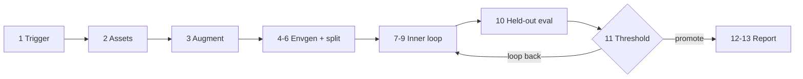

# Sim-to-Real VLM→RL Workflow — User Guide

Closed loop on Nebius GPUs: simulation rollouts → VLM critique → RL signal → policy
update → held-out eval → threshold gate → Rerun observability.

**Doc map:** [sim2real-data-contracts.md](./sim2real-data-contracts.md) (formats & schemas) ·
[sim2real-customer-assets.md](./sim2real-customer-assets.md) (uploads) ·
[sim2real-architecture.md](./sim2real-architecture.md) (K8s & control flow)

**Canonical workflow file:** `npa/workflows/workbench/sim2real/runbook.yaml`  
**Easy env overlay:** `npa/workflows/workbench/sim2real/quickstart.env`

**External object-store bucket:** use GCS with the S3-compatible API. Set `storage.bucket`
and `storage.endpoint_url` (`https://storage.googleapis.com`) in `~/.npa/config.yaml`,
GCS HMAC keys in `~/.npa/credentials.yaml`, and
`NPA_SIM2REAL_TRIGGER_DATASET_URI=s3://<your-object-store-bucket>/sim2real-triggers/<batch>/lerobot-pusht/`
in operator env or `--var` on submit. See the **Trigger bucket & S3-compatible
storage** comment block at the top of `runbook.yaml` for the full variable map
(`NPA_SIM2REAL_BUCKET`, `AWS_ENDPOINT_URL`, `S3_BUCKET`, seed + cluster secret sync).

---

## Configuration reference

| Concern | Where to set | Example vars |
| --- | --- | --- |
| Sim assets (scene/robot/cameras) | BYO URIs, stage 2 assets, operator env | `ASSETS_URI`, `SCENE_SPEC_URI`, `CAMERAS_URI`, `NPA_SIM2REAL_CAMERAS_URI`, `ROBOT_SPEC_URI`, `NPA_SIM2REAL_ROBOT_SPEC_URI`, `ROBOT_PRESET`, `NPA_SIM2REAL_ROBOT_PRESET` |
| Artifact bucket vs trigger bucket | `config.yaml`, operator env, runbook | `NPA_SIM2REAL_BUCKET` (alias `S3_BUCKET`), `NPA_SIM2REAL_TRIGGER_DATASET_URI` (alias `TRIGGER_DATASET_URI`), `storage.bucket`, `storage.sim2real_stock_trigger_uri` |
| External object-store bucket | endpoint + HMAC keys | `AWS_ENDPOINT_URL`, `S3_ENDPOINT_URL`, `storage.endpoint_url`, `~/.npa/credentials.yaml` |
| LeRobot custom/trigger dataset | trigger URI, dataset id | `NPA_SIM2REAL_TRIGGER_DATASET_URI`, `NPA_SIM2REAL_TRIGGER_DATASET_ID` (alias `TRIGGER_DATASET_ID`), default `lerobot/pusht` |
| Custom container images | operator env before submit | `AUGMENT_IMAGE`, `ENVGEN_IMAGE`, `POLICY_IMAGE`, `VLM_IMAGE`, `EVAL_IMAGE`, `TRAINER_IMAGE`, `ISAAC_IMAGE`, `NPA_SIM2REAL_RERUN_IMAGE` |

Artifact bucket and trigger prefix may differ (common on S3-compatible object stores). Sim assets are optional — leave URIs empty for stock smoke. See [sim2real-customer-assets.md](./sim2real-customer-assets.md) for BYO scene/robot detail.

---

## Pipeline at a glance

You can read the entire loop in the runbook `run:` block — no hidden orchestrator.



| Stage | What happens | Primary artifact types |
| --- | --- | --- |
| **1** Trigger | Consume LeRobot dataset trigger path | LeRobot + `npa.sim2real.trigger.v1` |
| **2** Assets | Stock or BYO scene + robot specs | `consumed_*_spec.json` |
| **3** Augment | Cosmos Transfer sibling Job (or reference) | augment manifest + frames |
| **4–6** Envgen | Raw envs + train/held-out split | `npa.sim2real.raw_env.v1` JSONL |
| **7–9** Inner loop | Rollouts → VLM → RL signal → trainer | rollouts, VLM eval, RL signal JSON |
| **10** Held-out | Isaac (default) or Genesis eval | `npa.sim2real.heldout_eval.v1` |
| **11** Gate | Promote checkpoint or loop back | threshold decision JSON |
| **12–13** Finish | External validation stub + retrigger | SEAM stubs |
| **Report** | E2E summary + optional S3 upload | `npa.sim2real.e2e_report.v1` |

Full schema list and S3 layout: [sim2real-data-contracts.md](./sim2real-data-contracts.md).

**State between stages:** `state/workflow_state.json` (quality, outer history, latest decision).

Status update (June 2026): stage-runner waits now pre-check Kubernetes Job
terminal counters before relying on `kubectl wait`, so already-failed sibling
jobs are reported as failed immediately instead of being misclassified as
complete in race/mock edge cases.

---

## Quick start (8 knobs)

Edit **`quickstart.env`** (or pass `--var` on submit):

```bash
# Copy and edit only these for a first run:
NPA_SIM2REAL_RUN_ID=pusht-demo-$(date -u +%Y%m%dT%H%M%SZ)
NPA_SIM2REAL_BUCKET=<your-bucket-without-s3-prefix>
NPA_SIM2REAL_TRIGGER_DATASET_URI=s3://<bucket>/sim2real-triggers/<run-id>/lerobot-pusht/
ASSETS_URI=s3://<bucket>/sim2real-assets/pusht/
AWS_ENDPOINT_URL=https://storage.eu-north1.nebius.cloud
INNER_ITERATIONS=2
OUTER_ITERATIONS=1
SUCCESS_THRESHOLD=0.75
```

**Before submit:** complete [Hugging Face model access](#hugging-face-model-access-self-hosted-workbench) — accept `nvidia/Cosmos-Reason2-8B`, `nvidia/Cosmos-Reason2-2B`, and `nvidia/Cosmos-Transfer2.5-2B`, put `HF_TOKEN` in `~/.npa/credentials.yaml`, and ensure cluster secret `hf-ngc-tokens` is present.

Run preflight first (recommended):

```bash
npa workbench health sim2real \
  --s3-bucket <your-bucket> \
  --s3-endpoint <your-endpoint> \
  --k8s-context <your-k8s-context> \
  --k8s-kubeconfig ~/.npa/clusters/<your-k8s-context>/kubeconfig
```

Then submit:

```bash
# Load the env overlay into your shell (submit reads these via the environment),
# then override the run ID (and any other knob) with --var:
set -a
source npa/workflows/workbench/sim2real/quickstart.env
set +a

npa workbench workflow submit \
  npa/workflows/workbench/sim2real/runbook.yaml \
  --var NPA_SIM2REAL_RUN_ID=pusht-demo
```

Track progress:

```bash
npa workbench workflow status <run-id> --watch
```

---

## Hugging Face model access (self-hosted workbench)

Sim2real on Kubernetes downloads **gated NVIDIA Cosmos weights at runtime** inside
GPU sibling Jobs. A Hugging Face token alone is not enough: you must **accept each
model license** on https://huggingface.co while signed in with the same account
that owns the token.

### One-time setup

1. Create a read token at https://huggingface.co/settings/tokens
2. Accept the license on each repo page (click **Agree and access** when prompted)
3. Add the token to `~/.npa/credentials.yaml`:

   ```yaml
   tokens:
     HF_TOKEN: hf_...
   ```

4. Mirror credentials into the cluster (default namespace):

   ```bash
   # Registry pull secret (expires ~weekly — refresh when image pulls return 401)
   export KUBECONFIG=~/.npa/clusters/<context>/kubeconfig
   npa/.venv/bin/python - <<'PY'
   from npa.cli.workbench.detection_training import _ensure_image_pull_secret
   reg = "<your-registry>/npa-cosmos3-reason:3.0.1-genuine-sm120"
   for name in ("npa-nebius-registry", "agent-sa"):
       _ensure_image_pull_secret(image=reg, secret_name=name, namespace="default",
                                 kubeconfig="~/.npa/clusters/<context>/kubeconfig")
   PY
   ```

   Ensure `hf-ngc-tokens` and `npa-storage-credentials` secrets exist in
   `default` (S3 + `HF_TOKEN` for sibling Jobs). The runbook mounts them via
   `NPA_SIM2REAL_K8S_ENV_SECRET_NAMES`.

### Self-hosted sim2real VLM repos (dual Reason eval)

| Hugging Face repo | Gated? | Role | Notes |
| --- | --- | --- | --- |
| `nvidia/Cosmos-Reason2-8B` | **Yes — accept license** | Reason2 sibling (`vlm_eval_reason2`) | Default `VLM_REASON2_MODEL` |
| `nvidia/Cosmos-Reason2-2B` | **Yes — accept license** | Reason3 sibling (`vlm_eval_reason3`) | Default `VLM_REASON3_MODEL` (smaller second Reason2 checkpoint) |
| `nvidia/Cosmos-Transfer2.5-2B` | **Yes — accept license** | Stage 3 augment (Cosmos Transfer image) | Downloaded inside `npa-cosmos2-transfer` |

### Cosmos 3 on Hugging Face (not used by sim2real VLM Jobs today)

| Hugging Face repo | Gated? | Notes |
| --- | --- | --- |
| `nvidia/Cosmos3-Nano` | Often early-access | 16B omni-model (reason + generate); used by Cosmos3 text-to-image workflows, not the `npa-cosmos3-reason` VLM sibling image |
| `nvidia/Cosmos3-Super` | Often early-access | 64B omni-model; datacenter scale |
| `nvidia/Cosmos-Reason1-7B` | Open | Legacy Reason1 generation; superseded by Reason2 for sim2real defaults |

### Hosted-only (not for self-hosted VLM Jobs)

| Model id | Where it runs | Notes |
| --- | --- | --- |
| `nvidia/Cosmos3-Super-Reasoner` | Nebius **Token Factory** API | No HF repo; use `npa workbench token-factory reason`. Do **not** set as `VLM_REASON3_MODEL` on cluster sim2real. |
| `nvidia/Cosmos3-Super` | Hugging Face (64B omnimodel) | Datacenter scale (multi-GPU vLLM); not used by the 1-GPU sim2real sibling Job pattern. |

### Verify access before launch

```bash
huggingface-cli whoami
# Optional: probe a repo you accepted
python -c "from huggingface_hub import hf_hub_download; hf_hub_download('nvidia/Cosmos-Reason2-8B', 'config.json')"
npa workbench health sim2real --checks tokens,registry,cluster
```

If a sibling Job fails with `GatedRepoError` or `403`, re-open the repo page,
confirm access, and retry. If pulls fail with `401 Unauthorized`, refresh the
`npa-nebius-registry` pull secret (see above). Sibling Jobs use writable
`/tmp/hf_home` caches by default (see `npa.workbench.cosmos.reason`).

---

> Top-level `npa workbench sim2real` was removed. Use **`workflow submit`**, module CLI
> (`python -m npa.workflows.sim2real run …`), staged subcommands (`preamble`,
> `outer-iteration`, `finalize`), or SDK (`npa.sdk.workbench.sim2real`).

---

## How to edit the workflow (agent-friendly)

Open **`npa/workflows/workbench/sim2real/runbook.yaml`**. The `run:` block is the source of truth:

```yaml
# Stage 1-13: single Python orchestrator (replaces bash preamble/outer/finalize loop)
./npa/.venv/bin/python -m npa.workflows.sim2real run "${common_args[@]}" \
  --initial-quality "${INITIAL_QUALITY:-0.38}" \
  --upload-artifacts
```

### What to edit where

| You want to… | Edit this | Example |
| --- | --- | --- |
| Scale the loop | `envs:` headline block | `INNER_ITERATIONS`, `ROLLOUT_COUNT`, `HELDOUT_ENV_COUNT` |
| Change success bar | `SUCCESS_THRESHOLD` | `0.75` → `0.85` |
| Swap sim engine | `NPA_SIM2REAL_SIM_BACKEND` | `isaac` (default) or `genesis` |
| Swap trainer / VLM images | `TRAINER_IMAGE`, `VLM_IMAGE`, `EVAL_IMAGE` | your registry tags |
| BYO trainer | `BYO_TRAINER_COMMAND` | shell command honoring § contracts below |
| Add a second outer pass | `OUTER_ITERATIONS` + the bash `for` loop (already there) | `OUTER_ITERATIONS=2` |
| Disable Rerun | `NPA_SIM2REAL_RERUN=0` or `--no-rerun` locally | |

**Do not** put secrets in YAML. Credentials live in `~/.npa/credentials.yaml`.

### Inspect stage progress during a run

```bash
npa workbench workflow status <run-id> --watch
```

SDK (same backend):

```python
from npa.sdk.workbench import sim2real

sim2real.status(run_id="<run-id>", watch=True)
```

Module CLI (`python -m npa.workflows.sim2real status`) remains available for
in-cluster/debug use; operators should prefer ``npa workbench workflow status``.

Stage 3 (augment) is marked **SUCCEEDED** only when
`augment/cosmos2-transfer-result.json` exists on S3—not when `augment/manifest.json`
alone is present. If status shows augment pending while the driver is waiting on a
Cosmos Transfer sibling Job, check sibling Jobs and cluster events rather than
relying on partial augment markers.

```bash
RUN=/tmp/npa-sim2real-<run-id>
cat "$RUN/state/workflow_state.json" | jq '{quality:.current_quality, decision:.final_decision.decision}'
cat "$RUN/inner_loop/outer-01/evidence.json" | jq '{reward_trend, final_quality, signal_diversity}'
cat "$RUN/eval/heldout/report.json" | jq '{success_rate, per_env: .per_env|length}'
cat "$RUN/outer_loop/decision.json" | jq .
```

When stage 10+ has completed, `npa workbench workflow status <run-id>` also prints
`success_rate`, `threshold`, and `decision` from workflow state or S3 artifacts
(not only per-stage `SUCCEEDED`/`PENDING`).

### Fetch final reports (S3)

For a completed cluster run, artifacts live under
`s3://<bucket>/sim2real-b/<run-id>/`. Replace placeholders with your bucket and
run id from submit output.

```bash
source ~/.npa/sim2real-operator.env   # sets AWS_* and endpoint
RUN=sim2real-staged-20260615t180818z
BUCKET="${S3_BUCKET:-<your-bucket>}"
PREFIX="s3://${BUCKET}/sim2real-b/${RUN}"

# E2E summary (includes rerun_serve.public_url when auto-serve ran)
aws s3 cp "${PREFIX}/reports/sim2real-report.json" /tmp/sim2real-report.json \
  --endpoint-url "${AWS_ENDPOINT_URL}"

# Held-out eval (stage 10)
aws s3 cp "${PREFIX}/eval/heldout/report.json" /tmp/heldout-report.json \
  --endpoint-url "${AWS_ENDPOINT_URL}"

# One-liners
jq '{status, public_url: .rerun_serve.public_url, decision: .outer_loop.latest_decision.decision, success_rate: .outer_loop.latest_heldout_report.success_rate, threshold: .outer_loop.latest_decision.threshold}' \
  /tmp/sim2real-report.json
jq '{success_rate, threshold, passed: [.per_env[]|select(.success)]|length, total: (.per_env|length)}' \
  /tmp/heldout-report.json
jq '{decision, success_rate, threshold, checkpoint_uri}' \
  <(aws s3 cp "${PREFIX}/outer_loop/decision.json" - --endpoint-url "${AWS_ENDPOINT_URL}")
```

Sync the full run tree locally (debug / air-gap):

```bash
aws s3 sync "${PREFIX}/" "/tmp/sim2real-demo/${RUN}/" --endpoint-url "${AWS_ENDPOINT_URL}"
```

Live workflow state (updated during the run):

```bash
aws s3 cp "${PREFIX}/state/workflow_state.json" - --endpoint-url "${AWS_ENDPOINT_URL}" \
  | jq '{status, success_rate: .final_eval.success_rate, threshold: .final_decision.threshold, decision: .final_decision.decision}'
```

---

## Local smoke (no cluster)

Run the same three commands the YAML uses:

```bash
OUT=/tmp/s2r-smoke
npa/.venv/bin/python -m npa.workflows.sim2real run \
  --run-id smoke --output-dir "$OUT" --inner-iterations 2 --rollout-count 2 --no-rerun

# Or explicit stage boundaries (debug / partial reruns):
npa/.venv/bin/python -m npa.workflows.sim2real preamble \
  --run-id smoke --output-dir "$OUT" --inner-iterations 2 --rollout-count 2 --no-rerun
npa/.venv/bin/python -m npa.workflows.sim2real outer-iteration \
  --run-id smoke --output-dir "$OUT" --outer-iteration 1 --initial-quality 0.38 \
  --inner-iterations 2 --rollout-count 2 --no-rerun
npa/.venv/bin/python -m npa.workflows.sim2real finalize \
  --run-id smoke --output-dir "$OUT" --inner-iterations 2 --rollout-count 2 --no-rerun
```

Without `s3_bucket`, VLM/held-out use **local reference** mode (CPU smoke). With
`s3_bucket`, sibling K8s GPU jobs run augment (Stage 3), policy (Stage 7), VLM
(Stage 8), and held-out eval (Stage 10) when images are registry-qualified.

SDK equivalent:

```python
from npa.sdk.workbench import sim2real

sim2real.preamble(run_id="sdk", output_dir="/tmp/s2r-sdk", inner_iterations=2)
sim2real.outer_iteration(run_id="sdk", output_dir="/tmp/s2r-sdk", outer_iteration=1)
sim2real.finalize(run_id="sdk", output_dir="/tmp/s2r-sdk")
# Or one call: sim2real.run(...)
```

---

## Custom LeRobot trainer (§ contract)

Set `BYO_TRAINER_COMMAND` for an in-process shell hook, or rely on the reference
trainer in the orchestrator pod (`TRAINER_IMAGE` is recorded in the report; it is
not a sibling Job by default).

Your command must read `NPA_SIM2REAL_SIGNAL_JSON` and write `NPA_SIM2REAL_OUTPUT_JSON`
with `reward_head_after`, `policy_output_after`, `policy_delta_l2`.

---

## Rerun observability

Stage 14 writes `reports/sim2real.rrd` locally and uploads it with the run tree.
When `NPA_SIM2REAL_RERUN=1` (default), artifact upload succeeds, and cluster
credentials are available, **`run_finalize` also deploys a hosted Rerun viewer**
on mk8s (`npa workbench sim2real rerun serve` logic). The workflow logs and
`reports/sim2real-report.json` include `rerun_serve.public_url` — one shared
LoadBalancer per mk8s cluster (stable URL for the whole team).

Disable hosted serve only: `NPA_SIM2REAL_RERUN_SERVE=0`. Disable `.rrd` emission:
`NPA_SIM2REAL_RERUN=0` or `--no-rerun`.

Point the shared cluster viewer at a completed run (updates the served recording
without a new external IP):

```bash
npa workbench sim2real rerun serve --run-id <sim2real-staged-…>
# optional: --cluster-name <profile from ~/.npa/clusters/>
```

Teardown the shared viewer for the cluster:

```bash
npa workbench sim2real rerun serve --run-id <any-valid-run-id> --destroy
```

Local offline review:

```bash
pip install rerun-sdk
rerun /path/to/reports/sim2real.rrd
```

Logs: rollout frames, VLM critiques, RL rewards/advantages, held-out scores.

---

## Real-world policy deployment (Stage 12 seam)

After Stage 11 promotes, artifacts land under
`s3://<bucket>/sim2real-b/<run-id>/checkpoints/candidate/`:

| Artifact | Schema | What it is today |
| --- | --- | --- |
| `candidate.json` | `npa.sim2real.candidate_checkpoint.v1` | Promote metadata (success rate, threshold, run id) |
| `outer_loop/decision.json` | `npa.sim2real.threshold_decision.v1` | `checkpoint_uri` pointer when decision is `promote_checkpoint` |
| Inner-loop trainer update | in `inner_loop/…/evidence.json` | Reference VLM→RL bias update (`policy_output_after`) — not a LeRobot `pretrained_model/` tree |

**WORKS today:** sim training, held-out eval, checkpoint **metadata** on S3, loop
retrigger record (Stage 13).

**SEAM today:** live real-robot execution. Stage 12 writes
`stage_12_external_validation/external_stub.json` with `input_checkpoint` —
a documented BYO gate, not an automated deploy.

**Customer deploy path (BYO):**

1. On promote, download `checkpoints/candidate/` from the run prefix on S3.
2. Map the reference trainer state to your robot policy format (or run your own
   trainer via `BYO_TRAINER_COMMAND` that writes a deployable LeRobot checkpoint).
3. Deploy with LeRobot on your robot stack, for example:
   `npa workbench lerobot serve --input-path s3://<your-bucket>/policies/<run-id>/`
   (requires a standard LeRobot checkpoint layout — not emitted by the reference
   trainer today).
4. Collect a new LeRobot dataset on hardware, upload to
   `s3://<bucket>/sim2real-triggers/<batch>/lerobot-<task>/`, and re-trigger
   (Stage 13).

Detail and scorecard: [sim2real-customer-assets.md § Real-world policy](./sim2real-customer-assets.md#real-world-policy-deployment-stage-12-seam).

## Simulation assets & robots

- **Trigger data:** LeRobot dataset only (Stage 1) — see [data contracts](./sim2real-data-contracts.md#not-everything-is-lerobot)
- **Objects / scene:** mesh + SceneSpec via `ASSETS_URI` / `SCENE_SPEC_URI`
- **Robot:** customer UR/Flexiv via `ROBOT_SPEC_URI`; stock Franka is platform smoke only
- **Backend:** `isaac` (default, RT-core held-out) or `genesis` (legacy)

Asset handoff and scorecard: [sim2real-customer-assets.md](./sim2real-customer-assets.md)

---

## Validate before merge

```bash
npa/.venv/bin/python -m pytest npa/tests/workflows/test_sim2real_loop.py -q
npa workbench health sim2real --checks config,coherence
```

## Upload behavior (`--upload-artifacts`)

When artifact upload is enabled, upload errors now fail the run instead of being
silently downgraded. This makes storage/config regressions visible immediately in
CI and operator dashboards.
