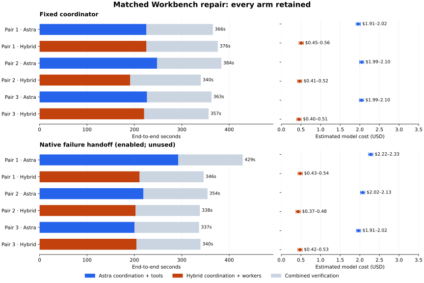

# Workbench delegation and coordination experiment

On September 28, 2026, two new cohorts compared Astra alone with Astra coordinating
three concurrent Token Factory specialists through Workbench and LangGraph. The
classifier was `nvidia/Nemotron-3_5-Lightning` on Token Factory. Both use the [same
known-regression repair benchmark](specialists-matched-repair-experiment.md):
physical-trace validation, transactional dataset publication and simulation-to-LeRobot
validation. Every declared run and retry is retained.

## What the delegation lock protects

The per-profile process lock prevents a coordinator and worker from changing the same
workspace concurrently. A refusal before submission now reports `submission_attempted:
false` and `safe_to_retry: true`. The coordinator may retry the exact assignment after
inspecting active work. An error after durable submission retains uncertainty and does
not authorize blind replay.

A regression test holds the real lock in a separate process and exercises the journalled
bridge. The refused request queues no task. After release, two identical submissions
produce exactly one durable task. The existing post-submission-error test checks the
other boundary. This proves coordination behavior under contention; it is separate from
the live performance measurements.

## Results

| Cohort | Quality, Astra / hybrid | Median seconds, Astra / hybrid | Conservative median model saving | Hybrid faster pairs |
| --- | --- | ---: | ---: | ---: |
| fixed-coordinator | 3/3 / 3/3 | 365.7 / 356.7 | 73.7% | 2/3 |
| native-failure-handoff | 3/3 / 3/3 | 354.3 / 339.5 | 73.7% | 2/3 |

The cost comparison uses the hybrid upper estimate against Astra’s lower estimate. Each
cohort has only three pairs. Equal completion and lower observed medians do not
establish generally better quality or a statistically significant speed advantage.

The gray portion is final combined verification; the colored portion includes
coordination, workers and their lane tools. Cost intervals retain input-only Astra setup
uncertainty. The panels show every arm, including slower hybrid outcomes.

| Cohort | Pair | Arm | Elapsed | Astra | Token Factory | Total model estimate |
| --- | --- | --- | ---: | ---: | ---: | ---: |
| fixed-coordinator | 1 | astra-only | 365.7s | $1.906196 | $0.000000 | $1.906196–$2.017226 |
| fixed-coordinator | 1 | astra-tofa | 376.1s | $0.242154 | $0.209974 | $0.452128–$0.563158 |
| fixed-coordinator | 2 | astra-tofa | 340.2s | $0.261920 | $0.149336 | $0.411256–$0.522286 |
| fixed-coordinator | 2 | astra-only | 383.6s | $1.992554 | $0.000000 | $1.992554–$2.103584 |
| fixed-coordinator | 3 | astra-only | 362.7s | $1.987652 | $0.000000 | $1.987652–$2.098682 |
| fixed-coordinator | 3 | astra-tofa | 356.7s | $0.242154 | $0.152872 | $0.395026–$0.506056 |
| native-failure-handoff | 1 | astra-only | 428.6s | $2.223896 | $0.000000 | $2.223896–$2.334926 |
| native-failure-handoff | 1 | astra-tofa | 346.1s | $0.264850 | $0.160492 | $0.425342–$0.536372 |
| native-failure-handoff | 2 | astra-tofa | 338.3s | $0.245434 | $0.127058 | $0.372492–$0.483522 |
| native-failure-handoff | 2 | astra-only | 354.3s | $2.017880 | $0.000000 | $2.017880–$2.128910 |
| native-failure-handoff | 3 | astra-only | 336.5s | $1.912278 | $0.000000 | $1.912278–$2.023308 |
| native-failure-handoff | 3 | astra-tofa | 339.5s | $0.246154 | $0.174318 | $0.420472–$0.531502 |

The fixed-coordinator cohort had mean elapsed times of **370.7s Astra and 357.6s
hybrid**. Across its three repeats, conservative aggregate model savings were **73.0%**.
All six arms together used **$7.144812–$7.810992** in standard API-equivalent model
usage.

The native-failure-handoff cohort had mean elapsed times of **373.1s Astra and 341.3s
hybrid**. Across its three repeats, conservative aggregate model savings were **74.8%**.
All six arms together used **$7.372361–$8.038541** in standard API-equivalent model
usage.

## Coordination and routing observations

| Cohort / hybrid pair | Astra turns | Astra process time | Model-free host wait | Router request sum | Final verification |
| --- | ---: | ---: | ---: | ---: | ---: |
| fixed-coordinator / 1 | 1 | 38.6s | 185.6s | 2.24s | 150.6s |
| fixed-coordinator / 2 | 1 | 42.8s | 147.4s | 2.13s | 148.9s |
| fixed-coordinator / 3 | 1 | 34.8s | 184.6s | 2.68s | 136.0s |
| native-failure-handoff / 1 | 1 | 36.5s | 173.4s | 2.21s | 135.1s |
| native-failure-handoff / 2 | 1 | 36.0s | 165.4s | 2.04s | 135.6s |
| native-failure-handoff / 3 | 1 | 37.0s | 166.4s | 2.20s | 135.0s |

The fixed-coordinator cohort recorded **0 safe lock refusals**, **0 uncertain/rejected
delegation calls**, **0 model handoffs** and **0 failed native attempts**. Actual
initial routing selections: `zai-org/GLM-5.3-Flash`: 9.

The native-failure-handoff cohort recorded **0 safe lock refusals**, **0
uncertain/rejected delegation calls**, **0 model handoffs** and **0 failed native
attempts**. Actual initial routing selections: `zai-org/GLM-5.3-Flash`: 9.

Astra process intervals include its tools, so they are not pure inference latency. Host
waits overlap worker inference and native execution. Router sums and per-lane model/tool
intervals also overlap; adding them would double-count elapsed time. Only
coordinator/workers plus subsequent combined verification partition the total. Timing is
derived from retained receipts; missing boundaries are marked incomplete.

The earlier September 27 third hybrid arm had an uncertain delegation response, no
publication worker submission, and two Astra turns totaling 191.6 seconds. The other two
hybrid arms needed one turn each. Its receipts remain available alongside retrospective
timing in the new JSON; none of its original costs or outcomes changed. Without a live
contention event in a new run, a faster result cannot be attributed to the lock fix.

The second cohort enables `--native-failure-handoff` only on the terminal native `wait`
operation. Initial expected diagnosis failures do not escalate. The next configured
model receives existing tool receipts and files; the runtime does not replay the
operation, and unresolved effects still block resubmission. A cohort with no triggered
handoff provides no evidence that escalation improved performance. Model diversity was
never forced.

## Work performed and measurement scope

Both arms received identical historical source, detailed requirements, 128 immutable
checks, scene matrices and operation grants. Both could run tools concurrently. Astra
used medium effort in both, with native shell/file access and additional Codex agents
disabled. Every lane needed passing checks plus a three-case native run. Final
verification combined the three patches, reran the checks, simulated six MuJoCo Fetch
episodes, replayed 1,110 physics transitions and checked both camera streams. Native
LeRobot loaded four accepted episodes, 740 timesteps and 1,480 aligned camera samples,
including a real four-sample training batch. Two failed-grasp controls stayed outside
the dataset.

This is real CPU Workbench simulation, repair and dataset conversion. It does not submit
a cloud/GPU workflow, train a policy or prove physical robot transfer. It tests known
regressions, not open-ended issue discovery. No operator edited candidate files during
paid runs.

The fixed-coordinator snapshot was `e1f4c20983fcd5ba2a5d424ea4ae616b5cd19302`; the
failure-handoff snapshot was `b0698c418a33dfbc2b59fcfca8365dffa39b03b0`. Each ran the
predeclared order Astra/hybrid, hybrid/Astra, Astra/hybrid on the same Linux host. Heavy
validation on the benchmark host ran after paid timing; local checks ran on a separate
machine. The second cohort also narrowed Python runtime mounts; the cohorts are not a
causal isolation of one code change. Frozen-file audits found only the 18 allowed
candidate source files changed in each cohort.

All Astra calls, initial classification, worker calls, rejected responses, failed
attempts and recovery usage count. Per-request Astra counters reconcile with all five
CLI counters, cached tokens are priced once and context tariffs apply per request. Token
Factory input is charged at full tariff with no assumed prefix-cache discount. Both
cohorts intentionally retain the September 27 price snapshot for comparison. These are
API-equivalent estimates, not verified Codex invoices. Development conversation,
setup/calibration, CPU hosting, storage and network costs are excluded.

## Runner fixes and validation

Publication CI exposed a temporary-path scanner finding. The sandbox now has a private
`/scratch` tmpfs and explicit `TMPDIR`. A separate runtime-path review found that a
system Python could previously cause an overly broad mount. The runner now rejects
mounts containing the account home or filesystem root. A failed calibration revealed a
missing virtualenv version alias; the corrected runner mounts that exact prefix too,
without its parent. That failed calibration made no generation calls and remains
retained. Audits of the actual supplied interpreters in the measured cohorts found no
account-home or filesystem-root mount.

At runtime source `146eaf2324a5deccdc4fbeb796cd516514096f37`, merged with main
`ad8872894`, the full Linux suite passed **34,469 tests**, with 138 skips and 1
non-strict XPASS, at **77.31% package coverage**. The serial security gate passed **878
tests with no skips** using pinned CPU Torch. Local checks passed 671 agent-evaluation
tests (three skips), 266 precheck tests, 206 merge-focused tests (one platform skip), 94
affected-fixture tests, CLI documentation drift and merge precheck. The subsequent
publication commit changes only reports and documentation.

After the main merge, an earlier full-suite attempt exposed two inherited fixture
assumptions: the requested directory mode survived a restrictive umask, and copied
Python executable bytes could find a standard library implicitly. Both failures
reproduced on clean main. The fixtures now set the intended mode and test interpreter
library explicitly; all 94 affected tests passed on Linux before the successful full
rerun. Earlier failed validation and reproduction logs are retained by hash in the
evidence.

The [machine-readable evidence](specialists-coordination-results.json) includes every
arm, source patch, native attempt, usage ledger, timing breakdown, frozen-input audit
and validation hash. Raw conversations, credentials, runtime paths and artifacts remain
in private operator storage. The [public
runner](../../npa/examples/specialists/repair_benchmark/README.md) describes
reproduction and timing semantics.
