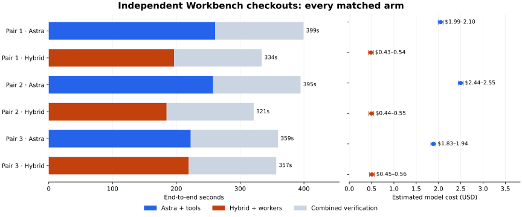

# Independent Workbench checkout experiment

On September 29, 2026 (UTC), Astra alone and Astra coordinating three Token Factory
specialists each received separate, complete Workbench checkouts for three repair lanes.
This is a matched test of the resulting system, with three repeats per arm. It is not a
controlled comparison against the earlier shared-reference layout. Every declared run
and attempt is retained.

## What changed

The earlier benchmark already separated writable candidate files and run outputs. The
new `--workspace-layout independent-checkout` preparation option creates a complete
detached Git checkout per lane in both arms. Each lane’s native operations import that
checkout’s source. The agent can edit its assigned repair file; other source, tests and
verifiers remain fixed. Final integration combines the three patches against a neutral
frozen reference.

Workers run as separate processes, with private outputs and per-profile ownership locks.
Those locks protect a worker from a duplicate controller or unsafe takeover; they do not
serialize different profiles. The processes share a host, read-only Python dependencies,
a local Git object store and the team’s task journal. This is not VM isolation,
independent cloud credentials or proof of duplicate-submission protection for remote
jobs.

## Results

| Arm | Verified completion | Median end-to-end time | Median model estimate |
| --- | ---: | ---: | ---: |
| astra-only | 3/3 | 394.7s | $1.9939–$2.1050 |
| astra-tofa | 3/3 | 333.9s | $0.4382–$0.5492 |

Hybrid median elapsed time was **15.4% lower**, with **72.5% lower conservatively
estimated median model cost**. Hybrid was faster in **3/3 matched pairs**. Small samples
establish observed results, not a statistically reliable speed advantage or generally
superior model quality.

| Pair | Arm | Elapsed | Astra estimate | ToFa estimate | Total model estimate |
| --- | --- | ---: | ---: | ---: | ---: |
| 1 | astra-only | 399.4s | $1.993938 | $0.000000 | $1.993938–$2.104968 |
| 1 | astra-tofa | 333.9s | $0.264010 | $0.165035 | $0.429045–$0.540075 |
| 2 | astra-tofa | 321.2s | $0.268580 | $0.169612 | $0.438192–$0.549222 |
| 2 | astra-only | 394.7s | $2.443778 | $0.000000 | $2.443778–$2.554808 |
| 3 | astra-only | 359.4s | $1.830618 | $0.000000 | $1.830618–$1.941648 |
| 3 | astra-tofa | 356.6s | $0.265550 | $0.187925 | $0.453475–$0.564505 |

Mean elapsed time was **384.5s Astra / 337.2s hybrid**. All six arms together consumed
**$7.589046–$8.255226** at standard API-equivalent prices. Conservative aggregate model
savings across the three repeats were **73.6%**.

## Independence and coordination evidence

| Hybrid pair | Peak observed worker processes | Peak overlapping task spans | Astra turns | Model-free host wait | Final verification |
| --- | ---: | ---: | ---: | ---: | ---: |
| 1 | 3 | 3 | 1 | 155.6s | 137.3s |
| 2 | 3 | 3 | 1 | 144.3s | 136.5s |
| 3 | 3 | 3 | 1 | 177.4s | 137.2s |

Before inference, the audit found **18 complete checkouts**, **21,942 source files**,
**zero shared source inodes** and every operation’s source root bound to its own
workspace. Preparation took **23.2s** for all six arms; source copies occupied **391.9
MiB**, excluding the rest of each checkout, runtime dependencies and output artifacts.
Preparation and calibration are outside measured task latency.

The final audit checked **77,876 frozen files**: only the **18 allowed candidate files**
changed. The experiment recorded **0 safe lock refusals**, **0 uncertain/rejected
delegations**, **0 model handoffs** and **0 failed native attempts**. A process observer
sampled both arms every five seconds; the peak counts are observations, not guaranteed
capture of every short-lived process.

The five between-arm gaps totaled **105.7s**. They include frozen-checkout integrity
audits and bookkeeping, and are excluded from the per-arm timer. First coordinator
launch through the last combined result took **2270.8s** across both arms. Initial
audits, setup and calibration precede that span. Full-checkout audit overhead is real;
the reported per-task medians do not include it.

As a sensitivity check, assigning each observed gap to the following arm gives median
**399.4s Astra / 360.0s hybrid**, or **9.9% lower hybrid elapsed time**. The first arm
receives zero preceding gap; initial audits remain excluded. This allocation is not a
separately clocked task measurement.

Actual initial routing selections: `zai-org/GLM-5.3-Flash` (9). Routing used
`nvidia/Nemotron-3_5-Lightning` on Token Factory, with LangGraph driving each
specialist. Full GLM remained a configured fallback; model diversity was not forced. No
Jev service was used.

Host waiting makes no Astra calls. Astra process intervals include tools; task spans
overlap model and native work. The total is partitioned into coordinator/workers and
subsequent combined verification. Do not add overlapping lane times or call those
intervals pure model latency.

## Workload and limits

The unchanged repair lanes cover physical-trace evidence validation, transactional
dataset publication and simulation-to-LeRobot input validation. Each starts with a known
historical regression, runs 128 immutable checks, repairs only its assigned file, and
completes a real three-case native simulation/export/replay/reader run. Final
integration reruns all checks and six MuJoCo Fetch episodes: 1,110 replayed physics
transitions, four accepted episodes, 740 dataset timesteps and 1,480 aligned camera
samples. The native LeRobot reader must load a real four-sample training batch. Two
failed-grasp controls must remain outside training data.

These are CPU Workbench simulation and dataset operations. They do not train a policy,
submit a GPU/cloud workflow, discover previously unknown production bugs or demonstrate
transfer to a physical robot. A complete checkout does not grant unrestricted repository
editing: the repair scope remains the same in both arms.

The frozen runtime was `d2e9f6d3c6b982ee05fec5f11c9e2bdad86cb1fe`. Order was
Astra/hybrid, hybrid/Astra, Astra/hybrid, with serial arms on the same host and
concurrent specialist lanes. Both used Astra medium effort and identical operation
grants; both could parallelize tools. No operator changed candidate files.
Benchmark-host validation started only after the timed experiment finished. Later
public-branch updates do not alter the frozen measurement.

All measured Astra coordination/work/recovery, ToFa
classification/generation/rejection/fallback and native verification count. Astra
request telemetry reconciles with all five CLI counters and applies context tariffs per
request. Input-only setup-response uncertainty remains in the ranges. ToFa input is
charged at full tariff; no prefix-cache discount is assumed. Rates were refreshed from
the [official OpenAI pricing page](https://developers.openai.com/api/docs/pricing) and
[Token Factory public catalog](https://tokenfactory.nebius.com/api/public/models_info)
on September 29. These are API equivalents, not verified Codex subscription charges or
provider invoices. Development conversation, installation, checkout preparation,
calibration, CPU hosting, storage and network expenses are excluded.

Independent checkouts keep each agent’s source changes separate. This experiment does
not show that changing the layout itself improves speed or cost; that requires a
concurrent, otherwise matched layout comparison. The earlier [coordination
experiment](specialists-coordination-experiment.md) remains unchanged.

## Validation and reproduction

After freezing the experiment, the reusable preparer was updated to preserve uncommitted
reference-source changes in new checkouts. The measured checkout was clean: all **21,924
noncandidate source copies** matched the frozen reference. That update was not applied
to any measured workspace.

Full validation initially exposed a concurrent SQLite initialization race
(`SQLITE_BUSY`). A new four-process test reproduced it on the old implementation. The
fix serializes only journal-mode/schema initialization and leaves task execution
concurrent; ordinary connections no longer change journal mode. The failed suite and
before/after regression logs remain bound by hashes in the evidence. This fix came from
validation, not a specialist-discovered workload defect, and was made after the measured
cohort. No speed improvement is attributed to it.

Validation at `e9eb3e131d8e6bd500ae792ecb0f06a893aa2c0d`: **35,057 full Linux tests
passed**, 149 skipped, 1 non-strict XPASS, **77.38% package coverage**; **883 serial
security tests passed** with no skips. Focused tests cover independent source files,
native mount roots, neutral integration and the existing real-process lock/refusal/retry
behavior.

Follow the [benchmark runner
instructions](../../npa/examples/specialists/repair_benchmark/README.md), adding
`--workspace-layout independent-checkout` to preparation. The [machine-readable
evidence](specialists-independent-results.json) retains every arm, patch, attempt, usage
estimate, timing breakdown, isolation audit and validation hash. Raw model
conversations, runtime locations, credentials and native artifacts remain in private
operator storage.
