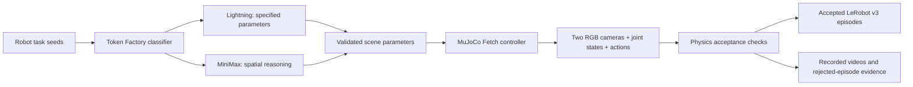

# Robot SDG with Token Factory and LeRobot

`npa workbench token-factory robot-sdg` creates actual robot demonstrations:
simulator camera video, joint state, actions, and task instructions in a
LeRobotDataset v3 directory. Open `index.html` in the resulting run directory to
watch the workspace and moving wrist camera recordings for each episode.

Token Factory provides automatic model selection and scene planning. MuJoCo
produces the images and trajectories. A scripted controller uses privileged
simulator state to grasp, lift, transport, release, and withdraw from a cube.
Physics measurements decide whether the episode belongs in the training dataset.



The initial supported task is tabletop pick-and-place with the seven-joint
[Fetch manipulator](https://robotics.farama.org/envs/fetch/pick_and_place/).
It uses the real `FetchPickAndPlace-v4` environment from Gymnasium-Robotics 1.4.1
and MuJoCo 3.3.7. Each demonstration contains 185 control steps at 25 Hz, covering
eight controller phases. This is a reference trajectory duration, not a run
deadline. Every input seed is processed once; there is no dataset-size cap or
automatic retry-until-success loop.

## Setup and first local dataset

Use the private Token Factory credential configured through
[Token Factory key setup](token-factory-key.md). The default uses only that key.
`--router jev` additionally needs `TYPESAFE_API_KEY` and remains optional.

Install the simulation extra in the existing NPA environment and make `ffmpeg`
available. For Linux without a display, install `libosmesa6` and set
`MUJOCO_GL=osmesa` and `PYOPENGL_PLATFORM=osmesa` before starting Python. The
workflow renderer installs these system dependencies and selects OSMesa. Local
macOS rendering uses MuJoCo's platform OpenGL context.

```bash
uv pip install --python npa/.venv/bin/python -e 'npa[robot-sdg]'
npa/.venv/bin/python -m npa workbench health preflight --checks token_factory
```

The SDK accepts local paths for development. The output directory must be new;
existing runs are never overwritten. Run this from the repository root:

```python
from npa.sdk.workbench.token_factory import RobotSdgRequest, robot_sdg

report = robot_sdg(
    RobotSdgRequest(
        input_path="npa/examples/token-factory-robot-sdg/seeds.jsonl",
        output_path="./robot-sdg-run",
        seed=42,
    )
)
print(report["accepted_count"], report["total_frames"])
```

Open `robot-sdg-run/index.html` for the actual robot videos. The six example
seeds mix exact scene-parameter extraction and relational spatial planning.
Generated scene parameters vary object/target locations, colors, and lighting.
They are validated against the supported workspace before simulation. The model
cannot execute code or select arbitrary simulator assets.

## CLI and workflow

Public CLI handoffs use S3. Upload the example seeds to your configured storage,
then choose an empty run prefix:

```bash
npa workbench token-factory robot-sdg \
  --input-path 's3://<your-bucket>/robot-sdg/seeds.jsonl' \
  --output-path 's3://<your-bucket>/robot-sdg/run-001' \
  --seed 42 --output-format json
```

`--dry-run` validates seeds without model inference, simulator imports, or writes.
The SDK has the same `dry_run` field. `seed` defaults to zero and increments for
each input record; it controls simulation initialization, not model determinism.

[The workflow](../../workflows/testing/token-factory-robot-sdg.yaml) uses
`workbench.token_factory.robot_sdg`, CPU simulation and software rendering. Submit
with the current source staged so the new command and optional dependencies are
available. Standard workflow storage credentials and `NEBIUS_TOKEN_FACTORY_KEY`
must be supplied through the existing secret mechanism. No new container image
is published by this change.

## What is recorded

| Artifact | Contents |
| --- | --- |
| `index.html` | Video gallery showing every recorded candidate and physics outcome |
| `episodes/episode_NNNN/preview.mp4` | Synchronized workspace and wrist camera views side by side |
| `episodes/episode_NNNN/obs_workspace.npy` | Original workspace RGB frames, before video encoding |
| `episodes/episode_NNNN/obs_wrist.npy` | Original RGB from a camera rigidly attached to the wrist |
| `episodes/episode_NNNN/state.npy` | Seven arm-joint positions and two finger-joint positions |
| `episodes/episode_NNNN/actions.npy` | Normalized Cartesian dx/dy/dz and gripper commands |
| `episodes/episode_NNNN/physics.npz` | Current/next state, object and gripper poses, contacts, phases and rewards |
| `dataset/` | Accepted episodes in native-readable LeRobotDataset v3 layout |
| `provenance.jsonl` | Scene parameters, model routes, provider usage, physics checks and dataset episode mapping |
| `rejected.jsonl` | Failed scene plans and physically rejected episodes |
| `report.json` | Artifact hashes, counts, simulator versions and provider cache counters |

Observations and joint state at timestep `t` precede action `t`. The physics
trace retains the resulting state at `t+1`. Both camera streams are rendered
from the same pre-action simulator state. The native dataset stores 480×360 RGB
video, nine-dimensional state, four-dimensional action, 25 Hz timestamps and
the instruction describing the rendered cube/target colors. Privileged object
pose is used by the demonstrator and acceptance checks; it is excluded from the
policy observation vector.

These Cartesian mocap-control actions are specific to the Fetch simulation
environment. A policy trained on this data needs the corresponding action
interface. This implementation does not establish transfer to a physical robot.

## Routing and acceptance

The default routing classifier is the hosted open-weight
`nvidia/Nemotron-3_5-Lightning`. It assigns task type from the seed. Direct
extraction of specified scene parameters routes to Lightning; spatial planning
and calculations route to `MiniMaxAI/MiniMax-M3`. This is a prompted,
hand-authored routing policy. It does not optimize against measured downstream
policy quality, live prices, or cache state. Both candidate models must be
available to the configured account.

If classification fails, the baseline is Lightning. An invalid scene or failed
planning response tries the other eligible model. A complete planning failure
is recorded as an error and makes the run fail. A simulator/rendering failure
raises and leaves partial local evidence without a completed manifest.

Episode acceptance is independent of model claims. All checks must pass:

- Finite robot state and actions.
- Both gripper fingers contact the cube during the episode.
- The cube rises at least 8 cm from its initial height.
- Final cube-to-target distance is at most 2.5 cm.
- Both fingers are open at the end and the gripper retreats at least 10 cm.
- Final settling speed is at most 2 cm/s over the last ten transitions.
- The environment's own success check also passes.

Rejected episodes retain their camera recordings and traces but receive no
training dataset episode index. If none pass, the run fails without exporting a
dataset. Publication writes `report.json` last; its hashes bind the recorded
arrays, delivered videos and dataset. S3 prefixes must be empty, although the
emptiness check is not a concurrent-writer lock. Use distinct run prefixes.

## Reproduce the live proof

Recorded on 2026-09-20: **six accepted episodes**, **1,110 timesteps**, and
**2,220 decoded camera frames**. Three scenes used Lightning and three used
MiniMax. All six final object-to-target distances were between 5.398 and
6.638 mm. These are six development scenarios, not a general success benchmark.

- [Actual two-camera MP4](../architecture/evidence/token-factory-robot-sdg/episode-0000.mp4), copied without modification from the first accepted episode.
- [Native LeRobot validation](../architecture/evidence/token-factory-robot-sdg/native-lerobot-validation.json): camera decoding, aligned state/action/image samples, preserved task text, and a four-example PyTorch batch.
- [Action replay](../architecture/evidence/token-factory-robot-sdg/action-replay-validation.json): all 185 transitions in one episode reproduced with zero joint-state error.
- [Failed-grasp negative control](../architecture/evidence/token-factory-robot-sdg/negative-physics-validation.json): keeping the gripper open was rejected by physical checks.
- [Live test log](../architecture/evidence/token-factory-robot-sdg/live-pytest.log): two tests passed in 83.21 seconds.
- [Per-call and per-episode provenance](../architecture/evidence/token-factory-robot-sdg/provenance.jsonl), [artifact manifest](../architecture/evidence/token-factory-robot-sdg/report.json), and [validation/source hashes](../architecture/evidence/token-factory-robot-sdg/validation.json).

The robot run made 12 hosted inference calls. MiniMax scene planning reported
**1,920 cached prompt tokens**; Lightning reported zero for this workload.
This reused a shared planning prefix in a warm development workload. The
counter is observable provider cache evidence, not GPU memory inspection.
The complete dataset and all episode recordings are retained locally; only the
first preview and sanitized validation records are checked into Git.

The live test calls Token Factory, executes MuJoCo, exports the native dataset,
checks a separate deliberately failed grasp, and replays recorded actions.
Native LeRobot validation uses an isolated interpreter because its dependency
pins differ from Workbench's environment. Install `lerobot==0.5.1` there, then
set `NPA_LEROBOT_PROOF_PYTHON` to that interpreter's absolute path:

```bash
NPA_TOKEN_FACTORY_ROBOT_SDG_LIVE=1 \
  NPA_LEROBOT_PROOF_PYTHON="$NPA_LEROBOT_PROOF_PYTHON" \
  npa/.venv/bin/python -m pytest \
  npa/tests/e2e/test_token_factory_robot_sdg_live.py -q
```

Optionally set `NPA_ROBOT_SDG_OUTPUT_DIR` to a new local directory to preserve
the positive run outside pytest's temporary directory. The native validation
script verifies artifact hashes, decodes every dataset video frame, compares
sampled images against the original arrays, confirms state/action and language
labels, and forms a real PyTorch training batch. Action replay compares every
recorded pre/post joint state for one episode against a fresh simulator.

This is simulation-generated demonstration data with a scripted teacher. It is
not a learned robot policy, photorealistic world-model video, or a physical robot
capture. GPU throughput, remote workflow execution, and physical transfer need
their own measurements. The local run is sequential, stores raw camera arrays,
and uses the existing in-memory LeRobot adapter; it is a reference pipeline,
not a measured large-scale data-generation service.

## Components and licensing

The simulator executes upstream [MuJoCo](https://github.com/google-deepmind/mujoco)
and [Gymnasium-Robotics](https://github.com/Farama-Foundation/Gymnasium-Robotics).
MuJoCo uses Apache-2.0 and Gymnasium-Robotics uses MIT; their installed wheels
carry the simulation runtime and bundled robot assets. No model weights,
third-party source, or simulator assets are copied into this PR. The model-card
links and hosted inference terms remain those in the
[Token Factory SDG guide](token-factory-sdg.md). LeRobot is used as the native
[dataset format and reader](https://huggingface.co/docs/lerobot/lerobot-dataset-v3).
