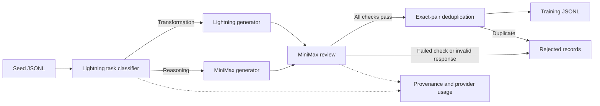

# Synthetic training data with automatic Token Factory routing

For robot camera/state/action demonstrations in LeRobot format, use
[robot SDG](token-factory-robot-sdg.md). This page covers text instruction data.

This pipeline turns JSONL seeds into reviewed instruction/answer training data.
The default path uses hosted open-weight models for routing, generation, and
review. It runs through the SDK on a developer machine or through the workbench
CLI with S3 handoffs; inference requires no operator-provisioned GPU.



The workbench implements the selection policy and sends concrete model IDs to
Token Factory. Transformation tasks include paraphrasing, extraction, and direct
descriptions. Reasoning includes calculations, proofs, planning, and debugging.
The policy maps those two classes to `nvidia/Nemotron-3_5-Lightning` and
`MiniMaxAI/MiniMax-M3`; both must be available to the configured account before
generation starts. This is model selection in the calling pipeline, separate
from the provider's routing of requests among serving replicas.

The [Lightning model card](https://huggingface.co/nvidia/NVIDIA-Nemotron-3.5-Lightning-30B-A3B-BF16)
identifies its OpenMDW 1.1 license; MiniMax publishes its weights under the
[MiniMax Community License](https://huggingface.co/MiniMaxAI/MiniMax-M3/blob/main/LICENSE).
The pipeline calls hosted endpoints and bundles no model weights. Use the
applicable model and hosted-service terms when selecting data for training.

## Run locally through the SDK

Configure `NEBIUS_TOKEN_FACTORY_KEY` through the existing private NPA credential
store and verify model access:

```bash
npa/.venv/bin/python -m npa workbench health preflight --checks token_factory --json
```

From the repository root, this runs the checked-in synthetic examples:

```bash
npa/.venv/bin/python - <<'PY'
import json
from npa.sdk.workbench.token_factory import SdgRequest, sdg

report = sdg(SdgRequest(
    input_path="npa/examples/token-factory-sdg/seeds.jsonl",
    context_path="npa/examples/token-factory-sdg/reference.md",
    output_path="/tmp/token-factory-sdg",
))
print(json.dumps(report, indent=2))
if report["status"] != "completed":
    raise SystemExit(1)
PY
```

Each nonblank input line must contain a unique string `id` and nonempty string
`prompt`. The prompt describes the kind of training example to create. The
optional UTF-8 reference file supplies shared context to generation and review.
The [example seeds](../../npa/examples/token-factory-sdg/seeds.jsonl) mix rewrite
and reasoning tasks; the [reference](../../npa/examples/token-factory-sdg/reference.md)
defines their terms. Every seed is processed; there is no added record or token
cap. The implementation processes requests sequentially and holds the run's
records in memory. It does not yet provide resumable or distributed execution.

Set `dry_run=True` to validate inputs without inference or artifact writes.
This differs from the older Token Factory generation commands' write-only dry
run. Use a distinct output directory or prefix for each run; existing artifact
names at that destination are replaced. Outputs are written after inference,
with the report last, so interruption before publication is not a saved checkpoint.

## CLI and workflow handoffs

The public SDG CLI uses the standard S3 input/output contract. Replace the
placeholders with the selected input object and a run-specific output prefix:

```bash
npa workbench token-factory sdg \
  --input-path s3://<bucket>/<input-prefix>/seeds.jsonl \
  --output-path s3://<bucket>/<run-prefix>/sdg \
  --output-format json
```

`--context-path` accepts an optional S3 reference file. `--dry-run` reads and
validates the inputs without inference or writes. The command returns nonzero
for input/access failures, unrecovered provider errors, or an empty accepted
dataset. Quality rejections alone do not fail a run that produces accepted rows.
See [Token Factory storage credentials](token-factory.md#generate-and-inspect-artifacts)
for the direct S3 environment requirements.

The [reference workflow](../../workflows/testing/token-factory-sdg.yaml) exposes
`workbench.token_factory.sdg` as a CPU stage. All four outputs are declared.
The submit live matrix includes actual seed upload and requires the Token
Factory and storage credentials. It must run with this checkout's current
staged NPA source; an older installed package does not contain the new command.

```bash
npa workbench workflow validate-spec workflows/testing/token-factory-sdg.yaml
npa workbench workflow plan-spec workflows/testing/token-factory-sdg.yaml
```

Before submitting, adapt the workflow's input and output URIs to your selected
storage and provide `NEBIUS_TOKEN_FACTORY_KEY` through `--secret-env`. The live
evidence below exercises the shared pipeline with local artifacts; a Kubernetes
submission and real S3 publication were not performed for that evidence.

## Artifacts and failure behavior

| Artifact | Contents |
| --- | --- |
| `dataset.jsonl` | Accepted, deduplicated records with `id` and user/assistant `messages`. |
| `rejected.jsonl` | Rejected or errored candidates with their reason and provenance. |
| `provenance.jsonl` | Every seed's hash, route, served model, candidate, review, and provider-call traces. |
| `report.json` | Counts, prompt revision, model cards, per-stage usage, input/context hashes, and SHA-256 of the other artifacts. |

Structured responses must have the requested model identity, a complete
`stop` finish reason, the expected fields, and valid field types. A classifier
failure falls back to the baseline generator and is recorded as unavailable.
A failed generation tries the remaining eligible model. Invalid generation
after fallback or an unavailable reviewer quarantines the row and marks the
run failed; it never silently publishes that candidate as training data.

Review checks seed fidelity, self-containment, correctness, and consistency.
All four booleans must be true before deduplication. Model reviews are fallible
and share a model with some generators; they are not independent ground truth.
Inspect samples and evaluate on held-out tasks before using the dataset in
training. Deduplication compares normalized instruction/answer text only; it
does not detect semantic duplicates or split a train/test dataset.

Static instructions and shared reference text stay at the beginning of each
generation/review prompt. Seed-specific content follows. The pipeline records
provider-reported cached prompt tokens separately for routing, generation, and
review. Missing counters stay unknown, and no application response cache is
used. Cache hits demonstrate reported prompt reuse, not training-data quality
or a billing discount.

## Optional Jev routing

Set `router="jev"` in `SdgRequest`, or pass `--router jev` to the CLI. This
requires the separate private `TYPESAFE_API_KEY` before any paid inference.
Jev receives the redacted seed text; generation and review still run through
Token Factory. Its usage remains separate in the manifest. This mode uses the
[existing Jev adapter](jev-routing.md) and is not the all-open-weight default.
Live Jev validation remains unavailable without that credential.

## Reproduce live validation

```bash
NPA_TOKEN_FACTORY_SDG_LIVE=1 npa/.venv/bin/python -m pytest \
  npa/tests/e2e/test_token_factory_sdg_live.py \
  --basetemp /tmp/token-factory-sdg-live-tests -q
```

The gate defaults to unset. Enabling it requires real Token Factory access and
makes live requests. The tests verify automatic selection of both generation
models, complete provenance, hash-bound artifact contents, rejection exclusion,
and a real reviewer response to a deliberately contradictory answer. Accepted
row counts may vary: filtering an unsuitable candidate is expected behavior.

## Recorded live evidence

The [validation record](../architecture/evidence/token-factory-sdg/validation.json)
documents two passing live tests on 2026-09-20 and retains the development-run
history. The final pipeline made 18 inference requests: six classifications,
six generations, and six reviews. Three generation requests used Lightning and
three used MiniMax. Five examples passed review; one unchanged sentence failed
the paraphrase requirement and was excluded from training data.

Inspect the actual [training JSONL](../architecture/evidence/token-factory-sdg/dataset.jsonl),
[rejected row](../architecture/evidence/token-factory-sdg/rejected.jsonl),
[per-call provenance](../architecture/evidence/token-factory-sdg/provenance.jsonl),
and [manifest](../architecture/evidence/token-factory-sdg/report.json). A separate
[negative review](../architecture/evidence/token-factory-sdg/negative-review.json)
rejected a response that contradicted itself about the number of required draws.

| Stage | Model | Requests | Reported cached prompt tokens, summed |
| --- | --- | --- | --- |
| Route | Lightning | 6 | 0 |
| Generate | Lightning | 3 | 0 |
| Generate | MiniMax | 3 | 3,456 |
| Review | MiniMax | 6 | 7,680 |

These are measured provider counters from the final run. The shared reference
was also used during development, so this is a warm-workload observation, not
a controlled cold-start benchmark. The earlier
[isolated-prefix experiment](jev-routing.md#recorded-token-factory-proof)
separately recorded cold and warm requests. The six development scenarios are
not a held-out accuracy benchmark, and model review does not prove correctness
across other domains. The first version under-routed reasoning tasks and
accepted contradictory answers; the second over-routed simple tasks. The final
version classifies task type explicitly and computes acceptance from four
separate checks. Those findings remain in the validation history.
