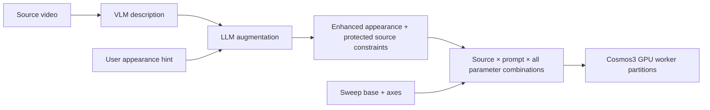

# Video variant sweep

Turn source videos into a tracked synthetic dataset: describe the scene, merge an
appearance hint or retain a direct prompt, generate conditioned variants in
parallel, review fidelity, record Postgres/MLflow lineage, and publish accepted
clips. The operator kit now selects
[the Cosmos3 reference](../testing/video-variant-sweep-cosmos3.yaml) by default.
The [Transfer 2.5 reference](../testing/video-variant-sweep.yaml) remains available
for existing configurations and historical results.

This workflow ends at the synthetic dataset. Policy training, train/test splits,
simulator task-success evaluation, and deployment are separate workflows. The
review gate measures augmentation fidelity, not robot task success.

## Run through the operator kit

Use a Linux operator checkout with `npa[video-sweep]`, an existing Kubernetes
cluster, project-owned S3 storage, and reachable Postgres/MLflow services:

```bash
npa/.venv/bin/python -m npa.workflows.video_sweep.operator init \
  --config /private/video-sweep/sweep.json
# Preview the full parameter fanout before any credential or provider call.
npa/.venv/bin/python -m npa.workflows.video_sweep.operator plan \
  --config /private/video-sweep/sweep.json \
  --output-dir /private/video-sweep/matrix-preview
# Fill in project, context, bucket, source URIs and exact accessible model IDs.
npa/.venv/bin/python -m npa.workflows.video_sweep.operator check \
  --config /private/video-sweep/sweep.json
npa/.venv/bin/python -m npa.workflows.video_sweep.operator run \
  --config /private/video-sweep/sweep.json \
  --output-dir /private/video-sweep/demo
```

`init` creates a private configuration with `generator: cosmos3-nano`, one B200
per worker, a three-axis parameter sweep producing eight candidates per source,
eight frame samples, and threshold 0.8.
Set `accelerators` to a verified alternative such as `RTXPRO6000:1` when using
that GPU family. GPU placement and model access are checked before submission;
selecting a GPU does not establish its inference compatibility.

Current live execution is blocked by Workbench's public Cosmos3 image quarantine.
The configured release needs a rebuilt and accepted image; the operator stops at
image preflight before staging or submitting GPU work. Do not reuse the old tag
or digest to bypass that check. Offline matrix planning remains available. See
[the current validation scope](#parameter-matrix-validation).

The current graph has two parallel workers. Each processes a disjoint partition
of **every source × variant** combination. This does not limit the number of
sources or variants. Changing worker concurrency still requires corresponding
worker states and output declarations. The declared worker count must match the
parallel worker list. Each worker processes its partition sequentially; eight
candidates on two workers means four generations per worker, not eight GPUs.

## Configure a parameter matrix

Use `sweep` in place of `variants` in the operator configuration:

```json
{
  "sweep": {
    "base": {
      "hint": "Warm warehouse lighting; preserve the forklift, supported load and motion",
      "edge_threshold": "medium",
      "num_steps": 35,
      "cfg_normalization": "enabled",
      "first_chunk_conditional_frames": 1
    },
    "axes": {
      "control_guidance": [1.0, 1.5],
      "guidance": [3.0, 5.0],
      "seed": [23, 41]
    }
  }
}
```

This expands **every source × 2 structural guidance values × 2 text guidance
values × 2 seeds**: eight candidates for one source, sixteen for two. Every
candidate receives one complete native parameter set. Fixed fields belong in
`base`; varying fields belong in `axes`. Do not put the same field in both.
Any supported native variant field can be an axis, including `hint` or `prompt`.
Each expanded row must contain exactly one of those text fields. Unknown fields,
empty axes, repeated values and invalid combinations fail before GPU submission.
There is no implicit truncation of the Cartesian product.

`plan` writes a private `matrix.json` and standalone `index.html` showing the
axis values, product size, all candidate rows and their worker assignments.
It works before routing placeholders are filled and uses no credentials or
network calls. The preview is clearly marked as planned, without generated
footage. Prompt text and source locations are omitted.

The live prepare stage expands the same configuration. Axis names are sorted
for deterministic enumeration; value lists retain their declared order. Each
source is described once, and each distinct hint is merged once per source,
holding the final prompt fixed while sampling parameters vary. Direct prompts
remain verbatim. The immutable plan retains the original sweep definition;
workers verify complete matrix coverage before generating. Changing an input or
axis value requires a new run ID, including when resuming a previous run.

### LLM augmentation before Cosmos

The CPU `prepare` state performs the diagram's description and prompt-merge path:



Use `hint` to enable LLM augmentation. The selected `reasoner_model` describes
observed geometry, motion, camera, lighting, contacts and uncertainty from ordered
source frames. The selected `merge_model` combines that description with the hint
and returns a validated proposed brief: `scene`, `appearance`, `preserve`, and
`avoid`. The final prompt takes the LLM-expanded appearance and adds protected
source-preservation and artifact-avoidance constraints. Proposed scene/motion
claims remain private audit context; they cannot prescribe camera changes,
freezing or new articulation. Preserve/avoid constraints are prompt text,
not unsupported sampler parameters.
An incomplete or malformed brief stops preparation before GPU generation.

The prompt asks for stable geometry, source motion and timing, camera continuity,
plausible contact/shadows and supported loads where visible. Those are generation
constraints, not proof of physical fidelity; the output review still decides
acceptance. Input/output hashes, selected model and measured response provenance
bind each enhanced prompt to its source and hint. Workers verify that binding.
Timestamped source frames help temporal comparison, while the full source video
remains authoritative when a sampled caption is wrong. Prompt wording still
cannot establish physical fidelity; generated media must pass review.

One source and one hint produce one enhanced prompt (`P1`), reused verbatim across
all eight sampling combinations in the example. Additional hint-axis values
produce additional enhanced prompts. The HTML explicitly shows that flow, prompt
groups and the prompt used by every candidate. It hides the actual private text.
Using `prompt` instead of `hint` deliberately bypasses the LLM and preserves the
provided text; the viewer labels that bypass. The earlier recorded forklift
experiments used direct prompts and do not prove LLM augmentation.

Direct workflow submissions use a `npa.video_sweep.variants.v3` manifest with
`generator: cosmos3-nano` and this `sweep` object. Native v2 explicit variant
rows remain supported. The result viewer shows the same matrix with recorded
scores and a play button connecting every cell to its generated clip.

`check` verifies operator prerequisites without submitting compute. `run` stages
immutable inventories and the current NPA source, then submits the standard
runtime with its own SkyPilot state directory. `resume` uses the same configured
run and durable runtime state. `export` needs only project storage and a completed
review/tracking result; it never submits compute. Choose a fresh export directory.
Use a new run ID when changing inputs, prompts, model selections or parameters.

The helper does not provision the cluster or tracking services. Both GPU workers
must fit concurrently. Service endpoints must be reachable from the worker pods;
operator-side credential checks do not establish that connectivity. macOS supports
authoring and export; isolated SkyPilot execution uses Linux.

## Native Cosmos3 generation

The native reference calls the real `run_cosmos3_generate` implementation with
`Cosmos3-Nano`, `video2video`, and explicit `TransferSettings`. It normalizes the
complete source to 832×480 at 24 fps with letterboxing, records both original and
prepared hashes, and supplies native edges from every source interval. It
verifies exact output frame count and timestamps against that prepared source.
This is full-source structural conditioning, not prefix-only continuation.

Native defaults use 93-frame windows, structural guidance 1.5, medium Canny
thresholds, no RGB hint, and zero first-chunk RGB conditional frames so appearance
can change. Later windows retain generated overlap for continuity. Guardrails
remain enabled and must report effective successful prompt/media evaluations.
Their configured state alone is insufficient. Temporal alignment verifies media
correspondence; it does not prove visual realism.

The v2 manifest declares the generator and its native controls explicitly:

```json
{
  "schema": "npa.video_sweep.variants.v2",
  "generator": "cosmos3-nano",
  "variants": [
    {
      "hint": "Dim the warehouse ambient lighting; preserve the vehicle and load",
      "seed": 17,
      "control_guidance": 1.5,
      "edge_threshold": "medium",
      "guidance": 5.0,
      "num_steps": 35
    },
    {
      "prompt": "A yellow warehouse forklift carries the same stable low pallet under warm overhead lighting. Preserve the exact vehicle, load, trajectory, floor contact, camera and timing.",
      "seed": 17,
      "control_guidance": 3.0,
      "edge_threshold": "medium",
      "guidance": 5.0,
      "num_steps": 35
    }
  ]
}
```

Each row has exactly one `hint` or `prompt`. A direct `prompt` is preserved
verbatim and its provenance records `direct-user-prompt`; an appearance `hint`
is merged with the source description. Source description and paired review
still use the selected reasoner. Supported edge thresholds are `very_low`, `low`,
`medium`, `high`, and `very_high`. `control_guidance` is native Cosmos3 structural
guidance, not Transfer 2.5's control weight. Seeds are nonnegative integers;
sampling steps and text guidance must be positive. No unchecked parameter bag
is forwarded into inference.

The optional `cfg_normalization` field accepts `enabled` or `disabled` (the
compatibility default). It forwards the native sampler's guided-prediction
normalization; it does not blend source pixels into the output. Strong structural
guidance can produce harsh outlines and distorted details. Compare gentler
sampling and normalization against the same source, retaining the original
quality threshold and rejected results. These controls do not guarantee realism.

The optional `first_chunk_conditional_frames` is 0 (default) or 1. One retains
the first source RGB frame as an appearance anchor, while complete source edges
still condition the whole clip. This can also constrain the first frame's
lighting and material edits. Use a source frame whose appearance is appropriate
for the requested variation and inspect transitions; anchoring is not proof of
photorealism or stable contacts.

Source inventories retain their existing schema:

```json
{"schema":"npa.video_sweep.sources.v1","clips":["s3://example-bucket/inputs/source.mp4"]}
```

For operator use, place only the variant rows in the configuration's `variants`
field; the kit writes the versioned manifest. Duplicate source URIs, duplicate
source bytes, duplicate variants, and invalid controls fail before generation.

## Reasoning and generation are separate models

`generator` selects video generation. `reasoner_model` selects source description
and paired visual review; `merge_model` selects prompt enhancement. The current
reasoning client uses Token Factory and requires exact available model IDs. A
Cosmos3 generation result does not prove Cosmos3 reasoning.

The reference reasoner is `nvidia/Cosmos3-Super-Reasoner`, which was unavailable
to the account used for the earlier live tests. Those tests explicitly selected
`MiniMaxAI/MiniMax-M3`. The reference merge model is
`nvidia/Nemotron-3_5-Lightning`. There is no silent substitution. Cluster-backed
Cosmos3 reasoning remains a separate integration requirement.

Source frames and hints are sent to the explicitly selected hosted service.
Use only inputs approved for that service. Public demonstrations must use
synthetic or otherwise approved imagery.

## Realism review

Before accepting a warehouse vehicle variant, inspect these independent aspects:

- Vehicle, mast, fork and pallet geometry remain rigid and consistent.
- Tires contact the floor; wheel rotation and translation are physically plausible.
- The load stays supported and moves with the vehicle without slipping or detaching.
- Source trajectory, occlusions, camera, timing and stationary background survive.
- The requested lighting or material change is visible, with plausible shadows.
- Chunk boundaries have no teleportation, abrupt shape changes or duplicate objects.

The reviewer receives explicit instructions about contact, rigid geometry, stable
loads and temporal continuity. Acceptance requires both a boolean pass and a
finite score meeting the configured threshold. Its evenly spaced sampled frames
include clip endpoints, but do not certify every frame. Inspect moving playback
and transition points as well as the score. Retain rejected candidates as evidence.

## Recovery, controls and export

Each completed candidate gets an immutable receipt before the worker proceeds.
A retry verifies the same plan/request identity, generator, seed, media hash,
full decoding and sampled metadata before reusing that candidate. Native receipts
also bind the generation evidence, prepared reference and actual edge-control
bytes. Corrupt or mismatched checkpoints fail closed instead of triggering a new
generation. A failed partition can reuse its completed candidates; an unfinished
candidate without a completed receipt is not claimed as recovered.

Native generation publishes the actual conditioning map and normalization /
temporal-alignment evidence. The offline exporter verifies those bindings and
shows the prepared source, generated video, real edge-control clip, model identity
and allowlisted numeric/categorical generation parameters. It excludes raw
prompts, review reasons, source URIs, run IDs, service addresses and provider IDs.
It removes audio and container metadata. Visible private imagery still requires
private handling.

The output directory contains a standalone `index.html`, silent `demo.mp4`,
`summary.json`, preview MP4s and posters. The HTML embeds all media and needs no
external requests. Playback and scrubbing include the native control video.
Threshold exploration does not alter recorded decisions or publication.

When all candidates are rejected, publication fails and no dataset or next-run
inventory is created. A completed, tracked rejection may still export a review
bundle. `run` and `resume` preserve the nonzero workflow result. Incomplete
tracking or failed publication of accepted clips cannot use that path.

## Credentials and artifacts

Keep credentials and operational configuration outside Git:

| Variable | Use |
| --- | --- |
| `HF_TOKEN` | Exact runtime-fetched model and guardrail access |
| `NEBIUS_TOKEN_FACTORY_KEY` | Selected hosted reasoning and merge models |
| `NPA_LINEAGE_POSTGRES_DSN` | Postgres role able to create/write lineage records |
| `MLFLOW_TRACKING_URI` | HTTPS tracking endpoint; loopback HTTP for local tests |
| `MLFLOW_EXPERIMENT_ID` | Existing tracking experiment |
| `MLFLOW_TRACKING_TOKEN` | Optional tracking bearer token |
| `MLFLOW_TRACKING_CA_PEM` | Optional private CA; TLS hostname verification remains enabled |

The kit resolves exact-project S3 credentials and forwards required values through
runtime secrets. An optional AWS session token is forwarded when present.
Artifacts live beneath the configured bucket, prefix and run ID. They include
`plan.json`, per-candidate `receipt.json`, native `generation.json` and controls,
worker receipts, `review.json`, `lineage.json`, and accepted-only
`dataset/manifest.json` plus `dataset/next-sources.json`.

Track every acceptance and rejection before publication. Postgres writes are
parameterized and replay-safe; MLflow records the actual per-candidate metrics.
The next-source inventory is for an explicit subsequent run, not a training loop.
Cancel the exact run and wait for terminal jobs before removing task-owned
controllers/services. Preserve dataset and lineage artifacts.

## Native runtime evidence

A synthetic warehouse forklift drive exercised the standard Cosmos3 graph on
two RTX PRO 6000 workers. Both outputs retained the complete 93-frame, 24 fps
timeline with zero timestamp error. Native receipts verified the actual edge
controls and effective successful text/video guardrails. MiniMax-M3 reviewed
twelve paired samples per clip; this did not exercise Cosmos3 reasoning.

The first warm/cool pair used structural guidance 2.5/3.0, text guidance 5.0,
35 steps and disabled CFG normalization. Strong outlines and deformed vehicle/load
details failed visual inspection. The unchanged 0.80 gate rejected both, scoring
0.25 and 0.15. Postgres retained two rows and MLflow retained two finished runs
with acceptance and review-score metrics. Publication correctly failed; no
dataset or next-source inventory was created, and the operator exported a tracked
rejection while preserving its nonzero result.

A second pair retained the same source bytes, direct prompts and seeds, using
structural guidance 1.0, text guidance 3.0 and enabled CFG normalization. Harsh
outlines improved visibly, and native receipts verified normalization, effective
guardrails and the same exact timeline. The reviewer still rejected both at
0.35: the warm clip retained a rendered material appearance, and the cool clip
failed its sampled motion-fidelity assessment. Both were tracked and withheld
from publication. Better-looking footage did not override the gate.

A third pair used a synthetic photographic edit of the first source frame as
the native one-frame appearance anchor, followed by the procedural motion
reference. Structural guidance remained 1.0 with CFG normalization enabled;
text guidance was 5.0. New direct prompts requested warm daylight and a gradual
cool LED transition. This changed both source and prompts, so it is not a
matched-input comparison. Native receipts verified the one-frame anchor,
effective guardrails, complete controls and the same exact output timeline.
The warm clip gained floor and material detail, while the cool clip developed
an excessive blue cast. Sampled review rejected both at 0.15 for geometry or
motion fidelity. An appearance anchor alone did not qualify physical realism.

A CPU replay verified both real candidate checkpoints with the inference
function set to raise if called. It reused both outputs without inference and
left both worker receipts unchanged. The exported native HTML passed synchronized
source/candidate/control playback, scrubbing, variant selection, unchanged gate
decisions, mobile overflow checks and zero external requests.

This validates the executed component path and strict rejection behavior.
It does not qualify realistic training data, B200 placement, multi-window
continuity or the default hosted Cosmos3 reasoner.

### Parameter matrix validation

The new matrix configuration defines one source × two structural guidance values
× two text guidance values × two seeds: eight candidates, partitioned across two
workers. Unit tests exercise all 24 combinations of a larger two-source grid,
complete worker joins, fixed prompt reuse, immutable input protection and the
mapping from recorded matrix cells to clips. The offline eight-candidate HTML
preview passed desktop/mobile checks with no external requests or script errors.

The live matrix attempt passed credential and exact-model access checks, then
stopped at image preflight because current Workbench main quarantines the
configured Cosmos3 release pending a rebuilt and accepted image. No matrix GPU
jobs, generated clips or dataset were created. The six earlier native clips above
predate this attempt and are not evidence that the new parameter matrix ran.

A later hosted-only preparation test ran against the synthetic forklift source
using eight timestamped frames, MiniMax-M3 description and Nemotron-3.5-Lightning
augmentation. It produced eight distinct candidate inputs sharing exactly one
enhanced prompt and one merge response. The final prompt retained the actual
LLM-expanded appearance plus five protected preservation constraints and four
artifact-avoidance constraints. Hash binding and complete matrix coverage passed.
No GPU inference was performed by this test. Sampled captions proved fallible
about motion/camera details, so those proposed claims remain audit context rather
than executable transformation instructions. This validates real prompt
preparation and reuse, not improvement in generated-video fidelity.

## Transfer 2.5 compatibility and evidence

Existing configurations without `generator`, or with `cosmos-transfer2.5`, use
the original reference and v1 variant rows: `hint`, `seed`, `control` (`edge` or
`vis`), `control_weight` in (0,1], and positive `guidance`. Native control names
are not silently translated to these older parameters. Historical runs remain
exportable with their actual generator label.

The earlier Transfer component run accepted one clip at 0.85 and rejected one at
0.30. A later full submission completed preparation, both GPU workers, review,
and Postgres/MLflow tracking; both candidates scored 0.30 against threshold 0.80
and publication correctly failed. These are procedural-source results with
MiniMax-M3 reasoning, not proof of a realistic Cosmos3 workflow. See the separate
readiness records beside each reference for the current scope of verification.
